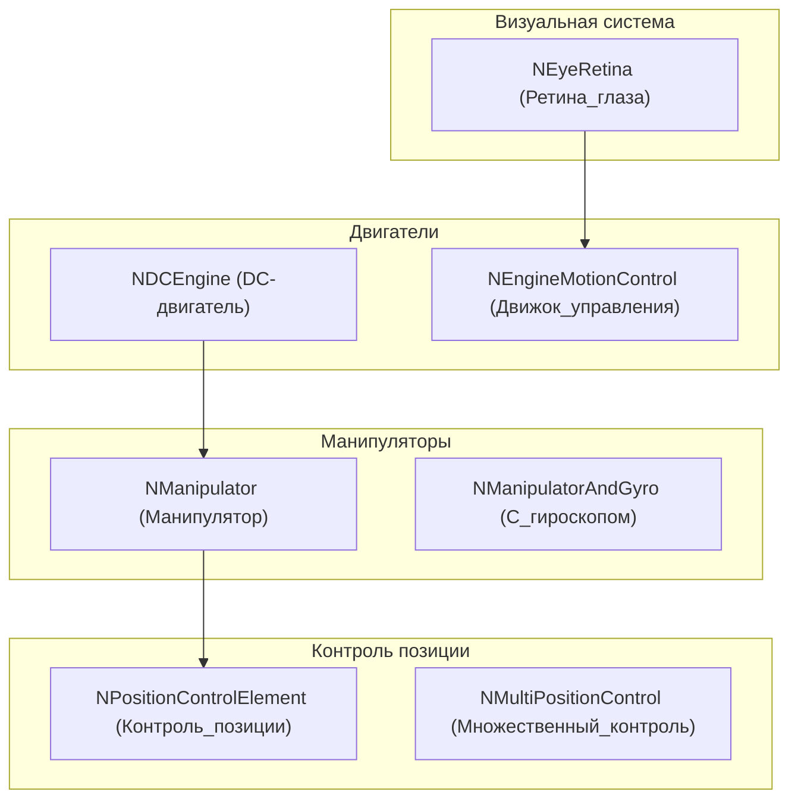
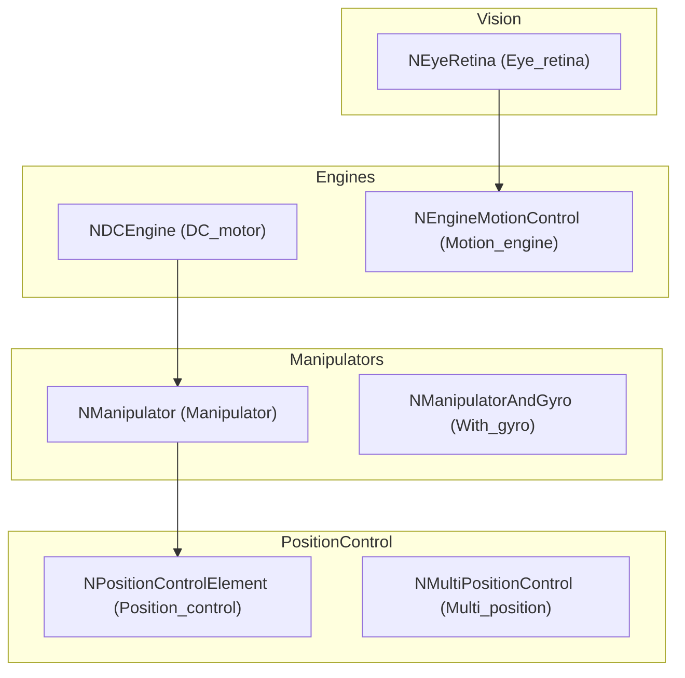

# Архитектура Nmsdk-MotionControlLib

## RU

### Обзор

Nmsdk-MotionControlLib интегрирует различные подсистемы для создания систем управления движением.

### Структура библиотеки



### Основные модули

#### 1. Двигатели и приводы

- **NDCEngine** - DC-двигатель (двигатель постоянного тока). Компонент для управления DC-двигателями с обратной связью.
  
  **Основные функции:**
  - Управление скоростью вращения
  - Управление направлением
  - Обратная связь по положению/скорости

- **NEngineMotionControl** - движок управления движением. Высокоуровневый компонент, объединяющий нейронную сеть, датчики и приводы для управления движением.

#### 2. Манипуляторы

- **NManipulator** - манипулятор, компонент для управления роботизированным манипулятором (рукой робота).
  
  **Основные функции:**
  - Управление суставами
  - Кинематика прямой и обратной
  - Планирование траекторий

- **NManipulatorAndGyro** - манипулятор с гироскопом, комбинированный компонент для управления манипулятором с учетом ориентации
- **NManipulatorInput** - входной компонент для манипулятора (получение команд управления)
- **NManipulatorInputEmulator** - эмулятор входных данных для манипулятора (для тестирования)
- **NManipulatorSource** - источник данных для манипулятора
- **NManipulatorSourceEmulator** - эмулятор источника данных для манипулятора

#### 3. Гироскопы и ориентация

- **NAstaticGyro** - астатический гироскоп, компонент для измерения угловой скорости и ориентации.
  
  **Основные функции:**
  - Измерение угловой скорости
  - Определение ориентации
  - Компенсация дрейфа

#### 4. Контроль позиции

- **NPositionControlElement** - элемент контроля позиции, базовый компонент для управления положением объекта
- **NNewPositionControlElement** - новый элемент контроля позиции (улучшенная версия)
- **NMultiPositionControl** - многопозиционное управление, управление несколькими степенями свободы одновременно

#### 5. Траектории

- **NTrajectoryElement** - элемент траектории, компонент для планирования и выполнения траекторий движения.
  
  **Основные функции:**
  - Генерация траекторий
  - Следование по траектории
  - Плавность движения

#### 6. Элементы движения

- **NMotionElement** - базовый элемент движения, абстрактный компонент для различных элементов управления движением

#### 7. Ретина глаза

- **NEyeRetina** - ретина глаза, компонент для обработки визуальной информации, имитирующий работу сетчатки глаза.
  
  **Основные функции:**
  - Обработка изображений
  - Детекция движения
  - Пространственная фильтрация

- **NEyeRetinaCore/** - подкаталог с ядром обработки ретины:
  - `NEyeRetinaBWCore` - обработка черно-белых изображений

#### 8. Навигация

- **NNavMousePrimitive** - примитив навигации мыши, компонент для простой навигации по принципу движения мыши

#### 9. Маятник и тележка

- **NPendulumAndCart** - маятник и тележка, классическая задача управления для тестирования алгоритмов управления.
  
  **Основные функции:**
  - Моделирование физики маятника
  - Управление тележкой
  - Стабилизация маятника

#### 10. Приемники и источники

- **NFrequencyReceiver** - приемник частоты, компонент для приема и обработки частотных сигналов
- **NPulseReceiver** - приемник импульсов, прием импульсов от импульсных нейросетей
- **NControlObjectSource** - источник управляющего объекта, компонент для получения информации об объекте управления

#### 11. Статистика и анализ

- **NSimpleStatistic** - простая статистика, базовые статистические вычисления для систем управления
- **NNetworkLinksStatistic** - статистика связей сети, анализ связей в нейронной сети (закомментирован в сборке из-за ошибок)

#### 12. Сепараторы

- **NSignumSeparator** - сепаратор знака, разделение сигналов по знаку
- **NIntervalSeparator** - сепаратор интервалов, разделение сигналов по интервалам

#### 13. Сравнение

- **NSeqComparison** - последовательное сравнение, сравнение последовательностей сигналов

#### 14. Детекция объектов

- **NObjInArea** - объект в области, детекция объектов в заданной области

#### 15. Элементы управления

- **NPCNElement** - элемент PCN (Position Control Network), элемент сети контроля позиции
- **NSuppressionUnit** - блок подавления, компонент для подавления определенных сигналов
- **NCounterNeuron** - счетчик нейронов, подсчет активности нейронов
- **NSignalEstimation** - оценка сигнала, оценка и фильтрация сигналов
- **NActuatorSignals** - сигналы актуаторов, управление сигналами для актуаторов (приводов)

#### 16. Память лабиринта

- **NMazeMemory** - память лабиринта, компонент для запоминания и навигации по лабиринту
- **NMazeMemory_simplified** - упрощенная версия памяти лабиринта

### Ключевые классы

#### NMotionControlLibrary

Главный класс библиотеки:

```cpp
class NMotionControlLibrary: public ULibrary
{
public:
    NMotionControlLibrary(void);
    virtual void CreateClassSamples(UStorage *storage);
};
```

Библиотека автоматически загружается при инициализации:

```cpp
libs_list.push_back(&NMSDK::MotionControlLibrary);
```

#### NEngineMotionControl

Высокоуровневый компонент для управления движением:

```cpp
class NEngineMotionControl: public UNet
{
    // Объединяет:
    // - Импульсные нейросети (NNet)
    // - Датчики и источники данных
    // - Приводы и двигатели
    // - Компоненты компьютерного зрения
};
```

#### NDCEngine

Компонент управления DC-двигателем:

```cpp
class NDCEngine: public UComponent
{
    // Управление двигателем
    // Обратная связь
    // Интеграция с аппаратным обеспечением
};
```

### Зависимости

- **rdk.static.qt** - ядро Rdk (обязательно)
- **Rdk-BasicLib.qt** - базовая библиотека (обязательно)
- **Rdk-CvBasicLib.qt** - компьютерное зрение (обязательно)
- **Rdk-HardwareLib.qt** - работа с железом (обязательно)
- **Nmsdk-PulseLib.qt** - импульсные нейросети (обязательно)

### Интеграция компонентов

Библиотека объединяет функциональность других библиотек:

1. **Импульсные нейросети** (PulseLib) - для принятия решений
2. **Компьютерное зрение** (CvBasicLib) - для восприятия окружения
3. **Аппаратное обеспечение** (HardwareLib) - для управления приводами
4. **Базовые компоненты** (BasicLib) - для работы с данными

### Примеры использования

#### Управление двигателем

```cpp
// Создание DC-двигателя
NDCEngine* engine = storage->CreateComponent<NDCEngine>();
// Настройка параметров и подключение к аппаратуре
```

#### Система управления движением

```cpp
// Создание движка управления
NEngineMotionControl* motionControl = storage->CreateComponent<NEngineMotionControl>();
// Добавление компонентов: нейросеть, датчики, приводы
// Настройка связей
```

#### Ретина для зрения

```cpp
// Создание ретины
NEyeRetina* retina = storage->CreateComponent<NEyeRetina>();
// Подключение к источнику изображений
// Обработка визуальной информации
```

#### Контроль позиции

```cpp
// Создание элемента контроля позиции
NPositionControlElement* posControl = storage->CreateComponent<NPositionControlElement>();
// Настройка целевой позиции и параметров управления
```

### Файлы библиотеки

#### Core компоненты

Библиотека содержит 109 файлов в директории `Core/`:
- 40 .cpp файлов
- 40 .h файлов
- Дополнительные файлы сборки

#### Особенности сборки

В CMakeLists.txt исключен файл `NNetworkLinksStatistic.cpp` из-за ошибок компиляции.

### См. также

- [Usage-Examples.md](Usage-Examples.md) - примеры использования
- [API-Overview.md](API-Overview.md) - обзор API

---

## EN

### Overview

Nmsdk-MotionControlLib integrates various subsystems to create motion control systems.

### Library Structure



The diagram shows how motion control is composed from multiple subsystems: actuators and manipulators feed position control elements; optional vision and sensor feedback are integrated into the motion control engine.

### Main Modules

#### 1. Engines and Actuators

- **NDCEngine** - DC motor (direct current motor). Component for controlling DC motors with feedback.
  
  **Main functions:**
  - Rotation speed control
  - Direction control
  - Position/speed feedback

- **NEngineMotionControl** - motion control engine. High-level component combining neural network, sensors, and actuators for motion control.

#### 2. Manipulators

- **NManipulator** - manipulator, component for controlling robotic manipulator (robot arm).
  
  **Main functions:**
  - Joint control
  - Forward and inverse kinematics
  - Trajectory planning

- **NManipulatorAndGyro** - manipulator with gyroscope, combined component for manipulator control with orientation consideration
- **NManipulatorInput** - input component for manipulator (receiving control commands)
- **NManipulatorInputEmulator** - input data emulator for manipulator (for testing)
- **NManipulatorSource** - data source for manipulator
- **NManipulatorSourceEmulator** - data source emulator for manipulator

#### 3. Gyroscopes and Orientation

- **NAstaticGyro** - astatic gyroscope, component for measuring angular velocity and orientation.
  
  **Main functions:**
  - Angular velocity measurement
  - Orientation determination
  - Drift compensation

#### 4. Position Control

- **NPositionControlElement** - position control element, base component for object position control
- **NNewPositionControlElement** - new position control element (improved version)
- **NMultiPositionControl** - multi-position control, controlling multiple degrees of freedom simultaneously

#### 5. Trajectories

- **NTrajectoryElement** - trajectory element, component for planning and executing motion trajectories.
  
  **Main functions:**
  - Trajectory generation
  - Trajectory following
  - Motion smoothness

#### 6. Motion Elements

- **NMotionElement** - base motion element, abstract component for various motion control elements

#### 7. Eye Retina

- **NEyeRetina** - eye retina, component for processing visual information, simulating retina operation.
  
  **Main functions:**
  - Image processing
  - Motion detection
  - Spatial filtering

- **NEyeRetinaCore/** - subdirectory with retina processing core:
  - `NEyeRetinaBWCore` - black and white image processing

#### 8. Navigation

- **NNavMousePrimitive** - mouse navigation primitive, component for simple navigation using mouse movement principle

#### 9. Pendulum and Cart

- **NPendulumAndCart** - pendulum and cart, classical control problem for testing control algorithms.
  
  **Main functions:**
  - Pendulum physics simulation
  - Cart control
  - Pendulum stabilization

#### 10. Receivers and Sources

- **NFrequencyReceiver** - frequency receiver, component for receiving and processing frequency signals
- **NPulseReceiver** - pulse receiver, receiving pulses from spiking neural networks
- **NControlObjectSource** - control object source, component for obtaining information about control object

#### 11. Statistics and Analysis

- **NSimpleStatistic** - simple statistics, basic statistical computations for control systems
- **NNetworkLinksStatistic** - network links statistics, analysis of connections in neural network (commented out in build due to errors)

#### 12. Separators

- **NSignumSeparator** - sign separator, signal separation by sign
- **NIntervalSeparator** - interval separator, signal separation by intervals

#### 13. Comparison

- **NSeqComparison** - sequential comparison, comparison of signal sequences

#### 14. Object Detection

- **NObjInArea** - object in area, object detection in specified area

#### 15. Control Elements

- **NPCNElement** - PCN element (Position Control Network), position control network element
- **NSuppressionUnit** - suppression unit, component for suppressing certain signals
- **NCounterNeuron** - neuron counter, counting neuron activity
- **NSignalEstimation** - signal estimation, signal estimation and filtering
- **NActuatorSignals** - actuator signals, signal control for actuators (drives)

#### 16. Maze Memory

- **NMazeMemory** - maze memory, component for remembering and navigating through maze
- **NMazeMemory_simplified** - simplified maze memory version

### Key Classes

#### NMotionControlLibrary

Main library class:

```cpp
class NMotionControlLibrary: public ULibrary
{
public:
    NMotionControlLibrary(void);
    virtual void CreateClassSamples(UStorage *storage);
};
```

The library is automatically loaded during initialization:

```cpp
libs_list.push_back(&NMSDK::MotionControlLibrary);
```

#### NEngineMotionControl

High-level component for motion control:

```cpp
class NEngineMotionControl: public UNet
{
    // Combines:
    // - Spiking neural networks (NNet)
    // - Sensors and data sources
    // - Actuators and motors
    // - Computer vision components
};
```

#### NDCEngine

DC motor control component:

```cpp
class NDCEngine: public UComponent
{
    // Motor control
    // Feedback
    // Hardware integration
};
```

### Dependencies

- **rdk.static.qt** - Rdk core (required)
- **Rdk-BasicLib.qt** - basic library (required)
- **Rdk-CvBasicLib.qt** - computer vision (required)
- **Rdk-HardwareLib.qt** - hardware (required)
- **Nmsdk-PulseLib.qt** - spiking neural networks (required)

### Component Integration

The library combines functionality from other libraries:

1. **Spiking neural networks** (PulseLib) - for decision making
2. **Computer vision** (CvBasicLib) - for environment perception
3. **Hardware** (HardwareLib) - for actuator control
4. **Basic components** (BasicLib) - for data operations

### Usage Examples

#### Motor Control

```cpp
// Create DC motor
NDCEngine* engine = storage->CreateComponent<NDCEngine>();
// Configure parameters and connect to hardware
```

#### Motion Control System

```cpp
// Create motion control engine
NEngineMotionControl* motionControl = storage->CreateComponent<NEngineMotionControl>();
// Add components: neural network, sensors, actuators
// Configure connections
```

#### Retina for Vision

```cpp
// Create retina
NEyeRetina* retina = storage->CreateComponent<NEyeRetina>();
// Connect to image source
// Process visual information
```

#### Position Control

```cpp
// Create position control element
NPositionControlElement* posControl = storage->CreateComponent<NPositionControlElement>();
// Configure target position and control parameters
```

### Library Files

#### Core Components

The library contains 109 files in the `Core/` directory:
- 40 .cpp files
- 40 .h files
- Additional build files

#### Build Features

In CMakeLists.txt, file `NNetworkLinksStatistic.cpp` is excluded due to compilation errors.

### See Also

- [Usage-Examples.md](Usage-Examples.md) - usage examples
- [API-Overview.md](API-Overview.md) - API overview
