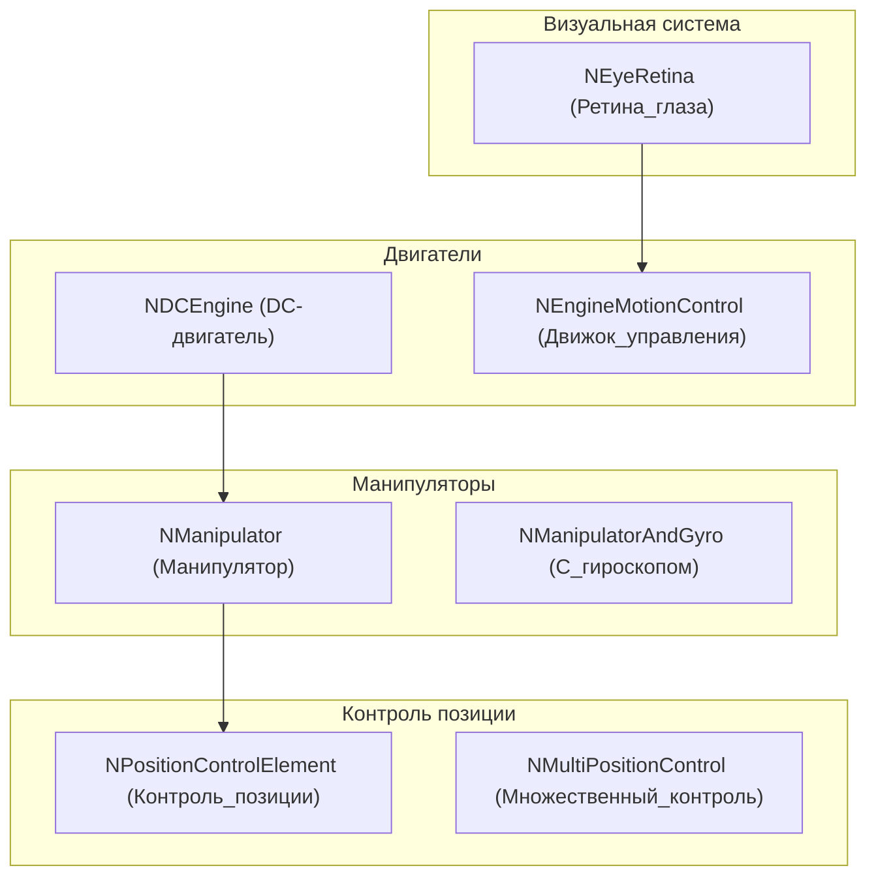
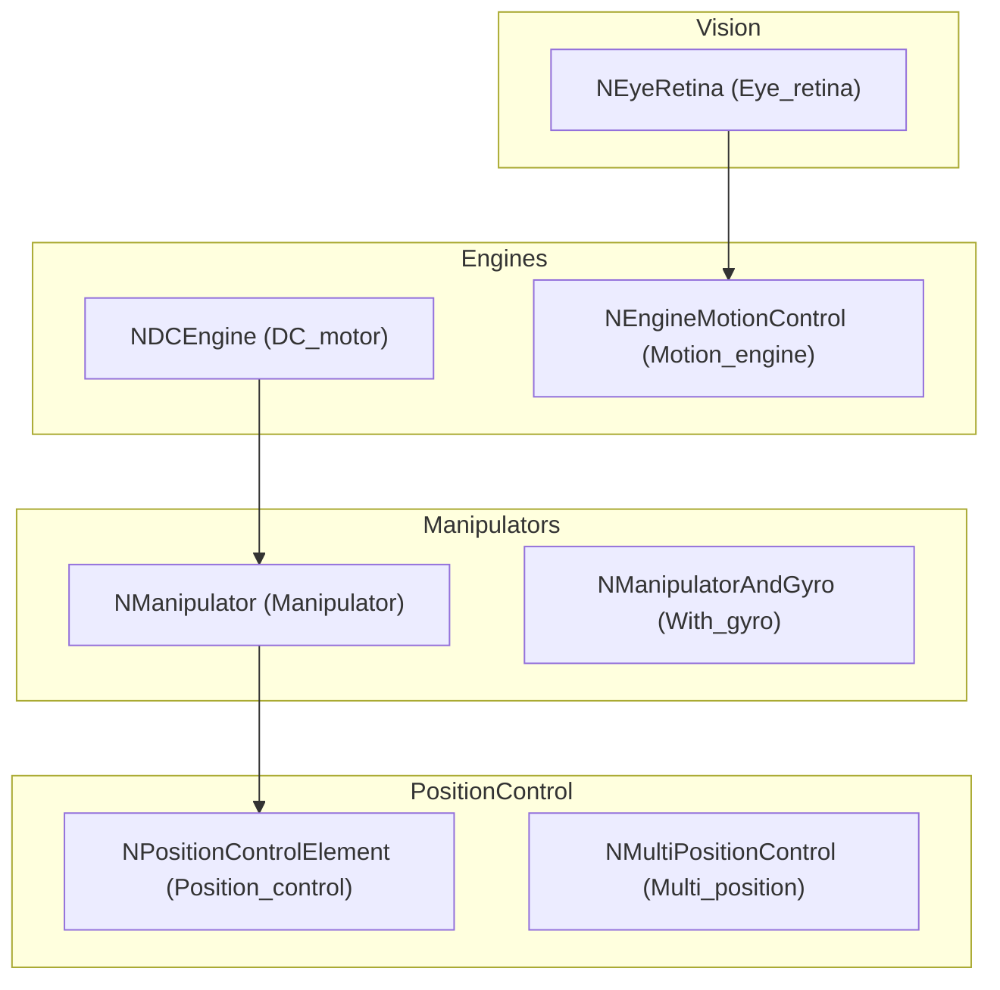

# Архитектура Nmsdk-MotionControlLib

## RU

### Обзор

Nmsdk-MotionControlLib интегрирует различные подсистемы для создания систем управления движением.

### Структура библиотеки

### Основные модули

#### Двигатели и приводы

- **NDCEngine** - DC-двигатель с обратной связью
- **NEngineMotionControl** - движок управления движением

#### Манипуляторы

- **NManipulator** - роботизированный манипулятор
- **NManipulatorAndGyro** - манипулятор с гироскопом

#### Контроль позиции

- **NPositionControlElement** - элемент контроля позиции
- **NMultiPositionControl** - множественный контроль позиции

#### Траектории

- **NTrajectoryElement** - элемент траектории

#### Визуальная система

- **NEyeRetina** - ретина глаза для визуального восприятия

#### Гироскопы

- **NAstaticGyro** - астатический гироскоп

### Зависимости

- `rdk.static.qt` - ядро Rdk
- Rdk-BasicLib - базовые компоненты
- Rdk-CvBasicLib - компьютерное зрение
- Rdk-HardwareLib - аппаратное обеспечение
- Nmsdk-PulseLib - импульсные нейронные сети

### См. также

- [Usage-Examples.md](Usage-Examples.md) - примеры использования
- [API-Overview.md](API-Overview.md) - обзор API

---

## EN

### Overview

Nmsdk-MotionControlLib integrates various subsystems to create motion control systems.

### Library Structure

The diagram shows how motion control is composed from multiple subsystems: actuators and manipulators feed position control elements; optional vision and sensor feedback are integrated into the motion control engine.

### Main Modules

#### Engines and Actuators

- **NDCEngine** - DC motor with feedback
- **NEngineMotionControl** - motion control engine

#### Manipulators

- **NManipulator** - robotic manipulator
- **NManipulatorAndGyro** - manipulator with gyroscope

#### Position Control

- **NPositionControlElement** - position control element
- **NMultiPositionControl** - multi-position control

#### Trajectories

- **NTrajectoryElement** - trajectory element

#### Visual System

- **NEyeRetina** - eye retina for visual perception

#### Gyroscopes

- **NAstaticGyro** - astatic gyroscope

### Dependencies

- `rdk.static.qt` - Rdk core
- Rdk-BasicLib - basic components
- Rdk-CvBasicLib - computer vision
- Rdk-HardwareLib - hardware
- Nmsdk-PulseLib - spiking neural networks

### See Also

- [Usage-Examples.md](Usage-Examples.md) - usage examples
- [API-Overview.md](API-Overview.md) - API overview
