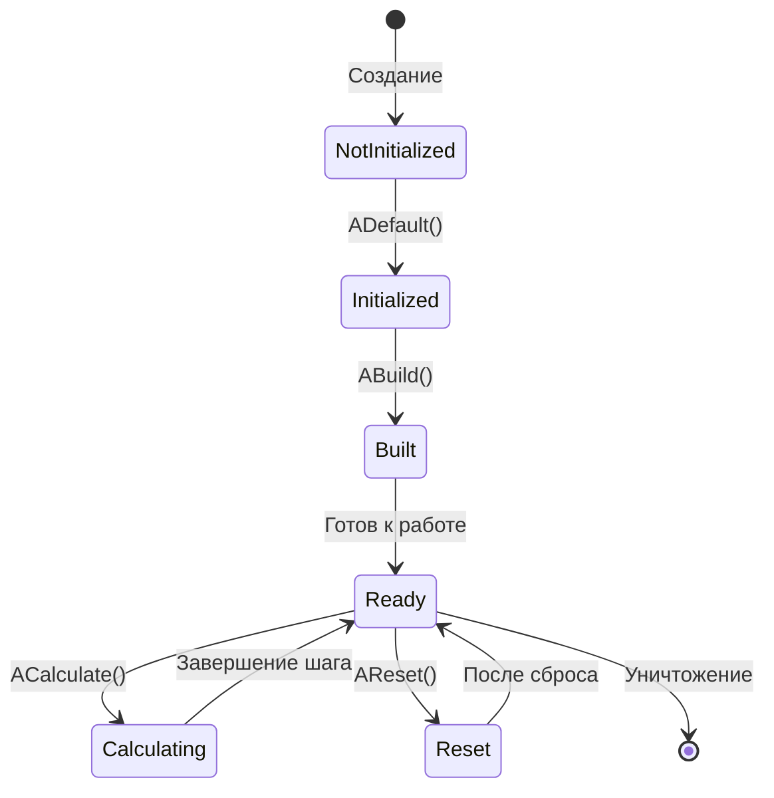
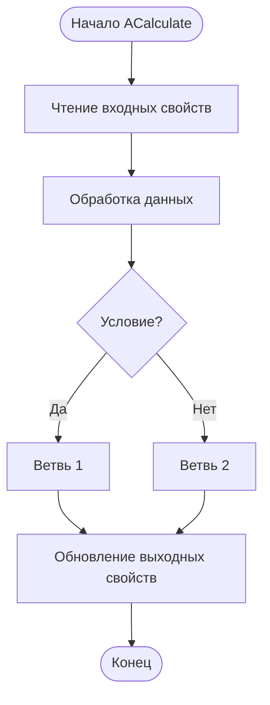
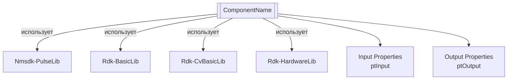
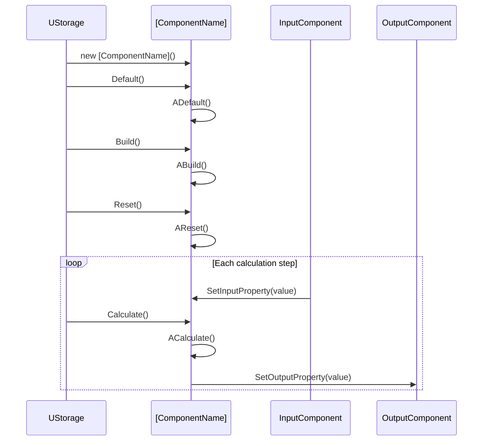
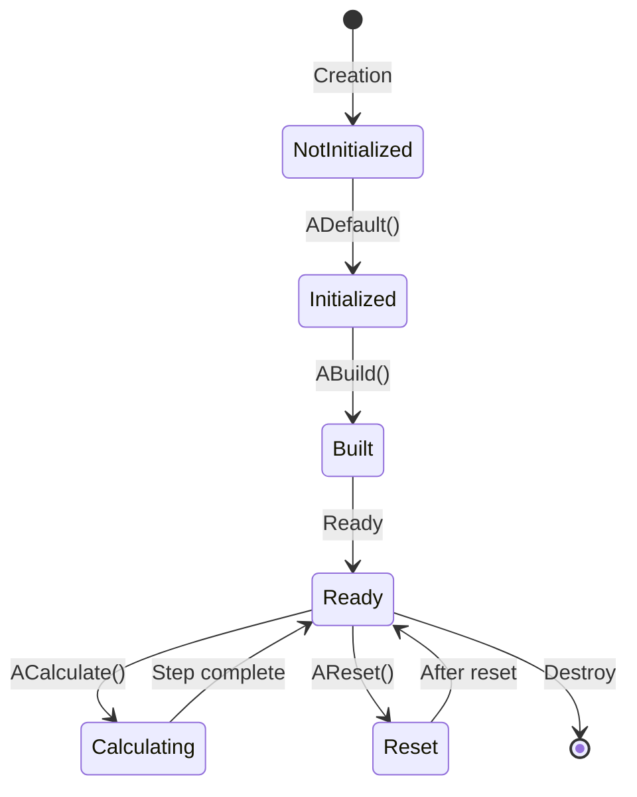
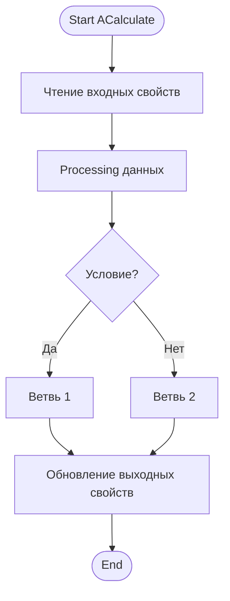
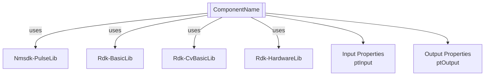

# [ComponentName] — [RU название]

## RU

**Класс**: `[ComponentName]` — [краткое описание назначения компонента].
**Регистрация**: `NMotionControlLibrary.cpp` → `UploadClass("[ComponentName]", ...)`.
**Базовый класс**: `[BaseClass]` (из [библиотека]).

[Подробное описание компонента, его назначения и области применения]

## UML-диаграмма классов

```mermaid
classDiagram
    [BaseClass] <|-- [ComponentName]
    [ComponentName] *-- [RelatedComponent] : [relationship]
    class [ComponentName] {
        +UProperty[Type] PropertyName : [flags]
        +MethodName() ReturnType
        #ProtectedProperty : Type
        #ADefault() bool
        #ABuild() bool
        #AReset() bool
        #ACalculate() bool
    }
```

**Иерархия наследования:**
- `[BaseClass]` — [описание базового класса]
- `[ComponentName]` — [описание компонента]

**Ключевые свойства / Favorites:** таблица primary для ClDesc Favorites (`{CompName}:Prop`); secondary (`Activity`, `Coord`, `Name`, `TimeStep`, debug…) не включать; опционально curated nested I/O aliases. См. `Docs/ClDesc-Detailed-Methodology.md`.

**Связи с другими компонентами:**
- [Описание связей: композиция, агрегация, зависимости]

## UML-диаграмма последовательности


**Описание жизненного цикла:**
1. **Создание** - компонент создается через конструктор
2. **Инициализация (ADefault)** - установка значений по умолчанию
3. **Построение (ABuild)** - создание внутренней структуры
4. **Сброс (AReset)** - сброс состояния к начальному
5. **Вычисление (ACalculate)** - основной цикл вычислений

## UML-диаграмма состояний



**Состояния компонента:**
- **NotInitialized** - компонент создан, но не инициализирован
- **Initialized** - компонент инициализирован (после ADefault)
- **Built** - внутренняя структура построена (после ABuild)
- **Ready** - готов к вычислениям
- **Calculating** - выполняется вычисление (ACalculate)
- **Reset** - состояние после сброса (AReset)

**Примечание:** Если компонент не имеет явных состояний, эта диаграмма может быть упрощена или заменена описанием жизненного цикла.

## UML-диаграмма активности



**Алгоритм работы:**
- [Описание алгоритма работы основных методов]
- [Поток данных внутри компонента]
- [Условные ветвления и циклы]

## UML-диаграмма компонентов



**Зависимости:**
- **Nmsdk-PulseLib** - [описание использования]
- **Rdk-BasicLib** - [описание использования]
- **Rdk-CvBasicLib** - [описание использования]
- **Rdk-HardwareLib** - [описание использования]

**Интерфейсы:**
- **Входы** - свойства с флагом `ptInput`
- **Выходы** - свойства с флагом `ptOutput`

## Свойства

### Параметры (ptParameter / ptPubParameter)

| Свойство | Тип | Флаги | Описание | Значение по умолчанию | Диапазон |
|----------|-----|-------|----------|----------------------|----------|
| `PropertyName` | `Type` | `ptPubParameter` | [Описание назначения] | [Значение] | [Диапазон] |

### Входы (ptInput)

| Свойство | Тип | Флаги | Описание | Источник данных |
|----------|-----|-------|----------|-----------------|
| `InputProperty` | `MDMatrix<double>` | `ptInput \| ptPubState` | [Описание назначения] | [Откуда поступают данные] |

### Выходы (ptOutput)

| Свойство | Тип | Флаги | Описание | Назначение |
|----------|-----|-------|----------|------------|
| `OutputProperty` | `MDMatrix<double>` | `ptOutput \| ptPubState` | [Описание назначения] | [Куда передаются данные] |

### Состояния (ptPubState)

| Свойство | Тип | Флаги | Описание | Изменяется в |
|----------|-----|-------|----------|--------------|
| `StateProperty` | `Type` | `ptPubState` | [Описание назначения] | [Метод, где изменяется] |

## Методы

### Конструкторы и деструкторы

#### `[ComponentName](void)`
**Назначение:** Конструктор компонента
**Параметры:** Нет
**Возвращаемое значение:** Нет
**Описание:** [Описание инициализации при создании]

#### `~[ComponentName](void)`
**Назначение:** Деструктор компонента
**Параметры:** Нет
**Возвращаемое значение:** Нет
**Описание:** [Описание очистки ресурсов]

### Методы жизненного цикла

#### `virtual bool ADefault(void)`
**Назначение:** Инициализация значений по умолчанию
**Параметры:** Нет
**Возвращаемое значение:** `true` при успехе, `false` при ошибке
**Описание:** [Описание инициализации]

#### `virtual bool ABuild(void)`
**Назначение:** Построение внутренней структуры компонента
**Параметры:** Нет
**Возвращаемое значение:** `true` при успехе, `false` при ошибке
**Описание:** [Описание построения структуры]

#### `virtual bool AReset(void)`
**Назначение:** Сброс состояния компонента к начальному
**Параметры:** Нет
**Возвращаемое значение:** `true` при успехе, `false` при ошибке
**Описание:** [Описание сброса состояния]

#### `virtual bool ACalculate(void)`
**Назначение:** Выполнение вычислений на текущем шаге
**Параметры:** Нет
**Возвращаемое значение:** `true` при успехе, `false` при ошибке
**Описание:** [Описание алгоритма вычислений]

### Сеттеры свойств

#### `bool SetPropertyName(const Type &value)`
**Назначение:** Установка значения свойства
**Параметры:**
- `value` - новое значение свойства
**Возвращаемое значение:** `true` при успехе, `false` при ошибке
**Описание:** [Описание валидации и установки значения]

### Публичные методы

#### `ReturnType MethodName(Parameters)`
**Назначение:** [Описание назначения метода]
**Параметры:**
- `param1` - [описание параметра]
- `param2` - [описание параметра]
**Возвращаемое значение:** [Описание возвращаемого значения]
**Описание:** [Подробное описание работы метода]

### Защищенные методы

#### `#ProtectedMethod(Parameters)`
**Назначение:** [Описание назначения]
**Параметры:** [Описание параметров]
**Возвращаемое значение:** [Описание возвращаемого значения]
**Описание:** [Описание работы метода]

## Примеры использования

### C++ код

#### Создание и настройка компонента

```cpp
#include "[ComponentName].h"

// Создание экземпляра
UEPtr<[ComponentName]> component = new [ComponentName];
component->SetName("MyComponent");

// Инициализация
component->Default();

// Настройка параметров
component->PropertyName = value;

// Построение структуры
component->Build();

// Подключение к другим компонентам
component->InputProperty.Connect(otherComponent->OutputProperty);

// Использование в цикле вычислений
component->Reset();
for (int step = 0; step < numSteps; step++) {
    component->Calculate();
    // Использование выходных данных
    double output = component->OutputProperty.GetValue();
}
```

#### Интеграция с другими компонентами

```cpp
// Создание компонентов
UEPtr<InputComponent> input = new InputComponent;
UEPtr<[ComponentName]> component = new [ComponentName];
UEPtr<OutputComponent> output = new OutputComponent;

// Инициализация
input->Default();
component->Default();
output->Default();

// Построение
input->Build();
component->Build();
output->Build();

// Связывание
component->InputProperty.Connect(input->OutputProperty);
output->InputProperty.Connect(component->OutputProperty);

// Вычисления
input->Reset();
component->Reset();
output->Reset();

for (int step = 0; step < numSteps; step++) {
    input->Calculate();
    component->Calculate();
    output->Calculate();
}
```

### XML конфигурация

#### Базовая конфигурация

```xml
<Object Name="MyComponent" ClassName="[ComponentName]">
    <Property Name="PropertyName" Value="value" />
    <Property Name="InputProperty" Connect="OtherComponent.OutputProperty" />
</Object>
```

#### Полная конфигурация с параметрами

```xml
<Object Name="MyComponent" ClassName="[ComponentName]">
    <!-- Параметры -->
    <Property Name="PropertyName" Value="1.0" />
    <Property Name="AnotherProperty" Value="2.5" />

    <!-- Входы -->
    <Property Name="InputProperty" Connect="SourceComponent.OutputProperty" />

    <!-- Выходы (подключение к другим компонентам) -->
    <Object Name="TargetComponent" ClassName="TargetClass">
        <Property Name="InputProperty" Connect="MyComponent.OutputProperty" />
    </Object>
</Object>
```

### Использование в конфигурациях

Компонент `[ComponentName]` используется в следующих конфигурационных проектах:

- `Bin/Configs/[ProjectName]/[ConfigFile].xml` - [описание использования]
- `Bin/Configs/[AnotherProject]/[AnotherConfig].xml` - [описание использования]

**Типичные сценарии использования:**
- [Описание сценария 1]
- [Описание сценария 2]
- [Описание сценария 3]

**Типичные комбинации с другими компонентами:**
- `[ComponentName]` + `[RelatedComponent1]` - [описание комбинации]
- `[ComponentName]` + `[RelatedComponent2]` - [описание комбинации]

## Источники

- [Literature-References.md](Literature-References.md): [A], [номера публикаций по тематике компонента] — [краткое пояснение, напр. иерархия управления, моторная память, контроль позиции].

---

## EN

[ComponentName] — [EN name]

**Class**: `[ComponentName]` — [brief description in English].
**Registration**: `NMotionControlLibrary.cpp` → `UploadClass("[ComponentName]", ...)`.
**Base class**: `[BaseClass]` (from [library]).

[Detailed description of the component, its purpose and application area]

## Class Diagram

[Same as RU section, translated to English]

```mermaid
classDiagram
    [BaseClass] <|-- [ComponentName]
    [ComponentName] *-- [RelatedComponent] : [relationship]
    class [ComponentName] {
        +UProperty[Type] PropertyName : [flags]
        +MethodName() ReturnType
        #ProtectedProperty : Type
        #ADefault() bool
        #ABuild() bool
        #AReset() bool
        #ACalculate() bool
    }
```

## Sequence Diagram

[Same as RU section, translated to English]



## State Diagram

[Same as RU section, translated to English]



## Activity Diagram

[Same as RU section, translated to English]



## Component Diagram

[Same as RU section, translated to English]



## Properties

[Same structure as RU section, translated to English]

## Methods

[Same structure as RU section, translated to English]

## Usage Examples

### C++ Code

[Same examples as RU section, with English comments]

### XML Configuration

[Same XML examples as RU section, with English comments]

### Usage in Configurations

[Same as RU section, translated to English]

## References

- [Literature-References.md](Literature-References.md): [A], [publication numbers for this component] — [brief note, e.g. hierarchical control, motor memory, position control].
