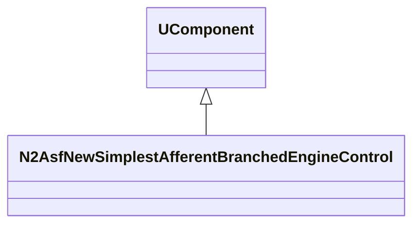
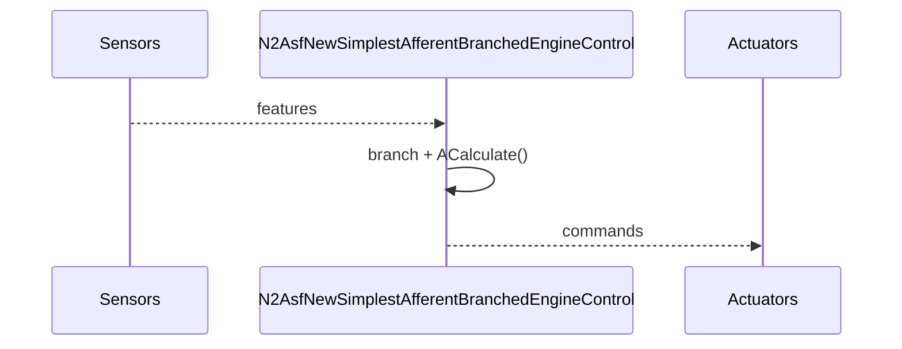
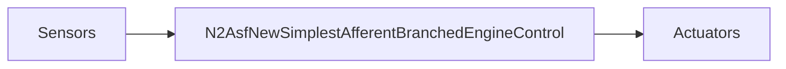
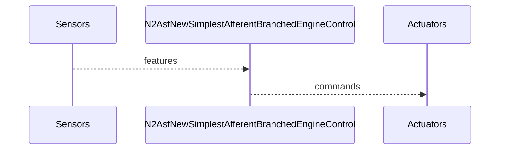

## N2AsfNewSimplestAfferentBranchedEngineControl — афферентный разветвлённый контроллер

**Класс**: `N2AsfNewSimplestAfferentBranchedEngineControl` — специализированный контроллер движения на основе разветвлённых афферентов (по регистрации библиотеки).  
**Регистрация**: `NMotionControlLibrary.cpp` → `UploadClass("N2AsfNewSimplestAfferentBranchedEngineControl", ...)`.

### Lifecycle
- **ADefault**: параметры ветвления/правил.
- **ABuild**: подключение сенсоров и актуаторов.
- **AReset**: сброс состояния ветвей.
- **ACalculate**: вычисление команды на основе афферентных ветвей.

### I/O
- Вход: сенсорные признаки/ошибки (векторы).
- Выход: команды управления (векторы/скаляры).



Пояснение: диаграмма классов показывает место компонента в иерархии и ключевые связи.



Пояснение: диаграмма последовательности показывает типовой сценарий взаимодействия и порядок вызовов.



Пояснение: блок-схема показывает поток данных/сигналов (входы → компонент → выходы).

### Config snippet

```ini
[Component]
ClassName = N2AsfNewSimplestAfferentBranchedEngineControl
Name = BranchedCtrl1
```

---

## N2AsfNewSimplestAfferentBranchedEngineControl — branched afferent control (EN)

Specialised branched afferent controller producing actuator commands from sensor features.


Description: this class diagram shows the component position in the type hierarchy and key relations.



Description: this sequence diagram shows a typical runtime interaction and call order.


Description: this flowchart shows the data/signal flow (inputs → component → outputs).
