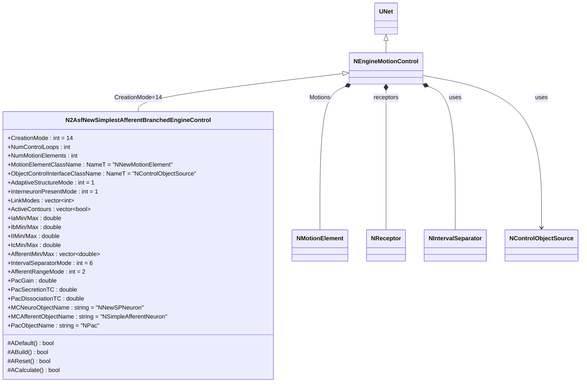
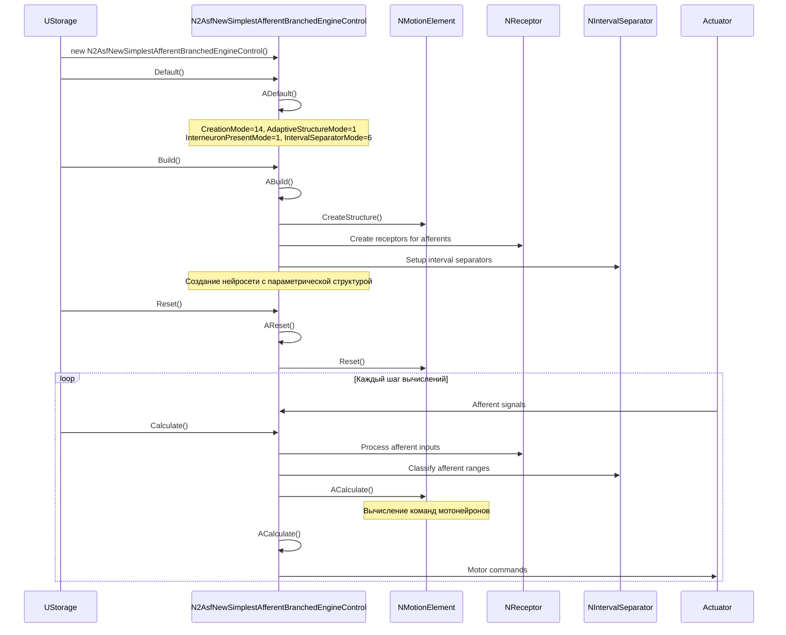
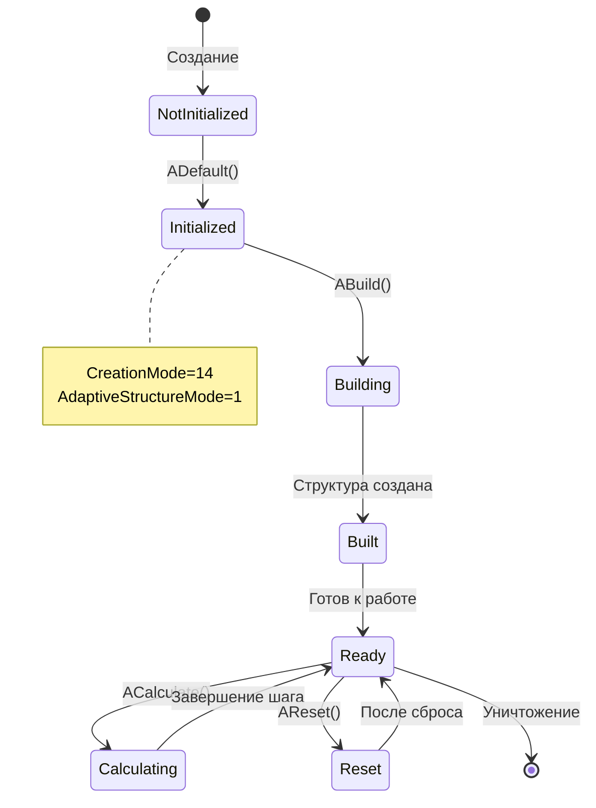
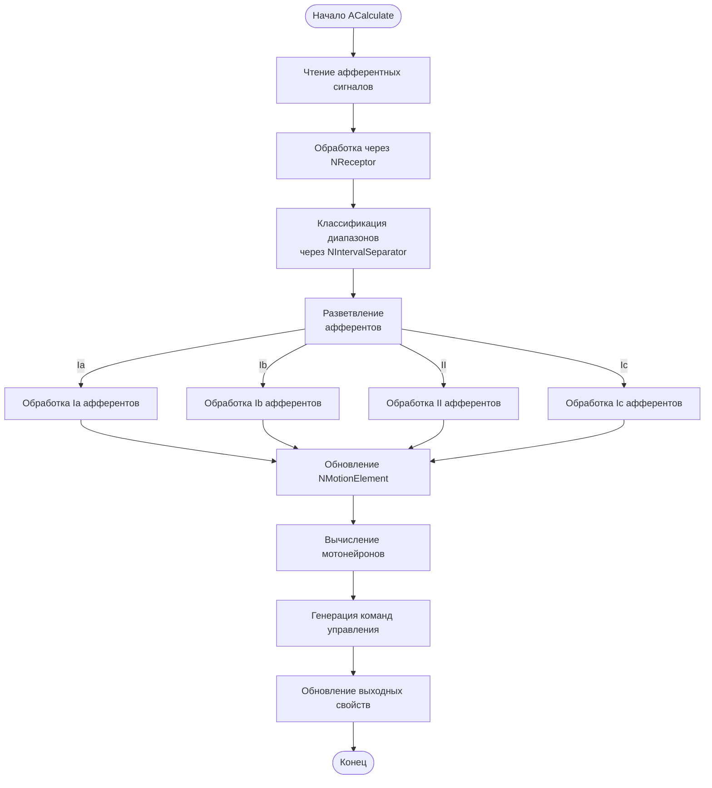
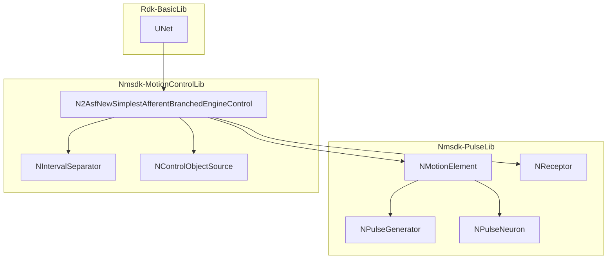
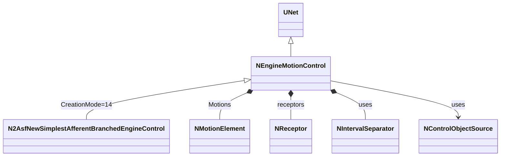
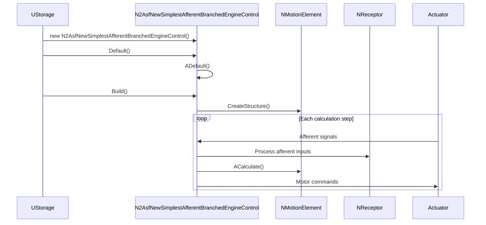
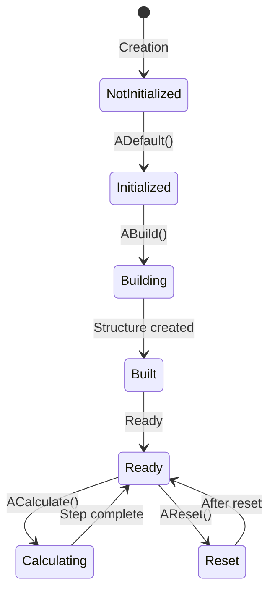
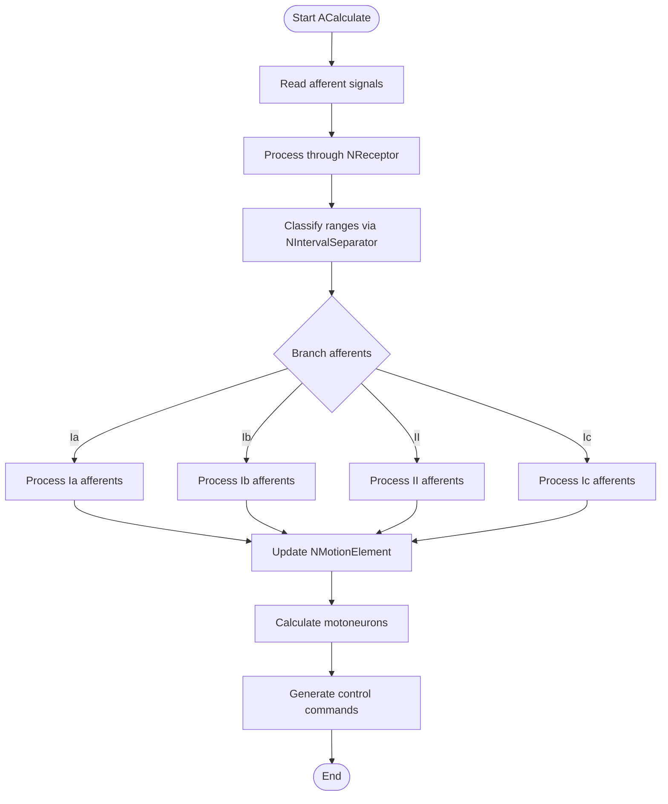
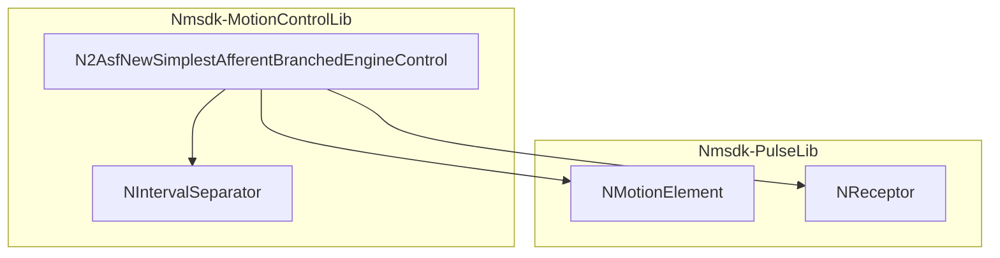

# N2AsfNewSimplestAfferentBranchedEngineControl — разветвлённый афферентный контроллер движения

## RU

**Класс**: `N2AsfNewSimplestAfferentBranchedEngineControl` — специализированная конфигурация `NEngineMotionControl` с разветвлённой афферентной обработкой и параметрическим управлением структурой нейросети.
**Регистрация**: `NMotionControlLibrary.cpp` → `UploadClass("N2AsfNewSimplestAfferentBranchedEngineControl", ...)`.
**Базовый класс**: `NEngineMotionControl` (через регистрацию с `CreationMode=14`).

N2AsfNewSimplestAfferentBranchedEngineControl представляет собой предварительно настроенный вариант `NEngineMotionControl` с `CreationMode=14` ("New net with parametric structure control"). Этот режим создаёт новую нейросеть с параметрическим управлением структурой, использующую разветвлённую обработку афферентных сигналов для управления движением. Компонент автоматически настраивает параметры для работы с упрощённой двухнейронной моделью с дополнительными контурами управления скоростью и силой.

## UML-диаграмма классов



**Иерархия наследования:**
- `UNet` (Rdk Framework) — базовый класс для сетей компонентов
- `NEngineMotionControl` — базовый класс контроллера движения
- `N2AsfNewSimplestAfferentBranchedEngineControl` — специализированная конфигурация с разветвлёнными афферентами

**Связи с другими компонентами:**
- **Композиция**: создаёт и управляет `NMotionElement` для каждого контура управления
- **Композиция**: использует `NReceptor` для обработки афферентных сигналов
- **Зависимости**: использует `NIntervalSeparator` для классификации афферентных диапазонов
- **Зависимости**: использует `NControlObjectSource` для интерфейса управления объектом

## UML-диаграмма последовательности



**Описание жизненного цикла:**
1. **Создание** - компонент создаётся через конструктор (фактически создаётся `NEngineMotionControl`)
2. **Инициализация (ADefault)** - установка `CreationMode=14` и специализированных параметров для разветвлённой афферентной обработки
3. **Построение (ABuild)** - создание нейросети с параметрической структурой, включая мотонейроны, афференты, интернейроны
4. **Сброс (AReset)** - сброс состояния всех внутренних компонентов
5. **Вычисление (ACalculate)** - обработка афферентных сигналов через разветвлённую структуру и генерация команд управления

## UML-диаграмма состояний



**Состояния компонента:**
- **NotInitialized** - компонент создан, но не инициализирован
- **Initialized** - компонент инициализирован с `CreationMode=14`
- **Building** - создаётся нейросеть с параметрической структурой
- **Built** - структура построена, готов к работе
- **Ready** - готов к вычислениям
- **Calculating** - выполняется обработка афферентных сигналов и генерация команд
- **Reset** - состояние после сброса

## UML-диаграмма активности



**Алгоритм работы ACalculate:**
1. Чтение афферентных сигналов от сенсоров
2. Обработка через рецепторы (`NReceptor`) для каждого типа афферентов
3. Классификация диапазонов через `NIntervalSeparator` (режим 6)
4. Разветвление афферентных сигналов по типам (Ia, Ib, II, Ic)
5. Параллельная обработка каждого типа афферентов
6. Обновление элементов движения (`NMotionElement`)
7. Вычисление активности мотонейронов в каждом контуре
8. Генерация команд управления на основе активности мотонейронов
9. Обновление выходных свойств

## UML-диаграмма компонентов



**Зависимости:**
- **Nmsdk-PulseLib**: базовые классы для импульсных нейросетей (`NMotionElement`, `NReceptor`, `NPulseGenerator`, `NPulseNeuron`)
- **Nmsdk-MotionControlLib**: вспомогательные компоненты (`NIntervalSeparator`, `NControlObjectSource`)
- **Rdk-BasicLib**: базовый фреймворк (`UNet`)

## Свойства компонента

### Параметры (ptPubParameter)

| Свойство | Тип | Значение по умолчанию | Описание |
|----------|-----|----------------------|----------|
| `CreationMode` | `int` | `14` | Режим создания сети: "New net with parametric structure control" |
| `NumControlLoops` | `int` | `1` | Количество контуров управления |
| `NumMotionElements` | `int` | `1` | Количество элементов движения |
| `MotionElementClassName` | `NameT` | `"NNewMotionElement"` | Имя класса для элементов движения |
| `ObjectControlInterfaceClassName` | `NameT` | `"NControlObjectSource"` | Имя класса интерфейса управления объектом |
| `AdaptiveStructureMode` | `int` | `1` | Режим адаптивной структуры (1 - адаптивная настройка) |
| `InterneuronPresentMode` | `int` | `1` | Режим присутствия интернейронов (1 - включены) |
| `LinkModes` | `vector<int>` | `[1]` | Режимы связей между компонентами |
| `ActiveContours` | `vector<bool>` | `[1]` | Флаги активности контуров управления |
| `IntervalSeparatorMode` | `int` | `6` | Режим работы интервального сепаратора |
| `AfferentRangeMode` | `int` | `2` | Режим диапазонов афферентов (2 - формула 3.4) |
| `PacGain` | `double` | `100` | Коэффициент усиления PAC |
| `PacSecretionTC` | `double` | `0.001` | Постоянная времени секреции PAC |
| `PacDissociationTC` | `double` | `0.001` | Постоянная времени диссоциации PAC |
| `IaMin/Max` | `double` | `-2π / 2π` | Диапазон для Ia афферентов |
| `IbMin/Max` | `double` | `-1 / 1` | Диапазон для Ib афферентов |
| `IIMin/Max` | `double` | `-π/2 / π/2` | Диапазон для II афферентов |
| `IcMin/Max` | `double` | `-10 / 10` | Диапазон для Ic афферентов |
| `AfferentMin/Max` | `vector<double>` | `[-π/2, π/2]` | Минимальные/максимальные значения афферентов |
| `MCNeuroObjectName` | `string` | `"NNewSPNeuron"` | Имя класса нейрона для управления |
| `MCAfferentObjectName` | `string` | `"NSimpleAfferentNeuron"` | Имя класса афферентного нейрона |
| `PacObjectName` | `string` | `"NPac"` | Имя класса PAC компонента |

### Состояния (ptPubState)

| Свойство | Тип | Описание |
|----------|-----|----------|
| `CurrentContourAmplitude` | `vector<double>` | Текущая амплитуда контуров |
| `CurrentContourAverage` | `vector<double>` | Текущее среднее значение контуров |
| `CurrentTransientTime` | `double` | Время текущего переходного процесса |
| `InstantAvgSpeed` | `double` | Мгновенная средняя скорость |
| `CurrentTransientState` | `bool` | Состояние переходного процесса |
| `MaxContourAmplitude` | `vector<double>` | Максимальная амплитуда контуров |
| `MinAfferentRange` | `double` | Минимальный диапазон афферентов |
| `Statistic` | `MDMatrix<double>` | Матрица статистики |

## Методы компонента

### Жизненный цикл

#### `ADefault() -> bool`
**Назначение**: Инициализация параметров по умолчанию для режима разветвлённых афферентов.

**Параметры**: Нет

**Возвращаемое значение**: `true` при успешной инициализации

**Описание**: Устанавливает `CreationMode=14`, `AdaptiveStructureMode=1`, `InterneuronPresentMode=1`, `IntervalSeparatorMode=6`, и другие параметры для работы с разветвлённой афферентной обработкой.

#### `ABuild() -> bool`
**Назначение**: Создание нейросети с параметрической структурой управления.

**Параметры**: Нет

**Возвращаемое значение**: `true` при успешном построении

**Описание**: Создаёт структуру нейросети, включая мотонейроны, афференты, интернейроны, рецепторы и интервальные сепараторы согласно параметрам `CreationMode=14`.

#### `AReset() -> bool`
**Назначение**: Сброс состояния компонента и всех внутренних элементов.

**Параметры**: Нет

**Возвращаемое значение**: `true` при успешном сбросе

**Описание**: Сбрасывает состояние всех `NMotionElement`, рецепторов и других внутренних компонентов к начальному состоянию.

#### `ACalculate() -> bool`
**Назначение**: Основной цикл вычислений: обработка афферентных сигналов и генерация команд управления.

**Параметры**: Нет

**Возвращаемое значение**: `true` при успешном вычислении

**Описание**: Обрабатывает афферентные сигналы через разветвлённую структуру, классифицирует их по диапазонам, обновляет элементы движения и генерирует команды управления на основе активности мотонейронов.

## Примеры использования

### C++ код

```cpp
#include "NEngineMotionControl.h"

// Создание компонента (фактически создаётся NEngineMotionControl с CreationMode=14)
UEPtr<NEngineMotionControl> controller = storage->CreateComponent<NEngineMotionControl>("BranchedController");

// Настройка параметров (устанавливаются автоматически при регистрации как N2AsfNewSimplestAfferentBranchedEngineControl)
// controller->CreationMode = 14; // Устанавливается автоматически
controller->NumControlLoops = 2;
controller->NumMotionElements = 2;
controller->AdaptiveStructureMode = 1;
controller->InterneuronPresentMode = 1;

// Инициализация
controller->Default();
controller->Build();
controller->Reset();

// В цикле вычислений
while (simulation_running) {
    // Установка афферентных сигналов через рецепторы
    // (обрабатываются автоматически внутри компонента)

    controller->Calculate();

    // Получение команд управления
    // (доступны через внутренние NMotionElement)
}
```

### XML конфигурация

```xml
<Component>
    <ClassName>N2AsfNewSimplestAfferentBranchedEngineControl</ClassName>
    <Name>BranchedController1</Name>
    <Properties>
        <NumControlLoops>2</NumControlLoops>
        <NumMotionElements>2</NumMotionElements>
        <AdaptiveStructureMode>1</AdaptiveStructureMode>
        <InterneuronPresentMode>1</InterneuronPresentMode>
        <IntervalSeparatorMode>6</IntervalSeparatorMode>
        <AfferentRangeMode>2</AfferentRangeMode>
        <IaMin>-6.28</IaMin>
        <IaMax>6.28</IaMax>
        <IbMin>-1</IbMin>
        <IbMax>1</IbMax>
        <IIMin>-1.57</IIMin>
        <IIMax>1.57</IIMax>
        <IcMin>-10</IcMin>
        <IcMax>10</IcMax>
        <PacGain>100</PacGain>
        <PacSecretionTC>0.001</PacSecretionTC>
        <PacDissociationTC>0.001</PacDissociationTC>
    </Properties>
</Component>
```

## Связи с конфигурационными проектами

Компонент `N2AsfNewSimplestAfferentBranchedEngineControl` используется в проектах, требующих:
- **Разветвлённой обработки афферентных сигналов** - когда необходимо разделить обработку различных типов афферентов (Ia, Ib, II, Ic)
- **Параметрического управления структурой** - когда структура нейросети должна адаптироваться в зависимости от параметров
- **Упрощённой двухнейронной модели с расширенными контурами** - для управления движением с дополнительными контурами контроля скорости и силы
- **Адаптивной настройки** - когда требуется автоматическая адаптация параметров сети в процессе работы

Типичные сценарии использования:
- Управление манипулятором с несколькими степенями свободы
- Роботизированные системы с обратной связью от проприоцептивных сенсоров
- Адаптивные системы управления движением с обучением

---

## EN

## N2AsfNewSimplestAfferentBranchedEngineControl — branched afferent motion controller (EN)

**Class**: `N2AsfNewSimplestAfferentBranchedEngineControl` — specialized configuration of `NEngineMotionControl` with branched afferent processing and parametric structure control.
**Registration**: `NMotionControlLibrary.cpp` → `UploadClass("N2AsfNewSimplestAfferentBranchedEngineControl", ...)`.
**Base class**: `NEngineMotionControl` (via registration with `CreationMode=14`).

N2AsfNewSimplestAfferentBranchedEngineControl is a pre-configured variant of `NEngineMotionControl` with `CreationMode=14` ("New net with parametric structure control"). This mode creates a new neural network with parametric structure control, using branched afferent signal processing for motion control. The component automatically configures parameters for working with a simplified two-neuron model with additional speed and force control loops.

## Class Diagram



## Sequence Diagram



## State Diagram



## Activity Diagram



## Component Diagram



## Properties

### Parameters (ptPubParameter)

| Property | Type | Default | Description |
|----------|------|---------|-------------|
| `CreationMode` | `int` | `14` | Network creation mode: "New net with parametric structure control" |
| `NumControlLoops` | `int` | `1` | Number of control loops |
| `AdaptiveStructureMode` | `int` | `1` | Adaptive structure mode (1 - adaptive tuning) |
| `InterneuronPresentMode` | `int` | `1` | Interneuron presence mode (1 - enabled) |
| `IntervalSeparatorMode` | `int` | `6` | Interval separator mode |
| `AfferentRangeMode` | `int` | `2` | Afferent range mode (2 - formula 3.4) |

## Methods

### Lifecycle Methods

#### `ADefault() -> bool`
**Purpose**: Initialize default parameters for branched afferent mode.

**Description**: Sets `CreationMode=14`, `AdaptiveStructureMode=1`, `InterneuronPresentMode=1`, `IntervalSeparatorMode=6`, and other parameters for branched afferent processing.

#### `ABuild() -> bool`
**Purpose**: Create neural network with parametric structure control.

**Description**: Creates network structure including motoneurons, afferents, interneurons, receptors, and interval separators according to `CreationMode=14` parameters.

#### `ACalculate() -> bool`
**Purpose**: Main computation cycle: process afferent signals and generate control commands.

**Description**: Processes afferent signals through branched structure, classifies them by ranges, updates motion elements, and generates control commands based on motoneuron activity.

## Usage Examples

### C++ Code

```cpp
#include "NEngineMotionControl.h"

UEPtr<NEngineMotionControl> controller = storage->CreateComponent<NEngineMotionControl>("BranchedController");
controller->NumControlLoops = 2;
controller->Default();
controller->Build();
controller->Reset();

while (simulation_running) {
    controller->Calculate();
}
```

### XML Configuration

```xml
<Component>
    <ClassName>N2AsfNewSimplestAfferentBranchedEngineControl</ClassName>
    <Name>BranchedController1</Name>
    <Properties>
        <NumControlLoops>2</NumControlLoops>
        <AdaptiveStructureMode>1</AdaptiveStructureMode>
        <InterneuronPresentMode>1</InterneuronPresentMode>
    </Properties>
</Component>
```

## References
- [Literature-References.md](../Literature-References.md): [A], 19, 20, 21, 22 — упрощённая ветвящаяся система управления движением.
