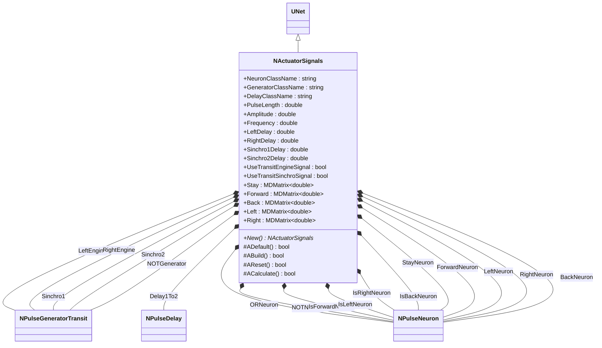
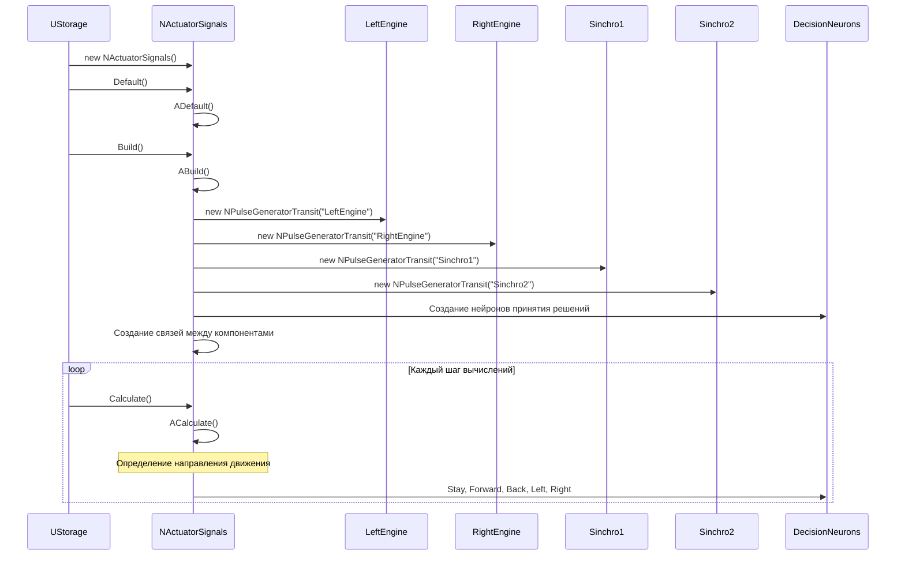
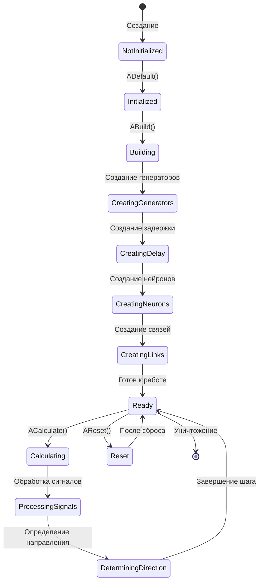
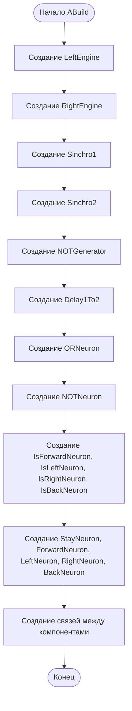
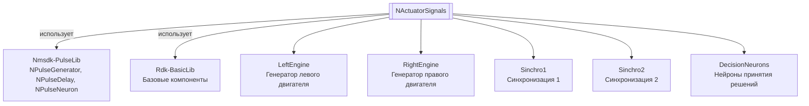

# NActuatorSignals — сигналы актуаторов

**Класс**: `NActuatorSignals` — компонент для определения направления движения объекта управления с использованием нейросетевой структуры из генераторов импульсов, задержек и нейронов.  
**Регистрация**: `NMotionControlLibrary.cpp` → `UploadClass("NActuatorSignals", ...)`.  
**Базовый класс**: `UNet` (из Rdk Framework).

NActuatorSignals определяет направление движения объекта управления (Stay, Forward, Back, Left, Right) на основе сигналов от левого и правого двигателей и синхронизирующих сигналов. Компонент создает сложную нейросетевую структуру для обработки сигналов и принятия решений о направлении движения.

## UML-диаграмма классов



**Иерархия наследования:**
- `UNet` (Rdk Framework) — базовый класс для сетей компонентов
- `NActuatorSignals` — сигналы актуаторов

## UML-диаграмма последовательности



## UML-диаграмма состояний



## UML-диаграмма активности



## UML-диаграмма компонентов



## Свойства

### Параметры классов

| Свойство | Тип | Флаги | Описание | Значение по умолчанию |
|----------|-----|-------|----------|----------------------|
| `NeuronClassName` | `std::string` | `ptPubParameter` | Имя класса нейрона | `"NSPNeuronGen"` |
| `GeneratorClassName` | `std::string` | `ptPubParameter` | Имя класса генератора | `"NPulseGeneratorTransit"` |
| `DelayClassName` | `std::string` | `ptPubParameter` | Имя класса задержки | `"NPDelay"` |

### Параметры импульсов

| Свойство | Тип | Флаги | Описание | Значение по умолчанию |
|----------|-----|-------|----------|----------------------|
| `PulseLength` | `double` | `ptPubParameter` | Длительность импульсов (с) | `0.001` |
| `Amplitude` | `double` | `ptPubParameter` | Амплитуда импульсов | `1.0` |
| `Frequency` | `double` | `ptPubParameter` | Частота генерации (Гц) | `0.0` |

### Параметры задержек

| Свойство | Тип | Флаги | Описание | Значение по умолчанию |
|----------|-----|-------|----------|----------------------|
| `LeftDelay` | `double` | `ptPubParameter` | Задержка левого двигателя (с) | `0.0` |
| `RightDelay` | `double` | `ptPubParameter` | Задержка правого двигателя (с) | `0.0` |
| `Sinchro1Delay` | `double` | `ptPubParameter` | Задержка синхронизации 1 (с) | `0.05` |
| `Sinchro2Delay` | `double` | `ptPubParameter` | Задержка синхронизации 2 (с) | `0.15` |

### Флаги режимов

| Свойство | Тип | Флаги | Описание | Значение по умолчанию |
|----------|-----|-------|----------|----------------------|
| `UseTransitEngineSignal` | `bool` | `ptPubParameter` | Использовать транзитный сигнал для двигателей | `false` |
| `UseTransitSinchroSignal` | `bool` | `ptPubParameter` | Использовать транзитный сигнал для синхронизации | `false` |

### Выходы

| Свойство | Тип | Флаги | Описание | Назначение |
|----------|-----|-------|----------|------------|
| `Stay` | `MDMatrix<double>` | `ptOutput \| ptPubState` | Сигнал остановки | Передача системам управления |
| `Forward` | `MDMatrix<double>` | `ptOutput \| ptPubState` | Сигнал движения вперед | Передача системам управления |
| `Back` | `MDMatrix<double>` | `ptOutput \| ptPubState` | Сигнал движения назад | Передача системам управления |
| `Left` | `MDMatrix<double>` | `ptOutput \| ptPubState` | Сигнал поворота влево | Передача системам управления |
| `Right` | `MDMatrix<double>` | `ptOutput \| ptPubState` | Сигнал поворота вправо | Передача системам управления |

## Методы

### Конструкторы и деструкторы

#### `NActuatorSignals(void)`
**Назначение:** Конструктор компонента  
**Параметры:** Нет  
**Возвращаемое значение:** Нет  
**Описание:** Инициализирует все указатели на компоненты как NULL

#### `virtual ~NActuatorSignals(void)`
**Назначение:** Деструктор компонента  
**Параметры:** Нет  
**Возвращаемое значение:** Нет

### Методы жизненного цикла

#### `virtual bool ADefault(void)`
**Назначение:** Инициализация значений по умолчанию  
**Параметры:** Нет  
**Возвращаемое значение:** `true` при успехе  
**Описание:** Устанавливает значения по умолчанию для всех параметров

#### `virtual bool ABuild(void)`
**Назначение:** Построение внутренней структуры компонента  
**Параметры:** Нет  
**Возвращаемое значение:** `true` при успехе  
**Описание:** Создает нейросетевую структуру:
1. LeftEngine, RightEngine - генераторы для левого и правого двигателей
2. Sinchro1, Sinchro2 - генераторы синхронизации
3. NOTGenerator - генератор для нейрона NOT
4. Delay1To2 - блок задержки
5. ORNeuron, NOTNeuron - логические нейроны
6. IsForwardNeuron, IsLeftNeuron, IsRightNeuron, IsBackNeuron - нейроны определения направления
7. StayNeuron, ForwardNeuron, LeftNeuron, RightNeuron, BackNeuron - выходные нейроны
8. Создает связи между компонентами

#### `virtual bool AReset(void)`
**Назначение:** Сброс состояния компонента  
**Параметры:** Нет  
**Возвращаемое значение:** `true` при успехе

#### `virtual bool ACalculate(void)`
**Назначение:** Выполнение вычислений на текущем шаге  
**Параметры:** Нет  
**Возвращаемое значение:** `true` при успехе  
**Описание:** Вычисления выполняются нейронами внутри структуры автоматически

### Сеттеры свойств

Все сеттеры свойств обновляют параметры соответствующих генераторов, задержек и нейронов при их существовании.

### Публичные методы

#### `virtual NActuatorSignals* New(void)`
**Назначение:** Создание нового экземпляра компонента  
**Параметры:** Нет  
**Возвращаемое значение:** Указатель на новый экземпляр

## Примеры использования

### C++ код

```cpp
#include "NActuatorSignals.h"

UEPtr<NActuatorSignals> signals = new NActuatorSignals;
signals->Default();
signals->LeftDelay = 0.0;
signals->RightDelay = 0.0;
signals->Sinchro1Delay = 0.05;
signals->Sinchro2Delay = 0.15;
signals->Build();
```

### XML конфигурация

```xml
<Object Name="ActuatorSignals" ClassName="NActuatorSignals">
    <Property Name="LeftDelay" Value="0.0" />
    <Property Name="RightDelay" Value="0.0" />
    <Property Name="Sinchro1Delay" Value="0.05" />
    <Property Name="Sinchro2Delay" Value="0.15" />
</Object>
```

### Использование в конфигурациях

Компонент `NActuatorSignals` используется для определения направления движения объекта управления на основе сигналов двигателей.

**Типичные сценарии использования:**
1. **Определение направления** - определение направления движения на основе сигналов двигателей
2. **Управление движением** - генерация команд управления для систем движения

**Типичные комбинации:**
- `NActuatorSignals` + двигатели - определение направления на основе сигналов двигателей

---

# NActuatorSignals — actuator signals

**Class**: `NActuatorSignals` — component for determining control object movement direction using a neural network structure of pulse generators, delays, and neurons.  
**Registration**: `NMotionControlLibrary.cpp` → `UploadClass("NActuatorSignals", ...)`.  
**Base class**: `UNet` (from Rdk Framework).

NActuatorSignals determines control object movement direction (Stay, Forward, Back, Left, Right) based on signals from left and right engines and synchronizing signals. The component creates a complex neural network structure for signal processing and movement direction decision making.

## Class Diagram

[Same as RU section]

## Sequence Diagram

[Same as RU section]

## State Diagram

[Same as RU section]

## Activity Diagram

[Same as RU section]

## Component Diagram

[Same as RU section]

## Properties

[Same structure as RU section, translated to English]

## Methods

[Same structure as RU section, translated to English]

## Usage Examples

[Same as RU section, with English comments]
