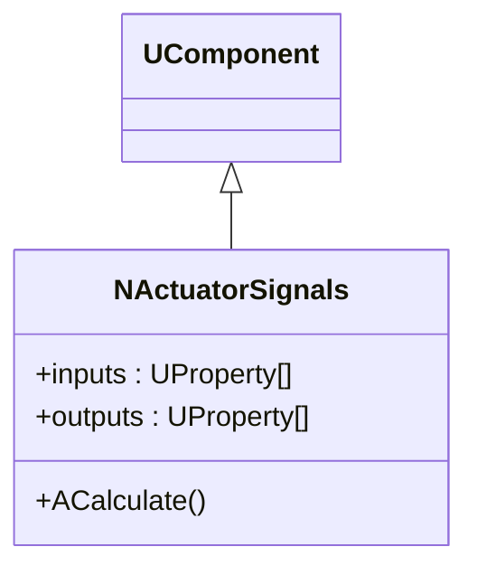
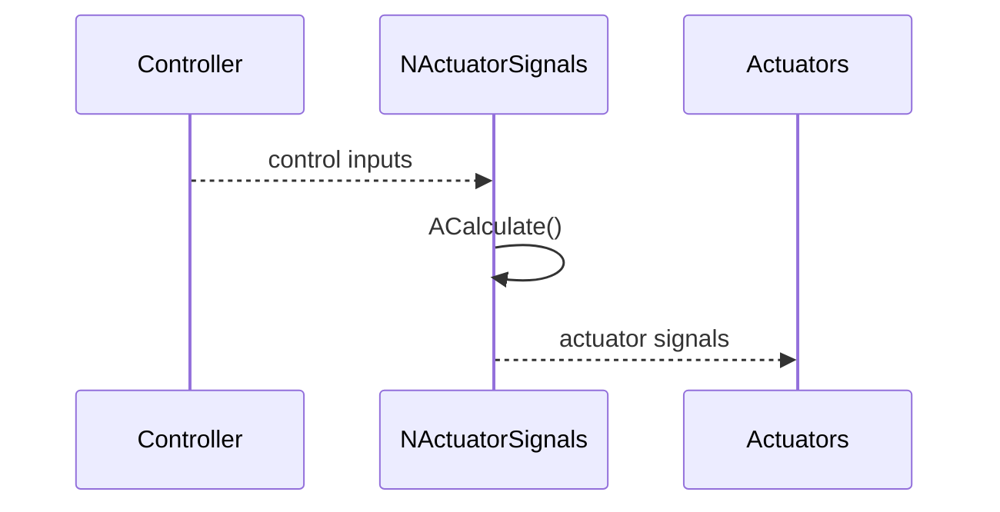
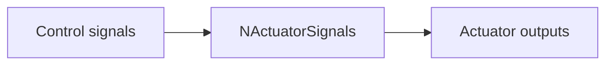
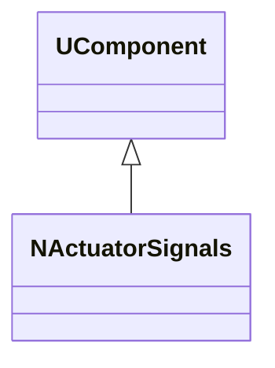
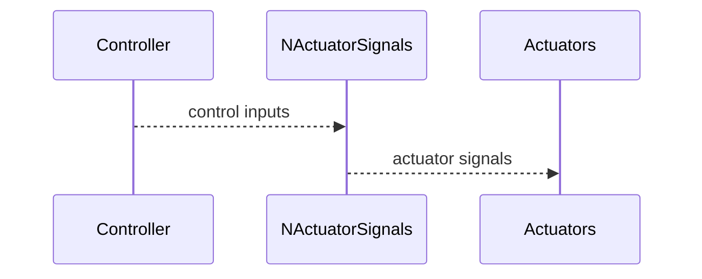

## NActuatorSignals — формирование сигналов актуаторов (Nmsdk-MotionControlLib)

**Класс**: `NActuatorSignals` — агрегирует/формирует управляющие сигналы для исполнительных механизмов.  
**Регистрация в UStorage**: `Libraries/Nmsdk-MotionControlLib/Core/NMotionControlLibrary.cpp` → `UploadClass("NActuatorSignals", ...)`.  
**Storage-инстансы**: в `Bin/ClDesc`/`Bin/Configs` используется `ClassName = "NActuatorSignals"`.

### Lifecycle
- **ADefault**: инициализация параметров формирования сигналов и нулевых выходов.
- **ABuild**: проверка подключений входных управляющих свойств и целевых выходов.
- **AReset**: сброс внутренних аккумуляторов/состояний.
- **ACalculate**: расчёт результирующих сигналов актуаторов на шаге управления.

### I/O (UProperty)
- **Входы**: управляющие значения (скаляры/векторы), параметры насыщения/ограничения.
- **Выходы**: набор сигналов на актуаторы (скаляры/векторы), готовые к подаче на двигатели/приводы.

### Диаграмма классов



Диаграмма показывает, что `NActuatorSignals` является компонентом и имеет набор входов/выходов, обрабатываемых в `ACalculate()`.

### Типовой сценарий (sequence)



Диаграмма отражает типовой шаг управления: контроллер формирует команды, `NActuatorSignals` преобразует их в формат актуаторов и отдаёт на исполнительный контур.

### Поток данных (flow)



Диаграмма показывает минимальный поток данных: входные команды превращаются в выходные сигналы актуаторов.

### Config snippet (пример)

```ini
[Component]
ClassName = NActuatorSignals
Name = ActSignals1
```

### Родственные компоненты
- `NDCEngine` — управление DC-двигателем: [`NDCEngine`](NDCEngine.md)
- `NEngineMotionControl` — центральный движок управления: [`NEngineMotionControl`](NEngineMotionControl.md)

---

## NActuatorSignals — actuator signal formation (EN)

**Class**: `NActuatorSignals` — aggregates and formats actuator control signals.  
**UStorage registration**: `NMotionControlLibrary.cpp` → `UploadClass("NActuatorSignals", ...)`.  
**Storage instances**: `ClassName = "NActuatorSignals"` in `Bin/ClDesc` / `Bin/Configs`.

### Lifecycle
- **ADefault**: initialise parameters and zero outputs.
- **ABuild**: validate connections between control inputs and actuator outputs.
- **AReset**: clear internal state.
- **ACalculate**: compute final actuator signals for the current control step.

### I/O (UProperty)
- **Inputs**: control values (scalars/vectors), limits/saturation parameters.
- **Outputs**: actuator-ready control signals (scalars/vectors).

### Class diagram



Shows `NActuatorSignals` as a `UComponent` with calculation-based behaviour.

### Typical sequence



Пояснение: диаграмма последовательности показывает типовой сценарий взаимодействия и порядок вызовов.

### Data flow


Пояснение: блок-схема показывает поток данных/сигналов (входы → компонент → выходы).
