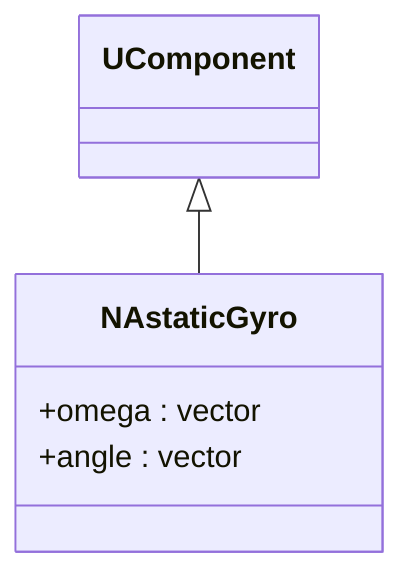
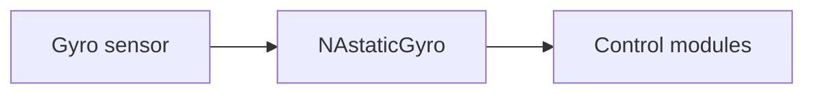
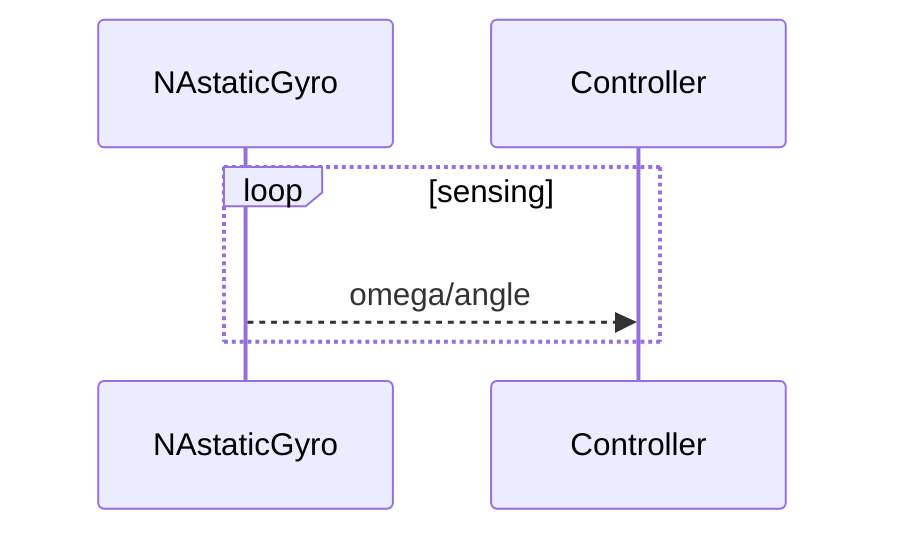

## NAstaticGyro — гироскоп

**Класс**: `NAstaticGyro` — измеряет угловую скорость/ориентацию.  
**Регистрация**: `NMotionControlLibrary.cpp` → `UploadClass("NAstaticGyro", ...)`.

### Входы/выходы
- Вход: поток датчика/шум.
- Выход: ориентация/угловая скорость для контроллеров.

Пояснение: блок-схема показывает поток данных/сигналов (входы → компонент → выходы).

Пояснение: диаграмма последовательности показывает типовой сценарий взаимодействия и порядок вызовов.

---

## NAstaticGyro — gyro

Provides angular velocity/orientation signals to control algorithms.
