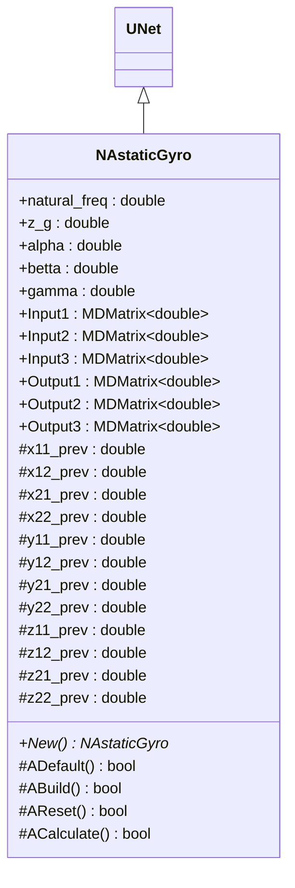
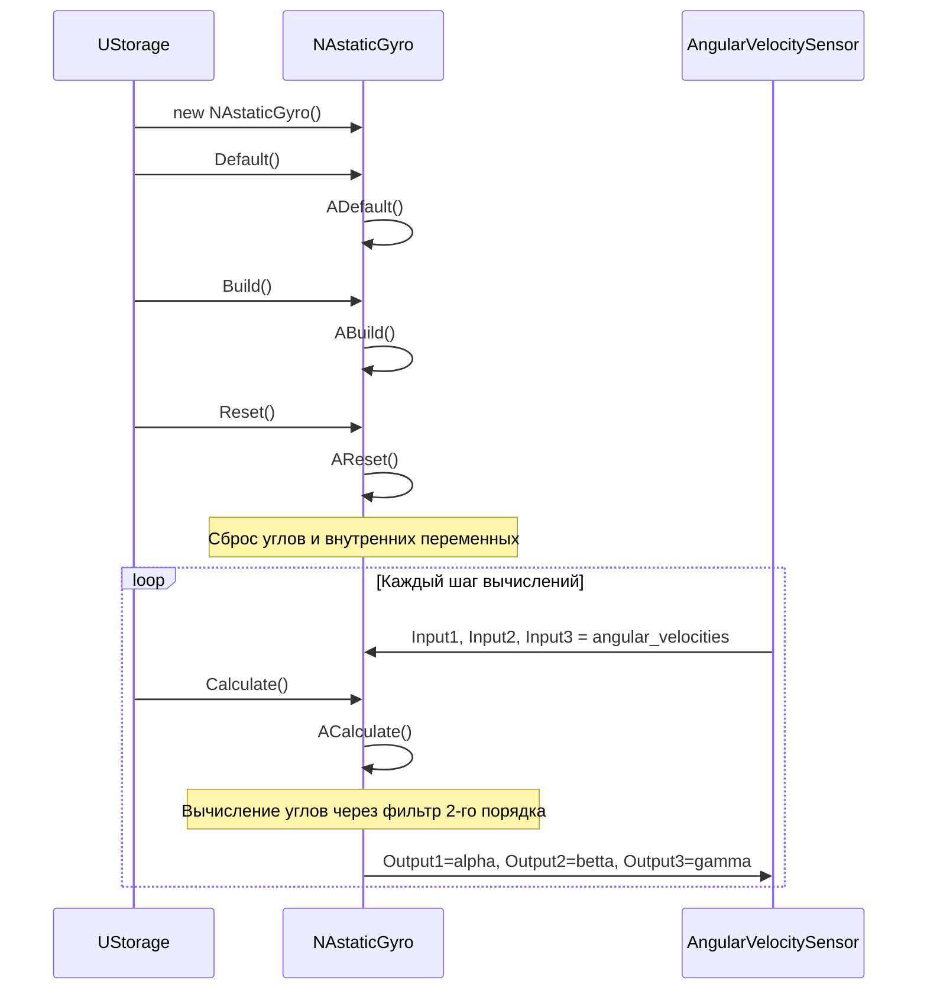
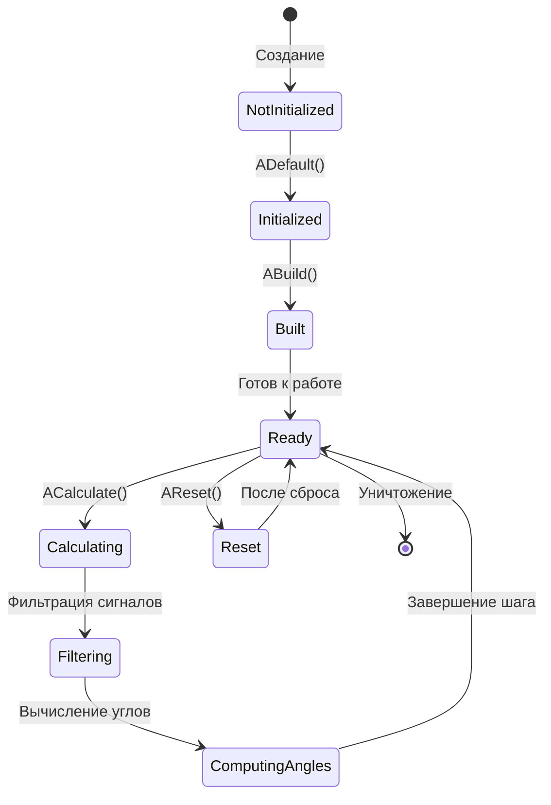
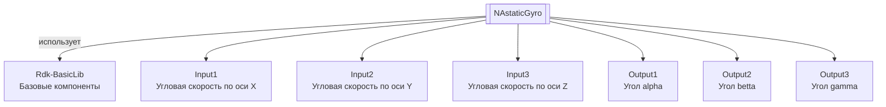

# NAstaticGyro — астатический гироскоп

**Класс**: `NAstaticGyro` — компонент моделирования астатического гироскопа для измерения углов ориентации (alpha, betta, gamma) на основе входных сигналов угловой скорости.
**Регистрация**: `NMotionControlLibrary.cpp` → `UploadClass("NAstaticGyro", ...)`.
**Базовый класс**: `UNet` (из Rdk Framework).

NAstaticGyro реализует модель астатического гироскопа, который вычисляет углы ориентации (alpha, betta, gamma) на основе входных сигналов угловой скорости по трем осям. Компонент использует фильтр второго порядка для обработки входных сигналов.

## UML-диаграмма классов



**Иерархия наследования:**
- `UNet` (Rdk Framework) — базовый класс для сетей компонентов
- `NAstaticGyro` — модель астатического гироскопа

## UML-диаграмма последовательности



## UML-диаграмма состояний



## UML-диаграмма активности

```mermaid
flowchart TD
    Start([Начало ACalculate]) --> CheckInputs["Все входы<br/>подключены?"]
    CheckInputs -->|Нет| End([Конец])
    CheckInputs -->|Да| ReadInputs[Чтение входных сигналов:<br/>input[0]=Input1, input[1]=Input2, input[2]=Input3]
    ReadInputs --> CalcAlpha["Вычисление alpha:<br/>Фильтр 2-го порядка для оси X"]
    CalcAlpha --> CalcBetta["Вычисление betta:<br/>Фильтр 2-го порядка для оси Y"]
    CalcBetta --> CalcGamma["Вычисление gamma:<br/>Фильтр 2-го порядка для оси Z"]
    CalcGamma --> UpdatePrev[Обновление предыдущих значений]
    UpdatePrev --> UpdateOutputs["Обновление выходов:<br/>Output1=alpha, Output2=betta, Output3=gamma"]
    UpdateOutputs --> End
```

## UML-диаграмма компонентов



## Свойства

### Параметры фильтра

| Свойство | Тип | Флаги | Описание | Значение по умолчанию |
|----------|-----|-------|----------|----------------------|
| `natural_freq` | `double` | `ptPubParameter` | Собственная частота фильтра (рад/с) | `190.0` |
| `z_g` | `double` | `ptPubParameter` | Коэффициент затухания | `0.707` |

### Входы

| Свойство | Тип | Флаги | Описание | Источник данных |
|----------|-----|-------|----------|-----------------|
| `Input1` | `MDMatrix<double>` | `ptInput \| ptPubState` | Угловая скорость по оси X (рад/с) | Датчик угловой скорости |
| `Input2` | `MDMatrix<double>` | `ptInput \| ptPubState` | Угловая скорость по оси Y (рад/с) | Датчик угловой скорости |
| `Input3` | `MDMatrix<double>` | `ptInput \| ptPubState` | Угловая скорость по оси Z (рад/с) | Датчик угловой скорости |

### Выходы

| Свойство | Тип | Флаги | Описание | Назначение |
|----------|-----|-------|----------|------------|
| `Output1` | `MDMatrix<double>` | `ptOutput \| ptPubState` | Угол alpha (рад) | Передача системам управления |
| `Output2` | `MDMatrix<double>` | `ptOutput \| ptPubState` | Угол betta (рад) | Передача системам управления |
| `Output3` | `MDMatrix<double>` | `ptOutput \| ptPubState` | Угол gamma (рад) | Передача системам управления |

### Состояния

| Свойство | Тип | Флаги | Описание | Изменяется в |
|----------|-----|-------|----------|--------------|
| `alpha` | `double` | `ptPubState` | Угол ориентации alpha (рад) | `ACalculate` |
| `betta` | `double` | `ptPubState` | Угол ориентации betta (рад) | `ACalculate` |
| `gamma` | `double` | `ptPubState` | Угол ориентации gamma (рад) | `ACalculate` |

### Защищенные переменные

| Свойство | Тип | Описание |
|----------|-----|----------|
| `x11_prev`, `x12_prev`, `x21_prev`, `x22_prev` | `double` | Предыдущие значения для фильтра по оси X |
| `y11_prev`, `y12_prev`, `y21_prev`, `y22_prev` | `double` | Предыдущие значения для фильтра по оси Y |
| `z11_prev`, `z12_prev`, `z21_prev`, `z22_prev` | `double` | Предыдущие значения для фильтра по оси Z |

## Методы

### Конструкторы и деструкторы

#### `NAstaticGyro(void)`
**Назначение:** Конструктор компонента
**Параметры:** Нет
**Возвращаемое значение:** Нет
**Описание:** Инициализирует все предыдущие значения нулями

#### `virtual ~NAstaticGyro(void)`
**Назначение:** Деструктор компонента
**Параметры:** Нет
**Возвращаемое значение:** Нет

### Методы жизненного цикла

#### `virtual bool ADefault(void)`
**Назначение:** Инициализация значений по умолчанию
**Параметры:** Нет
**Возвращаемое значение:** `true` при успехе
**Описание:** Устанавливает natural_freq=190.0, z_g=0.707, инициализирует входные и выходные матрицы нулями

#### `virtual bool ABuild(void)`
**Назначение:** Построение внутренней структуры компонента
**Параметры:** Нет
**Возвращаемое значение:** `true` при успехе

#### `virtual bool AReset(void)`
**Назначение:** Сброс состояния компонента
**Параметры:** Нет
**Возвращаемое значение:** `true` при успехе
**Описание:** Сбрасывает углы (alpha=0, betta=0, gamma=0) и все предыдущие значения фильтров

#### `virtual bool ACalculate(void)`
**Назначение:** Выполнение вычислений на текущем шаге
**Параметры:** Нет
**Возвращаемое значение:** `true` при успехе
**Описание:** Вычисляет углы ориентации через фильтр второго порядка:
- Для каждой оси (X, Y, Z) вычисляются промежуточные переменные x11, x12, x21, x22 (и аналогично для Y и Z)
- Формулы фильтра: `x12 = x12_prev + (natural_freq²*(input - x11_prev) - 2*z_g*natural_freq*x12_prev)/TimeStep`
- Углы: `alpha = x21`, `betta = y21`, `gamma = z21`

### Публичные методы

#### `virtual NAstaticGyro* New(void)`
**Назначение:** Создание нового экземпляра компонента
**Параметры:** Нет
**Возвращаемое значение:** Указатель на новый экземпляр

## Примеры использования

### C++ код

```cpp
#include "NAstaticGyro.h"

UEPtr<NAstaticGyro> gyro = new NAstaticGyro;
gyro->Default();
gyro->natural_freq = 200.0;
gyro->z_g = 0.7;
gyro->Build();
gyro->Reset();

// Подключение датчиков угловой скорости
UEPtr<AngularVelocitySensor> sensor = new AngularVelocitySensor;
sensor->OutputX.Connect(gyro->Input1);
sensor->OutputY.Connect(gyro->Input2);
sensor->OutputZ.Connect(gyro->Input3);

// Использование в цикле
for (int step = 0; step < numSteps; step++) {
    sensor->Calculate();
    gyro->Calculate();

    double alpha = gyro->Output1(0, 0);
    double betta = gyro->Output2(0, 0);
    double gamma = gyro->Output3(0, 0);

    // Использование углов для управления
}
```

### XML конфигурация

```xml
<Object Name="Gyroscope" ClassName="NAstaticGyro">
    <Property Name="natural_freq" Value="200.0" />
    <Property Name="z_g" Value="0.7" />
    <Property Name="Input1" Connect="Sensor.OutputX" />
    <Property Name="Input2" Connect="Sensor.OutputY" />
    <Property Name="Input3" Connect="Sensor.OutputZ" />
</Object>
```

### Использование в конфигурациях

Компонент `NAstaticGyro` используется для измерения ориентации в системах управления движением.

**Типичные сценарии использования:**
1. **Измерение ориентации** - определение углов ориентации объекта в пространстве
2. **Стабилизация** - использование в системах стабилизации ориентации
3. **Интеграция с системами управления** - предоставление данных об ориентации для систем управления движением

**Типичные комбинации:**
- `NAstaticGyro` + `NEngineMotionControl` - управление движением с учетом ориентации
- `NAstaticGyro` + `NManipulatorAndGyro` - манипулятор с гироскопом

---

# NAstaticGyro — astatic gyroscope

**Class**: `NAstaticGyro` — astatic gyroscope modeling component for measuring orientation angles (alpha, betta, gamma) based on angular velocity input signals.
**Registration**: `NMotionControlLibrary.cpp` → `UploadClass("NAstaticGyro", ...)`.
**Base class**: `UNet` (from Rdk Framework).

NAstaticGyro implements an astatic gyroscope model that calculates orientation angles (alpha, betta, gamma) based on angular velocity input signals along three axes. The component uses a second-order filter for processing input signals.

## Class Diagram

[Same as RU section]

## Sequence Diagram

[Same as RU section]

## State Diagram

[Same as RU section]

## Activity Diagram

[Same as RU section]

## Component Diagram

[Same as RU section]

## Properties

[Same structure as RU section, translated to English]

## Methods

[Same structure as RU section, translated to English]

## Источники

- [Literature-References.md](../Literature-References.md): [A], 19, 21 — гироскоп в иерархии управления и согласованном управлении.

## Usage Examples

[Same as RU section, with English comments]
