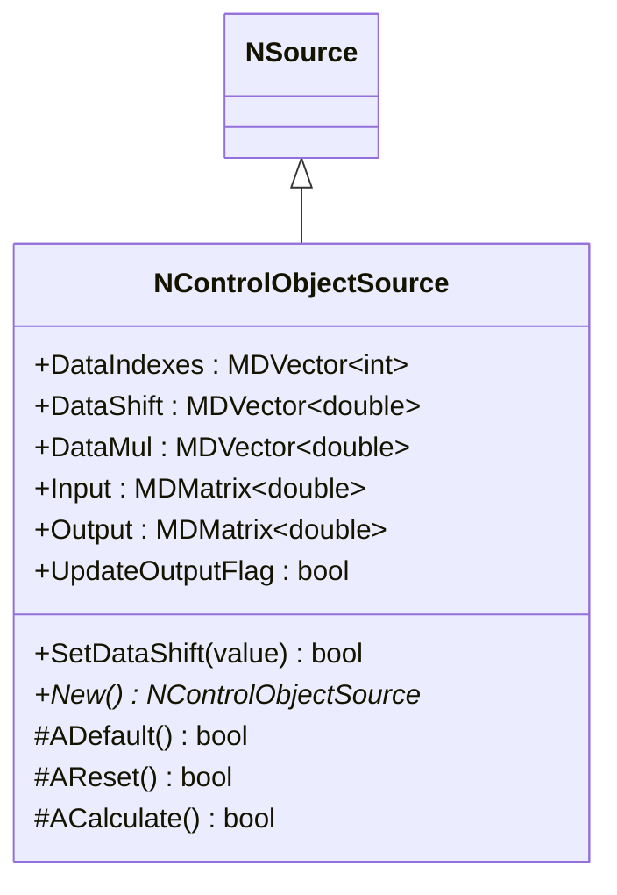
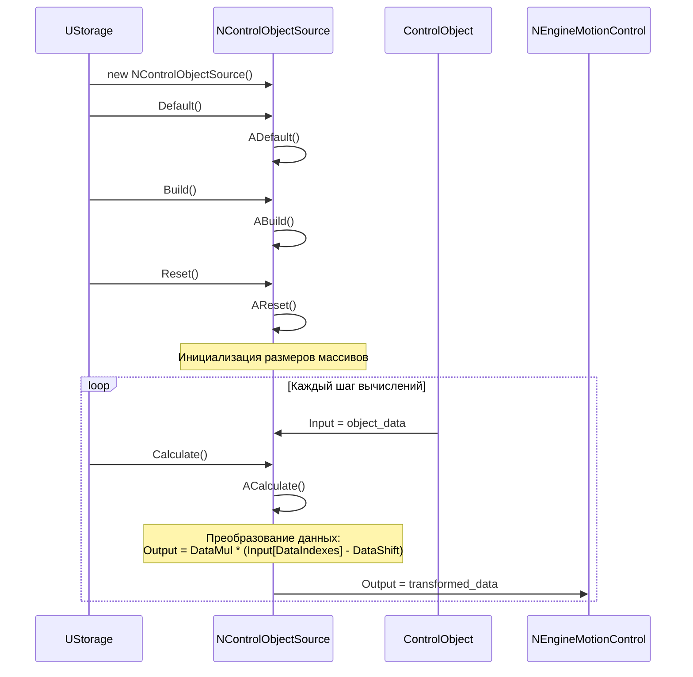
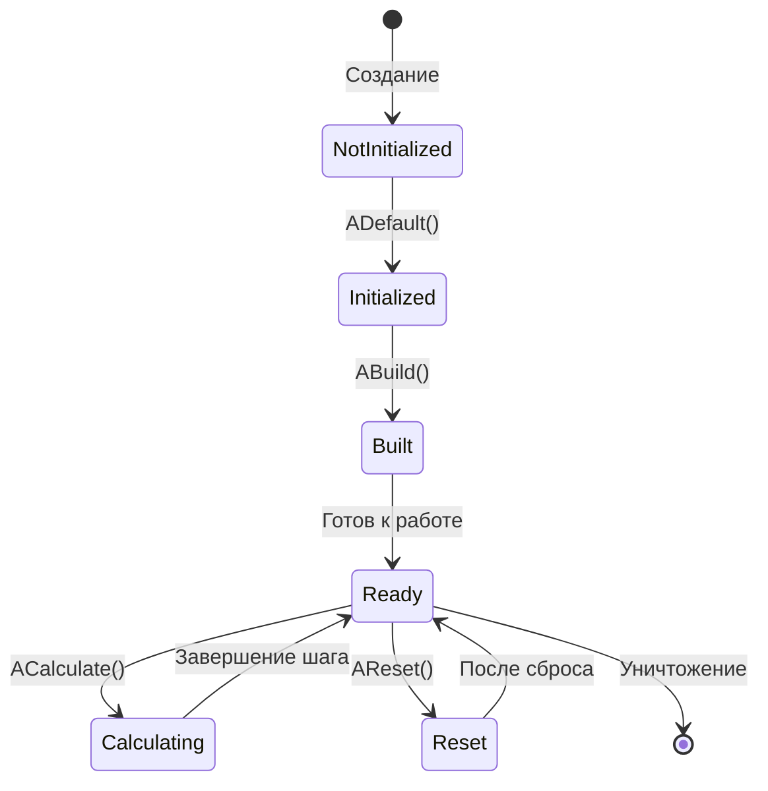
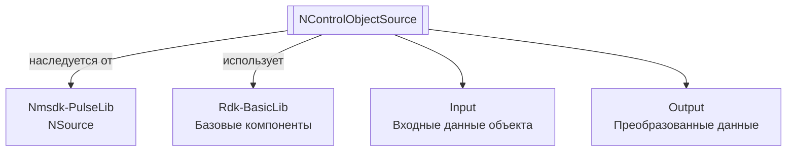

# NControlObjectSource — источник объекта управления

**Класс**: `NControlObjectSource` — источник данных о состоянии объекта управления для систем управления движением.  
**Регистрация**: `NMotionControlLibrary.cpp` → `UploadClass("NControlObjectSource", ...)`.  
**Базовый класс**: `NSource` (из Nmsdk-PulseLib).

NControlObjectSource преобразует входные данные об объекте управления (координаты, углы, скорости и т.д.) в выходные сигналы с возможностью масштабирования, сдвига и выбора индексов данных. Компонент используется в NEngineMotionControl для получения данных об объекте управления.

## UML-диаграмма классов



**Иерархия наследования:**
- `NSource` (Nmsdk-PulseLib) — базовый класс для источников сигналов
- `NControlObjectSource` — источник данных об объекте управления

## UML-диаграмма последовательности



## UML-диаграмма состояний



## UML-диаграмма активности

```mermaid
flowchart TD
    Start([Начало ACalculate]) --> CheckInput{Input<br/>подключен?}
    CheckInput -->|Да| ResizeArrays[Изменение размеров массивов:<br/>DataShift, DataIndexes, DataMul]
    CheckInput -->|Нет| ResizeOutputZero[Output.Resize(0,0)]
    ResizeArrays --> ResizeOutput[Output.Resize(1, Input->GetSize())]
    ResizeOutput --> LoopStart[Цикл по элементам Input]
    LoopStart --> Transform[Преобразование:<br/>Output[i] = DataMul[i] * (Input[DataIndexes[i]] - DataShift[i])]
    Transform --> LoopEnd{Еще элементы?}
    LoopEnd -->|Да| LoopStart
    LoopEnd -->|Нет| End([Конец])
    ResizeOutputZero --> End
```

## UML-диаграмма компонентов



**Зависимости:**
- **Nmsdk-PulseLib** - наследуется от NSource
- **Rdk-BasicLib** - базовые компоненты и утилиты

## Свойства

### Параметры преобразования

| Свойство | Тип | Флаги | Описание | Значение по умолчанию |
|----------|-----|-------|----------|----------------------|
| `DataIndexes` | `MDVector<int>` | `ptPubParameter` | Индексы элементов входных данных для выбора | Автоматически инициализируется |
| `DataShift` | `MDVector<double>` | `ptPubParameter` | Сдвиг для каждого элемента данных | Автоматически инициализируется нулями |
| `DataMul` | `MDVector<double>` | `ptPubParameter` | Множитель для каждого элемента данных | Автоматически инициализируется единицами |

### Входы

| Свойство | Тип | Флаги | Описание | Источник данных |
|----------|-----|-------|----------|-----------------|
| `Input` | `MDMatrix<double>` | `ptPubInput` | Входные данные об объекте управления (координаты, углы, скорости и т.д.) | Другие компоненты системы или модель объекта |

### Выходы

| Свойство | Тип | Флаги | Описание | Назначение |
|----------|-----|-------|----------|------------|
| `Output` | `MDMatrix<double>` | `ptOutput` (из NSource) | Преобразованные выходные данные | Передача в NEngineMotionControl и другие компоненты |

### Внутренние флаги

| Свойство | Тип | Описание |
|----------|-----|----------|
| `UpdateOutputFlag` | `bool` | Флаг необходимости обновления выхода |

## Методы

### Конструкторы и деструкторы

#### `NControlObjectSource(void)`
**Назначение:** Конструктор компонента  
**Параметры:** Нет  
**Возвращаемое значение:** Нет  
**Описание:** Инициализирует свойства, устанавливает UpdateOutputFlag=false

#### `virtual ~NControlObjectSource(void)`
**Назначение:** Деструктор компонента  
**Параметры:** Нет  
**Возвращаемое значение:** Нет

### Методы жизненного цикла

#### `virtual bool ADefault(void)`
**Назначение:** Инициализация значений по умолчанию  
**Параметры:** Нет  
**Возвращаемое значение:** `true` при успехе  
**Описание:** Вызывает ADefault() базового класса NSource

#### `virtual bool AReset(void)`
**Назначение:** Сброс состояния компонента  
**Параметры:** Нет  
**Возвращаемое значение:** `true` при успехе  
**Описание:** Устанавливает UpdateOutputFlag=true, инициализирует размеры массивов DataShift, DataIndexes, DataMul на основе размера Input (если подключен)

#### `virtual bool ACalculate(void)`
**Назначение:** Выполнение вычислений на текущем шаге  
**Параметры:** Нет  
**Возвращаемое значение:** `true` при успехе  
**Описание:** Преобразует входные данные:
1. Проверяет подключение Input
2. Изменяет размеры массивов DataShift, DataIndexes, DataMul при необходимости
3. Изменяет размер Output
4. Для каждого элемента: `Output(0,i) = DataMul(i) * (Input(0, DataIndexes(i)) - DataShift(i))`

### Сеттеры свойств

#### `bool SetDataShift(const MDVector<double> &value)`
**Назначение:** Установка сдвигов данных  
**Параметры:**
- `value` - вектор сдвигов
**Возвращаемое значение:** `true` при успехе

### Публичные методы

#### `virtual NControlObjectSource* New(void)`
**Назначение:** Создание нового экземпляра компонента  
**Параметры:** Нет  
**Возвращаемое значение:** Указатель на новый экземпляр

## Примеры использования

### C++ код

```cpp
#include "NControlObjectSource.h"

UEPtr<NControlObjectSource> source = new NControlObjectSource;
source->SetName("NManipulatorSource1");
source->Default();

// Подключение входных данных
UEPtr<SomeObject> object = new SomeObject;
object->OutputData.Connect(source->Input);

// Настройка преобразования
MDVector<double> shift(3);
shift[0] = 0.0;  // Сдвиг по X
shift[1] = 0.0;  // Сдвиг по Y
shift[2] = 0.0;  // Сдвиг по Z
source->DataShift = shift;

MDVector<double> mul(3);
mul[0] = 1.0;  // Множитель по X
mul[1] = 1.0;  // Множитель по Y
mul[2] = 1.0;  // Множитель по Z
source->DataMul = mul;

source->Build();
source->Reset();

// Использование в цикле
for (int step = 0; step < numSteps; step++) {
    object->Calculate();
    source->Calculate();
    
    // Получение преобразованных данных
    MDMatrix<double> output = source->Output;
    // Использование данных
}
```

### XML конфигурация

```xml
<Object Name="NManipulatorSource1" ClassName="NControlObjectSource">
    <!-- Подключение входных данных -->
    <Property Name="Input" Connect="ObjectModel.OutputData" />
    
    <!-- Настройка преобразования -->
    <Property Name="DataShift" Value="0.0,0.0,0.0" />
    <Property Name="DataMul" Value="1.0,1.0,1.0" />
    <Property Name="DataIndexes" Value="0,1,2" />
</Object>
```

### Использование в конфигурациях

Компонент `NControlObjectSource` используется в `NEngineMotionControl` для получения данных об объекте управления. Обычно создается с именем "NManipulatorSource1" и подключается к элементам движения.

**Типичные сценарии использования:**
1. **В NEngineMotionControl** - источник данных об объекте управления для вычисления статистики контуров
2. **Преобразование координат** - масштабирование и сдвиг координат объекта
3. **Выбор данных** - выбор определенных элементов из входных данных через DataIndexes

**Типичные комбинации:**
- `NControlObjectSource` + `NEngineMotionControl` - основной источник данных для движка управления
- `NControlObjectSource` + модели объектов - получение данных от моделей объектов управления

---

# NControlObjectSource — control object source

**Class**: `NControlObjectSource` — source of control object state data for motion control systems.  
**Registration**: `NMotionControlLibrary.cpp` → `UploadClass("NControlObjectSource", ...)`.  
**Base class**: `NSource` (from Nmsdk-PulseLib).

NControlObjectSource transforms input data about the control object (coordinates, angles, velocities, etc.) into output signals with scaling, shifting, and data index selection capabilities. The component is used in NEngineMotionControl to obtain data about the control object.

## Class Diagram

[Same as RU section]

## Sequence Diagram

[Same as RU section]

## State Diagram

[Same as RU section]

## Activity Diagram

[Same as RU section]

## Component Diagram

[Same as RU section]

## Properties

[Same structure as RU section, translated to English]

## Methods

[Same structure as RU section, translated to English]

## Usage Examples

[Same as RU section, with English comments]
