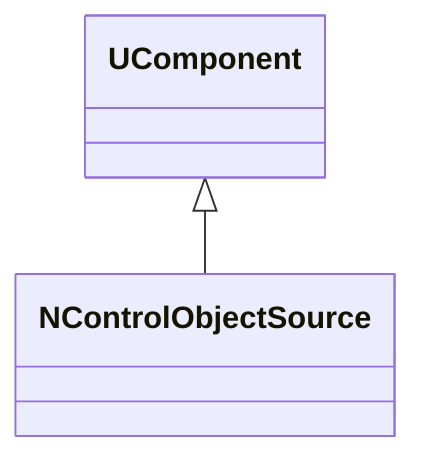
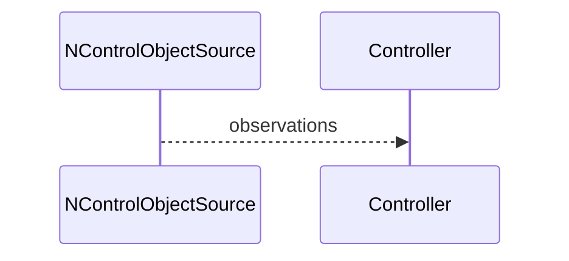
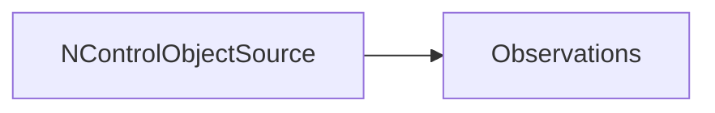

## NControlObjectSource — источник объекта управления

**Класс**: `NControlObjectSource` — выдаёт состояние/параметры объекта управления (среды/модели).  
**Регистрация**: `UploadClass("NControlObjectSource", ...)` в `NMotionControlLibrary.cpp`.

### Lifecycle
- **ADefault**: параметры источника/модели.
- **ABuild**: подготовка каналов выдачи состояния.
- **AReset**: сброс к начальному состоянию.
- **ACalculate**: обновление/выдача состояния объекта.

### I/O
- Выход: наблюдения (позиция, скорость, события) для контроллеров.



Пояснение: диаграмма классов показывает место компонента в иерархии и ключевые связи.



Пояснение: диаграмма последовательности показывает типовой сценарий взаимодействия и порядок вызовов.



Пояснение: блок-схема показывает поток данных/сигналов (входы → компонент → выходы).

### Config snippet

```ini
[Component]
ClassName = NControlObjectSource
Name = ObjSrc1
```

---

## NControlObjectSource — control object source (EN)

Provides environment/object observations for controllers.


Description: this class diagram shows the component position in the type hierarchy and key relations.


Description: this sequence diagram shows a typical runtime interaction and call order.


Description: this flowchart shows the data/signal flow (inputs → component → outputs).
