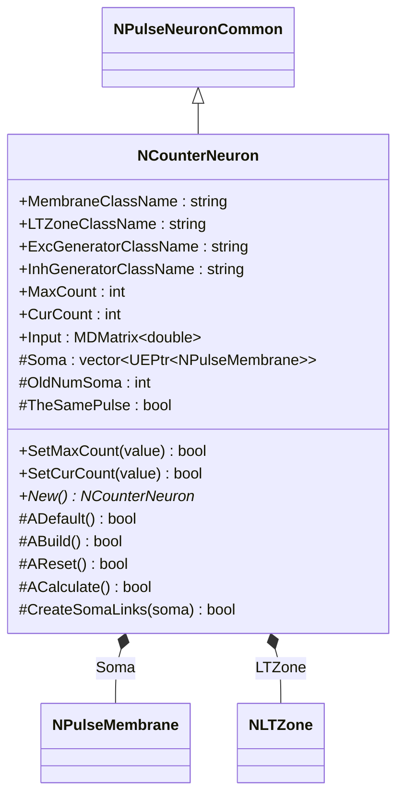
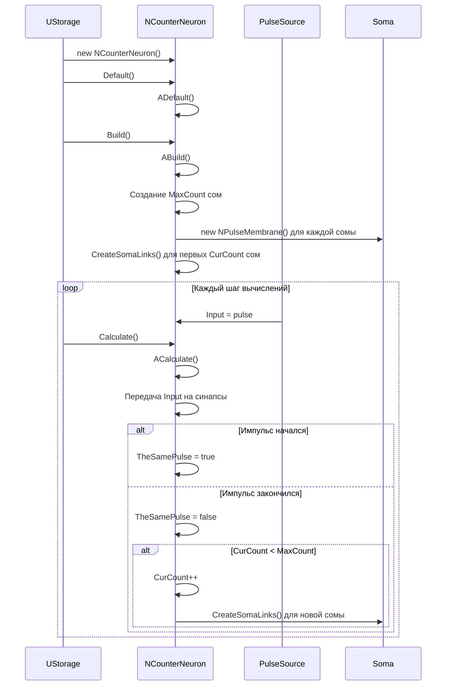
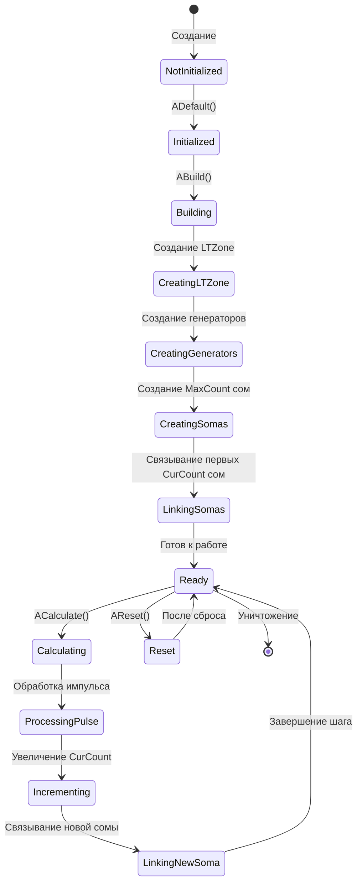
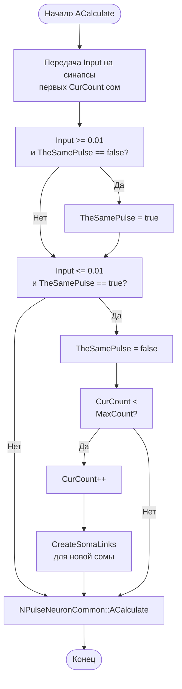
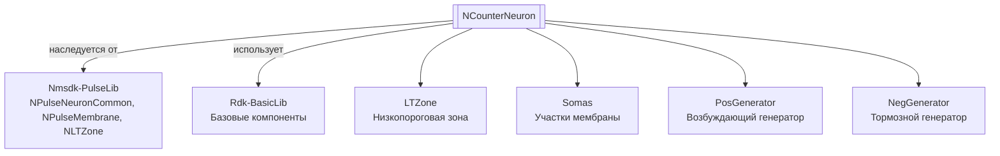

# NCounterNeuron — счетчик нейрон

## RU

**Класс**: `NCounterNeuron` — нейрон-счетчик, генерирующий выходной импульс только после получения MaxCount входных импульсов.
**Регистрация**: `NMotionControlLibrary.cpp` → `UploadClass("NCounterNeuron", ...)`.
**Базовый класс**: `NPulseNeuronCommon` (из Nmsdk-PulseLib).

NCounterNeuron реализует счетчик импульсов, который динамически увеличивает количество активных сом при получении импульсов и генерирует выходной импульс только после достижения MaxCount импульсов.

## UML-диаграмма классов



**Иерархия наследования:**
- `NPulseNeuronCommon` (Nmsdk-PulseLib) — базовый класс для нейронов
- `NCounterNeuron` — счетчик нейрон

## UML-диаграмма последовательности



## UML-диаграмма состояний



## UML-диаграмма активности



## UML-диаграмма компонентов



## Свойства

### Параметры классов

| Свойство | Тип | Флаги | Описание | Значение по умолчанию |
|----------|-----|-------|----------|----------------------|
| `MembraneClassName` | `std::string` | `ptPubParameter` | Имя класса участка мембраны | `"NPMembrane"` |
| `LTZoneClassName` | `std::string` | `ptPubParameter` | Имя класса низкопороговой зоны | `"NPLTZone"` |
| `ExcGeneratorClassName` | `std::string` | `ptPubParameter` | Имя класса возбуждающего генератора | `"NPNeuronPosCGenerator"` |
| `InhGeneratorClassName` | `std::string` | `ptPubParameter` | Имя класса тормозного генератора | `"NPNeuronNegCGenerator"` |

### Параметры счетчика

| Свойство | Тип | Флаги | Описание | Значение по умолчанию |
|----------|-----|-------|----------|----------------------|
| `MaxCount` | `int` | `ptPubParameter` | Максимальное количество импульсов для генерации выхода | `1` |
| `CurCount` | `int` | `ptPubParameter` | Текущее количество активных сом (начальное значение) | `1` |

### Входы

| Свойство | Тип | Флаги | Описание | Источник данных |
|----------|-----|-------|----------|-----------------|
| `Input` | `MDMatrix<double>` | `ptInput \| ptPubState` | Входной импульсный сигнал | Другие компоненты системы |

### Защищенные переменные

| Свойство | Тип | Описание |
|----------|-----|----------|
| `Soma` | `std::vector<UEPtr<NPulseMembrane>>` | Вектор участков мембраны (сом) |
| `OldNumSoma` | `int` | Предыдущее количество сом |
| `TheSamePulse` | `bool` | Флаг активного импульса |

## Методы

### Конструкторы и деструкторы

#### `NCounterNeuron(void)`
**Назначение:** Конструктор компонента
**Параметры:** Нет
**Возвращаемое значение:** Нет
**Описание:** Инициализирует OldNumSoma=0, очищает Soma

#### `virtual ~NCounterNeuron(void)`
**Назначение:** Деструктор компонента
**Параметры:** Нет
**Возвращаемое значение:** Нет

### Методы жизненного цикла

#### `virtual bool ADefault(void)`
**Назначение:** Инициализация значений по умолчанию
**Параметры:** Нет
**Возвращаемое значение:** `true` при успехе
**Описание:** Устанавливает значения по умолчанию для всех параметров, вызывает ADefault() базового класса

#### `virtual bool ABuild(void)`
**Назначение:** Построение внутренней структуры компонента
**Параметры:** Нет
**Возвращаемое значение:** `true` при успехе
**Описание:** Создает структуру:
1. LTZone - низкопороговая зона
2. PosGenerator, NegGenerator - генераторы для ионных механизмов
3. MaxCount сом (участков мембраны)
4. Связывает первые CurCount сом через CreateSomaLinks()

#### `virtual bool AReset(void)`
**Назначение:** Сброс состояния компонента
**Параметры:** Нет
**Возвращаемое значение:** `true` при успехе
**Описание:** Устанавливает TheSamePulse=false, вызывает AReset() базового класса

#### `virtual bool ACalculate(void)`
**Назначение:** Выполнение вычислений на текущем шаге
**Параметры:** Нет
**Возвращаемое значение:** `true` при успехе
**Описание:**
1. Передает Input на синапсы первых CurCount сом
2. Отслеживает начало и окончание импульсов
3. При окончании импульса увеличивает CurCount (если < MaxCount) и связывает новую сому
4. Вызывает ACalculate() базового класса

### Защищенные методы

#### `bool CreateSomaLinks(UEPtr<NPulseMembrane> soma)`
**Назначение:** Создание связей для сомы
**Параметры:**
- `soma` - указатель на сому
**Возвращаемое значение:** `true` при успехе
**Описание:** Создает связи между каналами сомы, LTZone, генераторами и обратной связью

### Публичные методы

#### `virtual NCounterNeuron* New(void)`
**Назначение:** Создание нового экземпляра компонента
**Параметры:** Нет
**Возвращаемое значение:** Указатель на новый экземпляр

## Примеры использования

### C++ код

```cpp
#include "NCounterNeuron.h"

UEPtr<NCounterNeuron> counter = new NCounterNeuron;
counter->Default();
counter->MaxCount = 5;  // Генерировать выход после 5 импульсов
counter->CurCount = 1;  // Начать с 1 активной сомы
counter->Build();
```

### XML конфигурация

```xml
<Object Name="CounterNeuron" ClassName="NCounterNeuron">
    <Property Name="MaxCount" Value="5" />
    <Property Name="CurCount" Value="1" />
    <Property Name="Input" Connect="Source.Output" />
</Object>
```

### Использование в конфигурациях

Компонент `NCounterNeuron` используется для подсчета импульсов и генерации выходного сигнала после достижения заданного количества импульсов.

**Типичные сценарии использования:**
1. **Подсчет импульсов** - подсчет входных импульсов перед генерацией выхода
2. **Пороговые детекторы** - генерация сигнала при достижении порога

**Типичные комбинации:**
- `NCounterNeuron` + источники импульсов - подсчет импульсов от источников

---

## EN

NCounterNeuron — counter neuron

**Class**: `NCounterNeuron` — counter neuron that generates output pulse only after receiving MaxCount input pulses.
**Registration**: `NMotionControlLibrary.cpp` → `UploadClass("NCounterNeuron", ...)`.
**Base class**: `NPulseNeuronCommon` (from Nmsdk-PulseLib).

NCounterNeuron implements a pulse counter that dynamically increases the number of active somas upon receiving pulses and generates an output pulse only after reaching MaxCount pulses.

## Class Diagram


## Sequence Diagram


## State Diagram


## Activity Diagram


## Component Diagram


## Properties

[Same structure as RU section, translated to English]

## Methods

[Same structure as RU section, translated to English]

## References
- [Literature-References.md](../Literature-References.md): [A], 25, 28, 29 — импульсные нейроны в контурах управления.

## Usage Examples

[Same as RU section, with English comments]
