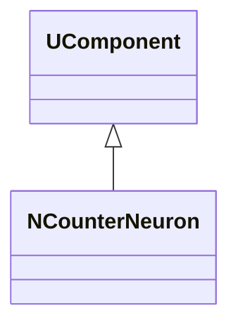
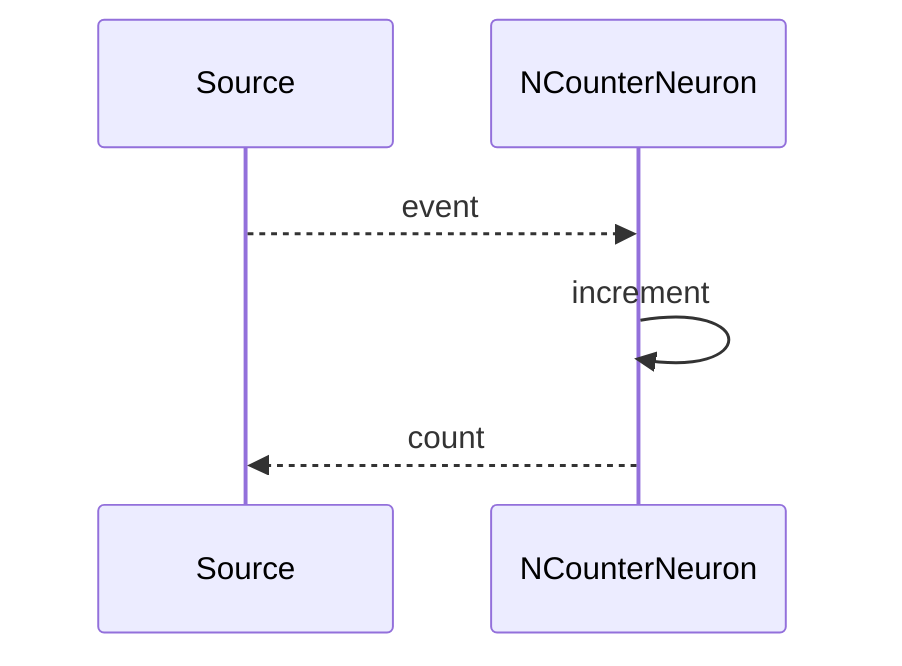
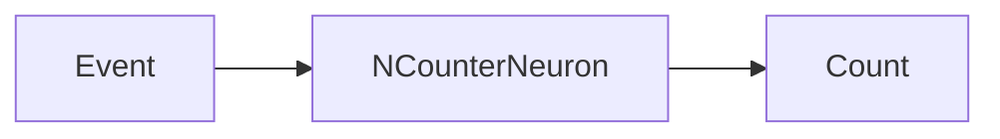
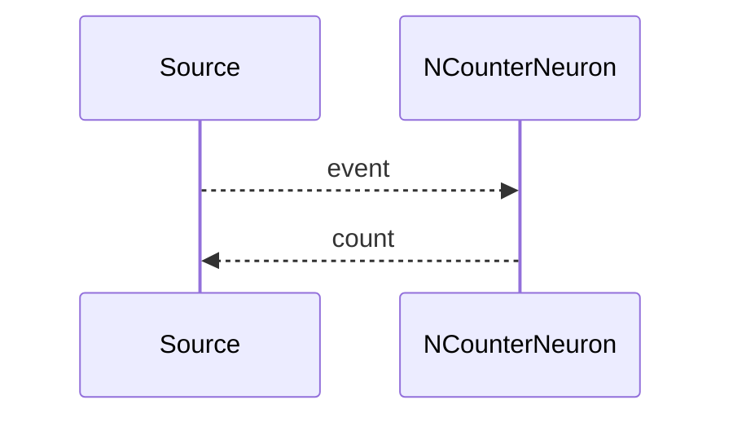

## NCounterNeuron — счётчик/интегратор сигналов

**Класс**: `NCounterNeuron` — компонент-счётчик (интегрирует события/сигналы, ведёт счёт).  
**Регистрация**: `UploadClass("NCounterNeuron", ...)` в `NMotionControlLibrary.cpp`.

### Lifecycle
- **ADefault**: обнуление счётчика.
- **ABuild**: подключение входа событий.
- **AReset**: сброс счётчика.
- **ACalculate**: обновление счётчика по входным событиям.

### I/O
- Вход: импульс/событие или условие.
- Выход: значение счётчика (скаляр).



Пояснение: диаграмма классов показывает место компонента в иерархии и ключевые связи.



Пояснение: диаграмма последовательности показывает типовой сценарий взаимодействия и порядок вызовов.



Пояснение: блок-схема показывает поток данных/сигналов (входы → компонент → выходы).

### Config snippet

```ini
[Component]
ClassName = NCounterNeuron
Name = Counter1
```

---

## NCounterNeuron — counter/integrator (EN)

Counts events and outputs running count value.


Description: this class diagram shows the component position in the type hierarchy and key relations.



Description: this sequence diagram shows a typical runtime interaction and call order.


Description: this flowchart shows the data/signal flow (inputs → component → outputs).
