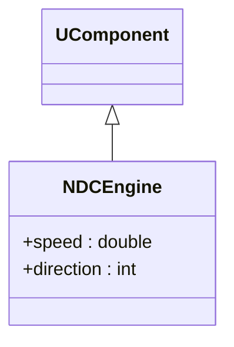
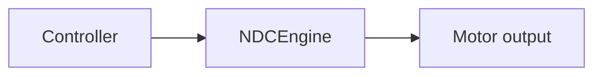
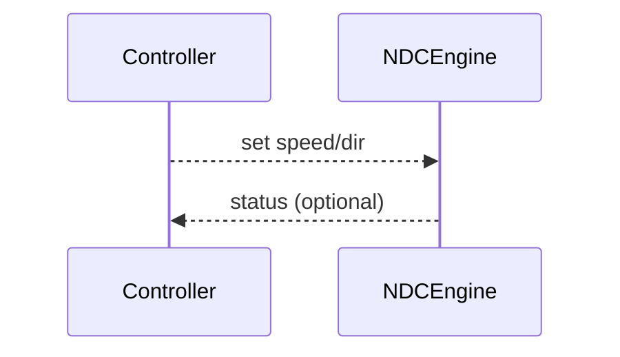

## NDCEngine — DC-двигатель

**Класс**: `NDCEngine` — управление DC-мотором (скорость/направление).  
**Регистрация**: `NMotionControlLibrary.cpp` → `UploadClass("NDCEngine", ...)`.

### Входы/выходы
- Вход: команда скорости/направления.
- Выход: сигналы на исполнительный блок (мотор/драйвер).

Пояснение: блок-схема показывает поток данных/сигналов (входы → компонент → выходы).

Пояснение: диаграмма последовательности показывает типовой сценарий взаимодействия и порядок вызовов.

---

## NDCEngine — DC motor controller

Controls motor speed/direction; input control commands, output drive signals.
