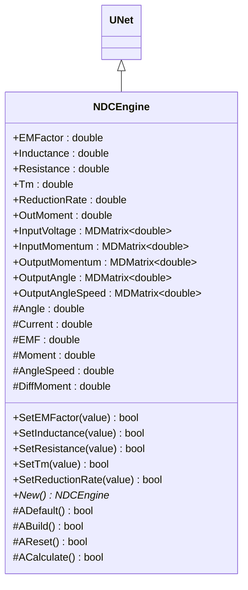
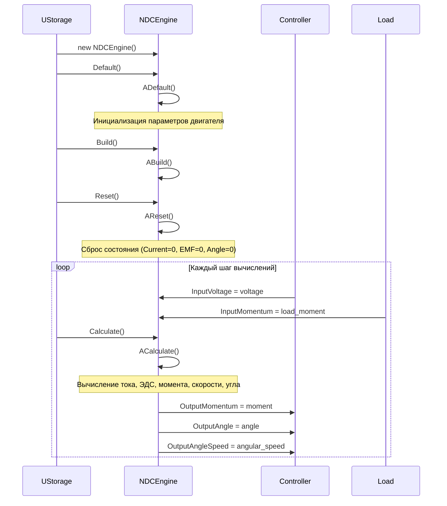
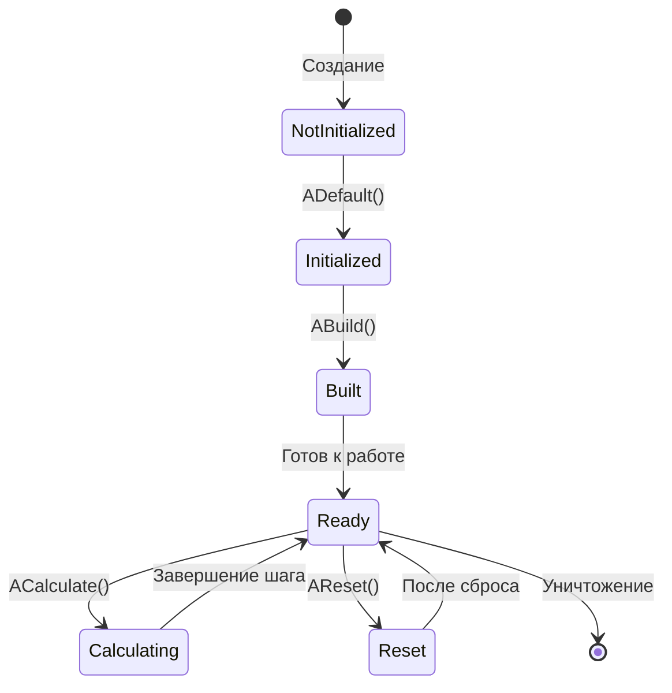
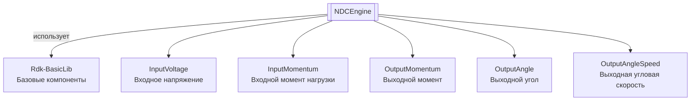
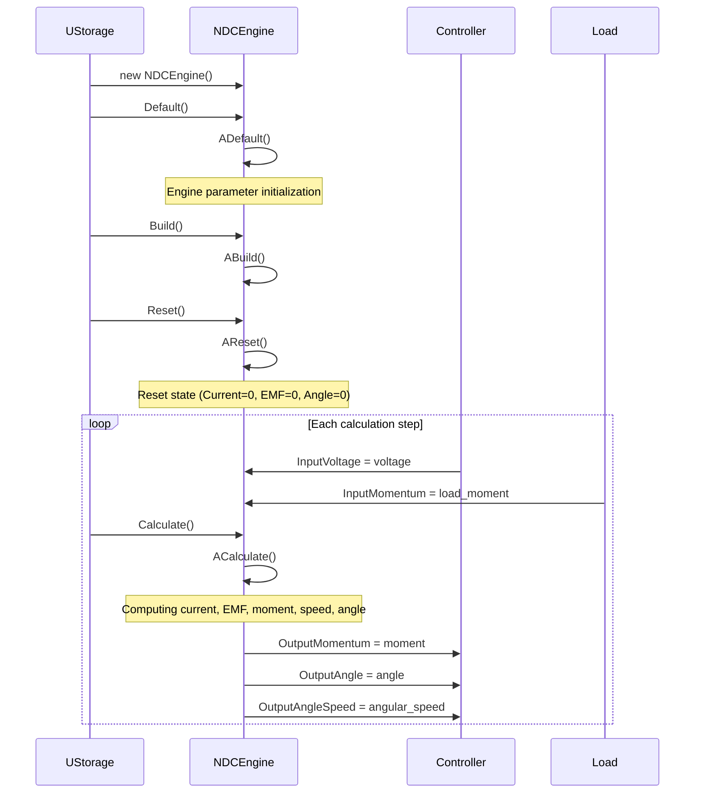
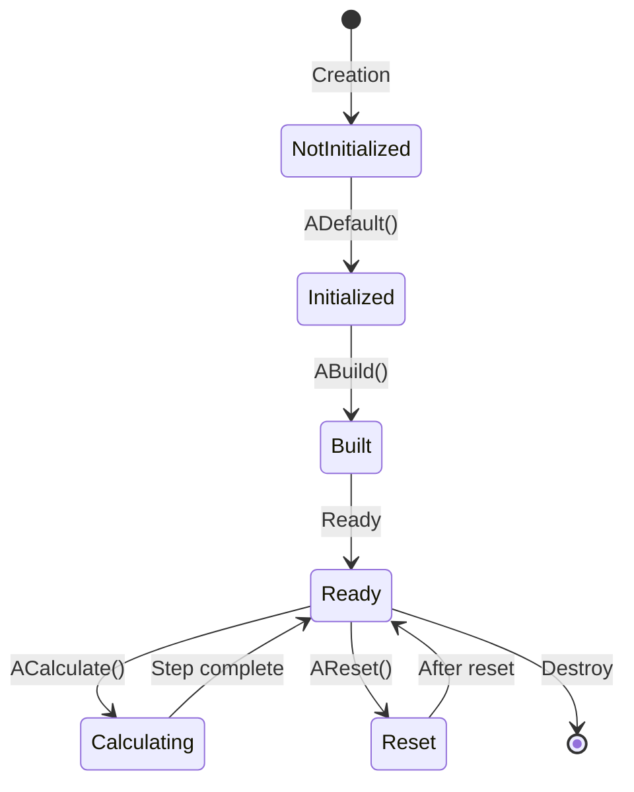
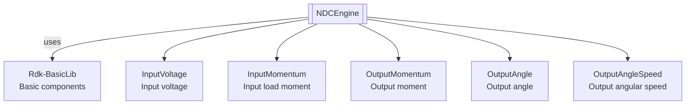

# NDCEngine — DC-двигатель

## RU

**Каталог компонентов:** [Component-Catalog.md](../Component-Catalog.md).

**Класс**: `NDCEngine` — компонент моделирования DC-двигателя с электромеханическими характеристиками.
**Регистрация**: `NMotionControlLibrary.cpp` → `UploadClass("NDCEngine", ...)`.
**Базовый класс**: `UNet` (из Rdk Framework).

NDCEngine реализует математическую модель DC-двигателя, учитывающую электрические параметры (индуктивность, сопротивление, ЭДС) и механические характеристики (момент, угловая скорость, угол поворота). Компонент вычисляет динамику двигателя на каждом шаге симуляции на основе входного напряжения и момента нагрузки.

## UML-диаграмма классов



**Иерархия наследования:**
- `UNet` (Rdk Framework) — базовый класс для сетей компонентов
- `NDCEngine` — модель DC-двигателя

**Связи с другими компонентами:**
- **Входы**: получает напряжение и момент нагрузки от других компонентов (например, от [NEngineMotionControl](NEngineMotionControl.md) или контроллеров)
- **Выходы**: предоставляет момент, угол и угловую скорость для подключения к [NManipulator](NManipulator.md), [NPositionControlElement](NPositionControlElement.md) и другим компонентам

## UML-диаграмма последовательности



**Описание жизненного цикла:**
1. **Создание** - компонент создается через конструктор
2. **Инициализация (ADefault)** - установка значений по умолчанию для параметров двигателя
3. **Построение (ABuild)** - подготовка к работе (для NDCEngine не требуется дополнительных действий)
4. **Сброс (AReset)** - сброс внутренних переменных (ток, ЭДС, угол, угловая скорость)
5. **Вычисление (ACalculate)** - основной цикл: вычисление динамики двигателя на основе входных сигналов

## UML-диаграмма состояний



**Состояния компонента:**
- **NotInitialized** - компонент создан, но не инициализирован
- **Initialized** - компонент инициализирован (после ADefault)
- **Built** - готов к работе (после ABuild)
- **Ready** - готов к вычислениям
- **Calculating** - выполняется вычисление (ACalculate)
- **Reset** - состояние после сброса (AReset)

## UML-диаграмма активности

```mermaid
flowchart TD
    Start([Начало ACalculate]) --> ReadVoltage["InputVoltage<br/>подключен?"]
    ReadVoltage -->|Да| GetVoltage[Получить InputVoltage]
    ReadVoltage -->|Нет| SetVoltageZero[input[0] = 0]
    GetVoltage --> ReadMomentum
    SetVoltageZero --> ReadMomentum["InputMomentum<br/>подключен?"]
    ReadMomentum -->|Да| GetMomentum[Получить InputMomentum + OutMoment]
    ReadMomentum -->|Нет| SetMomentumOut[input[1] = OutMoment]
    GetMomentum --> CalcCurrent["Вычисление тока:<br/>Current = f(Voltage, EMF, Resistance, Inductance)"]
    SetMomentumOut --> CalcCurrent
    CalcCurrent --> CalcEMF["Вычисление ЭДС:<br/>EMF = f(Current, Momentum, Tm)"]
    CalcEMF --> CalcMoment["Вычисление момента:<br/>Moment = Current * EMFactor / Resistance"]
    CalcMoment --> CalcSpeed["Вычисление угловой скорости:<br/>OutputAngleSpeed = EMF / EMFactor"]
    CalcSpeed --> CalcAngle["Вычисление угла:<br/>Angle += OutputAngleSpeed / ReductionRate / TimeStep"]
    CalcAngle --> UpdateOutputs["Обновление выходов:<br/>OutputMomentum, OutputAngle, OutputAngleSpeed"]
    UpdateOutputs --> End([Конец])
```

**Алгоритм работы ACalculate:**
1. Чтение входного напряжения (если подключено, иначе 0)
2. Чтение входного момента нагрузки (если подключено, иначе используется OutMoment)
3. Вычисление тока по формуле с учетом индуктивности и сопротивления
4. Вычисление ЭДС с учетом электромеханической постоянной времени
5. Вычисление момента на валу
6. Вычисление угловой скорости из ЭДС
7. Интегрирование угловой скорости для получения угла поворота
8. Обновление выходных свойств

## UML-диаграмма компонентов



**Зависимости:**
- **Rdk-BasicLib** - базовые компоненты и утилиты Rdk Framework

**Интерфейсы:**
- **Входы**: `InputVoltage` (напряжение управления), `InputMomentum` (момент нагрузки)
- **Выходы**: `OutputMomentum` (момент на валу), `OutputAngle` (угол поворота), `OutputAngleSpeed` (угловая скорость)

## Свойства

### Параметры двигателя

| Свойство | Тип | Флаги | Описание | Значение по умолчанию | Диапазон |
|----------|-----|-------|----------|----------------------|----------|
| `EMFactor` | `double` | `ptPubParameter` | Коэффициент ЭДС (связь между ЭДС и угловой скоростью) | `2.0` | > 0 |
| `Inductance` | `double` | `ptPubParameter` | Индуктивность обмотки двигателя (Гн) | `0.1` | > 0 |
| `Resistance` | `double` | `ptPubParameter` | Сопротивление обмотки двигателя (Ом) | `1.0` | > 0 |
| `Tm` | `double` | `ptPubParameter` | Электромеханическая постоянная времени (с) | `0.1` | > 0 |
| `ReductionRate` | `double` | `ptPubParameter` | Передаточное число редуктора | `1.0` | > 0 |
| `OutMoment` | `double` | `ptPubParameter` | Внешний момент (момент нагрузки по умолчанию) | `0.0` | Любое |

### Входы

| Свойство | Тип | Флаги | Описание | Источник данных |
|----------|-----|-------|----------|-----------------|
| `InputVoltage` | `MDMatrix<double>` | `ptInput \| ptPubState` | Входное напряжение управления (В) | Контроллер или другой источник напряжения |
| `InputMomentum` | `MDMatrix<double>` | `ptInput \| ptPubState` | Входной момент нагрузки (Н·м) | Другие компоненты системы или нагрузка |

### Выходы

| Свойство | Тип | Флаги | Описание | Назначение |
|----------|-----|-------|----------|------------|
| `OutputMomentum` | `MDMatrix<double>` | `ptOutput \| ptPubState` | Выходной момент на валу двигателя (Н·м) | Передача другим компонентам для обратной связи |
| `OutputAngle` | `MDMatrix<double>` | `ptOutput \| ptPubState` | Выходной угол поворота вала (рад) | Контроль позиции, подключение к системам управления |
| `OutputAngleSpeed` | `MDMatrix<double>` | `ptOutput \| ptPubState` | Выходная угловая скорость вала (рад/с) | Контроль скорости, подключение к системам управления |

### Защищенные свойства

| Свойство | Тип | Флаги | Описание | Изменяется в |
|----------|-----|-------|----------|--------------|
| `Angle` | `double` | `ptPubParameter` | Текущий угол поворота вала (рад) | `ACalculate` |
| `Current` | `double` | (внутреннее) | Ток в обмотке двигателя (А) | `ACalculate` |
| `EMF` | `double` | (внутреннее) | Электродвижущая сила (В) | `ACalculate` |
| `Moment` | `double` | (внутреннее) | Момент на валу (Н·м) | `ACalculate` |
| `AngleSpeed` | `double` | (внутреннее) | Угловая скорость (рад/с) | `ACalculate` |
| `DiffMoment` | `double` | (внутреннее) | Разность моментов | `ACalculate` |

## Методы

### Конструкторы и деструкторы

#### `NDCEngine(void)`
**Назначение:** Конструктор компонента
**Параметры:** Нет
**Возвращаемое значение:** Нет
**Описание:** Инициализирует все свойства компонента

#### `virtual ~NDCEngine(void)`
**Назначение:** Деструктор компонента
**Параметры:** Нет
**Возвращаемое значение:** Нет
**Описание:** Освобождает ресурсы компонента

### Методы жизненного цикла

#### `virtual bool ADefault(void)`
**Назначение:** Инициализация значений по умолчанию
**Параметры:** Нет
**Возвращаемое значение:** `true` при успехе
**Описание:** Устанавливает значения по умолчанию:
- EMFactor = 2.0
- Inductance = 0.1
- Resistance = 1.0
- Tm = 0.1
- ReductionRate = 1.0
- OutMoment = 0.0
- Инициализирует входные и выходные матрицы нулями

#### `virtual bool ABuild(void)`
**Назначение:** Построение внутренней структуры компонента
**Параметры:** Нет
**Возвращаемое значение:** `true` при успехе
**Описание:** Для NDCEngine не требуется дополнительных действий при построении

#### `virtual bool AReset(void)`
**Назначение:** Сброс состояния компонента к начальному
**Параметры:** Нет
**Возвращаемое значение:** `true` при успехе
**Описание:** Сбрасывает внутренние переменные:
- Current = 0
- EMF = 0
- Angle = 0
- AngleSpeed = 0
- DiffMoment = 0

#### `virtual bool ACalculate(void)`
**Назначение:** Выполнение вычислений на текущем шаге
**Параметры:** Нет
**Возвращаемое значение:** `true` при успехе
**Описание:** Основной метод вычислений динамики двигателя:
1. Чтение входного напряжения (если подключено)
2. Чтение входного момента нагрузки (если подключено)
3. Вычисление тока: `Current = ((Voltage - EMF) * Resistance) / (TimeStep * Inductance) + (1.0 - Resistance / (TimeStep * Inductance)) * Current`
4. Вычисление ЭДС: `EMF += (Current - Momentum * Resistance / EMFactor) / (TimeStep * Tm)`
5. Вычисление момента: `Moment = Current * EMFactor / Resistance`
6. Вычисление угловой скорости: `OutputAngleSpeed = EMF / EMFactor`
7. Интегрирование угла: `Angle += OutputAngleSpeed / (ReductionRate * TimeStep)`
8. Обновление выходных свойств

### Сеттеры свойств

#### `bool SetEMFactor(const double &value)`
**Назначение:** Установка коэффициента ЭДС
**Параметры:**
- `value` - коэффициент ЭДС (должен быть > 0)
**Возвращаемое значение:** `true` при успехе, `false` при ошибке
**Описание:** Валидирует значение (должно быть положительным)

#### `bool SetInductance(const double &value)`
**Назначение:** Установка индуктивности
**Параметры:**
- `value` - индуктивность в Гн (должна быть > 0)
**Возвращаемое значение:** `true` при успехе, `false` при ошибке
**Описание:** Валидирует значение (должно быть положительным)

#### `bool SetResistance(const double &value)`
**Назначение:** Установка сопротивления
**Параметры:**
- `value` - сопротивление в Ом (должно быть > 0)
**Возвращаемое значение:** `true` при успехе, `false` при ошибке
**Описание:** Валидирует значение (должно быть положительным)

#### `bool SetTm(const double &value)`
**Назначение:** Установка электромеханической постоянной времени
**Параметры:**
- `value` - постоянная времени в секундах (должна быть > 0)
**Возвращаемое значение:** `true` при успехе, `false` при ошибке
**Описание:** Валидирует значение (должно быть положительным)

#### `bool SetReductionRate(const double &value)`
**Назначение:** Установка передаточного числа редуктора
**Параметры:**
- `value` - передаточное число (должно быть > 0)
**Возвращаемое значение:** `true` при успехе, `false` при ошибке
**Описание:** Валидирует значение (должно быть положительным)

### Публичные методы

#### `virtual NDCEngine* New(void)`
**Назначение:** Создание нового экземпляра компонента
**Параметры:** Нет
**Возвращаемое значение:** Указатель на новый экземпляр NDCEngine
**Описание:** Выделяет память и создает новый экземпляр компонента

## Примеры использования

### C++ код

#### Создание и настройка компонента

```cpp
#include "NDCEngine.h"

// Создание экземпляра
UEPtr<NDCEngine> engine = new NDCEngine;
engine->SetName("DCMotor");

// Инициализация
engine->Default();

// Настройка параметров двигателя
engine->EMFactor = 2.5;        // Коэффициент ЭДС
engine->Inductance = 0.15;      // Индуктивность 0.15 Гн
engine->Resistance = 1.2;       // Сопротивление 1.2 Ом
engine->Tm = 0.12;              // Постоянная времени 0.12 с
engine->ReductionRate = 10.0;   // Передаточное число редуктора 10:1
engine->OutMoment = 0.0;        // Момент нагрузки по умолчанию

// Построение
engine->Build();

// Подключение входов
UEPtr<SomeController> controller = new SomeController;
controller->OutputVoltage.Connect(engine->InputVoltage);

UEPtr<SomeLoad> load = new SomeLoad;
load->OutputMoment.Connect(engine->InputMomentum);

// Использование в цикле вычислений
engine->Reset();
for (int step = 0; step < numSteps; step++) {
    controller->Calculate();
    load->Calculate();
    engine->Calculate();

    // Получение выходных данных
    double angle = engine->OutputAngle(0, 0);
    double speed = engine->OutputAngleSpeed(0, 0);
    double moment = engine->OutputMomentum(0, 0);

    // Использование данных для управления или визуализации
    std::cout << "Angle: " << angle << ", Speed: " << speed << ", Moment: " << moment << std::endl;
}
```

#### Интеграция с системой управления

```cpp
// Создание системы управления с обратной связью
UEPtr<NDCEngine> motor = new NDCEngine;
UEPtr<PositionController> controller = new PositionController;

// Настройка двигателя
motor->Default();
motor->EMFactor = 3.0;
motor->Inductance = 0.1;
motor->Resistance = 1.0;
motor->Tm = 0.1;
motor->ReductionRate = 20.0;  // Редуктор 20:1
motor->Build();

// Настройка контроллера
controller->Default();
controller->TargetAngle = M_PI / 2;  // Целевой угол 90 градусов
controller->Build();

// Связывание компонентов
controller->OutputVoltage.Connect(motor->InputVoltage);
controller->InputAngle.Connect(motor->OutputAngle);
controller->InputSpeed.Connect(motor->OutputAngleSpeed);

// Симуляция
motor->Reset();
controller->Reset();

for (int step = 0; step < 1000; step++) {
    controller->Calculate();
    motor->Calculate();

    // Проверка достижения целевого угла
    double currentAngle = motor->OutputAngle(0, 0);
    if (fabs(currentAngle - controller->TargetAngle) < 0.01) {
        std::cout << "Target reached at step " << step << std::endl;
        break;
    }
}
```

### XML конфигурация

#### Базовая конфигурация

```xml
<Object Name="DCMotor" ClassName="NDCEngine">
    <!-- Параметры двигателя -->
    <Property Name="EMFactor" Value="2.0" />
    <Property Name="Inductance" Value="0.1" />
    <Property Name="Resistance" Value="1.0" />
    <Property Name="Tm" Value="0.1" />
    <Property Name="ReductionRate" Value="1.0" />
    <Property Name="OutMoment" Value="0.0" />

    <!-- Подключение входов -->
    <Property Name="InputVoltage" Connect="Controller.OutputVoltage" />
    <Property Name="InputMomentum" Connect="Load.OutputMoment" />
</Object>
```

#### Полная конфигурация с редуктором

```xml
<Object Name="DCMotorWithGear" ClassName="NDCEngine">
    <!-- Параметры двигателя -->
    <Property Name="EMFactor" Value="2.5" />
    <Property Name="Inductance" Value="0.15" />
    <Property Name="Resistance" Value="1.2" />
    <Property Name="Tm" Value="0.12" />
    <Property Name="ReductionRate" Value="10.0" />
    <Property Name="OutMoment" Value="0.5" />

    <!-- Подключение к контроллеру -->
    <Object Name="MotorController" ClassName="SomeController">
        <Property Name="OutputVoltage" Connect="DCMotorWithGear.InputVoltage" />
    </Object>

    <!-- Подключение к нагрузке -->
    <Object Name="Load" ClassName="SomeLoad">
        <Property Name="OutputMoment" Connect="DCMotorWithGear.InputMomentum" />
    </Object>

    <!-- Использование выходов -->
    <Object Name="PositionMonitor" ClassName="SomeMonitor">
        <Property Name="InputAngle" Connect="DCMotorWithGear.OutputAngle" />
        <Property Name="InputSpeed" Connect="DCMotorWithGear.OutputAngleSpeed" />
        <Property Name="InputMoment" Connect="DCMotorWithGear.OutputMomentum" />
    </Object>
</Object>
```

### Использование в конфигурациях

Компонент `NDCEngine` используется в конфигурационных проектах для:

- Моделирования DC-двигателей в робототехнических системах
- Систем управления манипуляторами
- Систем управления движением с обратной связью
- Симуляции электромеханических систем

**Примеры конфигураций:** `Bin/Configs/SpikeSamples/MC-Muscles/` (MC-M-00-EyeMuscle, MC-M-01-EyeMuscle — модели управления мышцей глаза с нейронными командами).

**Типичные сценарии использования:**
1. **Управление манипулятором** - двигатель для привода сустава манипулятора
2. **Система позиционирования** - двигатель с обратной связью по углу и скорости
3. **Моделирование нагрузки** - двигатель с подключенной нагрузкой через InputMomentum
4. **Цепочка двигателей** - несколько двигателей, соединенных последовательно

**Типичные комбинации с другими компонентами:**
- `NDCEngine` + [NPositionControlElement](NPositionControlElement.md) — управление позицией с обратной связью
- `NDCEngine` + [NManipulator](NManipulator.md) — привод сустава манипулятора
- `NDCEngine` + [NEngineMotionControl](NEngineMotionControl.md) — интеграция в систему управления движением
- `NDCEngine` + контроллеры напряжения — различные стратегии управления

---

### Ключевые свойства / Favorites

| Свойство | Роль |
|----------|------|
| `EMFactor` / `Resistance` / `Inductance` / `Tm` / `ReductionRate` | Параметры двигателя |
| `InputVoltage` | Управление |
| `OutputAngle` / `OutputAngleSpeed` | Выходная кинематика |

ClDesc: `Bin/ClDesc/MotionControlLibrary/ru-RU/NDCEngine.xml`.

## EN

NDCEngine — DC motor

**Class**: `NDCEngine` — DC motor modeling component with electromechanical characteristics.
**Registration**: `NMotionControlLibrary.cpp` → `UploadClass("NDCEngine", ...)`.
**Base class**: `UNet` (from Rdk Framework).

NDCEngine implements a mathematical model of a DC motor, accounting for electrical parameters (inductance, resistance, EMF) and mechanical characteristics (torque, angular velocity, rotation angle). The component calculates motor dynamics at each simulation step based on input voltage and load torque.

## Class Diagram


## Sequence Diagram



## State Diagram



## Activity Diagram

```mermaid
flowchart TD
    Start([Start ACalculate]) --> ReadVoltage["InputVoltage<br/>connected?"]
    ReadVoltage -->|Yes| GetVoltage[Get InputVoltage]
    ReadVoltage -->|No| SetVoltageZero[input[0] = 0]
    GetVoltage --> ReadMomentum
    SetVoltageZero --> ReadMomentum["InputMomentum<br/>connected?"]
    ReadMomentum -->|Yes| GetMomentum[Get InputMomentum + OutMoment]
    ReadMomentum -->|No| SetMomentumOut[input[1] = OutMoment]
    GetMomentum --> CalcCurrent["Computing current:<br/>Current = f(Voltage, EMF, Resistance, Inductance)"]
    SetMomentumOut --> CalcCurrent
    CalcCurrent --> CalcEMF["Computing EMF:<br/>EMF = f(Current, Momentum, Tm)"]
    CalcEMF --> CalcMoment["Computing moment:<br/>Moment = Current * EMFactor / Resistance"]
    CalcMoment --> CalcSpeed["Computing angular speed:<br/>OutputAngleSpeed = EMF / EMFactor"]
    CalcSpeed --> CalcAngle["Computing angle:<br/>Angle += OutputAngleSpeed / ReductionRate / TimeStep"]
    CalcAngle --> UpdateOutputs["Updating outputs:<br/>OutputMomentum, OutputAngle, OutputAngleSpeed"]
    UpdateOutputs --> End([End])
```

## Component Diagram



## Properties

### Parameters

| Property | Type | Description | Default |
|----------|------|-------------|---------|
| `EMFactor` | `double` | EMF coefficient (link between EMF and angular speed) | `2.0` |
| `Inductance` | `double` | Motor winding inductance (H) | `0.1` |
| `Resistance` | `double` | Motor winding resistance (Ω) | `1.0` |
| `Tm` | `double` | Electromechanical time constant (s) | `0.1` |
| `ReductionRate` | `double` | Gear ratio | `1.0` |
| `OutMoment` | `double` | Default load torque (N·m) | `0.0` |

### Inputs

| Property | Type | Description |
|----------|------|-------------|
| `InputVoltage` | `MDMatrix<double>` | Control voltage (V) |
| `InputMomentum` | `MDMatrix<double>` | Load torque (N·m) |

### Outputs

| Property | Type | Description |
|----------|------|-------------|
| `OutputMomentum` | `MDMatrix<double>` | Shaft torque (N·m) |
| `OutputAngle` | `MDMatrix<double>` | Shaft angle (rad) |
| `OutputAngleSpeed` | `MDMatrix<double>` | Angular speed (rad/s) |

## Methods

### Lifecycle

- **`ADefault()`** — set default parameters (EMFactor, Inductance, Resistance, Tm, ReductionRate, OutMoment).
- **`ABuild()`** — no extra setup for NDCEngine.
- **`AReset()`** — reset internal state (Current, EMF, Angle, AngleSpeed to zero).
- **`ACalculate()`** — compute motor dynamics: current, EMF, torque, angular speed, angle; update outputs.

### Setters

- **`SetEMFactor(value)`**, **`SetInductance(value)`**, **`SetResistance(value)`**, **`SetTm(value)`**, **`SetReductionRate(value)`** — set parameters; return `true` on success.

## Usage Examples

### C++ Code

```cpp
#include "NDCEngine.h"

UEPtr<NDCEngine> engine = storage->CreateComponent<NDCEngine>("Engine1");
engine->EMFactor = 1.0;
engine->Inductance = 0.01;
engine->Resistance = 1.0;
engine->Tm = 0.1;
engine->ReductionRate = 10.0;
engine->Default();
engine->Build();
engine->Reset();

// Each step: set voltage and load torque, then calculate
engine->InputVoltage(0, 0) = voltage;
engine->InputMomentum(0, 0) = load_moment;
engine->Calculate();
double moment = engine->OutputMomentum(0, 0);
double angle = engine->OutputAngle(0, 0);
double angle_speed = engine->OutputAngleSpeed(0, 0);
```

### XML Configuration

See RU section for full XML; typical properties: `EMFactor`, `Inductance`, `Resistance`, `Tm`, `ReductionRate`, `OutMoment`.

### Usage in Configurations

Used in motion control and manipulator systems; example configs: `Bin/Configs/SpikeSamples/MC-Muscles/` (MC-M-00-EyeMuscle, MC-M-01-EyeMuscle). Typical combinations: with [NPositionControlElement](NPositionControlElement.md), [NManipulator](NManipulator.md), [NEngineMotionControl](NEngineMotionControl.md).

## References

- [Literature-References.md](../Literature-References.md): [A], 28, 29, 31 — neural structures for muscle contraction control and conversion of pulse streams in actuator systems.
