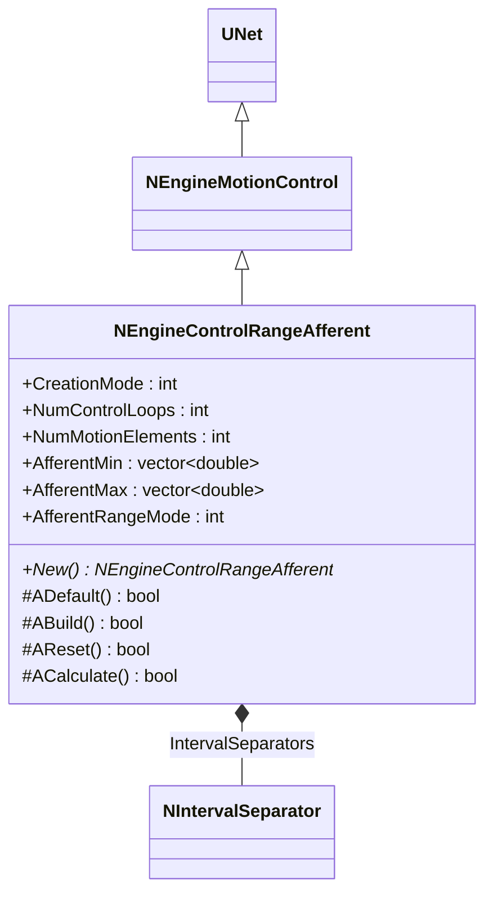
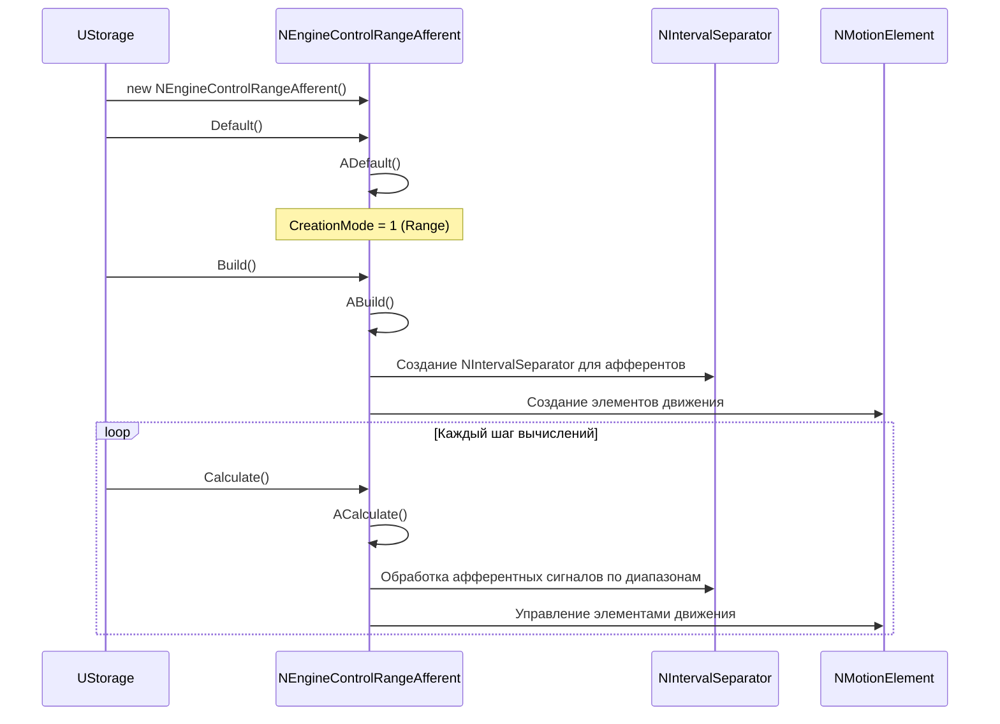
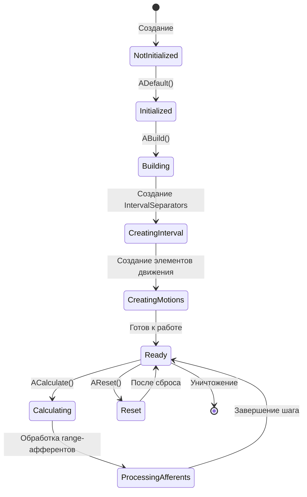
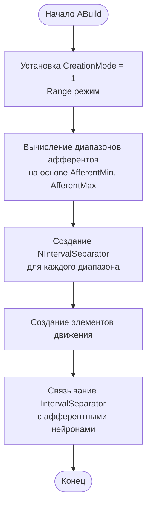
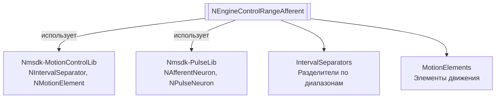

# NEngineControlRangeAfferent — афферентный контроллер (range)

**Класс**: `NEngineControlRangeAfferent` — вариант контроллера движения на базе диапазонных (range) афферентов.  
**Регистрация**: `NMotionControlLibrary.cpp` → `UploadClass("NEngineControlRangeAfferent", ...)`.  
**Базовый класс**: `NEngineMotionControl` (из Nmsdk-MotionControlLib).

NEngineControlRangeAfferent является специализированной версией NEngineMotionControl, настроенной для работы с range-афферентами (разделение сигналов по диапазонам значений). Компонент использует NIntervalSeparator для обработки афферентных сигналов.

## UML-диаграмма классов



**Иерархия наследования:**
- `UNet` (Rdk Framework) — базовый класс для сетей компонентов
- `NEngineMotionControl` — базовый движок управления движением
- `NEngineControlRangeAfferent` — афферентный контроллер (range)

## UML-диаграмма последовательности



## UML-диаграмма состояний



## UML-диаграмма активности



## UML-диаграмма компонентов



## Свойства

### Параметры

[Аналогично NEngineMotionControl, но с CreationMode=1 для Range режима]

### Параметры диапазонов

| Свойство | Тип | Флаги | Описание | Значение по умолчанию |
|----------|-----|-------|----------|----------------------|
| `AfferentMin` | `std::vector<double>` | `ptPubParameter` | Минимальные значения афферентов по контурам | `[-π/2]` |
| `AfferentMax` | `std::vector<double>` | `ptPubParameter` | Максимальные значения афферентов по контурам | `[π/2]` |
| `AfferentRangeMode` | `int` | `ptPubParameter` | Режим расчета диапазонов (0-3) | `2` |

### Входы

[Аналогично NEngineMotionControl]

### Выходы

[Аналогично NEngineMotionControl]

## Методы

[Аналогично NEngineMotionControl]

## Примеры использования

### C++ код

```cpp
// NEngineControlRangeAfferent создается через NEngineMotionControl
UEPtr<NEngineMotionControl> controller = new NEngineMotionControl;
controller->CreationMode = 1;  // Range режим
controller->NumMotionElements = 2;
controller->NumControlLoops = 3;
controller->AfferentMin = {-M_PI/2};
controller->AfferentMax = {M_PI/2};
controller->AfferentRangeMode = 2;
controller->Build();
```

### XML конфигурация

```xml
<Object Name="EngineControlRangeAfferent" ClassName="NEngineControlRangeAfferent">
    <!-- Использует параметры NEngineMotionControl с CreationMode=1 -->
    <Property Name="AfferentMin" Value="-1.57" />
    <Property Name="AfferentMax" Value="1.57" />
    <Property Name="AfferentRangeMode" Value="2" />
</Object>
```

### Использование в конфигурациях

Компонент `NEngineControlRangeAfferent` используется как специализированная версия NEngineMotionControl для работы с range-афферентами.

**Типичные сценарии использования:**
1. **Управление с range-афферентами** - управление движением с использованием разделения сигналов по диапазонам
2. **Гранулярная обработка** - более детальная обработка афферентных сигналов по диапазонам

**Типичные комбинации:**
- `NEngineControlRangeAfferent` + `NIntervalSeparator` - обработка афферентных сигналов по диапазонам

---

# NEngineControlRangeAfferent — afferent range controller

**Class**: `NEngineControlRangeAfferent` — motion controller variant based on range afferents.  
**Registration**: `NMotionControlLibrary.cpp` → `UploadClass("NEngineControlRangeAfferent", ...)`.  
**Base class**: `NEngineMotionControl` (from Nmsdk-MotionControlLib).

NEngineControlRangeAfferent is a specialized version of NEngineMotionControl configured for working with range afferents (signal separation by value ranges). The component uses NIntervalSeparator for processing afferent signals.

## Class Diagram

[Same as RU section]

## Sequence Diagram

[Same as RU section]

## State Diagram

[Same as RU section]

## Activity Diagram

[Same as RU section]

## Component Diagram

[Same as RU section]

## Properties

[Same structure as RU section, translated to English]

## Methods

[Same structure as RU section, translated to English]

## Usage Examples

[Same as RU section, with English comments]
