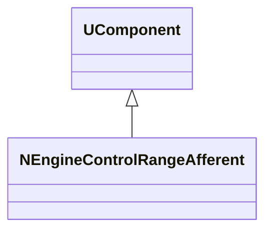
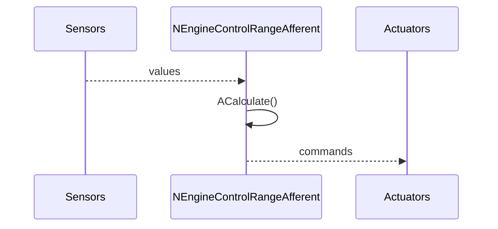
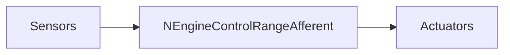
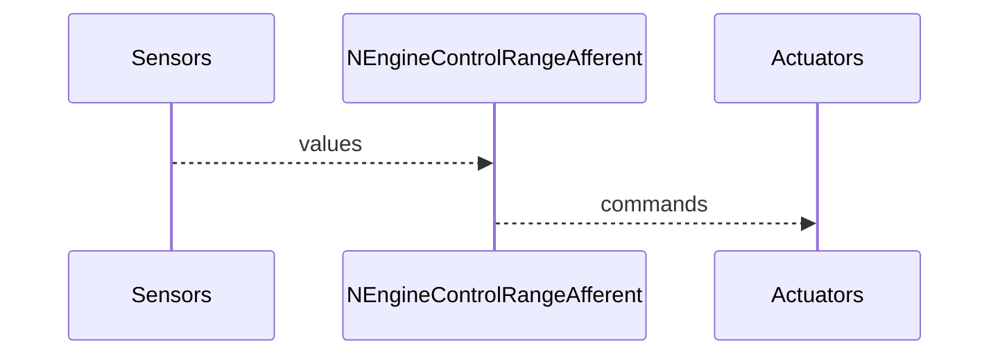

## NEngineControlRangeAfferent — афферентный контроллер (range)

**Класс**: `NEngineControlRangeAfferent` — вариант контроллера движения на базе диапазонных (range) афферентов.  
**Регистрация**: `UploadClass("NEngineControlRangeAfferent", ...)` в `NMotionControlLibrary.cpp`.

### Lifecycle
- **ADefault**: границы диапазонов и коэффициенты управления.
- **ABuild**: подключение сенсоров и актуаторов.
- **AReset**: сброс внутренних состояний.
- **ACalculate**: расчёт управляющих воздействий по диапазонным признакам.

### I/O
- Вход: сенсорные значения/ошибки.
- Выход: команды на двигатели/манипуляторы.



Пояснение: диаграмма классов показывает место компонента в иерархии и ключевые связи.



Пояснение: диаграмма последовательности показывает типовой сценарий взаимодействия и порядок вызовов.



Пояснение: блок-схема показывает поток данных/сигналов (входы → компонент → выходы).

### Config snippet

```ini
[Component]
ClassName = NEngineControlRangeAfferent
Name = CtrlRange1
```

---

## NEngineControlRangeAfferent — afferent range controller (EN)

Maps sensor values to control commands using range-based features.


Description: this class diagram shows the component position in the type hierarchy and key relations.



Description: this sequence diagram shows a typical runtime interaction and call order.


Description: this flowchart shows the data/signal flow (inputs → component → outputs).
