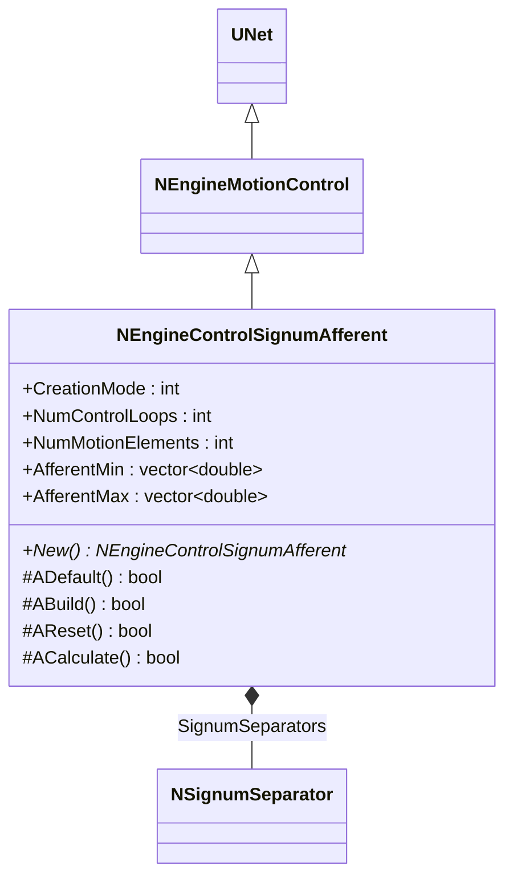
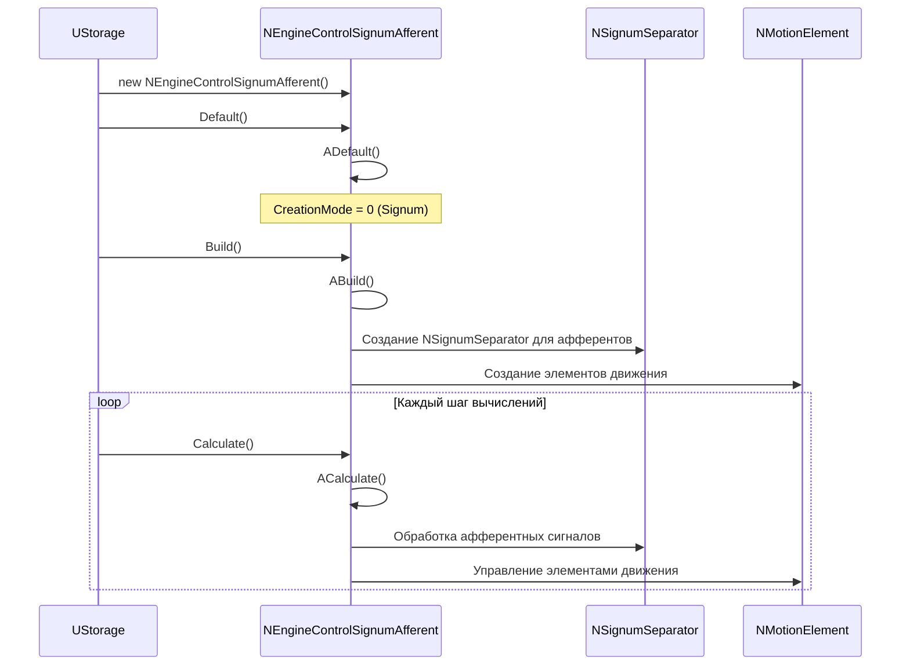
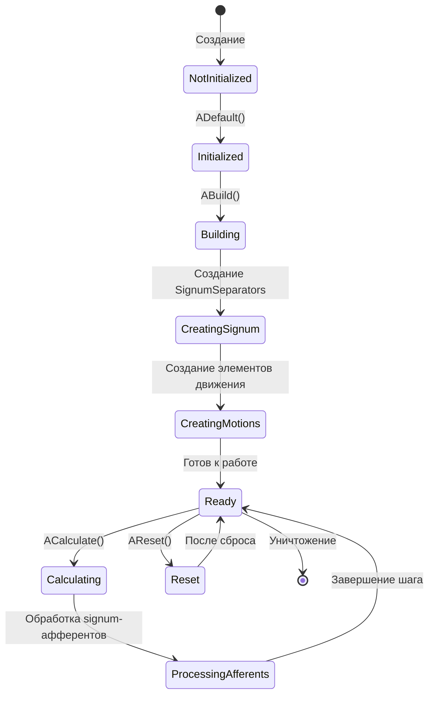
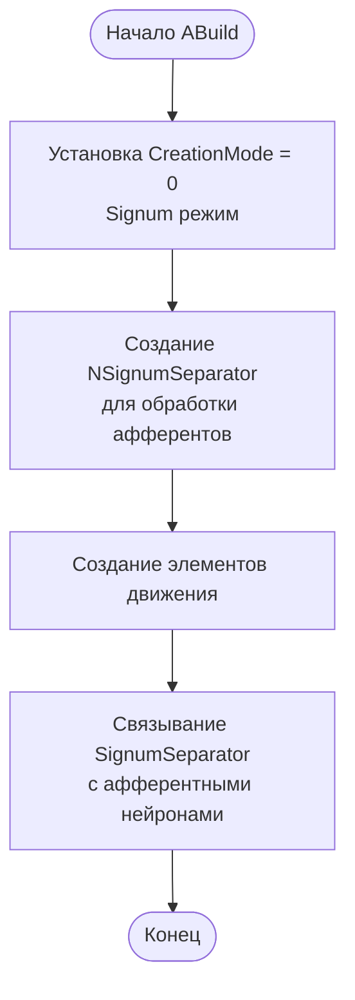
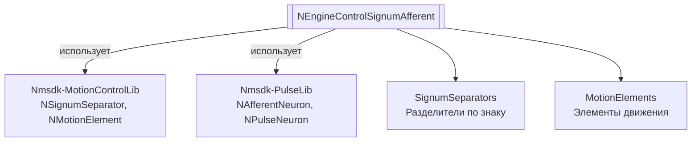

# NEngineControlSignumAfferent — афферентный контроллер (signum)

**Класс**: `NEngineControlSignumAfferent` — вариант контроллера движения на базе signum-признаков (афферентные сигналы).
**Регистрация**: `NMotionControlLibrary.cpp` → `UploadClass("NEngineControlSignumAfferent", ...)`.
**Базовый класс**: `NEngineMotionControl` (из Nmsdk-MotionControlLib).

NEngineControlSignumAfferent является специализированной версией NEngineMotionControl, настроенной для работы с signum-афферентами (разделение сигналов по знаку). Компонент использует NSignumSeparator для обработки афферентных сигналов.

## UML-диаграмма классов



**Иерархия наследования:**
- `UNet` (Rdk Framework) — базовый класс для сетей компонентов
- `NEngineMotionControl` — базовый движок управления движением
- `NEngineControlSignumAfferent` — афферентный контроллер (signum)

## UML-диаграмма последовательности



## UML-диаграмма состояний



## UML-диаграмма активности



## UML-диаграмма компонентов



## Свойства

### Параметры

[Аналогично NEngineMotionControl, но с CreationMode=0 для Signum режима]

### Входы

[Аналогично NEngineMotionControl]

### Выходы

[Аналогично NEngineMotionControl]

## Методы

[Аналогично NEngineMotionControl]

## Примеры использования

### C++ код

```cpp
// NEngineControlSignumAfferent создается через NEngineMotionControl
UEPtr<NEngineMotionControl> controller = new NEngineMotionControl;
controller->CreationMode = 0;  // Signum режим
controller->NumMotionElements = 2;
controller->NumControlLoops = 3;
controller->Build();
```

### XML конфигурация

```xml
<Object Name="EngineControlSignumAfferent" ClassName="NEngineControlSignumAfferent">
    <!-- Использует параметры NEngineMotionControl с CreationMode=0 -->
</Object>
```

### Использование в конфигурациях

Компонент `NEngineControlSignumAfferent` используется как специализированная версия NEngineMotionControl для работы с signum-афферентами.

**Типичные сценарии использования:**
1. **Управление с signum-афферентами** - управление движением с использованием разделения сигналов по знаку
2. **Упрощенная обработка** - упрощенная обработка афферентных сигналов

**Типичные комбинации:**
- `NEngineControlSignumAfferent` + `NSignumSeparator` - обработка афферентных сигналов

---

# NEngineControlSignumAfferent — afferent controller (signum)

**Class**: `NEngineControlSignumAfferent` — motion controller variant based on signum features (afferent signals).
**Registration**: `NMotionControlLibrary.cpp` → `UploadClass("NEngineControlSignumAfferent", ...)`.
**Base class**: `NEngineMotionControl` (from Nmsdk-MotionControlLib).

NEngineControlSignumAfferent is a specialized version of NEngineMotionControl configured for working with signum afferents (signal separation by sign). The component uses NSignumSeparator for processing afferent signals.

## Class Diagram

[Same as RU section]

## Sequence Diagram

[Same as RU section]

## State Diagram

[Same as RU section]

## Activity Diagram

[Same as RU section]

## Component Diagram

[Same as RU section]

## Properties

[Same structure as RU section, translated to English]

## Methods

[Same structure as RU section, translated to English]

## Источники

- [Literature-References.md](../Literature-References.md): [A], 19, 20, 21, 22, 27 — движок управления с афферентами, иерархия и моторная память.

## Usage Examples

[Same as RU section, with English comments]
