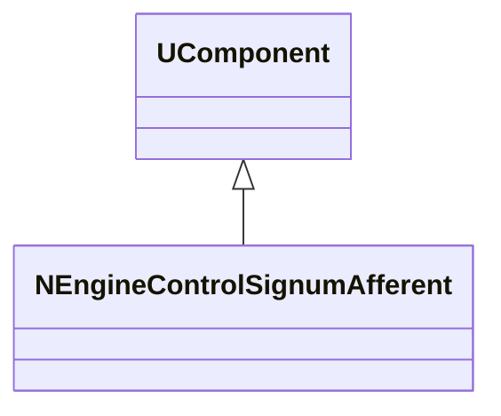
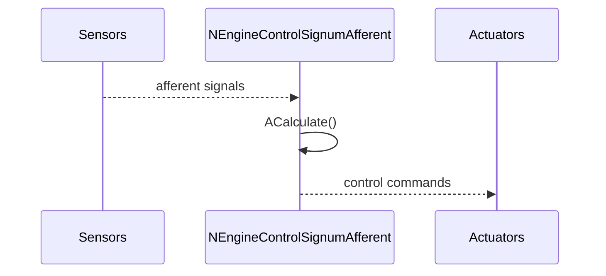
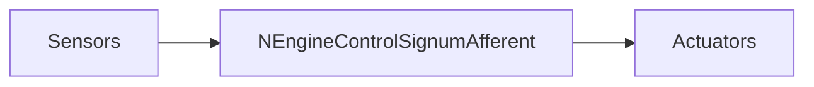
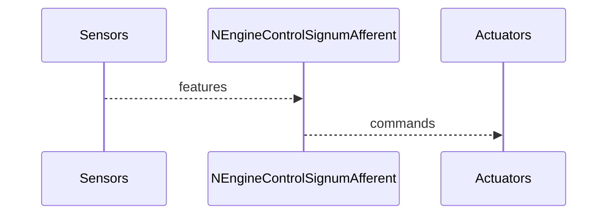

## NEngineControlSignumAfferent — афферентный контроллер (signum)

**Класс**: `NEngineControlSignumAfferent` — вариант контроллера движения на базе signum-признаков (афферентные сигналы).  
**Регистрация**: `UploadClass("NEngineControlSignumAfferent", ...)` в `NMotionControlLibrary.cpp`.

### Lifecycle
- **ADefault**: настройки афферентного преобразования (пороги/маски).
- **ABuild**: связывание входов сенсоров и выходов управления.
- **AReset**: сброс внутренних состояний.
- **ACalculate**: вычисление управляющего сигнала на основе signum-афферентов.

### I/O
- Вход: сенсорные признаки/ошибки (скаляры/векторы).
- Выход: управляющие команды на двигатели/манипулятор.



Пояснение: диаграмма классов показывает место компонента в иерархии и ключевые связи.



Пояснение: диаграмма последовательности показывает типовой сценарий взаимодействия и порядок вызовов.



Пояснение: блок-схема показывает поток данных/сигналов (входы → компонент → выходы).

### Config snippet

```ini
[Component]
ClassName = NEngineControlSignumAfferent
Name = CtrlSignum1
```

---

## NEngineControlSignumAfferent — afferent controller (EN)

Computes control actions from signum-like afferent features.


Description: this class diagram shows the component position in the type hierarchy and key relations.



Description: this sequence diagram shows a typical runtime interaction and call order.


Description: this flowchart shows the data/signal flow (inputs → component → outputs).
