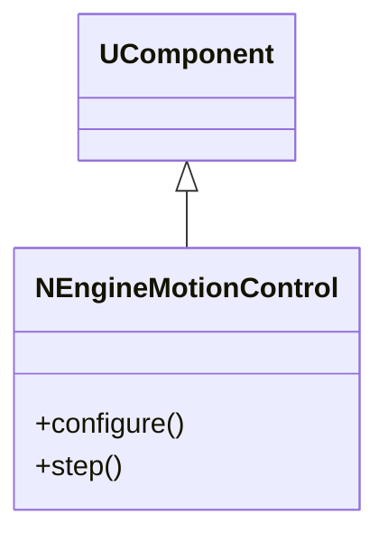
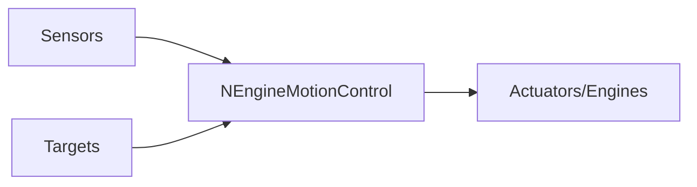
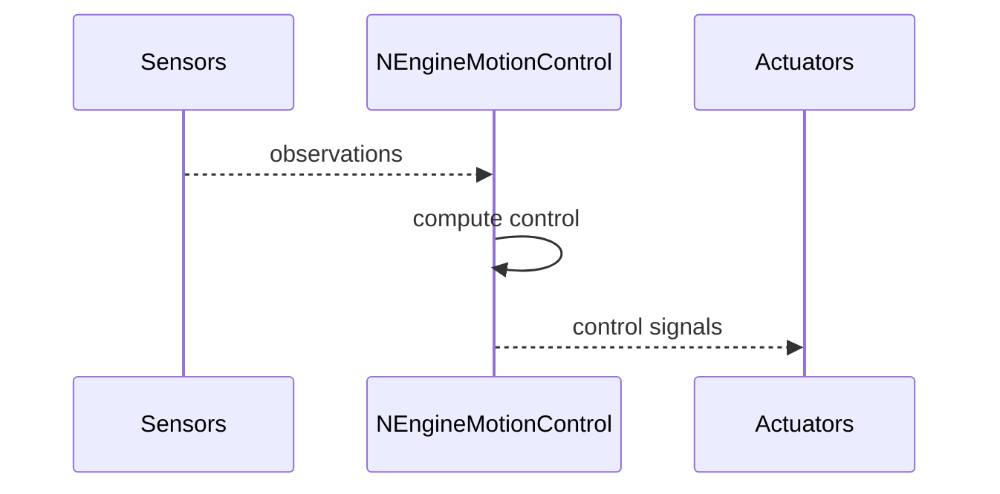

## NEngineMotionControl — движок управления движением

**Класс**: `NEngineMotionControl` — объединяет сенсоры, контроллеры и актуаторы для движения.  
**Регистрация**: `NMotionControlLibrary.cpp` → `UploadClass("NEngineMotionControl", ...)`.

### Входы/выходы
- Вход: сенсоры (ретина, гироскоп, приемники), цели/команды.
- Выход: управляющие сигналы к двигателям/манипуляторам.

Пояснение: блок-схема показывает поток данных/сигналов (входы → компонент → выходы).

Пояснение: диаграмма последовательности показывает типовой сценарий взаимодействия и порядок вызовов.

---

## NEngineMotionControl — motion control engine

Central engine combining perception and actuation to achieve motion targets.
