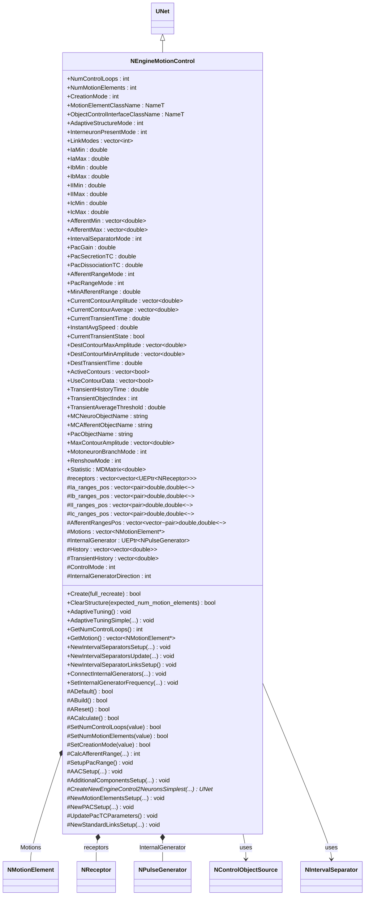
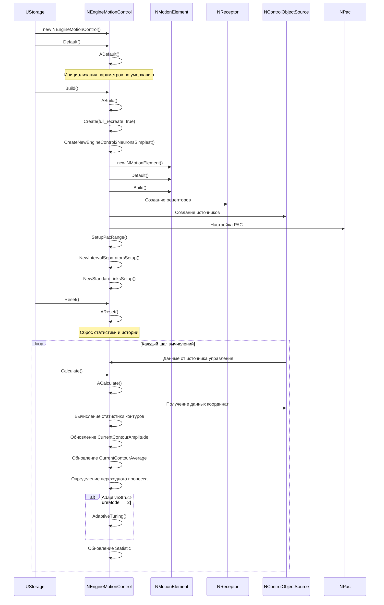
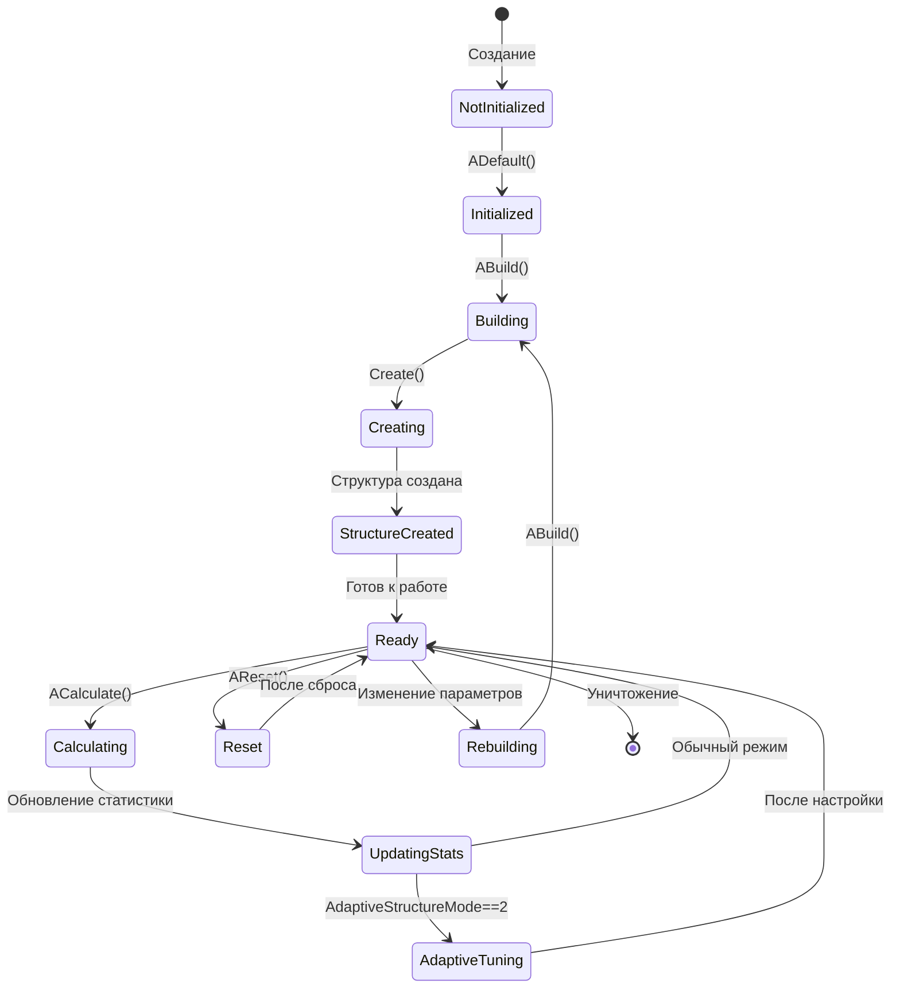
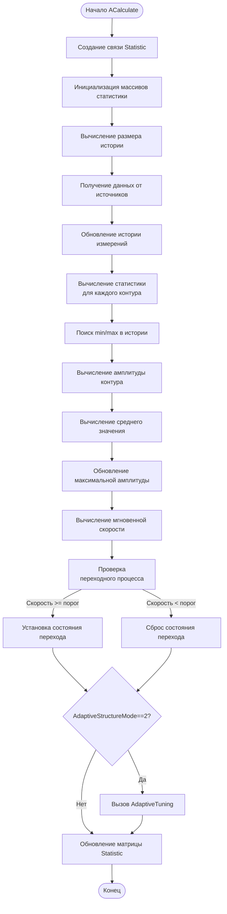
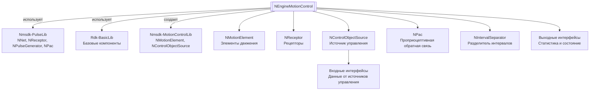

# NEngineMotionControl — движок управления движением

## RU

**Каталог компонентов:** [Component-Catalog.md](../Component-Catalog.md).

**Класс**: `NEngineMotionControl` — центральный компонент управления движением, объединяющий сенсоры, контроллеры и актуаторы для реализации сложных систем управления движением.
**Регистрация**: `NMotionControlLibrary.cpp` → `UploadClass("NEngineMotionControl", ...)`.
**Базовый класс**: `UNet` (из Rdk Framework).

NEngineMotionControl является высокоуровневым компонентом, который создает и управляет сетью элементов движения (NMotionElement), интегрируя импульсные нейросети из Nmsdk-PulseLib с компонентами управления позицией и источниками данных. Компонент поддерживает различные режимы создания сети (CreationMode), адаптивную настройку структуры и управление множественными контурами управления.

## UML-диаграмма классов



**Иерархия наследования:**
- `UNet` (Rdk Framework) — базовый класс для сетей компонентов
- `NEngineMotionControl` — движок управления движением

**Связи с другими компонентами:**
- **Композиция**: содержит вектор `Motions` из `NMotionElement*` — элементы движения
- **Агрегация**: использует `NReceptor`, `NPulseGenerator`, `NControlObjectSource`, `NIntervalSeparator`
- **Зависимости**: зависит от компонентов из `Nmsdk-PulseLib` (NNet, NReceptor, NPulseGenerator, NPac)

## UML-диаграмма последовательности



**Описание жизненного цикла:**
1. **Создание** - компонент создается через конструктор, инициализируются свойства
2. **Инициализация (ADefault)** - установка значений по умолчанию для всех параметров
3. **Построение (ABuild)** - вызов `Create()` для создания внутренней структуры сети
4. **Создание структуры (Create)** - создание элементов движения, рецепторов, источников, PAC
5. **Сброс (AReset)** - сброс статистики, истории и состояний переходных процессов
6. **Вычисление (ACalculate)** - основной цикл: получение данных, вычисление статистики, адаптивная настройка

## UML-диаграмма состояний



**Состояния компонента:**
- **NotInitialized** - компонент создан, но не инициализирован
- **Initialized** - компонент инициализирован (после ADefault)
- **Building** - выполняется построение структуры (ABuild)
- **Creating** - создание внутренней структуры сети (Create)
- **StructureCreated** - структура создана, но не готова к работе
- **Ready** - готов к вычислениям
- **Calculating** - выполняется вычисление (ACalculate)
- **UpdatingStats** - обновление статистики контуров
- **AdaptiveTuning** - выполняется адаптивная настройка структуры
- **Reset** - состояние после сброса (AReset)
- **Rebuilding** - требуется перестроение структуры

## UML-диаграмма активности



**Алгоритм работы ACalculate:**
1. Создание связи для статистики
2. Инициализация массивов для статистики контуров
3. Получение данных от источников управления (NControlObjectSource)
4. Обновление истории измерений
5. Вычисление статистики для каждого контура управления:
   - Поиск минимального и максимального значений в истории
   - Вычисление амплитуды контура (max - min)
   - Вычисление среднего значения
   - Обновление максимальной амплитуды
6. Вычисление мгновенной скорости изменения
7. Определение состояния переходного процесса
8. Адаптивная настройка (если включена)
9. Обновление матрицы статистики

## UML-диаграмма компонентов



**Зависимости:**
- **Nmsdk-PulseLib** - использует NNet, NReceptor, NPulseGenerator, NPac для создания нейросетевой структуры
- **Rdk-BasicLib** - базовые компоненты и утилиты Rdk Framework
- **Nmsdk-MotionControlLib** - использует NMotionElement, NControlObjectSource, NIntervalSeparator

**Интерфейсы:**
- **Входы** - данные получаются через компоненты NControlObjectSource, которые подключаются к движку
- **Выходы** - статистика через свойство `Statistic`, состояния через свойства `CurrentContourAmplitude`, `CurrentContourAverage` и др.

## Свойства

### Основные параметры структуры

| Свойство | Тип | Флаги | Описание | Значение по умолчанию |
|----------|-----|-------|----------|----------------------|
| `NumControlLoops` | `int` | `ptPubParameter` | Количество контуров управления | `1` |
| `NumMotionElements` | `int` | `ptPubParameter` | Количество элементов движения | `1` |
| `CreationMode` | `int` | `ptPubParameter` | Режим создания сети (0-14): 0=Signum, 1=Range, 2=Branched Range, 3=Branched Range Crosslinks, 4=Branched Ind. Range, 5=Branched Ind. Range Crosslinks, 10=Branched Ind. Range Continues LTZone, 11=Simplest 2 neuron, 12=As 11 + speed/force, 13=As 12 + control contour, 14=New net with parametric structure | `14` |
| `MotionElementClassName` | `NameT` | `ptPubParameter` | Имя класса элемента движения | `"NNewMotionElement"` |
| `ObjectControlInterfaceClassName` | `NameT` | `ptPubParameter` | Имя класса интерфейса управления объектом | `"NControlObjectSource"` |

### Параметры адаптации

| Свойство | Тип | Флаги | Описание | Значение по умолчанию |
|----------|-----|-------|----------|----------------------|
| `AdaptiveStructureMode` | `int` | `ptPubParameter` | Режим адаптивной структуры: 0=отключена, 1=включена, 2=с автоматической настройкой | `1` |
| `InterneuronPresentMode` | `int` | `ptPubParameter` | Режим наличия интернейронов: 0=нет, 1=есть | `1` |
| `LinkModes` | `std::vector<int>` | `ptPubParameter` | Режимы связей для каждого контура | `[1]` |

### Диапазоны афферентных сигналов

| Свойство | Тип | Флаги | Описание | Значение по умолчанию |
|----------|-----|-------|----------|----------------------|
| `IaMin` | `double` | `ptParameter` | Минимальное значение для Ia афферентов | `-2.0*π` |
| `IaMax` | `double` | `ptParameter` | Максимальное значение для Ia афферентов | `2.0*π` |
| `IbMin` | `double` | `ptParameter` | Минимальное значение для Ib афферентов | `-1.0` |
| `IbMax` | `double` | `ptParameter` | Максимальное значение для Ib афферентов | `1.0` |
| `IIMin` | `double` | `ptParameter` | Минимальное значение для II афферентов | `-π/2` |
| `IIMax` | `double` | `ptParameter` | Максимальное значение для II афферентов | `π/2` |
| `IcMin` | `double` | `ptParameter` | Минимальное значение для Ic афферентов | `-10.0` |
| `IcMax` | `double` | `ptParameter` | Максимальное значение для Ic афферентов | `10.0` |
| `AfferentMin` | `std::vector<double>` | `ptPubParameter` | Минимальные значения афферентов по контурам | `[-π/2]` |
| `AfferentMax` | `std::vector<double>` | `ptPubParameter` | Максимальные значения афферентов по контурам | `[π/2]` |
| `AfferentRangeMode` | `int` | `ptPubParameter` | Режим расчета диапазонов афферентов (0-3) | `2` |
| `MinAfferentRange` | `double` | `ptPubState` | Минимальный диапазон афферентов (0-1) | `0.1` |

### Параметры PAC (Proprioceptive Afferent Control)

| Свойство | Тип | Флаги | Описание | Значение по умолчанию |
|----------|-----|-------|----------|----------------------|
| `PacGain` | `double` | `ptPubParameter` | Усиление PAC | `100.0` |
| `PacSecretionTC` | `double` | `ptPubParameter` | Постоянная времени секреции PAC | `0.001` |
| `PacDissociationTC` | `double` | `ptPubParameter` | Постоянная времени диссоциации PAC | `0.001` |
| `PacRangeMode` | `int` | `ptPubParameter` | Режим диапазонов PAC (0-3) | `0` |

### Параметры разделителей интервалов

| Свойство | Тип | Флаги | Описание | Значение по умолчанию |
|----------|-----|-------|----------|----------------------|
| `IntervalSeparatorMode` | `int` | `ptPubParameter` | Режим разделителя интервалов | `6` |

### Параметры моторных нейронов

| Свойство | Тип | Флаги | Описание | Значение по умолчанию |
|----------|-----|-------|----------|----------------------|
| `MotoneuronBranchMode` | `int` | `ptPubParameter` | Режим ветвления моторных нейронов: 0=нет, 1=есть | `0` |
| `RenshowMode` | `int` | `ptPubParameter` | Режим интернейронов Реншоу: 0=нет, 1=есть | `0` |

### Имена классов компонентов

| Свойство | Тип | Флаги | Описание | Значение по умолчанию |
|----------|-----|-------|----------|----------------------|
| `MCNeuroObjectName` | `string` | `ptPubParameter` | Имя класса нейрона для элементов движения | `"NNewSPNeuron"` |
| `MCAfferentObjectName` | `string` | `ptPubParameter` | Имя класса афферентного нейрона | `"NSimpleAfferentNeuron"` |
| `PacObjectName` | `string` | `ptPubParameter` | Имя класса PAC компонента | `"NPac"` |

### Состояния контуров управления

| Свойство | Тип | Флаги | Описание | Изменяется в |
|----------|-----|-------|----------|--------------|
| `CurrentContourAmplitude` | `std::vector<double>` | `ptPubState` | Текущая амплитуда каждого контура | `ACalculate` |
| `CurrentContourAverage` | `std::vector<double>` | `ptPubState` | Текущее среднее значение каждого контура | `ACalculate` |
| `MaxContourAmplitude` | `std::vector<double>` | `ptPubState` | Максимальная амплитуда каждого контура | `ACalculate` |
| `ActiveContours` | `std::vector<bool>` | `ptPubParameter` | Флаги активности контуров (0=II, 1=Ia, 2=Ib, 3=Ic) | `SetActiveContours` |
| `UseContourData` | `std::vector<bool>` | `ptPubParameter` | Флаги использования данных контуров | Устанавливается пользователем |

### Параметры переходного процесса

| Свойство | Тип | Флаги | Описание | Значение по умолчанию |
|----------|-----|-------|----------|----------------------|
| `CurrentTransientTime` | `double` | `ptPubState` | Текущее время переходного процесса | `0.0` |
| `CurrentTransientState` | `bool` | `ptPubState` | Текущее состояние переходного процесса | `false` |
| `DestTransientTime` | `double` | `ptPubParameter` | Целевое время переходного процесса | `0.1` |
| `TransientHistoryTime` | `double` | `ptPubParameter` | Время истории для анализа переходного процесса | `1.0` |
| `TransientObjectIndex` | `int` | `ptPubParameter` | Индекс объекта для анализа переходного процесса | `0` |
| `TransientAverageThreshold` | `double` | `ptPubParameter` | Порог для определения переходного процесса | `0.05` |
| `DestContourMaxAmplitude` | `std::vector<double>` | `ptPubParameter` | Целевая максимальная амплитуда контуров | Задается пользователем |
| `DestContourMinAmplitude` | `std::vector<double>` | `ptPubParameter` | Целевая минимальная амплитуда контуров | Задается пользователем |
| `InstantAvgSpeed` | `double` | `ptPubState` | Мгновенная средняя скорость изменения | `ACalculate` |

### Статистика

| Свойство | Тип | Флаги | Описание | Изменяется в |
|----------|-----|-------|----------|--------------|
| `Statistic` | `MDMatrix<double>` | `ptPubState` | Матрица статистики (1x(11+NumControlLoops*2)) | `ACalculate` |

## Методы

### Конструкторы и деструкторы

#### `NEngineMotionControl(void)`
**Назначение:** Конструктор компонента
**Параметры:** Нет
**Возвращаемое значение:** Нет
**Описание:** Инициализирует все свойства, устанавливает начальные значения внутренних переменных (ControlMode=0, HistorySize=0, TransientHistorySize=0, InternalGeneratorDirection=-1)

#### `virtual ~NEngineMotionControl(void)`
**Назначение:** Деструктор компонента
**Параметры:** Нет
**Возвращаемое значение:** Нет
**Описание:** Освобождает ресурсы компонента

### Методы жизненного цикла

#### `virtual bool ADefault(void)`
**Назначение:** Инициализация значений по умолчанию
**Параметры:** Нет
**Возвращаемое значение:** `true` при успехе
**Описание:** Устанавливает значения по умолчанию для всех параметров: NumMotionElements=1, NumControlLoops=1, CreationMode=14, диапазоны афферентов, параметры PAC и др.

#### `virtual bool ABuild(void)`
**Назначение:** Построение внутренней структуры компонента
**Параметры:** Нет
**Возвращаемое значение:** `true` при успехе, `false` при ошибке
**Описание:** Проверяет наличие Storage, вызывает `Create()` если AdaptiveStructureMode включен, инициализирует массивы для статистики контуров

#### `virtual bool AReset(void)`
**Назначение:** Сброс состояния компонента к начальному
**Параметры:** Нет
**Возвращаемое значение:** `true` при успехе
**Описание:** Сбрасывает статистику контуров, время переходного процесса, состояния, инициализирует векторы рецепторов для каждого элемента движения

#### `virtual bool ACalculate(void)`
**Назначение:** Выполнение вычислений на текущем шаге
**Параметры:** Нет
**Возвращаемое значение:** `true` при успехе
**Описание:** Основной метод вычислений:
- Получает данные от источников управления
- Обновляет историю измерений
- Вычисляет статистику для каждого контура (амплитуда, среднее значение)
- Определяет состояние переходного процесса
- Выполняет адаптивную настройку (если включена)
- Обновляет матрицу статистики

### Публичные методы управления

#### `virtual bool Create(bool full_recreate=true)`
**Назначение:** Создание структуры сети в соответствии с CreationMode
**Параметры:**
- `full_recreate` - если `true`, удаляет все существующие элементы движения, иначе сохраняет их
**Возвращаемое значение:** `true` при успехе
**Описание:** Удаляет существующую структуру (если нужно), создает новую структуру сети в зависимости от CreationMode, настраивает PAC, разделители интервалов, создает компонент статистики

#### `virtual bool ClearStructure(int expected_num_motion_elements)`
**Назначение:** Удаление существующей структуры, сохранение указанного количества элементов движения
**Параметры:**
- `expected_num_motion_elements` - количество элементов движения для сохранения
**Возвращаемое значение:** `true` при успехе
**Описание:** Удаляет компоненты структуры, сохраняя интерфейсные компоненты и указанное количество элементов движения

#### `virtual void AdaptiveTuning(void)`
**Назначение:** Адаптивная настройка структуры на основе текущих и целевых параметров
**Параметры:** Нет
**Возвращаемое значение:** Нет
**Описание:** Вызывает `AdaptiveTuningSimple()` с текущими параметрами контуров и целевыми значениями для автоматической настройки количества элементов движения и усиления управления

#### `virtual void AdaptiveTuningSimple(...)`
**Назначение:** Упрощенная адаптивная настройка с явными параметрами
**Параметры:**
- `current_contour_amplitude` - текущие амплитуды контуров
- `use_contour_data` - флаги использования данных контуров
- `current_transient_time` - текущее время переходного процесса
- `dest_contour_max_amplitude` - целевые максимальные амплитуды
- `dest_contour_min_amplitude` - целевые минимальные амплитуды
- `dest_transient_time` - целевое время переходного процесса
- `num_motion_elements` - выходной параметр: количество элементов движения
- `control_gain` - выходной параметр: усиление управления
**Возвращаемое значение:** Нет
**Описание:** Вычисляет оптимальные параметры структуры на основе сравнения текущих и целевых характеристик

#### `int GetNumControlLoops(void)`
**Назначение:** Получение количества контуров управления
**Параметры:** Нет
**Возвращаемое значение:** Количество контуров управления
**Описание:** Возвращает значение свойства NumControlLoops

#### `vector<NMotionElement *> GetMotion(void)`
**Назначение:** Получение вектора элементов движения
**Параметры:** Нет
**Возвращаемое значение:** Вектор указателей на элементы движения
**Описание:** Возвращает внутренний вектор Motions, содержащий все созданные элементы движения

### Методы настройки разделителей интервалов

#### `void NewIntervalSeparatorsSetup(int mode_value, int last_mode_value, double pos_gain_value, double neg_gain_value)`
**Назначение:** Настройка разделителей интервалов
**Параметры:**
- `mode_value` - новый режим разделителей
- `last_mode_value` - предыдущий режим
- `pos_gain_value` - усиление для положительных интервалов
- `neg_gain_value` - усиление для отрицательных интервалов
**Возвращаемое значение:** Нет
**Описание:** Создает или обновляет разделители интервалов в соответствии с режимом

#### `void NewIntervalSeparatorsUpdate(int mode_value, int last_mode_value)`
**Назначение:** Обновление разделителей интервалов
**Параметры:**
- `mode_value` - новый режим
- `last_mode_value` - предыдущий режим
**Возвращаемое значение:** Нет
**Описание:** Обновляет существующие разделители интервалов без пересоздания

#### `void NewIntervalSeparatorLinksSetup(void)`
**Назначение:** Настройка связей разделителей интервалов
**Параметры:** Нет
**Возвращаемое значение:** Нет
**Описание:** Создает связи между разделителями интервалов и другими компонентами сети

### Методы управления генераторами

#### `void ConnectInternalGenerators(int direction, int num_motion_elements, int control_loop_index)`
**Назначение:** Подключение внутренних генераторов
**Параметры:**
- `direction` - направление (0=прямое, 1=обратное)
- `num_motion_elements` - количество элементов движения
- `control_loop_index` - индекс контура управления
**Возвращаемое значение:** Нет
**Описание:** Подключает внутренние генераторы импульсов к элементам движения

#### `void SetInternalGeneratorFrequency(int direction, int num_motion_elements, int control_loop_index, double value)`
**Назначение:** Установка частоты внутреннего генератора
**Параметры:**
- `direction` - направление генератора
- `num_motion_elements` - количество элементов движения
- `control_loop_index` - индекс контура управления
- `value` - частота генератора
**Возвращаемое значение:** Нет
**Описание:** Устанавливает частоту внутреннего генератора для указанного направления и контура

### Защищенные методы

#### `#int CalcAfferentRange(int num_motions, bool cross_ranges, double a_min, double a_max, vector<pair<double,double> > &pos_ranges, vector<pair<double,double> > &neg_ranges, int range_mode)`
**Назначение:** Вычисление диапазонов афферентных нейронов
**Параметры:**
- `num_motions` - количество элементов движения
- `cross_ranges` - использовать ли пересекающиеся диапазоны
- `a_min`, `a_max` - минимальное и максимальное значения
- `pos_ranges`, `neg_ranges` - выходные векторы диапазонов для положительных и отрицательных значений
- `range_mode` - режим расчета диапазонов
**Возвращаемое значение:** Количество созданных диапазонов
**Описание:** Вычисляет диапазоны для афферентных нейронов в зависимости от режима

#### `#void SetupPacRange(void)`
**Назначение:** Настройка диапазонов PAC
**Параметры:** Нет
**Возвращаемое значение:** Нет
**Описание:** Настраивает диапазоны для компонентов PAC на основе текущих параметров

#### `#void AACSetup(UEPtr<UNet> net, double gain_value)`
**Назначение:** Настройка AAC (Adaptive Afferent Control)
**Параметры:**
- `net` - сеть для настройки
- `gain_value` - значение усиления
**Возвращаемое значение:** Нет
**Описание:** Настраивает адаптивное афферентное управление в сети

#### `#void AdditionalComponentsSetup(UEPtr<UNet> net)`
**Назначение:** Настройка дополнительных компонентов
**Параметры:**
- `net` - сеть для настройки
**Возвращаемое значение:** Нет
**Описание:** Настраивает дополнительные компоненты сети (источники, разделители и т.д.)

#### `#UNet* CreateNewEngineControl2NeuronsSimplest(bool crosslinks = false, bool crossranges=false)`
**Назначение:** Создание упрощенной структуры управления с 2 нейронами
**Параметры:**
- `crosslinks` - создавать ли перекрестные связи
- `crossranges` - использовать ли пересекающиеся диапазоны
**Возвращаемое значение:** Указатель на созданную сеть
**Описание:** Создает упрощенную структуру управления движением с двумя нейронами на каждый элемент движения

#### `#void NewMotionElementsSetup(UEPtr<UNet> net)`
**Назначение:** Настройка элементов движения
**Параметры:**
- `net` - сеть для настройки
**Возвращаемое значение:** Нет
**Описание:** Создает и настраивает элементы движения в сети

#### `#void NewPACSetup(double pulse_amplitude, double secretion_tc, double dissociaton_tc, double gain_value, bool gain_div_mode)`
**Назначение:** Настройка PAC компонентов
**Параметры:**
- `pulse_amplitude` - амплитуда импульсов
- `secretion_tc` - постоянная времени секреции
- `dissociaton_tc` - постоянная времени диссоциации
- `gain_value` - значение усиления
- `gain_div_mode` - режим деления усиления
**Возвращаемое значение:** Нет
**Описание:** Создает и настраивает компоненты PAC в сети

#### `#void UpdatePacTCParameters(void)`
**Назначение:** Обновление параметров постоянных времени PAC
**Параметры:** Нет
**Возвращаемое значение:** Нет
**Описание:** Обновляет постоянные времени секреции и диссоциации для всех PAC компонентов

#### `#void NewStandardLinksSetup(const string &engine_integrator_name)`
**Назначение:** Настройка стандартных связей
**Параметры:**
- `engine_integrator_name` - имя интегратора двигателя
**Возвращаемое значение:** Нет
**Описание:** Создает стандартные связи между компонентами сети

### Сеттеры свойств

Все сеттеры свойств имеют сигнатуру `bool SetPropertyName(const Type &value)` и возвращают `true` при успехе, `false` при ошибке валидации. Многие сеттеры устанавливают флаг `Ready=false`, что требует перестроения структуры.

## Примеры использования

### C++ код

#### Создание и настройка компонента

```cpp
#include "NEngineMotionControl.h"

// Создание экземпляра
UEPtr<NEngineMotionControl> engine = new NEngineMotionControl;
engine->SetName("MotionControlEngine");

// Инициализация
engine->Default();

// Настройка параметров
engine->NumMotionElements = 3;  // 3 элемента движения
engine->NumControlLoops = 2;    // 2 контура управления
engine->CreationMode = 14;      // Новый режим с параметрической структурой
engine->AdaptiveStructureMode = 2;  // С автоматической настройкой

// Настройка диапазонов афферентов
engine->IaMin = -M_PI;
engine->IaMax = M_PI;
engine->IIMin = -M_PI/2;
engine->IIMax = M_PI/2;

// Настройка PAC
engine->PacGain = 150.0;
engine->PacSecretionTC = 0.001;
engine->PacDissociationTC = 0.001;

// Настройка целевых параметров для адаптации
std::vector<double> destMax(2, 1.5);
std::vector<double> destMin(2, 0.5);
engine->DestContourMaxAmplitude = destMax;
engine->DestContourMinAmplitude = destMin;
engine->DestTransientTime = 0.15;

// Построение структуры
engine->Build();

// Получение элементов движения
std::vector<NMotionElement*> motions = engine->GetMotion();
for (size_t i = 0; i < motions.size(); i++) {
    // Работа с элементами движения
    motions[i]->NumControlLoops = 2;
}

// Использование в цикле вычислений
engine->Reset();
for (int step = 0; step < numSteps; step++) {
    engine->Calculate();

    // Получение статистики
    MDMatrix<double> stats = engine->Statistic;
    std::vector<double> amplitudes = engine->CurrentContourAmplitude;
    std::vector<double> averages = engine->CurrentContourAverage;

    // Проверка состояния переходного процесса
    if (engine->CurrentTransientState) {
        double transientTime = engine->CurrentTransientTime;
        // Обработка переходного процесса
    }
}
```

#### Интеграция с источниками управления

```cpp
// Создание источника управления объектом
UEPtr<NControlObjectSource> source = new NControlObjectSource;
source->SetName("NManipulatorSource1");
source->Default();
source->Build();

// Добавление источника к движку
engine->AddComponent(source);

// Установка координат объекта
MVector<double, 3> coord(10.0, 8.0, 6.0);
source->SetCoord(coord);

// Связывание с элементами движения происходит автоматически
// при создании структуры через Create()
```

#### Адаптивная настройка

```cpp
// Включение адаптивной настройки
engine->AdaptiveStructureMode = 2;

// Настройка целевых параметров
engine->DestContourMaxAmplitude = {2.0, 1.8, 1.5};
engine->DestContourMinAmplitude = {0.8, 0.6, 0.5};
engine->DestTransientTime = 0.2;
engine->UseContourData = {true, true, true};

// Адаптивная настройка выполняется автоматически в ACalculate
// при AdaptiveStructureMode == 2

// Или ручной вызов
int numElements;
double controlGain;
engine->AdaptiveTuningSimple(
    engine->CurrentContourAmplitude,
    engine->UseContourData,
    engine->CurrentTransientTime,
    engine->DestContourMaxAmplitude,
    engine->DestContourMinAmplitude,
    engine->DestTransientTime,
    numElements,
    controlGain
);

// Применение результатов
engine->NumMotionElements = numElements;
engine->PacGain = controlGain;
engine->Create(false);  // Перестроение с сохранением структуры
```

### XML конфигурация

#### Базовая конфигурация

```xml
<Object Name="MotionControlEngine" ClassName="NEngineMotionControl">
    <!-- Основные параметры -->
    <Property Name="NumMotionElements" Value="2" />
    <Property Name="NumControlLoops" Value="3" />
    <Property Name="CreationMode" Value="14" />
    <Property Name="AdaptiveStructureMode" Value="1" />

    <!-- Диапазоны афферентов -->
    <Property Name="IaMin" Value="-3.14159" />
    <Property Name="IaMax" Value="3.14159" />
    <Property Name="IIMin" Value="-1.5708" />
    <Property Name="IIMax" Value="1.5708" />

    <!-- Параметры PAC -->
    <Property Name="PacGain" Value="120.0" />
    <Property Name="PacSecretionTC" Value="0.001" />
    <Property Name="PacDissociationTC" Value="0.001" />

    <!-- Имена классов -->
    <Property Name="MotionElementClassName" Value="NNewMotionElement" />
    <Property Name="MCNeuroObjectName" Value="NNewSPNeuron" />
    <Property Name="MCAfferentObjectName" Value="NSimpleAfferentNeuron" />
</Object>
```

#### Полная конфигурация с адаптацией

```xml
<Object Name="MotionControlEngine" ClassName="NEngineMotionControl">
    <!-- Структура -->
    <Property Name="NumMotionElements" Value="3" />
    <Property Name="NumControlLoops" Value="2" />
    <Property Name="CreationMode" Value="14" />
    <Property Name="AdaptiveStructureMode" Value="2" />
    <Property Name="InterneuronPresentMode" Value="1" />

    <!-- Диапазоны афферентов -->
    <Property Name="AfferentMin" Value="-1.5708,-3.14159" />
    <Property Name="AfferentMax" Value="1.5708,3.14159" />
    <Property Name="AfferentRangeMode" Value="2" />
    <Property Name="MinAfferentRange" Value="0.1" />

    <!-- PAC параметры -->
    <Property Name="PacGain" Value="150.0" />
    <Property Name="PacSecretionTC" Value="0.001" />
    <Property Name="PacDissociationTC" Value="0.001" />
    <Property Name="PacRangeMode" Value="0" />

    <!-- Параметры переходного процесса -->
    <Property Name="DestTransientTime" Value="0.15" />
    <Property Name="TransientHistoryTime" Value="1.0" />
    <Property Name="TransientObjectIndex" Value="0" />
    <Property Name="TransientAverageThreshold" Value="0.05" />
    <Property Name="DestContourMaxAmplitude" Value="1.8,1.5" />
    <Property Name="DestContourMinAmplitude" Value="0.8,0.6" />
    <Property Name="UseContourData" Value="true,true" />

    <!-- Активные контуры -->
    <Property Name="ActiveContours" Value="true,true" />

    <!-- Разделители интервалов -->
    <Property Name="IntervalSeparatorMode" Value="6" />

    <!-- Моторные нейроны -->
    <Property Name="MotoneuronBranchMode" Value="1" />
    <Property Name="RenshowMode" Value="1" />

    <!-- Источник управления -->
    <Object Name="NManipulatorSource1" ClassName="NControlObjectSource">
        <Property Name="Coord" Value="10.0,8.0,6.0" />
    </Object>
</Object>
```

### Использование в конфигурациях

Компонент `NEngineMotionControl` является центральным компонентом для систем управления движением и используется в большинстве конфигурационных проектов, связанных с:

- Управлением манипуляторами
- Робототехническими системами
- Системами управления движением с обратной связью
- Адаптивными системами управления

**Примеры конфигураций:** `Bin/Configs/SpikeSamples/MC-Muscles/`, `Bin/Configs/SpikeSamples/MC1-PCN/` (MotionControl_Test, MultiPositionControl_*), `Bin/Configs/SpikeSamples/MC0-RCN/`, `Bin/Configs/SpikeSamples/EyeRetina/`.

**Типичные сценарии использования:**
1. **Управление манипулятором** - создание системы управления с несколькими степенями свободы
2. **Адаптивное управление** - автоматическая настройка параметров на основе характеристик переходных процессов
3. **Множественные контуры управления** - управление несколькими независимыми контурами (Ia, Ib, II, Ic)
4. **Интеграция с сенсорами** - подключение ретины, гироскопов, приемников сигналов

**Типичные комбинации с другими компонентами:**
- `NEngineMotionControl` + [NControlObjectSource](NControlObjectSource.md) — источник данных об объекте управления
- `NEngineMotionControl` + `NMotionElement` — элементы движения (создаются автоматически)
- `NEngineMotionControl` + [NEyeRetina](NEyeRetina.md) — визуальное восприятие для управления
- `NEngineMotionControl` + [NAstaticGyro](NAstaticGyro.md) — ориентация в пространстве
- `NEngineMotionControl` + [NPositionControlElement](NPositionControlElement.md) — контроль позиции

---

## EN

NEngineMotionControl — motion control engine

**Class**: `NEngineMotionControl` — central motion control component that integrates sensors, controllers, and actuators for complex motion control systems.
**Registration**: `NMotionControlLibrary.cpp` → `UploadClass("NEngineMotionControl", ...)`.
**Base class**: `UNet` (from Rdk Framework).

NEngineMotionControl is a high-level component that creates and manages a network of motion elements (NMotionElement), integrating spiking neural networks from Nmsdk-PulseLib with position control components and data sources. The component supports various network creation modes (CreationMode), adaptive structure tuning, and management of multiple control loops.

## Class Diagram

[Same as RU section]

## Sequence Diagram

[Same as RU section]

## State Diagram

[Same as RU section]

## Activity Diagram

[Same as RU section]

## Component Diagram

[Same as RU section]

## Properties

### Main parameters

| Property | Type | Description |
|----------|------|-------------|
| `CreationMode` | `int` | Network creation mode (0=Signum, 14=Branched, etc.) |
| `NumControlLoops` | `int` | Number of control loops |
| `NumMotionElements` | `int` | Number of motion elements |
| `MotionElementClassName` | `NameT` | Class name for motion elements (e.g. NNewMotionElement) |
| `ObjectControlInterfaceClassName` | `NameT` | Class name for control object source (e.g. NControlObjectSource) |
| `AdaptiveStructureMode` | `int` | Adaptive structure tuning |
| `InterneuronPresentMode` | `int` | Interneuron presence |
| `IntervalSeparatorMode` | `int` | Interval separator mode |
| `AfferentMin`, `AfferentMax` | `vector<double>` | Afferent ranges (Ia, Ib, II, Ic) |

### State

| Property | Type | Description |
|----------|------|-------------|
| `CurrentContourAmplitude`, `CurrentContourAverage` | `vector<double>` | Current contour state |
| `ActiveContours`, `UseContourData` | `vector<bool>` | Active/used contours |
| `Statistic` | `MDMatrix<double>` | Statistics matrix |

## Methods

### Lifecycle

- **`ADefault()`** — set default parameters for chosen CreationMode
- **`ABuild()`** — create neural network (receptors, motion elements, interval separators)
- **`AReset()`** — reset all internal components
- **`ACalculate()`** — process afferent signals; update motion elements; generate control commands

### Structure

- **`Create(full_recreate)`** — (re)build network structure
- **`ClearStructure(expected_num_motion_elements)`** — clear motion elements
- **`AdaptiveTuning()`** — tune structure adaptively

## Usage Examples

### C++ Code

See RU section for full examples. Typical usage: create NEngineMotionControl, set CreationMode and NumMotionElements, connect [NControlObjectSource](NControlObjectSource.md) as ObjectControlInterface, Default/Build/Reset, then Calculate() in loop. Afferent signals are fed via receptors; motion elements output control commands.

### Usage in Configurations

Central component for motion control; example configs: `Bin/Configs/SpikeSamples/MC-Muscles/`, `Bin/Configs/SpikeSamples/MC1-PCN/`, `Bin/Configs/SpikeSamples/MC0-RCN/`, `Bin/Configs/SpikeSamples/EyeRetina/`. Typical combinations: with [NControlObjectSource](NControlObjectSource.md), [NPositionControlElement](NPositionControlElement.md), [NEyeRetina](NEyeRetina.md), [NAstaticGyro](NAstaticGyro.md).

## Источники

- [Literature-References.md](../Literature-References.md): [A], 19, 20, 21, 22, 27 — иерархия управления поведением робота, моторная память, согласованное управление исполнительной системой.
