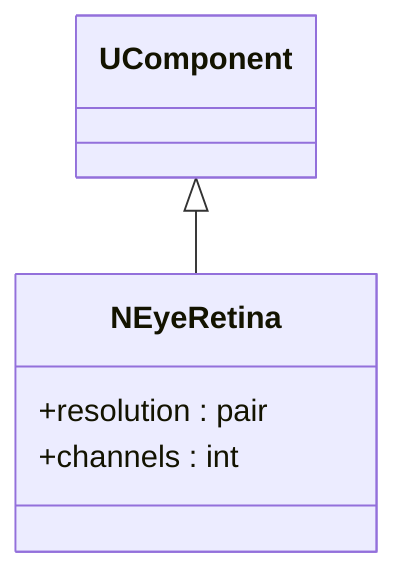
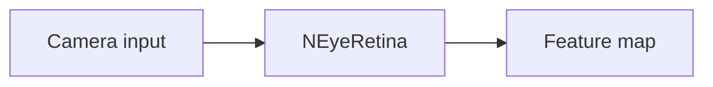
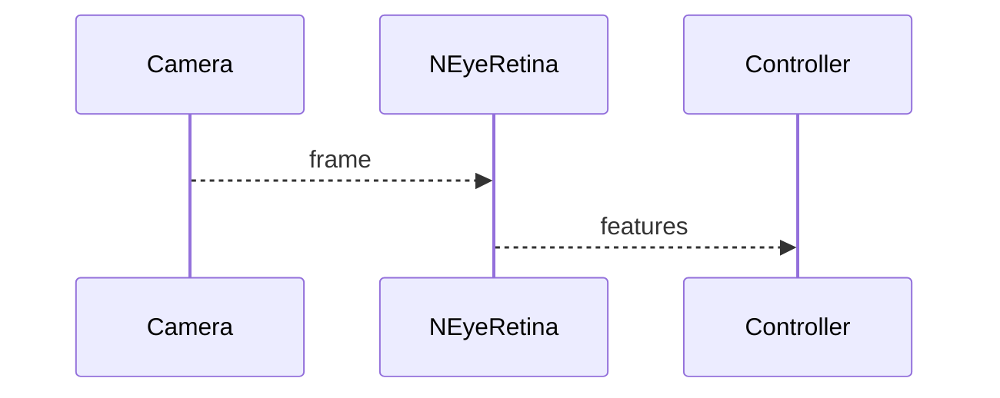

## NEyeRetina — ретина

**Класс**: `NEyeRetina` — модель ретины, преобразующая входной сигнал в карту признаков.  
**Регистрация**: `NMotionControlLibrary.cpp` → `UploadClass("NEyeRetina", ...)`.

### Входы/выходы
- Вход: визуальный поток/bitmap.
- Выход: признаковая карта для последующих блоков.

Пояснение: блок-схема показывает поток данных/сигналов (входы → компонент → выходы).

Пояснение: диаграмма последовательности показывает типовой сценарий взаимодействия и порядок вызовов.

---

## NEyeRetina — retina

Transforms visual input into feature map for downstream motion/control modules.
