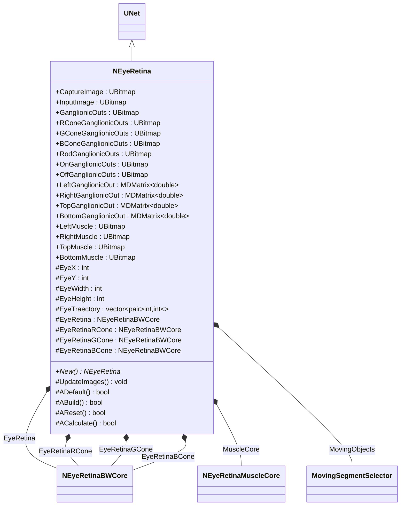
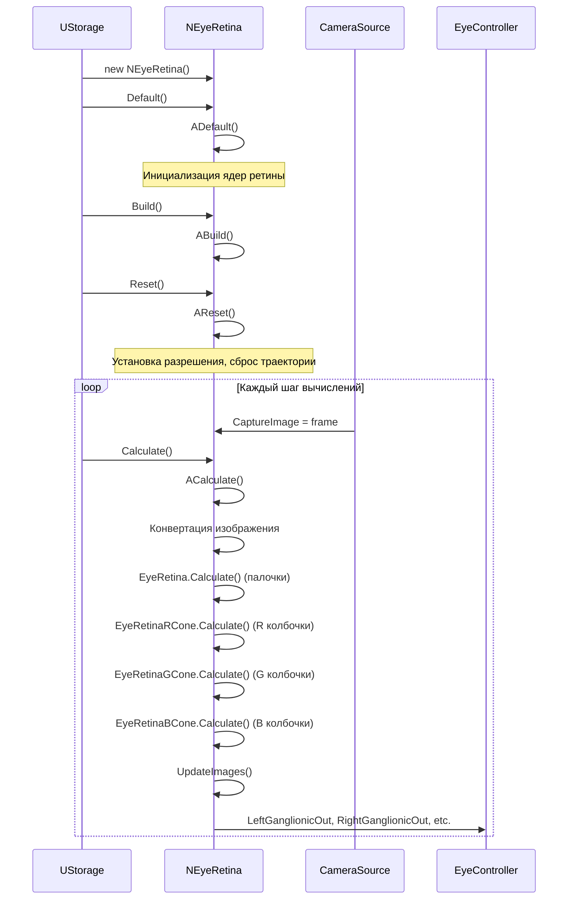
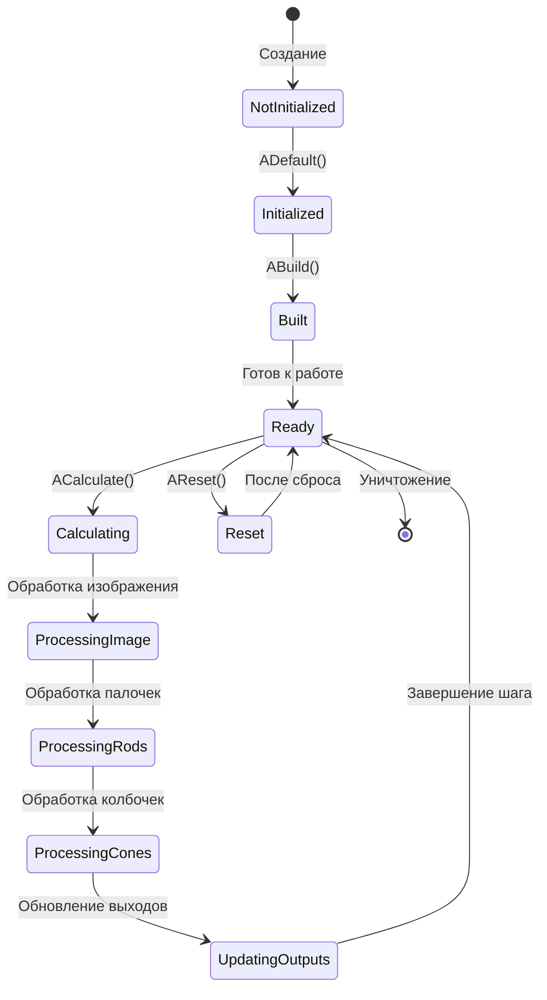
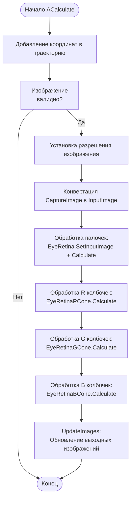
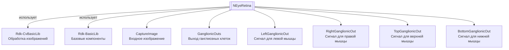

# NEyeRetina — ретина глаза

## RU

**Каталог компонентов:** [Component-Catalog.md](../Component-Catalog.md).

**Класс**: `NEyeRetina` — компонент моделирования биологической ретины глаза для обработки визуальной информации.
**Регистрация**: `NMotionControlLibrary.cpp` → `UploadClass("NEyeRetina", ...)`.
**Базовый класс**: `UNet` (из Rdk Framework).

NEyeRetina реализует модель биологической ретины, обрабатывающую входные изображения через слои фоторецепторов (палочки и колбочки R, G, B), биполярных клеток и ганглиозных клеток. Компонент выдает выходные сигналы для управления движениями глаз и предоставляет обработанные изображения для дальнейшей обработки.

## UML-диаграмма классов



**Иерархия наследования:**
- `UNet` (Rdk Framework) — базовый класс для сетей компонентов
- `NEyeRetina` — модель ретины глаза

**Связи с другими компонентами:**
- **Композиция**: содержит ядра обработки ретины (EyeRetina, EyeRetinaRCone, EyeRetinaGCone, EyeRetinaBCone)
- **Входы**: получает изображения через CaptureImage
- **Выходы**: предоставляет обработанные изображения и сигналы для управления движениями глаз

## UML-диаграмма последовательности



**Описание жизненного цикла:**
1. **Создание** - компонент создается через конструктор
2. **Инициализация (ADefault)** - сброс параметров ядер ретины по умолчанию
3. **Построение (ABuild)** - подготовка к работе
4. **Сброс (AReset)** - установка разрешения, инициализация ядер ретины, очистка траектории
5. **Вычисление (ACalculate)** - основной цикл: обработка изображения через все слои ретины

## UML-диаграмма состояний



## UML-диаграмма активности



## UML-диаграмма компонентов



**Зависимости:**
- **Rdk-CvBasicLib** - компоненты компьютерного зрения и обработки изображений
- **Rdk-BasicLib** - базовые компоненты и утилиты Rdk Framework

**Интерфейсы:**
- **Входы**: `CaptureImage` (входное изображение для обработки)
- **Выходы**: `GanglionicOuts`, `RConeGanglionicOuts`, `GConeGanglionicOuts`, `BConeGanglionicOuts`, `RodGanglionicOuts`, `OnGanglionicOuts`, `OffGanglionicOuts` (обработанные изображения), `LeftGanglionicOut`, `RightGanglionicOut`, `TopGanglionicOut`, `BottomGanglionicOut` (сигналы для управления мышцами глаз)

## Свойства

### Входные изображения

| Свойство | Тип | Флаги | Описание | Источник данных |
|----------|-----|-------|----------|-----------------|
| `CaptureImage` | `UBitmap` | `ptPubParameter` | Входное изображение для обработки | Камера или источник изображений |
| `InputImage` | `UBitmap` | `ptPubParameter` | Внутреннее изображение для обработки | Создается из CaptureImage |

### Выходные изображения

| Свойство | Тип | Флаги | Описание | Назначение |
|----------|-----|-------|----------|------------|
| `GanglionicOuts` | `UBitmap` | `ptPubParameter` | Выход ганглиозных клеток (RGB) | Визуализация и дальнейшая обработка |
| `RConeGanglionicOuts` | `UBitmap` | `ptPubParameter` | Выход R колбочек (RGB) | Обработка красного канала |
| `GConeGanglionicOuts` | `UBitmap` | `ptPubParameter` | Выход G колбочек (RGB) | Обработка зеленого канала |
| `BConeGanglionicOuts` | `UBitmap` | `ptPubParameter` | Выход B колбочек (RGB) | Обработка синего канала |
| `RodGanglionicOuts` | `UBitmap` | `ptPubParameter` | Выход палочек (Y8) | Обработка яркости |
| `OnGanglionicOuts` | `UBitmap` | `ptPubParameter` | Выход ON каналов (RGB) | Обработка положительных сигналов |
| `OffGanglionicOuts` | `UBitmap` | `ptPubParameter` | Выход OFF каналов (RGB) | Обработка отрицательных сигналов |

### Выходные сигналы для управления мышцами

| Свойство | Тип | Флаги | Описание | Назначение |
|----------|-----|-------|----------|------------|
| `LeftGanglionicOut` | `MDMatrix<double>` | `ptOutput \| ptPubState` | Сигнал для левой глазной мышцы | Управление движением глаза влево |
| `RightGanglionicOut` | `MDMatrix<double>` | `ptOutput \| ptPubState` | Сигнал для правой глазной мышцы | Управление движением глаза вправо |
| `TopGanglionicOut` | `MDMatrix<double>` | `ptOutput \| ptPubState` | Сигнал для верхней глазной мышцы | Управление движением глаза вверх |
| `BottomGanglionicOut` | `MDMatrix<double>` | `ptOutput \| ptPubState` | Сигнал для нижней глазной мышцы | Управление движением глаза вниз |

### Выходные изображения для мышц (отладка)

| Свойство | Тип | Флаги | Описание | Назначение |
|----------|-----|-------|----------|------------|
| `LeftMuscle` | `UBitmap` | `ptPubParameter` | Изображение активности левой мышцы | Визуализация для отладки |
| `RightMuscle` | `UBitmap` | `ptPubParameter` | Изображение активности правой мышцы | Визуализация для отладки |
| `TopMuscle` | `UBitmap` | `ptPubParameter` | Изображение активности верхней мышцы | Визуализация для отладки |
| `BottomMuscle` | `UBitmap` | `ptPubParameter` | Изображение активности нижней мышцы | Визуализация для отладки |

### Защищенные свойства

| Свойство | Тип | Описание | Изменяется в |
|----------|-----|----------|--------------|
| `EyeX`, `EyeY` | `int` | Координаты центра глаза | `AReset`, `ACalculate` |
| `EyeWidth`, `EyeHeight` | `int` | Размеры обрабатываемого изображения | `AReset`, `ACalculate` |
| `EyeTraectory` | `vector<pair<int,int>>` | Траектория движения глаза | `ACalculate` |
| `EyeRetina` | `NEyeRetinaBWCore` | Ядро обработки палочек | Внутреннее использование |
| `EyeRetinaRCone` | `NEyeRetinaBWCore` | Ядро обработки R колбочек | Внутреннее использование |
| `EyeRetinaGCone` | `NEyeRetinaBWCore` | Ядро обработки G колбочек | Внутреннее использование |
| `EyeRetinaBCone` | `NEyeRetinaBWCore` | Ядро обработки B колбочек | Внутреннее использование |
| `MovingObjects` | `MovingSegmentSelector` | Селектор движущихся объектов | Внутреннее использование |

## Методы

### Конструкторы и деструкторы

#### `NEyeRetina(void)`
**Назначение:** Конструктор компонента
**Параметры:** Нет
**Возвращаемое значение:** Нет
**Описание:** Инициализирует все свойства компонента

#### `virtual ~NEyeRetina(void)`
**Назначение:** Деструктор компонента
**Параметры:** Нет
**Возвращаемое значение:** Нет
**Описание:** Освобождает ресурсы компонента

### Методы жизненного цикла

#### `virtual bool ADefault(void)`
**Назначение:** Инициализация значений по умолчанию
**Параметры:** Нет
**Возвращаемое значение:** `true` при успехе
**Описание:** Сбрасывает параметры всех ядер ретины по умолчанию, инициализирует выходные сигналы нулями

#### `virtual bool ABuild(void)`
**Назначение:** Построение внутренней структуры компонента
**Параметры:** Нет
**Возвращаемое значение:** `true` при успехе
**Описание:** Для NEyeRetina не требуется дополнительных действий при построении

#### `virtual bool AReset(void)`
**Назначение:** Сброс состояния компонента к начальному
**Параметры:** Нет
**Возвращаемое значение:** `true` при успехе
**Описание:** Устанавливает разрешение изображения (320x240 по умолчанию), инициализирует все ядра ретины с правильным разрешением, очищает траекторию движения глаза

#### `virtual bool ACalculate(void)`
**Назначение:** Выполнение вычислений на текущем шаге
**Параметры:** Нет
**Возвращаемое значение:** `true` при успехе
**Описание:** Основной метод обработки изображения:
1. Добавление текущих координат в траекторию
2. Проверка валидности входного изображения
3. Установка разрешения и конвертация изображения
4. Обработка через ядро палочек (EyeRetina)
5. Обработка через ядра колбочек (EyeRetinaRCone, EyeRetinaGCone, EyeRetinaBCone)
6. Обновление выходных изображений через UpdateImages()

### Защищенные методы

#### `void UpdateImages(void)`
**Назначение:** Обновление выходных изображений на основе результатов обработки
**Параметры:** Нет
**Возвращаемое значение:** Нет
**Описание:** Обновляет все выходные изображения (GanglionicOuts, RConeGanglionicOuts, GConeGanglionicOuts, BConeGanglionicOuts, RodGanglionicOuts, OnGanglionicOuts, OffGanglionicOuts) на основе результатов обработки ядрами ретины

### Публичные методы

#### `virtual NEyeRetina* New(void)`
**Назначение:** Создание нового экземпляра компонента
**Параметры:** Нет
**Возвращаемое значение:** Указатель на новый экземпляр NEyeRetina
**Описание:** Выделяет память и создает новый экземпляр компонента

## Примеры использования

### C++ код

#### Создание и настройка компонента

```cpp
#include "NEyeRetina.h"

// Создание экземпляра
UEPtr<NEyeRetina> retina = new NEyeRetina;
retina->SetName("EyeRetina");

// Инициализация
retina->Default();

// Построение
retina->Build();

// Подключение источника изображений
UEPtr<CameraSource> camera = new CameraSource;
camera->OutputImage.Connect(retina->CaptureImage);

// Использование в цикле вычислений
retina->Reset();
for (int step = 0; step < numSteps; step++) {
    camera->Calculate();
    retina->Calculate();

    // Получение выходных сигналов для управления мышцами
    double leftSignal = retina->LeftGanglionicOut(0, 0);
    double rightSignal = retina->RightGanglionicOut(0, 0);
    double topSignal = retina->TopGanglionicOut(0, 0);
    double bottomSignal = retina->BottomGanglionicOut(0, 0);

    // Использование сигналов для управления движениями глаз
    // ...

    // Получение обработанных изображений
    UBitmap* ganglionicImage = retina->GanglionicOuts.GetItem();
    // Использование для дальнейшей обработки
}
```

### XML конфигурация

#### Базовая конфигурация

```xml
<Object Name="EyeRetina" ClassName="NEyeRetina">
    <!-- Подключение источника изображений -->
    <Object Name="Camera" ClassName="CameraSource">
        <Property Name="OutputImage" Connect="EyeRetina.CaptureImage" />
    </Object>

    <!-- Использование выходных сигналов -->
    <Object Name="EyeController" ClassName="EyeMuscleController">
        <Property Name="LeftInput" Connect="EyeRetina.LeftGanglionicOut" />
        <Property Name="RightInput" Connect="EyeRetina.RightGanglionicOut" />
        <Property Name="TopInput" Connect="EyeRetina.TopGanglionicOut" />
        <Property Name="BottomInput" Connect="EyeRetina.BottomGanglionicOut" />
    </Object>
</Object>
```

### Использование в конфигурациях

Компонент `NEyeRetina` используется в конфигурационных проектах для:

- Систем компьютерного зрения
- Управления движениями глаз (саккады, плавные движения)
- Обработки визуальной информации для робототехнических систем
- Интеграции с системами управления движением

**Примеры конфигураций:** `Bin/Configs/SpikeSamples/EyeRetina/` (EyeRetina, EyeRetinaMuscle), `Bin/Configs/SpikeSamples/MC-Muscles/` (управление мышцей глаза).

**Типичные сценарии использования:**
1. **Управление движениями глаз** - использование выходных сигналов для управления глазными мышцами
2. **Обработка визуальной информации** - использование обработанных изображений для дальнейшего анализа
3. **Интеграция с системами управления** - подключение к NEngineMotionControl для управления на основе визуальной информации

**Типичные комбинации с другими компонентами:**
- `NEyeRetina` + [NEngineMotionControl](NEngineMotionControl.md) — управление движением на основе визуальной информации
- `NEyeRetina` + системы управления мышцами — управление движениями глаз
- `NEyeRetina` + компоненты обработки изображений — дальнейшая обработка визуальной информации

---

## EN

NEyeRetina — eye retina

**Class**: `NEyeRetina` — biological eye retina modeling component for visual information processing.
**Registration**: `NMotionControlLibrary.cpp` → `UploadClass("NEyeRetina", ...)`.
**Base class**: `UNet` (from Rdk Framework).

NEyeRetina implements a biological retina model that processes input images through layers of photoreceptors (rods and R, G, B cones), bipolar cells, and ganglion cells. The component outputs signals for eye movement control and provides processed images for further processing.

## Class Diagram


## Sequence Diagram


## State Diagram


## Activity Diagram


## Component Diagram


## Properties

### Inputs / parameters

| Property | Type | Description |
|----------|------|-------------|
| `CaptureImage` | `UBitmap` | Captured image |
| `InputImage` | `UBitmap` | Input image |

### Outputs (images)

| Property | Type | Description |
|----------|------|-------------|
| `GanglionicOuts` | `UBitmap` | Ganglion cell outputs |
| `RConeGanglionicOuts`, `GConeGanglionicOuts`, `BConeGanglionicOuts` | `UBitmap` | Cone outputs |
| `RodGanglionicOuts`, `OnGanglionicOuts`, `OffGanglionicOuts` | `UBitmap` | Rod / on/off outputs |

### Outputs (control signals)

| Property | Type | Description |
|----------|------|-------------|
| `LeftGanglionicOut`, `RightGanglionicOut` | `MDMatrix<double>` | Left/right eye control |
| `TopGanglionicOut`, `BottomGanglionicOut` | `MDMatrix<double>` | Top/bottom eye control |

### Muscle parameters

| Property | Type | Description |
|----------|------|-------------|
| `LeftMuscle`, `RightMuscle`, `TopMuscle`, `BottomMuscle` | `UBitmap` | Muscle images |

## Methods

### Lifecycle

- **`ADefault()`** — set default parameters
- **`ABuild()`** — build retina cores (photoreceptors, bipolar, ganglion)
- **`AReset()`** — reset state
- **`ACalculate()`** — process input image; update ganglion outputs and control signals

## Usage Examples

### C++ Code

```cpp
#include "NEyeRetina.h"

UEPtr<NEyeRetina> retina = storage->CreateComponent<NEyeRetina>("Retina1");
retina->Default();
retina->Build();
retina->Reset();

retina->Calculate();
double left_out = retina->LeftGanglionicOut(0, 0);
double right_out = retina->RightGanglionicOut(0, 0);
```

### Usage in Configurations

Used in vision and eye-movement control; example configs: `Bin/Configs/SpikeSamples/EyeRetina/` (EyeRetina, EyeRetinaMuscle), `Bin/Configs/SpikeSamples/MC-Muscles/`. Typical combination: with [NEngineMotionControl](NEngineMotionControl.md).

## References
- [Literature-References.md](../Literature-References.md): 13, [A] — нейроморфная модель зрительной системы.
