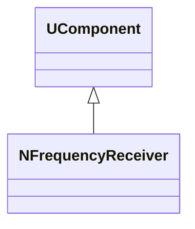
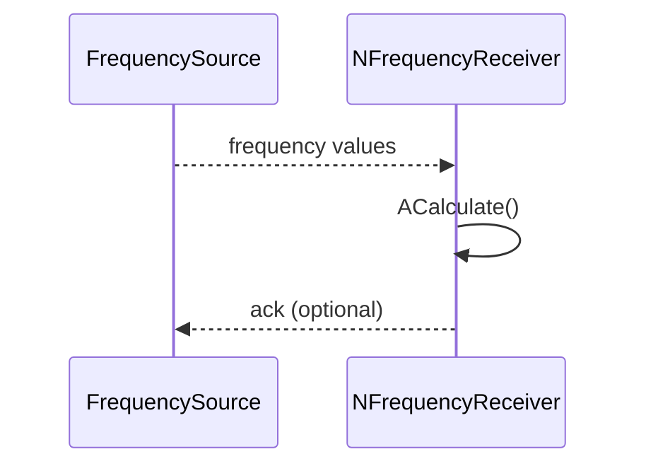
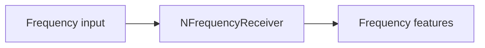
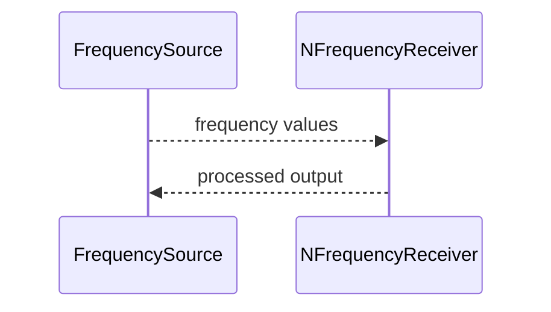

## NFrequencyReceiver — приёмник частотных сигналов (Nmsdk-MotionControlLib)

**Класс**: `NFrequencyReceiver` — принимает частотные/периодические сигналы (например, для связи с нейросетью/датчиками).  
**Регистрация**: `NMotionControlLibrary.cpp` → `UploadClass("NFrequencyReceiver", ...)`.  
**Storage-инстансы**: `ClassName = "NFrequencyReceiver"`.

### Lifecycle
- **ADefault**: настройка параметров приёма (окна, масштабирование).
- **ABuild**: подключение источников частотных данных.
- **AReset**: сброс накопителей.
- **ACalculate**: чтение входов и обновление выходных представлений.

### I/O
- **Входы**: частотные значения/временные ряды (скаляры/векторы).
- **Выходы**: нормализованные/агрегированные частотные признаки.

### classDiagram



Диаграмма показывает роль компонента-приёмника в общей архитектуре.

### sequenceDiagram



Сценарий отражает периодическое чтение входных частот и формирование признаков на шаге.

### flowchart



Пояснение: блок-схема показывает поток данных/сигналов (входы → компонент → выходы).

### Config snippet

```ini
[Component]
ClassName = NFrequencyReceiver
Name = FreqRcv1
```

---

## NFrequencyReceiver — frequency receiver (EN)

Receives frequency-like inputs and outputs aggregated/normalised features.


Description: this class diagram shows the component position in the type hierarchy and key relations.



Description: this sequence diagram shows a typical runtime interaction and call order.


Description: this flowchart shows the data/signal flow (inputs → component → outputs).
