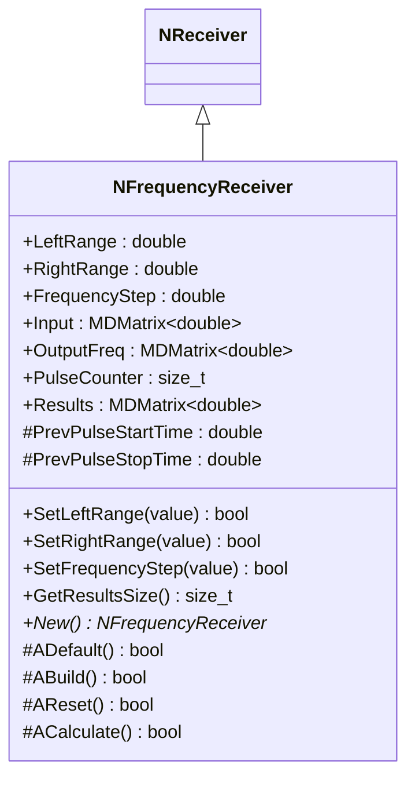
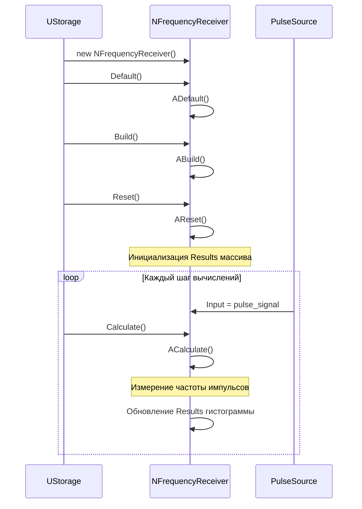
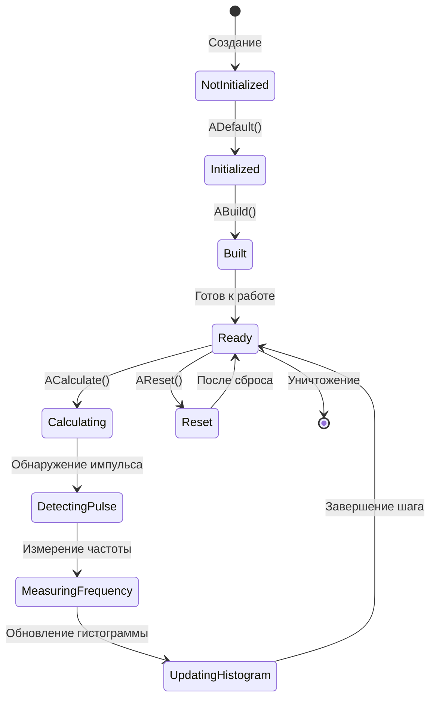
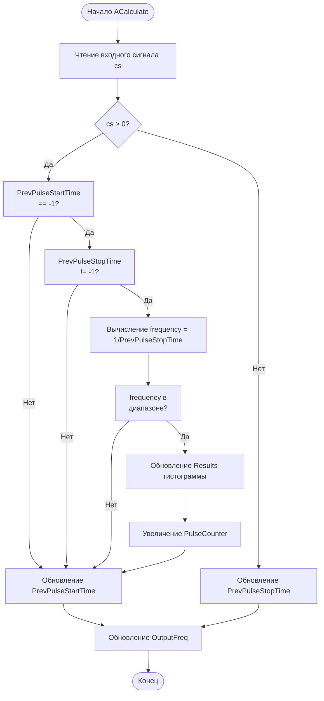
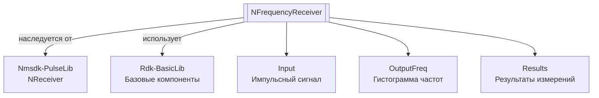

# NFrequencyReceiver — приемник частот

**Класс**: `NFrequencyReceiver` — приемник для измерения частоты импульсных сигналов в заданном диапазоне.
**Регистрация**: `NMotionControlLibrary.cpp` → `UploadClass("NFrequencyReceiver", ...)`.
**Базовый класс**: `NReceiver` (из Nmsdk-PulseLib).

NFrequencyReceiver измеряет частоту входных импульсных сигналов, подсчитывая количество импульсов в заданном диапазоне частот и предоставляя гистограмму распределения частот.

## UML-диаграмма классов



**Иерархия наследования:**
- `NReceiver` (Nmsdk-PulseLib) — базовый класс для приемников
- `NFrequencyReceiver` — приемник частот

## UML-диаграмма последовательности



## UML-диаграмма состояний



## UML-диаграмма активности



## UML-диаграмма компонентов



## Свойства

### Параметры

| Свойство | Тип | Флаги | Описание | Значение по умолчанию |
|----------|-----|-------|----------|----------------------|
| `LeftRange` | `double` | `ptPubParameter` | Левая граница диапазона частот (Гц) | `0.0` |
| `RightRange` | `double` | `ptPubParameter` | Правая граница диапазона частот (Гц) | `500.0` |
| `FrequencyStep` | `double` | `ptPubParameter` | Шаг по частоте для гистограммы (Гц) | `1.0` |

### Входы

| Свойство | Тип | Флаги | Описание | Источник данных |
|----------|-----|-------|----------|-----------------|
| `Input` | `MDMatrix<double>` | `ptPubParameter` | Входной импульсный сигнал | Источник импульсов |

### Выходы

| Свойство | Тип | Флаги | Описание | Назначение |
|----------|-----|-------|----------|------------|
| `OutputFreq` | `MDMatrix<double>` | `ptPubOutput \| ptState` | Гистограмма частот (2xN: частоты и счетчики) | Передача другим компонентам |
| `Results` | `MDMatrix<double>` | `ptPubParameter` | Результаты измерений (2xN: частоты и счетчики) | Внутреннее использование и визуализация |
| `PulseCounter` | `size_t` | `ptPubParameter` | Счетчик импульсов | Отслеживание количества измеренных импульсов |

### Защищенные переменные

| Свойство | Тип | Описание |
|----------|-----|----------|
| `PrevPulseStartTime` | `double` | Время начала предыдущего импульса |
| `PrevPulseStopTime` | `double` | Время окончания предыдущего импульса |

## Методы

### Конструкторы и деструкторы

#### `NFrequencyReceiver(void)`
**Назначение:** Конструктор компонента
**Параметры:** Нет
**Возвращаемое значение:** Нет
**Описание:** Инициализирует PrevPulseStartTime=0, PrevPulseStopTime=0

#### `virtual ~NFrequencyReceiver(void)`
**Назначение:** Деструктор компонента
**Параметры:** Нет
**Возвращаемое значение:** Нет

### Методы жизненного цикла

#### `virtual bool ADefault(void)`
**Назначение:** Инициализация значений по умолчанию
**Параметры:** Нет
**Возвращаемое значение:** `true` при успехе
**Описание:** Устанавливает LeftRange=0, RightRange=500, FrequencyStep=1, инициализирует матрицы

#### `virtual bool ABuild(void)`
**Назначение:** Построение внутренней структуры компонента
**Параметры:** Нет
**Возвращаемое значение:** `true` при успехе

#### `virtual bool AReset(void)`
**Назначение:** Сброс состояния компонента
**Параметры:** Нет
**Возвращаемое значение:** `true` при успехе
**Описание:** Инициализирует Results массив с частотами от LeftRange до RightRange с шагом FrequencyStep, сбрасывает счетчики

#### `virtual bool ACalculate(void)`
**Назначение:** Выполнение вычислений на текущем шаге
**Параметры:** Нет
**Возвращаемое значение:** `true` при успехе
**Описание:** Измеряет частоту импульсов:
1. Читает входной сигнал
2. Обнаруживает начало и конец импульсов
3. Вычисляет частоту как 1/длительность_импульса
4. Обновляет гистограмму Results, если частота в диапазоне
5. Обновляет OutputFreq

### Сеттеры свойств

#### `bool SetLeftRange(const double &range)`
**Назначение:** Установка левой границы диапазона
**Параметры:**
- `range` - левая граница (должна быть >= 0)
**Возвращаемое значение:** `true` при успехе, `false` при ошибке
**Описание:** Устанавливает Ready=false для перестроения

#### `bool SetRightRange(const double &range)`
**Назначение:** Установка правой границы диапазона
**Параметры:**
- `range` - правая граница (должна быть >= 0)
**Возвращаемое значение:** `true` при успехе, `false` при ошибке
**Описание:** Устанавливает Ready=false для перестроения

#### `bool SetFrequencyStep(const double &step)`
**Назначение:** Установка шага по частоте
**Параметры:**
- `step` - шаг (должен быть >= 0)
**Возвращаемое значение:** `true` при успехе, `false` при ошибке
**Описание:** Устанавливает Ready=false для перестроения

### Публичные методы

#### `size_t GetResultsSize(void) const`
**Назначение:** Получение размера результатов
**Параметры:** Нет
**Возвращаемое значение:** Количество точек в Results

#### `virtual NFrequencyReceiver* New(void)`
**Назначение:** Создание нового экземпляра компонента
**Параметры:** Нет
**Возвращаемое значение:** Указатель на новый экземпляр

## Примеры использования

### C++ код

```cpp
#include "NFrequencyReceiver.h"

UEPtr<NFrequencyReceiver> receiver = new NFrequencyReceiver;
receiver->Default();
receiver->LeftRange = 10.0;
receiver->RightRange = 1000.0;
receiver->FrequencyStep = 5.0;
receiver->Build();
receiver->Reset();

// Подключение источника импульсов
UEPtr<PulseSource> source = new PulseSource;
source->Output.Connect(receiver->Input);

// Использование в цикле
for (int step = 0; step < numSteps; step++) {
    source->Calculate();
    receiver->Calculate();

    // Получение гистограммы частот
    MDMatrix<double> histogram = receiver->OutputFreq;
    size_t numPoints = receiver->GetResultsSize();
}
```

### XML конфигурация

```xml
<Object Name="FrequencyReceiver" ClassName="NFrequencyReceiver">
    <Property Name="LeftRange" Value="10.0" />
    <Property Name="RightRange" Value="1000.0" />
    <Property Name="FrequencyStep" Value="5.0" />
    <Property Name="Input" Connect="PulseSource.Output" />
</Object>
```

### Использование в конфигурациях

Компонент `NFrequencyReceiver` используется для измерения частоты импульсных сигналов в системах управления движением.

**Типичные сценарии использования:**
1. **Измерение частоты нейронов** - определение частоты импульсов от нейронов
2. **Анализ активности** - анализ частотных характеристик нейросетевых компонентов
3. **Мониторинг** - мониторинг частотных характеристик системы

**Типичные комбинации:**
- `NFrequencyReceiver` + нейроны - измерение частоты импульсов нейронов
- `NFrequencyReceiver` + генераторы - анализ частотных характеристик генераторов

---

# NFrequencyReceiver — frequency receiver

**Class**: `NFrequencyReceiver` — receiver for measuring frequency of pulse signals in a specified range.
**Registration**: `NMotionControlLibrary.cpp` → `UploadClass("NFrequencyReceiver", ...)`.
**Base class**: `NReceiver` (from Nmsdk-PulseLib).

NFrequencyReceiver measures the frequency of input pulse signals by counting pulses in a specified frequency range and providing a frequency distribution histogram.

## Class Diagram

[Same as RU section]

## Sequence Diagram

[Same as RU section]

## State Diagram

[Same as RU section]

## Activity Diagram

[Same as RU section]

## Component Diagram

[Same as RU section]

## Properties

[Same structure as RU section, translated to English]

## Methods

[Same structure as RU section, translated to English]

## Источники

- [Literature-References.md](../Literature-References.md): [A], 25, 28 — приём частотных сигналов в контурах управления.

## Usage Examples

[Same as RU section, with English comments]
