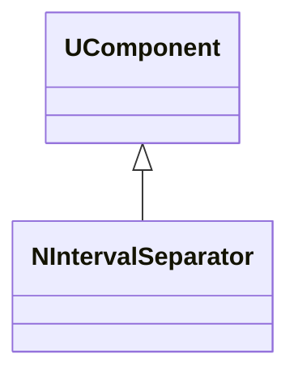
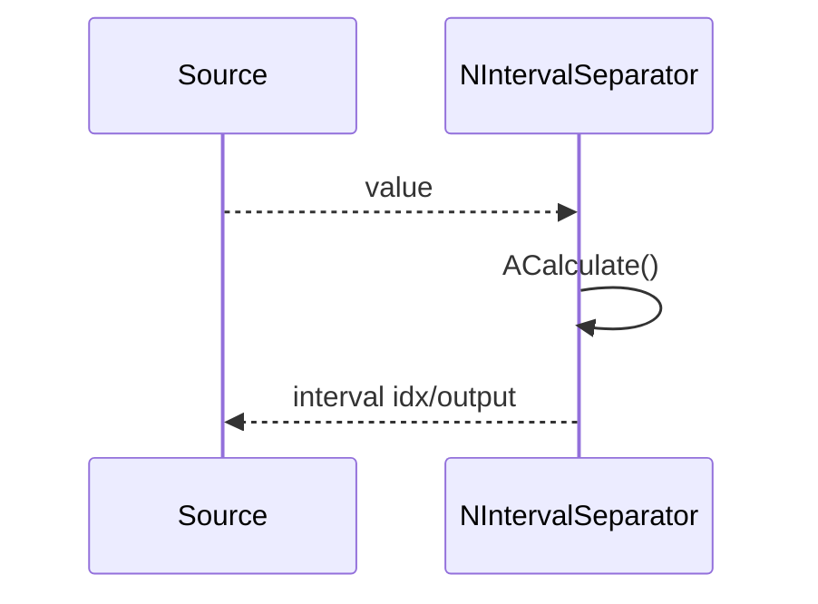
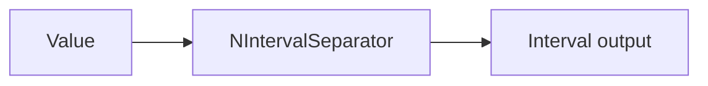
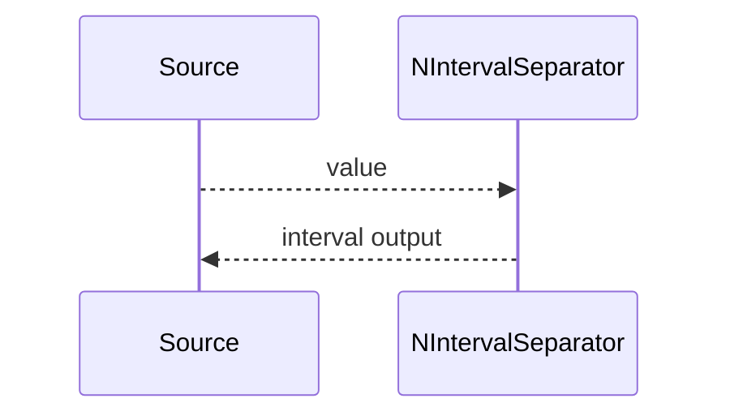

## NIntervalSeparator — разделитель по интервалам (Nmsdk-MotionControlLib)

**Класс**: `NIntervalSeparator` — классифицирует/разделяет входной сигнал по диапазонам (интервалам).  
**Регистрация**: `NMotionControlLibrary.cpp` → `UploadClass("NIntervalSeparator", ...)`.

### Регистрация в UStorage
- `ClassName = "NIntervalSeparator"` в `Bin/ClDesc` / `Bin/Configs`.

### Lifecycle
- **ADefault**: установка границ интервалов и режима.
- **ABuild**: подготовка выходных каналов.
- **AReset**: очистка статистики (если ведётся).
- **ACalculate**: вычисление принадлежности интервалу и выдача на соответствующий выход.

### I/O
- **Вход**: скаляр/вектор.
- **Выход**: индекс интервала/маска/сигнал на выбранном выходе.

### classDiagram



Диаграмма показывает `NIntervalSeparator` как компонент-раскладчик входа на интервалы.

### sequenceDiagram



Пояснение: диаграмма последовательности показывает типовой сценарий взаимодействия и порядок вызовов.

### flowchart



Пояснение: блок-схема показывает поток данных/сигналов (входы → компонент → выходы).

### Config snippet

```ini
[Component]
ClassName = NIntervalSeparator
Name = IntervalSep1
```

---

## NIntervalSeparator — interval separator (EN)

Splits/classifies input signal into configured intervals and produces interval output.


Description: this class diagram shows the component position in the type hierarchy and key relations.



Description: this sequence diagram shows a typical runtime interaction and call order.


Description: this flowchart shows the data/signal flow (inputs → component → outputs).
