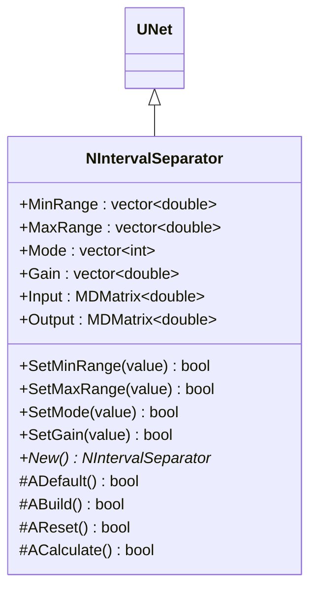
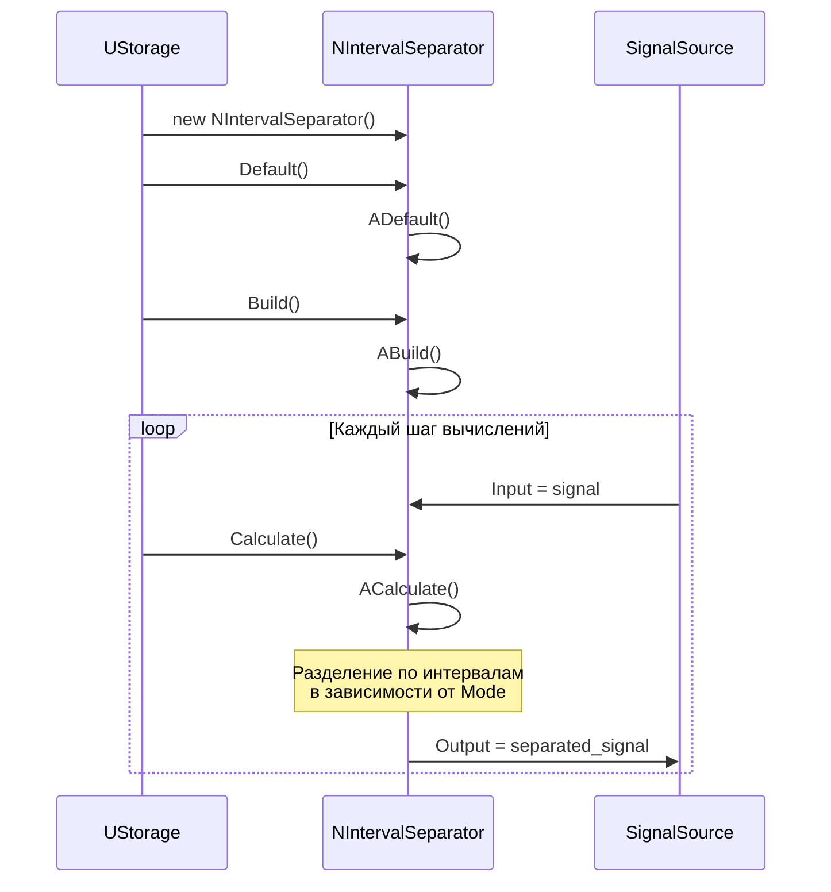
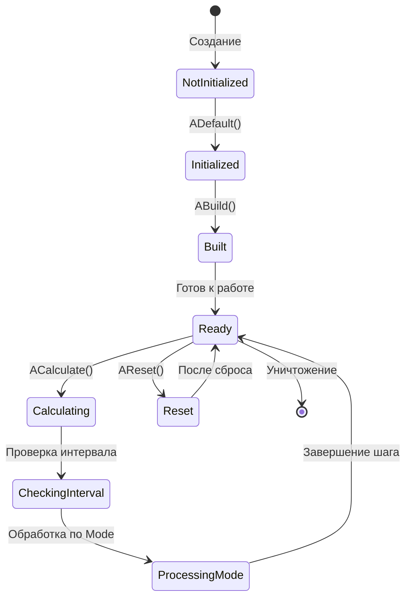
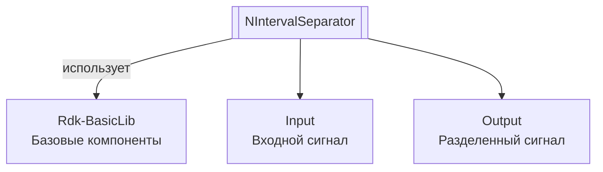
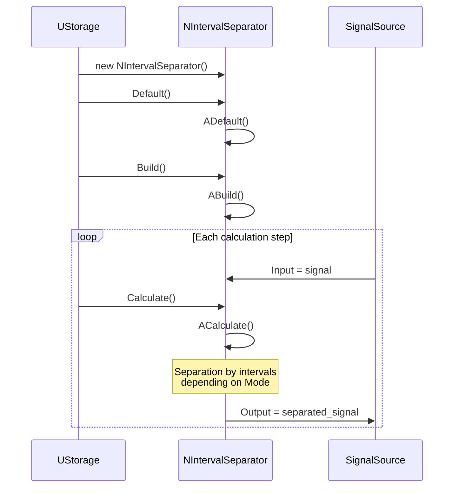
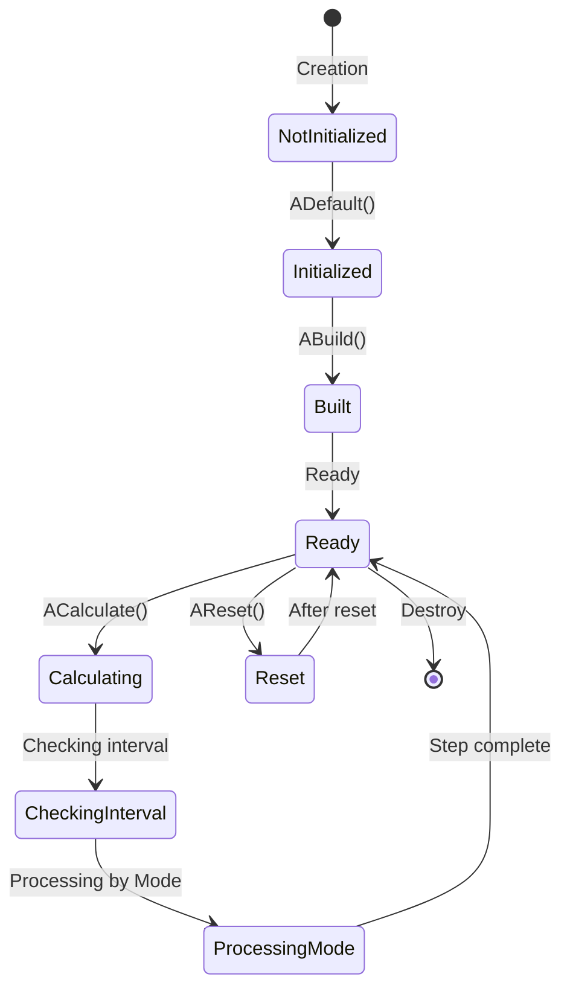
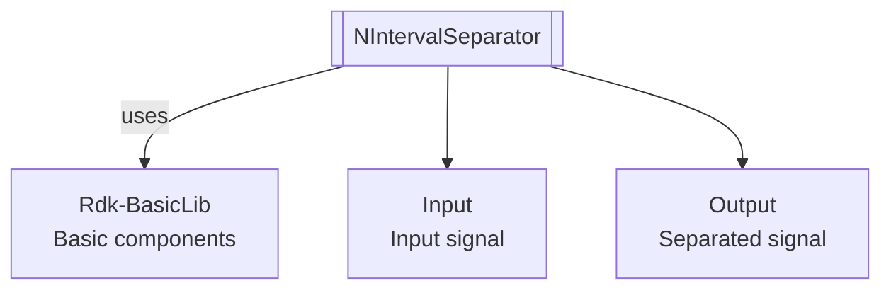

# NIntervalSeparator — разделитель по интервалам

## RU

**Класс**: `NIntervalSeparator` — компонент для разделения входного сигнала по заданным интервалам значений с различными режимами обработки.
**Регистрация**: `NMotionControlLibrary.cpp` → `UploadClass("NIntervalSeparator", ...)`.
**Базовый класс**: `UNet` (из Rdk Framework).

NIntervalSeparator разделяет входной сигнал на части в зависимости от принадлежности значения заданным интервалам [MinRange, MaxRange]. Компонент поддерживает различные режимы обработки (Mode) для разных типов разделения.

## UML-диаграмма классов



**Иерархия наследования:**
- `UNet` (Rdk Framework) — базовый класс для сетей компонентов
- `NIntervalSeparator` — разделитель по интервалам

## UML-диаграмма последовательности



## UML-диаграмма состояний



## UML-диаграмма активности

```mermaid
flowchart TD
    Start([Начало ACalculate]) --> ReadInput[Чтение входного сигнала]
    ReadInput --> ResizeOutput[Изменение размера Output]
    ResizeOutput --> LoopInputs[Цикл по элементам входа]
    LoopInputs --> CheckMode{Mode[j]?}
    CheckMode -->|0| Mode0["input в<br/>[MinRange, MaxRange]?"]
    CheckMode -->|1| Mode1["input в<br/>[MinRange, MaxRange]?"]
    CheckMode -->|2| Mode2["input ><br/>MinRange?"]
    CheckMode -->|3| Mode3["input <<br/>MaxRange?"]
    CheckMode -->|4| Mode4["input ><br/>MinRange?"]
    CheckMode -->|5| Mode5["Режим 5:<br/>Сложная логика"]
    CheckMode -->|6| Mode6["Режим 6:<br/>Сложная логика"]
    Mode0 -->|Да| OutputInput[Output = input]
    Mode0 -->|Нет| OutputZero[Output = 0]
    Mode1 -->|Да| OutputShift[Output = input - MinRange]
    Mode1 -->|Нет| OutputZero
    Mode2 -->|Да| OutputInput
    Mode2 -->|Нет| OutputZero
    Mode3 -->|Да| OutputInput
    Mode3 -->|Нет| OutputZero
    Mode4 -->|Да| OutputShift
    Mode4 -->|Нет| OutputZero
    Mode5 --> ApplyGain
    Mode6 --> ApplyGain
    OutputInput --> ApplyGain[Применение Gain]
    OutputShift --> ApplyGain
    OutputZero --> ApplyGain
    ApplyGain --> NextInput{Еще элементы?}
    NextInput -->|Да| LoopInputs
    NextInput -->|Нет| End([Конец])
```

## UML-диаграмма компонентов



## Свойства

### Параметры

| Свойство | Тип | Флаги | Описание | Значение по умолчанию |
|----------|-----|-------|----------|----------------------|
| `MinRange` | `std::vector<double>` | `ptPubParameter` | Нижние границы интервалов | `[0.0]` |
| `MaxRange` | `std::vector<double>` | `ptPubParameter` | Верхние границы интервалов | `[1.0]` |
| `Mode` | `std::vector<int>` | `ptPubParameter` | Режимы разделения: 0=пропуск вне интервала, 1=смещение, 2=больше MinRange, 3=меньше MaxRange, 4=смещение если больше MinRange, 5=сложная логика, 6=сложная логика | `[2]` |
| `Gain` | `std::vector<double>` | `ptPubParameter` | Коэффициенты усиления | `[1.0]` |

### Входы

| Свойство | Тип | Флаги | Описание | Источник данных |
|----------|-----|-------|----------|-----------------|
| `Input` | `MDMatrix<double>` | `ptInput \| ptPubState` | Входной сигнал для разделения | Другие компоненты системы |

### Выходы

| Свойство | Тип | Флаги | Описание | Назначение |
|----------|-----|-------|----------|------------|
| `Output` | `MDMatrix<double>` | `ptOutput \| ptPubState` | Разделенный сигнал | Передача другим компонентам |

## Методы

### Конструкторы и деструкторы

#### `NIntervalSeparator(void)`
**Назначение:** Конструктор компонента
**Параметры:** Нет
**Возвращаемое значение:** Нет

#### `virtual ~NIntervalSeparator(void)`
**Назначение:** Деструктор компонента
**Параметры:** Нет
**Возвращаемое значение:** Нет

### Методы жизненного цикла

#### `virtual bool ADefault(void)`
**Назначение:** Инициализация значений по умолчанию
**Параметры:** Нет
**Возвращаемое значение:** `true` при успехе
**Описание:** Устанавливает MinRange=[0.0], MaxRange=[1.0], Mode=[2], Gain=[1.0]

#### `virtual bool ABuild(void)`
**Назначение:** Построение внутренней структуры компонента
**Параметры:** Нет
**Возвращаемое значение:** `true` при успехе

#### `virtual bool AReset(void)`
**Назначение:** Сброс состояния компонента
**Параметры:** Нет
**Возвращаемое значение:** `true` при успехе
**Описание:** Обнуляет Output

#### `virtual bool ACalculate(void)`
**Назначение:** Выполнение вычислений на текущем шаге
**Параметры:** Нет
**Возвращаемое значение:** `true` при успехе
**Описание:** Разделяет входной сигнал по интервалам в зависимости от Mode:
- Mode=0: если input в [MinRange, MaxRange], то Output=input, иначе 0
- Mode=1: если input в [MinRange, MaxRange], то Output=input-MinRange, иначе 0
- Mode=2: если input > MinRange, то Output=input, иначе 0
- Mode=3: если input < MaxRange, то Output=input, иначе 0
- Mode=4: если input > MinRange, то Output=input-MinRange, иначе 0
- Mode=5,6: сложная логика с учетом знака и границ

### Сеттеры свойств

#### `bool SetMinRange(const double &value)`
**Назначение:** Установка нижней границы интервала
**Параметры:**
- `value` - нижняя граница
**Возвращаемое значение:** `true` при успехе

#### `bool SetMaxRange(const double &value)`
**Назначение:** Установка верхней границы интервала
**Параметры:**
- `value` - верхняя граница
**Возвращаемое значение:** `true` при успехе

#### `bool SetMode(const int &value)`
**Назначение:** Установка режима разделения
**Параметры:**
- `value` - режим (0-6)
**Возвращаемое значение:** `true` при успехе, `false` при ошибке

#### `bool SetGain(const double &value)`
**Назначение:** Установка коэффициента усиления
**Параметры:**
- `value` - значение усиления
**Возвращаемое значение:** `true` при успехе

### Публичные методы

#### `virtual NIntervalSeparator* New(void)`
**Назначение:** Создание нового экземпляра компонента
**Параметры:** Нет
**Возвращаемое значение:** Указатель на новый экземпляр

## Примеры использования

### C++ код

```cpp
#include "NIntervalSeparator.h"

UEPtr<NIntervalSeparator> separator = new NIntervalSeparator;
separator->Default();
std::vector<double> minRange(1, 0.0);
std::vector<double> maxRange(1, 10.0);
separator->MinRange = minRange;
separator->MaxRange = maxRange;
std::vector<int> mode(1, 1);  // Режим смещения
separator->Mode = mode;
separator->Build();
```

### XML конфигурация

```xml
<Object Name="IntervalSeparator" ClassName="NIntervalSeparator">
    <Property Name="MinRange" Value="0.0" />
    <Property Name="MaxRange" Value="10.0" />
    <Property Name="Mode" Value="1" />
    <Property Name="Gain" Value="1.0" />
    <Property Name="Input" Connect="Source.Output" />
</Object>
```

### Использование в конфигурациях

Компонент `NIntervalSeparator` используется для разделения сигналов по интервалам значений в системах управления движением.

**Типичные сценарии использования:**
1. **Разделение сигналов** - выделение сигналов в заданных диапазонах
2. **Обработка афферентных сигналов** - разделение афферентных сигналов по интервалам

**Типичные комбинации:**
- `NIntervalSeparator` + `NEngineMotionControl` - разделение афферентных сигналов
- `NIntervalSeparator` + датчики - обработка сигналов датчиков

---

## EN

NIntervalSeparator — interval separator

**Class**: `NIntervalSeparator` — component for separating input signal by specified value intervals with different processing modes.
**Registration**: `NMotionControlLibrary.cpp` → `UploadClass("NIntervalSeparator", ...)`.
**Base class**: `UNet` (from Rdk Framework).

NIntervalSeparator separates input signal into parts depending on value membership in specified intervals [MinRange, MaxRange]. The component supports various processing modes (Mode) for different types of separation.

## Class Diagram


## Sequence Diagram



## State Diagram



## Activity Diagram

```mermaid
flowchart TD
    Start([Start ACalculate]) --> ReadInput[Reading input signal]
    ReadInput --> ResizeOutput[Resizing Output]
    ResizeOutput --> LoopInputs[Loop over input elements]
    LoopInputs --> CheckMode{Mode[j]?}
    CheckMode -->|0| Mode0["input in<br/>[MinRange, MaxRange]?"]
    CheckMode -->|1| Mode1["input in<br/>[MinRange, MaxRange]?"]
    CheckMode -->|2| Mode2["input ><br/>MinRange?"]
    CheckMode -->|3| Mode3["input <<br/>MaxRange?"]
    CheckMode -->|4| Mode4["input ><br/>MinRange?"]
    CheckMode -->|5| Mode5["Mode 5:<br/>Complex logic"]
    CheckMode -->|6| Mode6["Mode 6:<br/>Complex logic"]
    Mode0 -->|Yes| OutputInput[Output = input]
    Mode0 -->|No| OutputZero[Output = 0]
    Mode1 -->|Yes| OutputShift[Output = input - MinRange]
    Mode1 -->|No| OutputZero
    Mode2 -->|Yes| OutputInput
    Mode2 -->|No| OutputZero
    Mode3 -->|Yes| OutputInput
    Mode3 -->|No| OutputZero
    Mode4 -->|Yes| OutputShift
    Mode4 -->|No| OutputZero
    Mode5 --> ApplyGain
    Mode6 --> ApplyGain
    OutputInput --> ApplyGain[Applying Gain]
    OutputShift --> ApplyGain
    OutputZero --> ApplyGain
    ApplyGain --> NextInput{More elements?}
    NextInput -->|Yes| LoopInputs
    NextInput -->|No| End([End])
```

## Component Diagram



## Properties

[Same structure as RU section, translated to English]

## Methods

[Same structure as RU section, translated to English]

## References

- [Literature-References.md](../Literature-References.md): [A], 19, 22 — interval separation in motion control loops.

## Usage Examples

[Same as RU section, with English comments]
