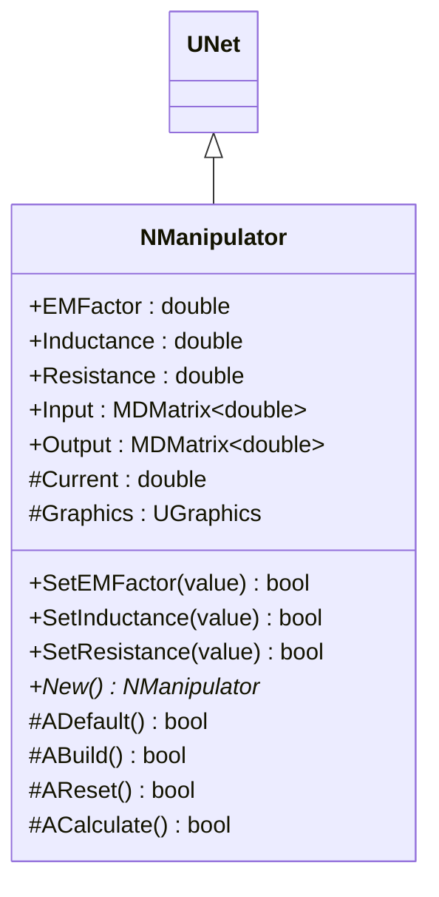
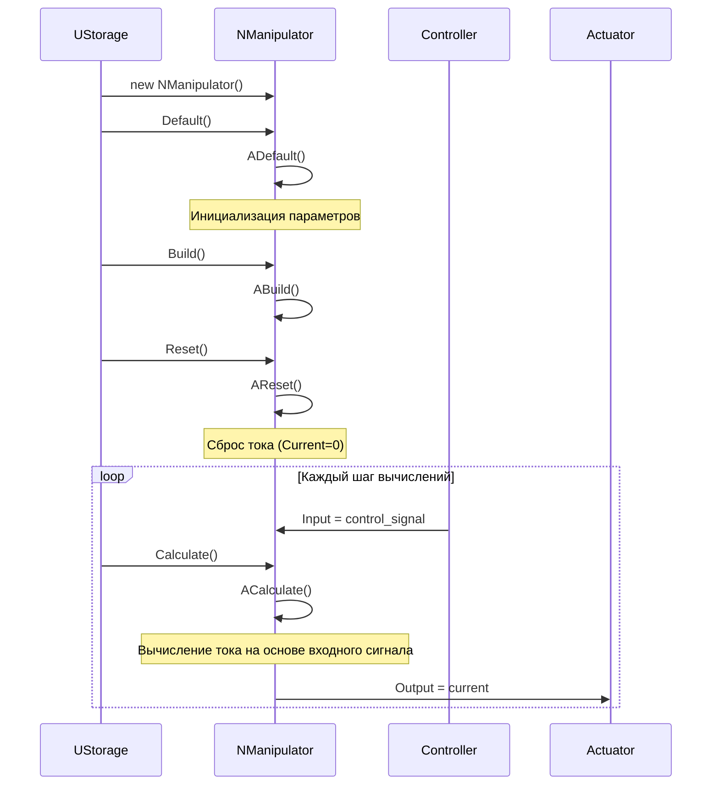
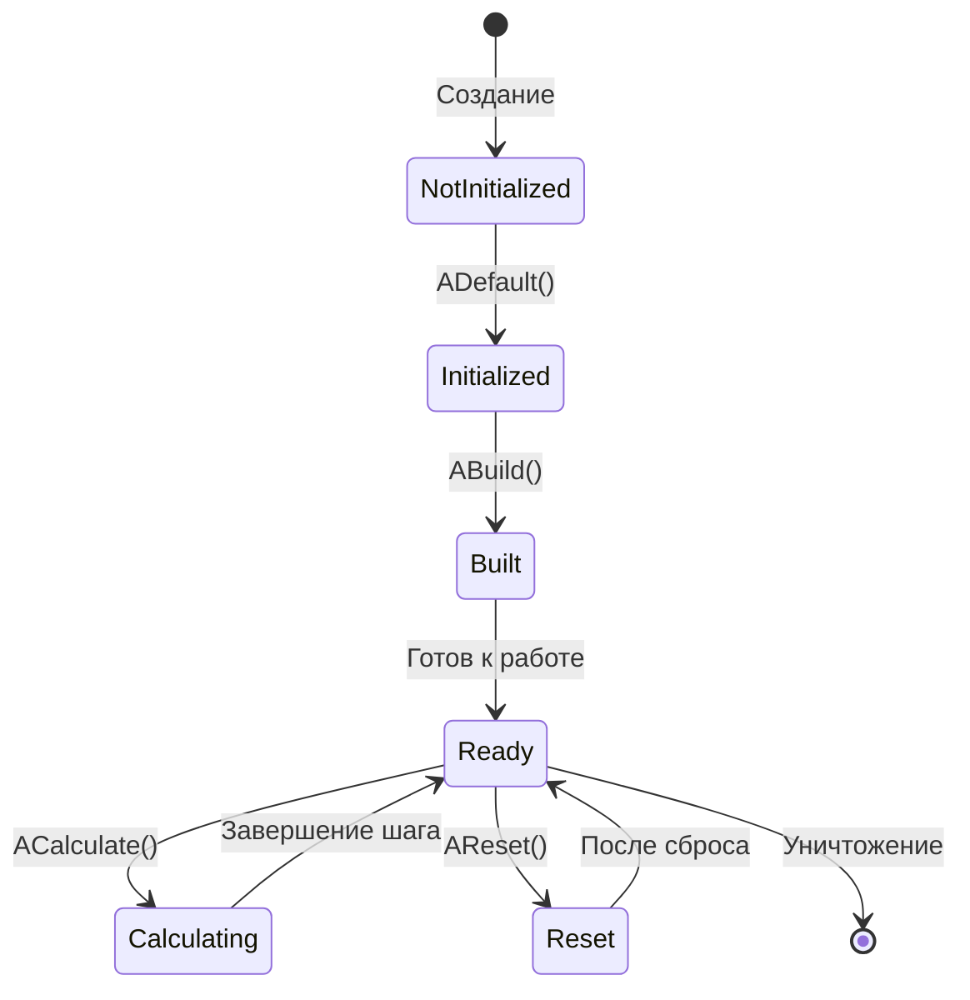
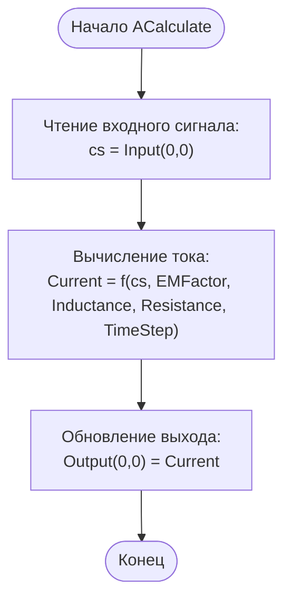
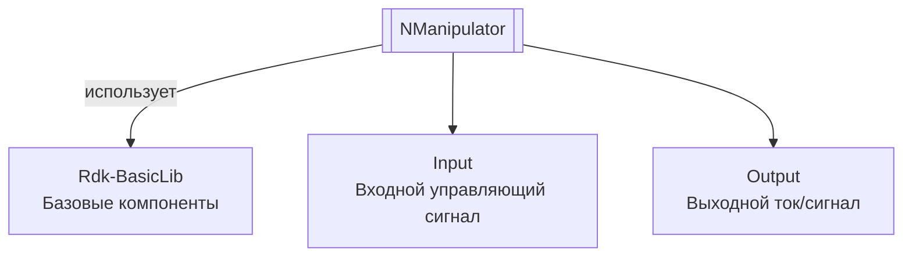
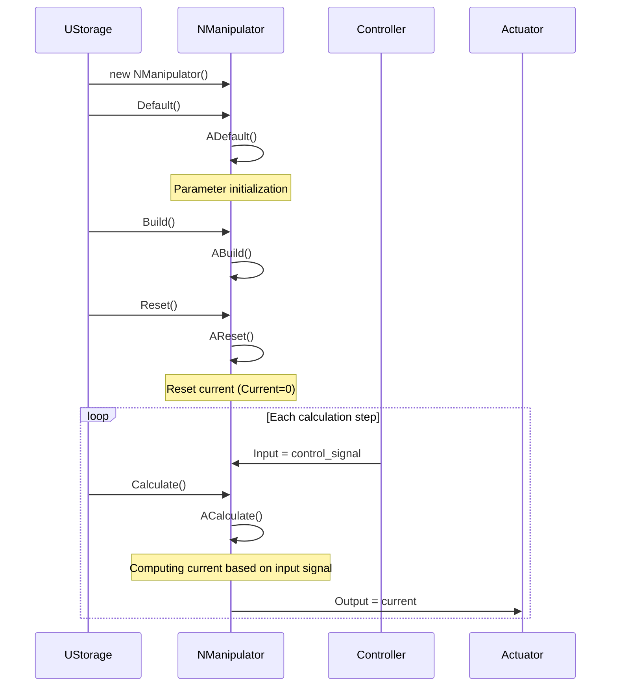
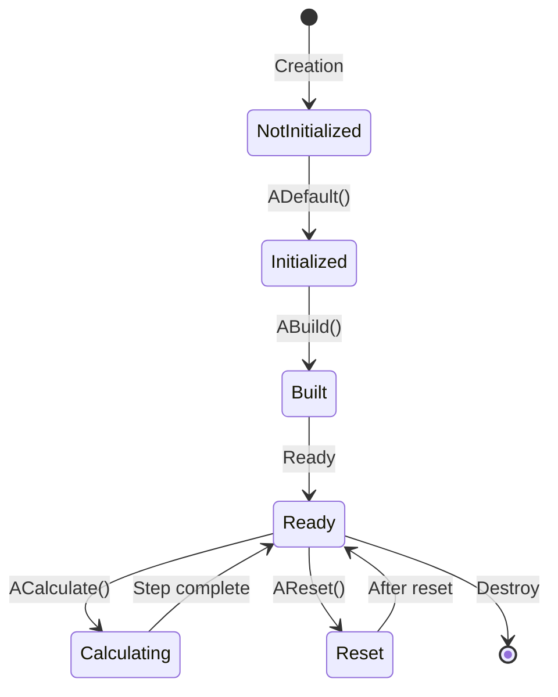
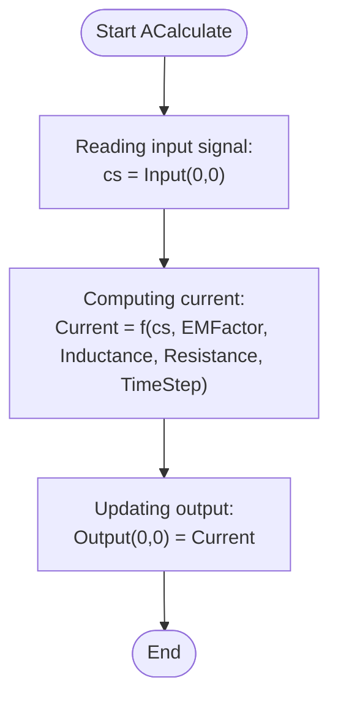
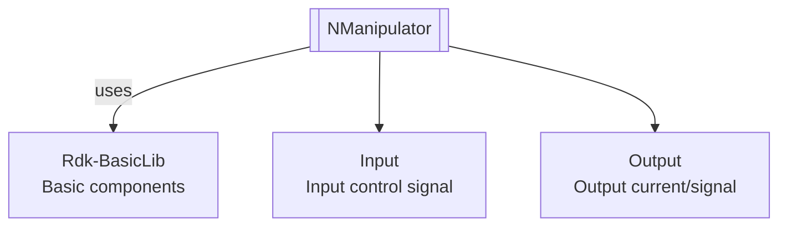

# NManipulator — манипулятор

## RU

**Каталог компонентов:** [Component-Catalog.md](../Component-Catalog.md).

**Класс**: `NManipulator` — компонент моделирования манипулятора с электрическими характеристиками.
**Регистрация**: `NMotionControlLibrary.cpp` → `UploadClass("NManipulator", ...)`.
**Базовый класс**: `UNet` (из Rdk Framework).

NManipulator реализует упрощенную модель манипулятора, учитывающую электрические параметры (индуктивность, сопротивление, коэффициент ЭДС). Компонент вычисляет ток на основе входного управляющего сигнала и выдает его как выходной сигнал для управления приводами.

## UML-диаграмма классов



**Иерархия наследования:**
- `UNet` (Rdk Framework) — базовый класс для сетей компонентов
- `NManipulator` — модель манипулятора

**Связи с другими компонентами:**
- **Входы**: получает управляющий сигнал от [NEngineMotionControl](NEngineMotionControl.md) или контроллеров
- **Выходы**: предоставляет ток/сигнал управления для подключения к приводам и [NDCEngine](NDCEngine.md)

## UML-диаграмма последовательности



**Описание жизненного цикла:**
1. **Создание** - компонент создается через конструктор
2. **Инициализация (ADefault)** - установка значений по умолчанию для параметров
3. **Построение (ABuild)** - подготовка к работе
4. **Сброс (AReset)** - сброс внутренних переменных (ток)
5. **Вычисление (ACalculate)** - основной цикл: вычисление тока на основе входного сигнала

## UML-диаграмма состояний



**Состояния компонента:**
- **NotInitialized** - компонент создан, но не инициализирован
- **Initialized** - компонент инициализирован (после ADefault)
- **Built** - готов к работе (после ABuild)
- **Ready** - готов к вычислениям
- **Calculating** - выполняется вычисление (ACalculate)
- **Reset** - состояние после сброса (AReset)

## UML-диаграмма активности



**Алгоритм работы ACalculate:**
1. Чтение входного управляющего сигнала
2. Вычисление тока по формуле с учетом индуктивности и сопротивления
3. Обновление выходного свойства значением тока

## UML-диаграмма компонентов



**Зависимости:**
- **Rdk-BasicLib** - базовые компоненты и утилиты Rdk Framework

**Интерфейсы:**
- **Входы**: `Input` (управляющий сигнал)
- **Выходы**: `Output` (ток/сигнал управления)

## Свойства

### Параметры манипулятора

| Свойство | Тип | Флаги | Описание | Значение по умолчанию | Диапазон |
|----------|-----|-------|----------|----------------------|----------|
| `EMFactor` | `double` | `ptPubParameter` | Коэффициент ЭДС | `1.0` | > 0 |
| `Inductance` | `double` | `ptPubParameter` | Индуктивность (Гн) | `1.0` | > 0 |
| `Resistance` | `double` | `ptPubParameter` | Сопротивление (Ом) | `1.0` | > 0 |

### Входы

| Свойство | Тип | Флаги | Описание | Источник данных |
|----------|-----|-------|----------|-----------------|
| `Input` | `MDMatrix<double>` | `ptInput \| ptPubState` | Входной управляющий сигнал | Контроллер или другой источник управления |

### Выходы

| Свойство | Тип | Флаги | Описание | Назначение |
|----------|-----|-------|----------|------------|
| `Output` | `MDMatrix<double>` | `ptOutput \| ptPubState` | Выходной ток/сигнал управления | Передача приводам или другим компонентам |

### Защищенные свойства

| Свойство | Тип | Флаги | Описание | Изменяется в |
|----------|-----|-------|----------|--------------|
| `Current` | `double` | (внутреннее) | Ток в системе (А) | `ACalculate` |
| `Graphics` | `UGraphics` | (внутреннее) | Графический объект для визуализации | Не используется в вычислениях |

## Методы

### Конструкторы и деструкторы

#### `NManipulator(void)`
**Назначение:** Конструктор компонента
**Параметры:** Нет
**Возвращаемое значение:** Нет
**Описание:** Инициализирует все свойства компонента, устанавливает Current=0

#### `virtual ~NManipulator(void)`
**Назначение:** Деструктор компонента
**Параметры:** Нет
**Возвращаемое значение:** Нет
**Описание:** Освобождает ресурсы компонента

### Методы жизненного цикла

#### `virtual bool ADefault(void)`
**Назначение:** Инициализация значений по умолчанию
**Параметры:** Нет
**Возвращаемое значение:** `true` при успехе
**Описание:** Устанавливает значения по умолчанию:
- EMFactor = 1.0
- Inductance = 1.0
- Resistance = 1.0
- Инициализирует входную и выходную матрицы нулями

#### `virtual bool ABuild(void)`
**Назначение:** Построение внутренней структуры компонента
**Параметры:** Нет
**Возвращаемое значение:** `true` при успехе
**Описание:** Для NManipulator не требуется дополнительных действий при построении

#### `virtual bool AReset(void)`
**Назначение:** Сброс состояния компонента к начальному
**Параметры:** Нет
**Возвращаемое значение:** `true` при успехе
**Описание:** Сбрасывает внутренние переменные:
- Current = 0

#### `virtual bool ACalculate(void)`
**Назначение:** Выполнение вычислений на текущем шаге
**Параметры:** Нет
**Возвращаемое значение:** `true` при успехе
**Описание:** Основной метод вычислений:
1. Чтение входного управляющего сигнала: `cs = Input(0,0)`
2. Вычисление тока: `Current = (cs/TimeStep - 0*EMFactor)/Inductance + (1.0 - Resistance/(TimeStep*Inductance))*Current`
3. Обновление выхода: `Output(0,0) = Current`

### Сеттеры свойств

#### `bool SetEMFactor(const double &value)`
**Назначение:** Установка коэффициента ЭДС
**Параметры:**
- `value` - коэффициент ЭДС (должен быть > 0)
**Возвращаемое значение:** `true` при успехе, `false` при ошибке
**Описание:** Валидирует значение (должно быть положительным)

#### `bool SetInductance(const double &value)`
**Назначение:** Установка индуктивности
**Параметры:**
- `value` - индуктивность в Гн (должна быть > 0)
**Возвращаемое значение:** `true` при успехе, `false` при ошибке
**Описание:** Валидирует значение (должно быть положительным)

#### `bool SetResistance(const double &value)`
**Назначение:** Установка сопротивления
**Параметры:**
- `value` - сопротивление в Ом (должно быть > 0)
**Возвращаемое значение:** `true` при успехе, `false` при ошибке
**Описание:** Валидирует значение (должно быть положительным)

### Публичные методы

#### `virtual NManipulator* New(void)`
**Назначение:** Создание нового экземпляра компонента
**Параметры:** Нет
**Возвращаемое значение:** Указатель на новый экземпляр NManipulator
**Описание:** Выделяет память и создает новый экземпляр компонента

## Примеры использования

### C++ код

#### Создание и настройка компонента

```cpp
#include "NManipulator.h"

// Создание экземпляра
UEPtr<NManipulator> manipulator = new NManipulator;
manipulator->SetName("RobotManipulator");

// Инициализация
manipulator->Default();

// Настройка параметров
manipulator->EMFactor = 1.5;
manipulator->Inductance = 0.5;
manipulator->Resistance = 2.0;

// Построение
manipulator->Build();

// Подключение входов
UEPtr<SomeController> controller = new SomeController;
controller->OutputSignal.Connect(manipulator->Input);

// Использование в цикле вычислений
manipulator->Reset();
for (int step = 0; step < numSteps; step++) {
    controller->Calculate();
    manipulator->Calculate();

    // Получение выходного сигнала
    double output = manipulator->Output(0, 0);

    // Использование для управления приводами
    std::cout << "Control signal: " << output << std::endl;
}
```

### XML конфигурация

#### Базовая конфигурация

```xml
<Object Name="RobotManipulator" ClassName="NManipulator">
    <!-- Параметры манипулятора -->
    <Property Name="EMFactor" Value="1.5" />
    <Property Name="Inductance" Value="0.5" />
    <Property Name="Resistance" Value="2.0" />

    <!-- Подключение входов -->
    <Property Name="Input" Connect="Controller.OutputSignal" />
</Object>
```

### Использование в конфигурациях

Компонент `NManipulator` используется в конфигурационных проектах для:

- Моделирования манипуляторов в робототехнических системах
- Систем управления суставами роботов
- Преобразования управляющих сигналов в токи управления

**Примеры конфигураций:** `Bin/Configs/SpikeSamples/MC-Muscles/`, `Bin/Configs/SpikeSamples/MC0-RCN/`, `Bin/Configs/SpikeSamples/MC1-PCN/`.

**Типичные сценарии использования:**
1. **Управление суставом** - преобразование управляющего сигнала в ток для привода сустава
2. **Цепочка манипуляторов** - несколько манипуляторов для управления несколькими суставами
3. **Интеграция с системами управления** - использование в составе более сложных систем управления

**Типичные комбинации с другими компонентами:**
- `NManipulator` + `NEngineMotionControl` - интеграция в систему управления движением
- `NManipulator` + `NPositionControlElement` - управление позицией сустава
- `NManipulator` + контроллеры - различные стратегии управления

---

## EN

NManipulator — manipulator

**Class**: `NManipulator` — manipulator modeling component with electrical characteristics.
**Registration**: `NMotionControlLibrary.cpp` → `UploadClass("NManipulator", ...)`.
**Base class**: `UNet` (from Rdk Framework).

NManipulator implements a simplified manipulator model, accounting for electrical parameters (inductance, resistance, EMF factor). The component calculates current based on input control signal and outputs it as a control signal for actuator drives.

## Class Diagram


## Sequence Diagram



## State Diagram



## Activity Diagram



## Component Diagram



## Properties

### Parameters

| Property | Type | Description | Default |
|----------|------|-------------|---------|
| `EMFactor` | `double` | EMF coefficient | `1.0` |
| `Inductance` | `double` | Inductance (H) | `1.0` |
| `Resistance` | `double` | Resistance (Ω) | `1.0` |

### Inputs / Outputs

| Property | Type | Description |
|----------|------|-------------|
| `Input` | `MDMatrix<double>` | Control signal input |
| `Output` | `MDMatrix<double>` | Current / control signal output |

## Methods

### Lifecycle

- **`ADefault()`** — set default parameters (EMFactor, Inductance, Resistance).
- **`ABuild()`** — no extra setup for NManipulator.
- **`AReset()`** — reset Current to zero.
- **`ACalculate()`** — read Input, compute current, update Output.

### Setters

- **`SetEMFactor(value)`**, **`SetInductance(value)`**, **`SetResistance(value)`** — set parameters; return `true` on success.

## Usage Examples

### C++ Code

```cpp
#include "NManipulator.h"

UEPtr<NManipulator> manipulator = storage->CreateComponent<NManipulator>("Manip1");
manipulator->EMFactor = 1.0;
manipulator->Inductance = 0.01;
manipulator->Resistance = 1.0;
manipulator->Default();
manipulator->Build();
manipulator->Reset();

manipulator->Input(0, 0) = control_signal;
manipulator->Calculate();
double output_current = manipulator->Output(0, 0);
```

### XML Configuration

See RU section for full XML; typical properties: `EMFactor`, `Inductance`, `Resistance`.

### Usage in Configurations

Used in robotic manipulator and motion control systems; example configs: `Bin/Configs/SpikeSamples/MC-Muscles/`, `Bin/Configs/SpikeSamples/MC0-RCN/`, `Bin/Configs/SpikeSamples/MC1-PCN/`. Typical combinations: with [NDCEngine](NDCEngine.md), [NEngineMotionControl](NEngineMotionControl.md).

## References

- [Literature-References.md](../Literature-References.md): [A], 19, 20, 21, 23 — robot behavior control hierarchy, coordinated actuator control, bionic motion control models.
