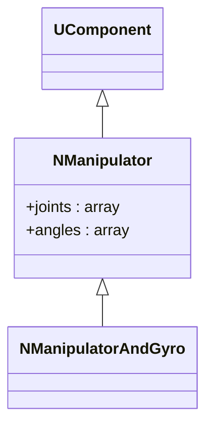
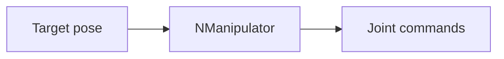
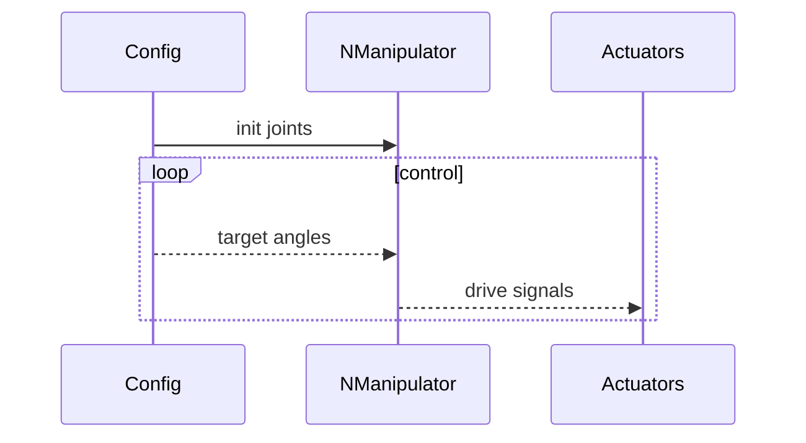

## NManipulator — манипулятор

**Класс**: `NManipulator` (и `NManipulatorAndGyro`) — управление звеньями/суставами манипулятора.  
**Регистрация**: `NMotionControlLibrary.cpp` → `UploadClass("NManipulator", ...)`.

### Входы/выходы
- Вход: целевые положения/углы, опционально данные гироскопа.
- Выход: команды приводу/позиции.

Пояснение: блок-схема показывает поток данных/сигналов (входы → компонент → выходы).

Пояснение: диаграмма последовательности показывает типовой сценарий взаимодействия и порядок вызовов.

---

## NManipulator — manipulator controller

Drives joints to target poses; may fuse gyro feedback (NManipulatorAndGyro).
