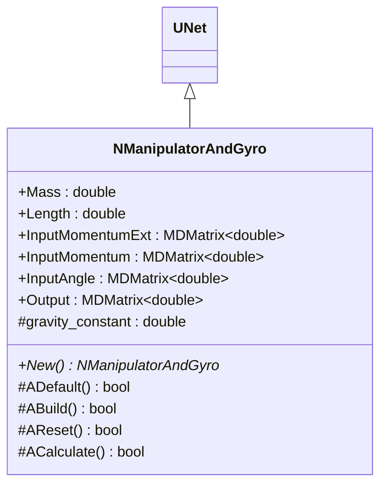
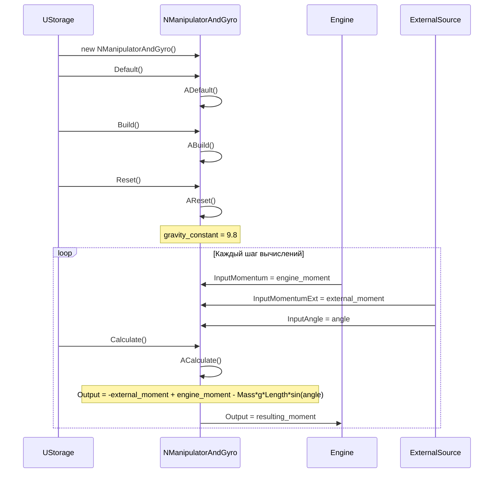
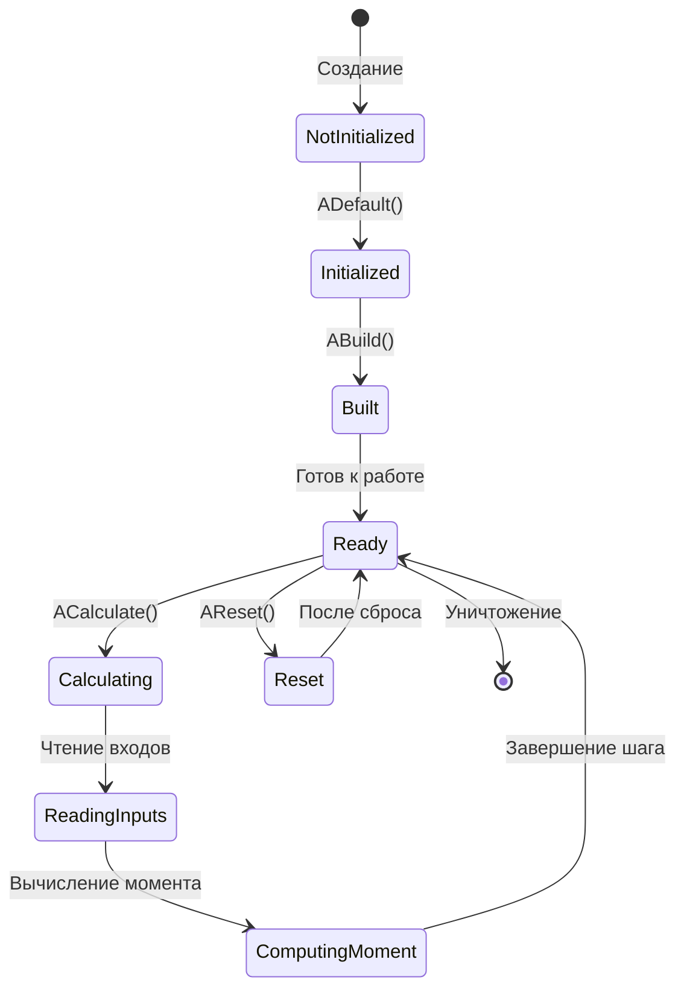
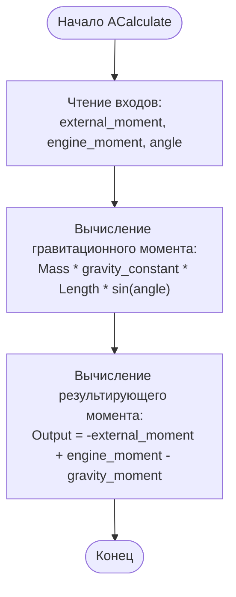
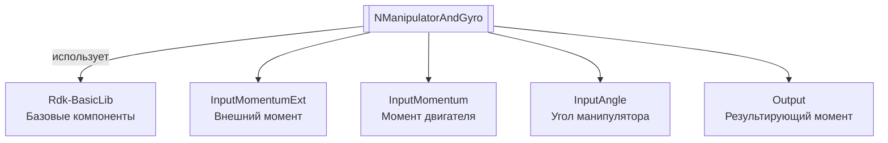
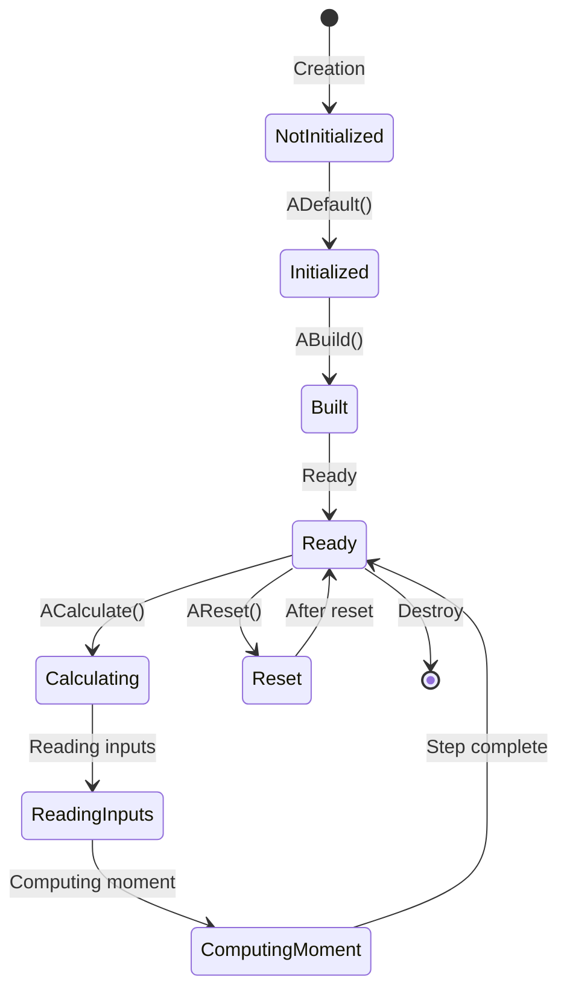
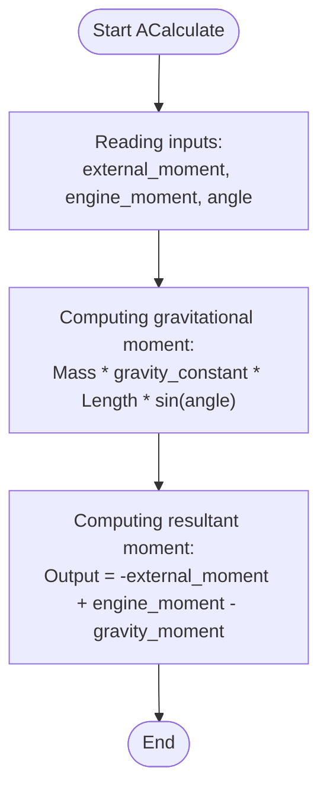
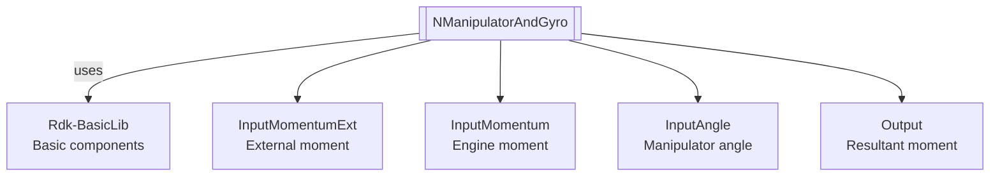

# NManipulatorAndGyro — манипулятор с гироскопом

## RU

**Класс**: `NManipulatorAndGyro` — компонент для моделирования манипулятора с гироскопом, вычисляющий результирующий момент с учетом внешнего момента, момента двигателя и гравитации.
**Регистрация**: `NMotionControlLibrary.cpp` → `UploadClass("NManipulatorAndGyro", ...)`.
**Базовый класс**: `UNet` (из Rdk Framework).

NManipulatorAndGyro реализует модель манипулятора с учетом гравитации и гироскопических эффектов. Компонент вычисляет результирующий момент на основе внешнего момента, момента двигателя и гравитационного момента.

## UML-диаграмма классов



**Иерархия наследования:**
- `UNet` (Rdk Framework) — базовый класс для сетей компонентов
- `NManipulatorAndGyro` — манипулятор с гироскопом

## UML-диаграмма последовательности



## UML-диаграмма состояний



## UML-диаграмма активности



## UML-диаграмма компонентов



## Свойства

### Параметры модели

| Свойство | Тип | Флаги | Описание | Значение по умолчанию |
|----------|-----|-------|----------|----------------------|
| `Mass` | `double` | `ptPubParameter` | Масса манипулятора (кг) | `1.0` |
| `Length` | `double` | `ptPubParameter` | Длина манипулятора (м) | `1.0` |

### Входы

| Свойство | Тип | Флаги | Описание | Источник данных |
|----------|-----|-------|----------|-----------------|
| `InputMomentumExt` | `MDMatrix<double>` | `ptInput \| ptPubState` | Внешний момент (Н·м) | Внешние источники |
| `InputMomentum` | `MDMatrix<double>` | `ptInput \| ptPubState` | Момент двигателя (Н·м) | Двигатель или привод |
| `InputAngle` | `MDMatrix<double>` | `ptInput \| ptPubState` | Угол манипулятора (рад) | Датчик угла или модель |

### Выходы

| Свойство | Тип | Флаги | Описание | Назначение |
|----------|-----|-------|----------|------------|
| `Output` | `MDMatrix<double>` | `ptOutput \| ptPubState` | Результирующий момент (Н·м) | Передача системам управления |

### Защищенные переменные

| Свойство | Тип | Описание |
|----------|-----|----------|
| `gravity_constant` | `double` | Константа гравитации (9.8 м/с²) |

## Методы

### Конструкторы и деструкторы

#### `NManipulatorAndGyro(void)`
**Назначение:** Конструктор компонента
**Параметры:** Нет
**Возвращаемое значение:** Нет
**Описание:** Инициализирует gravity_constant=0

#### `virtual ~NManipulatorAndGyro(void)`
**Назначение:** Деструктор компонента
**Параметры:** Нет
**Возвращаемое значение:** Нет

### Методы жизненного цикла

#### `virtual bool ADefault(void)`
**Назначение:** Инициализация значений по умолчанию
**Параметры:** Нет
**Возвращаемое значение:** `true` при успехе
**Описание:** Устанавливает Mass=1, Length=1, инициализирует входные и выходные матрицы нулями

#### `virtual bool ABuild(void)`
**Назначение:** Построение внутренней структуры компонента
**Параметры:** Нет
**Возвращаемое значение:** `true` при успехе

#### `virtual bool AReset(void)`
**Назначение:** Сброс состояния компонента
**Параметры:** Нет
**Возвращаемое значение:** `true` при успехе
**Описание:** Устанавливает gravity_constant=9.8

#### `virtual bool ACalculate(void)`
**Назначение:** Выполнение вычислений на текущем шаге
**Параметры:** Нет
**Возвращаемое значение:** `true` при успехе
**Описание:** Вычисляет результирующий момент:
- `Output = -InputMomentumExt + InputMomentum - Mass * gravity_constant * Length * sin(InputAngle)`

### Публичные методы

#### `virtual NManipulatorAndGyro* New(void)`
**Назначение:** Создание нового экземпляра компонента
**Параметры:** Нет
**Возвращаемое значение:** Указатель на новый экземпляр

## Примеры использования

### C++ код

```cpp
#include "NManipulatorAndGyro.h"

UEPtr<NManipulatorAndGyro> manipulator = new NManipulatorAndGyro;
manipulator->Default();
manipulator->Mass = 2.0;  // Масса 2 кг
manipulator->Length = 0.5;  // Длина 0.5 м
manipulator->Build();
manipulator->Reset();
```

### XML конфигурация

```xml
<Object Name="ManipulatorAndGyro" ClassName="NManipulatorAndGyro">
    <Property Name="Mass" Value="2.0" />
    <Property Name="Length" Value="0.5" />
    <Property Name="InputMomentum" Connect="Engine.OutputMoment" />
    <Property Name="InputAngle" Connect="AngleSensor.Output" />
</Object>
```

### Использование в конфигурациях

Компонент `NManipulatorAndGyro` используется для моделирования манипулятора с учетом гравитации и гироскопических эффектов.

**Типичные сценарии использования:**
1. **Моделирование манипулятора** - симуляция динамики манипулятора с гравитацией
2. **Интеграция с гироскопом** - использование данных гироскопа для управления

**Типичные комбинации:**
- `NManipulatorAndGyro` + `NAstaticGyro` - манипулятор с гироскопом
- `NManipulatorAndGyro` + двигатели - управление манипулятором

---

## EN

NManipulatorAndGyro — manipulator with gyroscope

**Class**: `NManipulatorAndGyro` — component for modeling a manipulator with a gyroscope, calculating resulting moment accounting for external moment, engine moment, and gravity.
**Registration**: `NMotionControlLibrary.cpp` → `UploadClass("NManipulatorAndGyro", ...)`.
**Base class**: `UNet` (from Rdk Framework).

NManipulatorAndGyro implements a manipulator model accounting for gravity and gyroscopic effects. The component calculates resulting moment based on external moment, engine moment, and gravitational moment.

## Class Diagram


## Sequence Diagram


## State Diagram



## Activity Diagram



## Component Diagram



## Properties

[Same structure as RU section, translated to English]

## Methods

[Same structure as RU section, translated to English]

## References

- [Literature-References.md](../Literature-References.md): [A], 19, 21 — manipulator and gyroscope in the control hierarchy.

## Usage Examples

[Same as RU section, with English comments]
