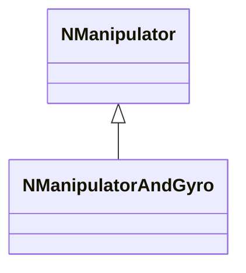
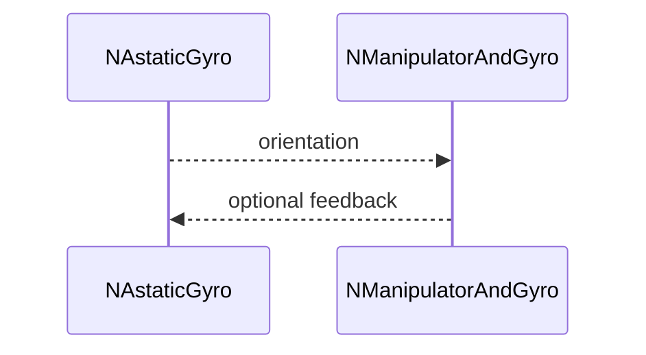
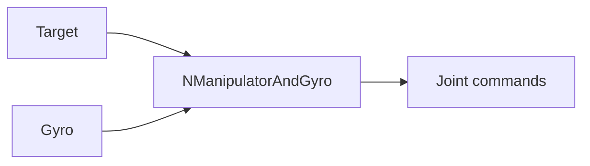
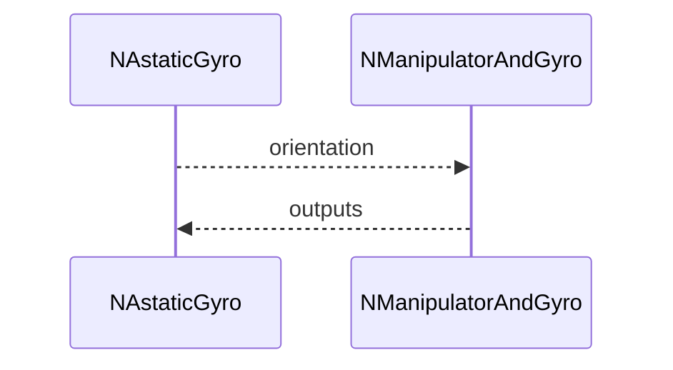

## NManipulatorAndGyro — манипулятор с гироскопом

**Класс**: `NManipulatorAndGyro` — вариант управления манипулятором с учётом данных гироскопа.  
**Регистрация**: `NMotionControlLibrary.cpp` → `UploadClass("NManipulatorAndGyro", ...)`.

### Lifecycle
- **ADefault**: параметры фильтрации/слияния данных.
- **ABuild**: подключение `NManipulator` и `NAstaticGyro`.
- **AReset**: сброс фильтров.
- **ACalculate**: вычисление команд манипулятора с учётом ориентации.

### I/O
- Вход: целевые команды + данные гироскопа.
- Выход: команды на суставы.



Пояснение: диаграмма классов показывает место компонента в иерархии и ключевые связи.



Пояснение: диаграмма последовательности показывает типовой сценарий взаимодействия и порядок вызовов.



Пояснение: блок-схема показывает поток данных/сигналов (входы → компонент → выходы).

### Config snippet

```ini
[Component]
ClassName = NManipulatorAndGyro
Name = ManGyro1
```

---

## NManipulatorAndGyro — manipulator with gyro (EN)

Manipulator control with gyro feedback fusion.


Description: this class diagram shows the component position in the type hierarchy and key relations.



Description: this sequence diagram shows a typical runtime interaction and call order.


Description: this flowchart shows the data/signal flow (inputs → component → outputs).
