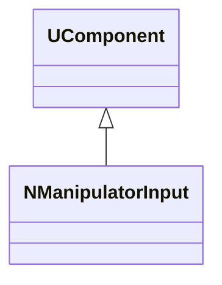
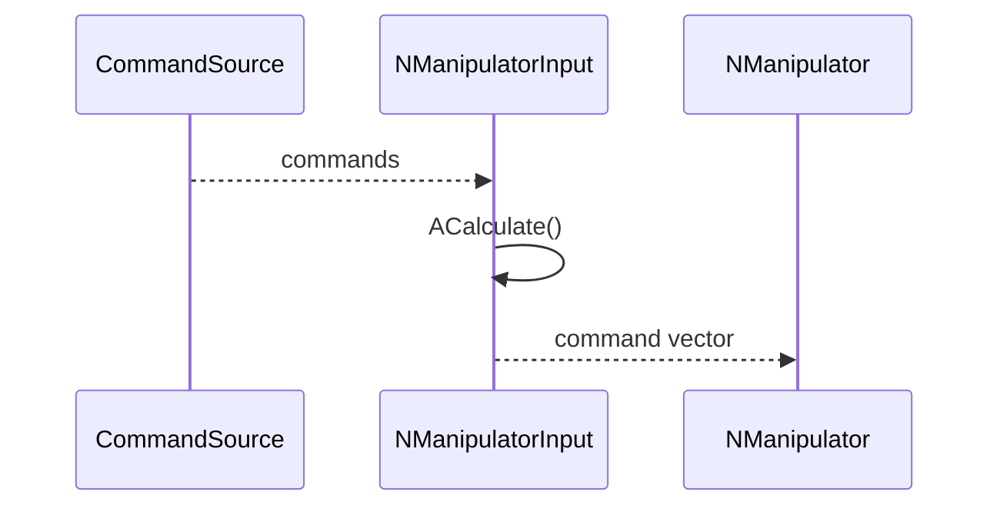
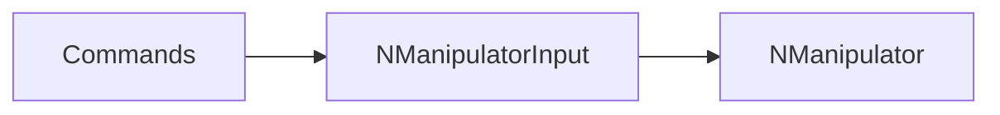
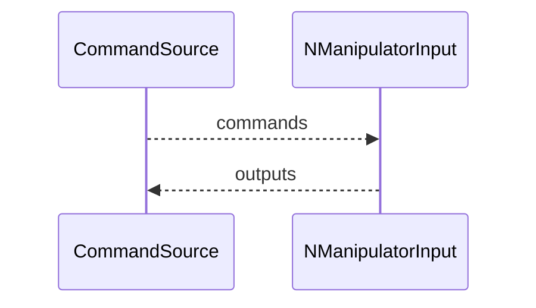

## NManipulatorInput — вход команд манипулятора

**Класс**: `NManipulatorInput` — принимает команды управления манипулятором (углы/скорости/режимы).  
**Регистрация**: `NMotionControlLibrary.cpp` → `UploadClass("NManipulatorInput", ...)`.  
**Storage-инстансы**: `ClassName = "NManipulatorInput"`.

### Lifecycle
- **ADefault**: значения по умолчанию и режим ввода.
- **ABuild**: подключение источников команд.
- **AReset**: сброс команд.
- **ACalculate**: обновление команд на шаге управления.

### I/O
- Вход: команды (скаляры/векторы).
- Выход: нормализованные команды для `NManipulator`.



Диаграмма показывает компонент ввода команд.



Пояснение: диаграмма последовательности показывает типовой сценарий взаимодействия и порядок вызовов.



Пояснение: блок-схема показывает поток данных/сигналов (входы → компонент → выходы).

### Config snippet

```ini
[Component]
ClassName = NManipulatorInput
Name = ManInput1
```

---

## NManipulatorInput — manipulator command input (EN)

Consumes control commands and outputs command vectors for manipulator controllers.


Description: this class diagram shows the component position in the type hierarchy and key relations.



Description: this sequence diagram shows a typical runtime interaction and call order.


Description: this flowchart shows the data/signal flow (inputs → component → outputs).
