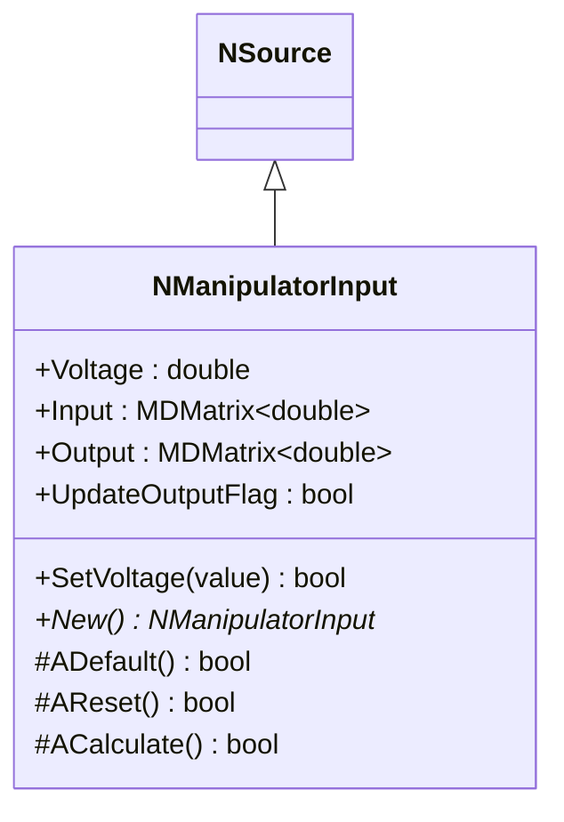
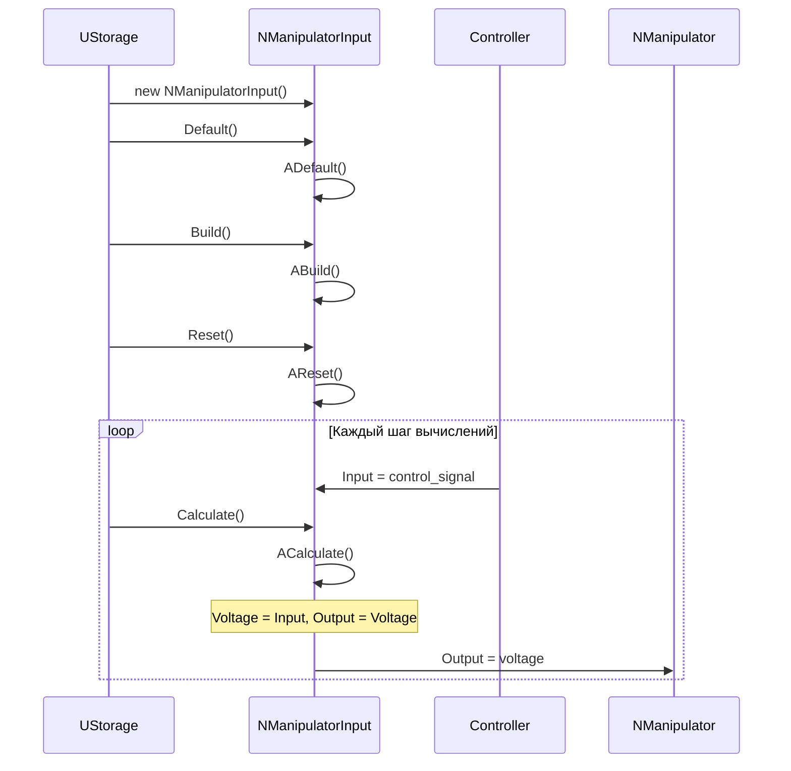
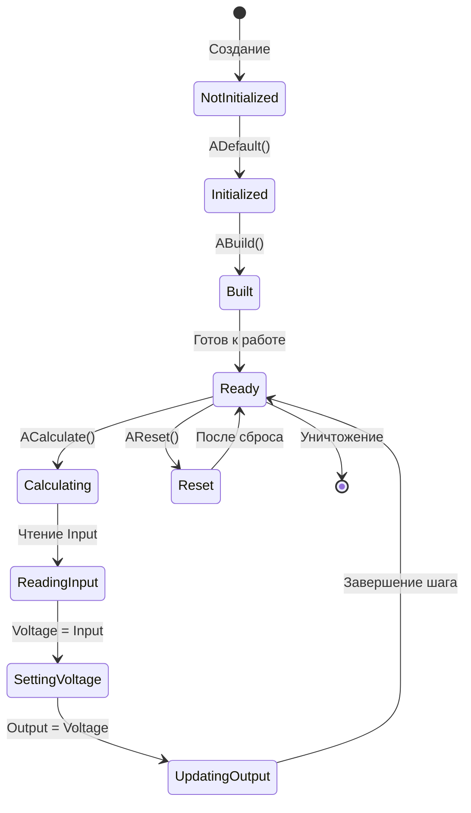
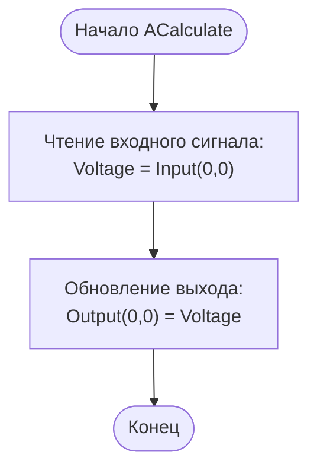
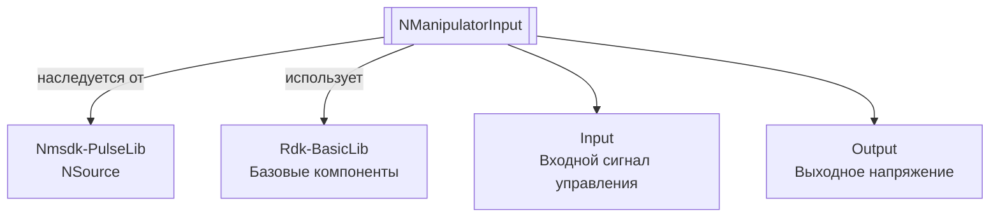
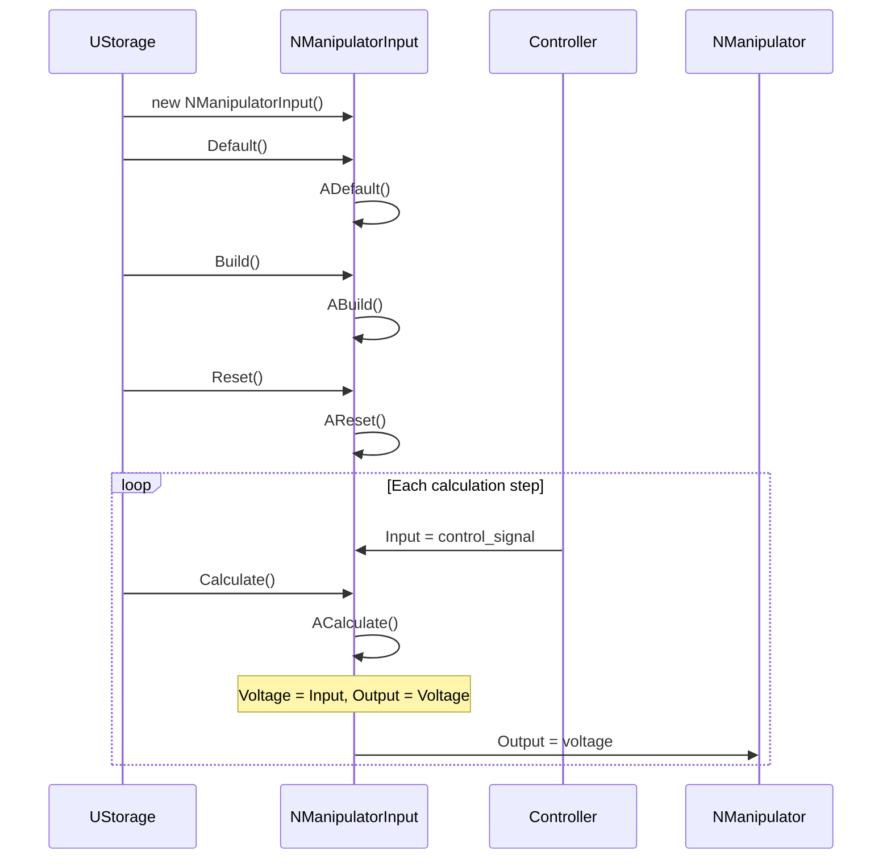
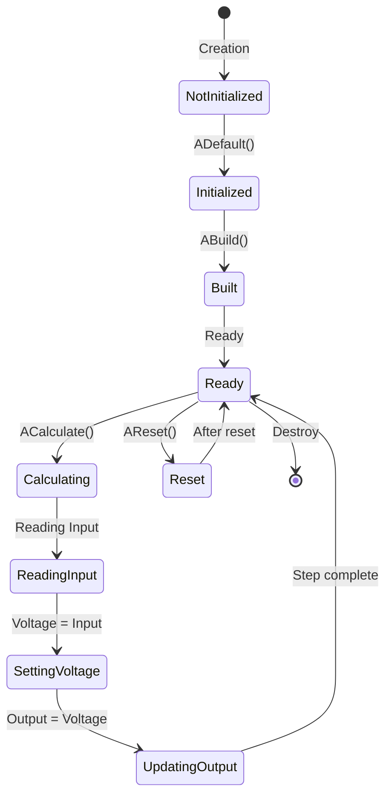
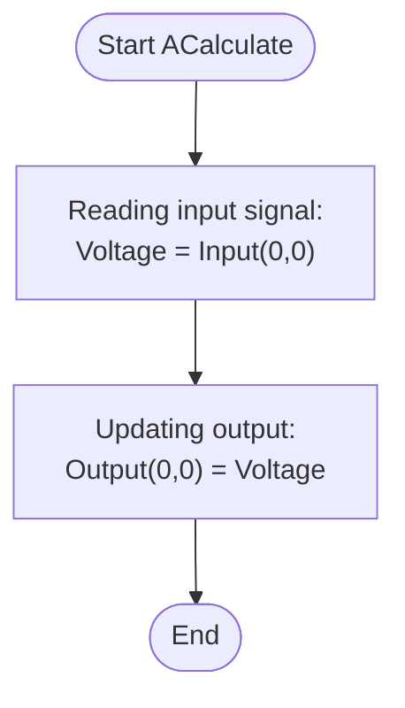
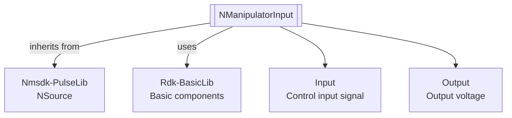

# NManipulatorInput — вход манипулятора

## RU

**Класс**: `NManipulatorInput` — источник входных данных для манипулятора, преобразующий входной сигнал в напряжение.
**Регистрация**: `NMotionControlLibrary.cpp` → `UploadClass("NManipulatorInput", ...)`.
**Базовый класс**: `NSource` (из Nmsdk-PulseLib).

NManipulatorInput является источником данных для манипулятора. Компонент получает входной сигнал и преобразует его в напряжение, которое передается на выход для управления манипулятором.

## UML-диаграмма классов



**Иерархия наследования:**
- `NSource` (Nmsdk-PulseLib) — базовый класс для источников сигналов
- `NManipulatorInput` — вход манипулятора

## UML-диаграмма последовательности



## UML-диаграмма состояний



## UML-диаграмма активности



## UML-диаграмма компонентов



## Свойства

### Параметры

| Свойство | Тип | Флаги | Описание | Значение по умолчанию |
|----------|-----|-------|----------|----------------------|
| `Voltage` | `double` | `ptPubParameter` | Напряжение управления (В) | `0.0` |

### Входы

| Свойство | Тип | Флаги | Описание | Источник данных |
|----------|-----|-------|----------|-----------------|
| `Input` | `MDMatrix<double>` | `ptInput \| ptPubState` | Входной сигнал управления | Контроллер или другой источник управления |

### Выходы

| Свойство | Тип | Флаги | Описание | Назначение |
|----------|-----|-------|----------|------------|
| `Output` | `MDMatrix<double>` | `ptOutput` (из NSource) | Выходное напряжение | Передача манипулятору или другим компонентам |

### Внутренние флаги

| Свойство | Тип | Описание |
|----------|-----|----------|
| `UpdateOutputFlag` | `bool` | Флаг необходимости обновления выхода |

## Методы

### Конструкторы и деструкторы

#### `NManipulatorInput(void)`
**Назначение:** Конструктор компонента
**Параметры:** Нет
**Возвращаемое значение:** Нет
**Описание:** Инициализирует UpdateOutputFlag=false

#### `virtual ~NManipulatorInput(void)`
**Назначение:** Деструктор компонента
**Параметры:** Нет
**Возвращаемое значение:** Нет

### Методы жизненного цикла

#### `virtual bool ADefault(void)`
**Назначение:** Инициализация значений по умолчанию
**Параметры:** Нет
**Возвращаемое значение:** `true` при успехе
**Описание:** Устанавливает Voltage=0, инициализирует Input и Output нулями, вызывает ADefault() базового класса

#### `virtual bool AReset(void)`
**Назначение:** Сброс состояния компонента
**Параметры:** Нет
**Возвращаемое значение:** `true` при успехе
**Описание:** Устанавливает UpdateOutputFlag=true, вызывает AReset() базового класса

#### `virtual bool ACalculate(void)`
**Назначение:** Выполнение вычислений на текущем шаге
**Параметры:** Нет
**Возвращаемое значение:** `true` при успехе
**Описание:** Читает входной сигнал: `Voltage = Input(0,0)`, обновляет выход: `Output(0,0) = Voltage`

### Сеттеры свойств

#### `bool SetVoltage(const double &value)`
**Назначение:** Установка напряжения
**Параметры:**
- `value` - значение напряжения
**Возвращаемое значение:** `true` при успехе

### Публичные методы

#### `virtual NManipulatorInput* New(void)`
**Назначение:** Создание нового экземпляра компонента
**Параметры:** Нет
**Возвращаемое значение:** Указатель на новый экземпляр

## Примеры использования

### C++ код

```cpp
#include "NManipulatorInput.h"

UEPtr<NManipulatorInput> input = new NManipulatorInput;
input->Default();
input->Build();
input->Reset();

// Подключение контроллера
UEPtr<Controller> controller = new Controller;
controller->OutputSignal.Connect(input->Input);

// Подключение к манипулятору
UEPtr<NManipulator> manipulator = new NManipulator;
input->Output.Connect(manipulator->Input);

// Использование в цикле
for (int step = 0; step < numSteps; step++) {
    controller->Calculate();
    input->Calculate();
    manipulator->Calculate();
}
```

### XML конфигурация

```xml
<Object Name="ManipulatorInput" ClassName="NManipulatorInput">
    <Property Name="Input" Connect="Controller.OutputSignal" />
    <Property Name="Output" Connect="Manipulator.Input" />
</Object>
```

### Использование в конфигурациях

Компонент `NManipulatorInput` используется как источник входных данных для манипуляторов в системах управления движением.

**Типичные сценарии использования:**
1. **Управление манипулятором** - преобразование управляющих сигналов в напряжение для манипулятора
2. **Интеграция с контроллерами** - подключение между контроллерами и манипуляторами

**Типичные комбинации:**
- `NManipulatorInput` + `NManipulator` - управление манипулятором
- `NManipulatorInput` + контроллеры - различные стратегии управления

---

## EN

NManipulatorInput — manipulator input

**Class**: `NManipulatorInput` — source of input data for manipulator, converting input signal to voltage.
**Registration**: `NMotionControlLibrary.cpp` → `UploadClass("NManipulatorInput", ...)`.
**Base class**: `NSource` (from Nmsdk-PulseLib).

NManipulatorInput is a data source for manipulators. The component receives an input signal and converts it to voltage, which is output for manipulator control.

## Class Diagram


## Sequence Diagram



## State Diagram



## Activity Diagram



## Component Diagram



## Properties

[Same structure as RU section, translated to English]

## Methods

[Same structure as RU section, translated to English]

## References

- [Literature-References.md](../Literature-References.md): [A], 19, 21 — manipulator input in the control hierarchy.

## Usage Examples

[Same as RU section, with English comments]
