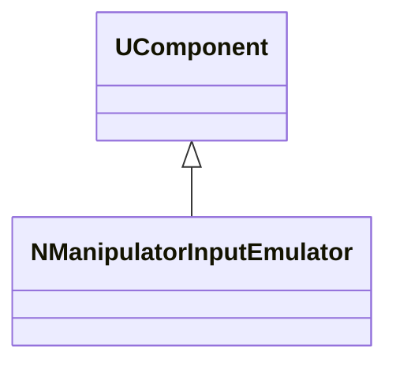
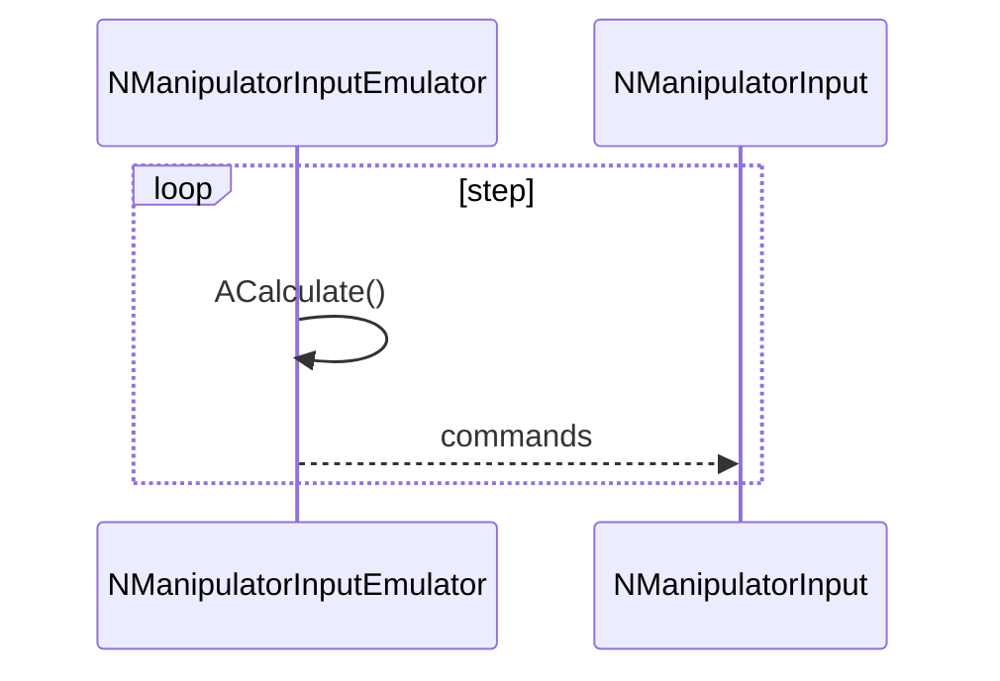
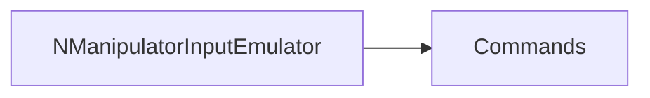
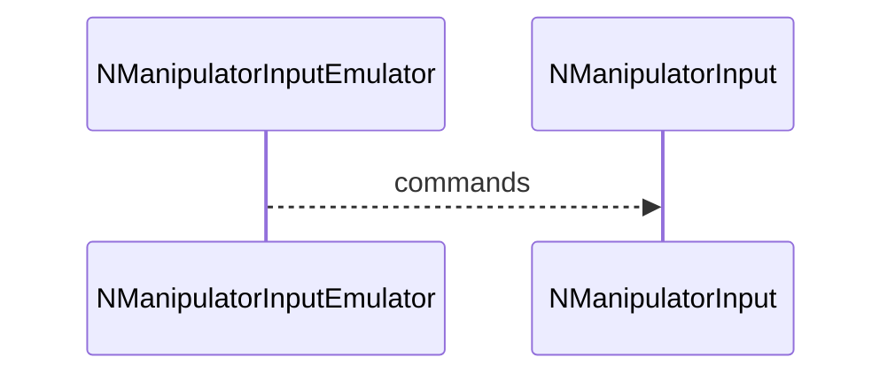

## NManipulatorInputEmulator — эмулятор ввода манипулятора

**Класс**: `NManipulatorInputEmulator` — генерирует тестовые команды для манипулятора (демо/отладка).  
**Регистрация**: `UploadClass("NManipulatorInputEmulator", ...)` в `NMotionControlLibrary.cpp`.

### Lifecycle
- **ADefault**: сценарий эмуляции по умолчанию.
- **ABuild**: подготовка генераторов/паттернов.
- **AReset**: сброс времени/состояния.
- **ACalculate**: выдача очередной команды.

### I/O
- Выход: команды для `NManipulatorInput`/`NManipulator`.



Пояснение: диаграмма классов показывает место компонента в иерархии и ключевые связи.



Пояснение: диаграмма последовательности показывает типовой сценарий взаимодействия и порядок вызовов.



Пояснение: блок-схема показывает поток данных/сигналов (входы → компонент → выходы).

### Config snippet

```ini
[Component]
ClassName = NManipulatorInputEmulator
Name = ManInpEmu1
```

---

## NManipulatorInputEmulator — manipulator input emulator (EN)

Generates synthetic manipulator commands for testing/debugging.


Description: this class diagram shows the component position in the type hierarchy and key relations.



Description: this sequence diagram shows a typical runtime interaction and call order.


Description: this flowchart shows the data/signal flow (inputs → component → outputs).
