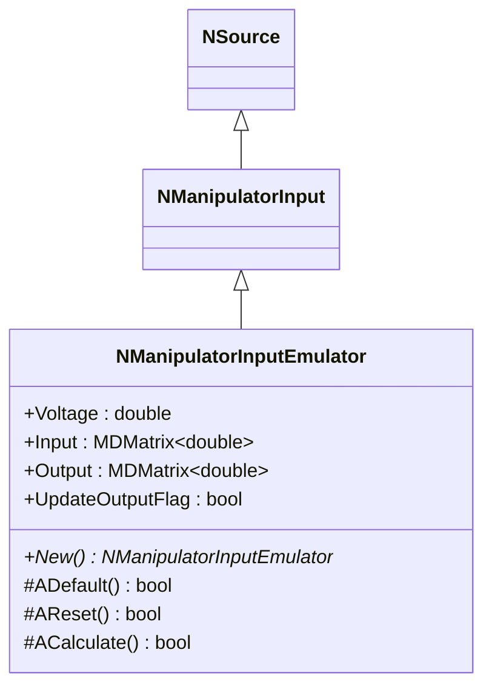
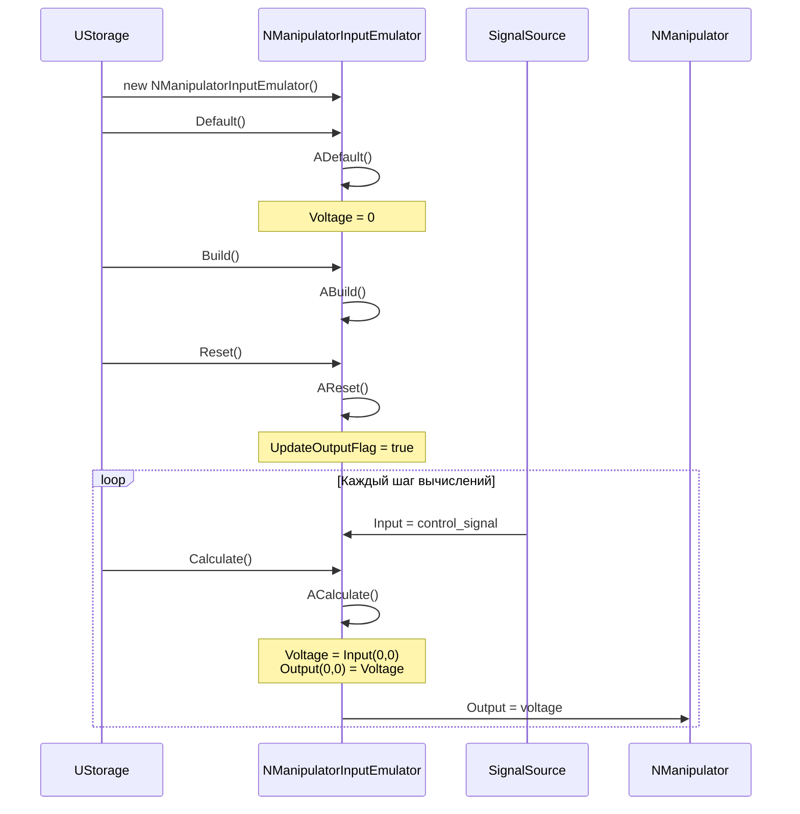
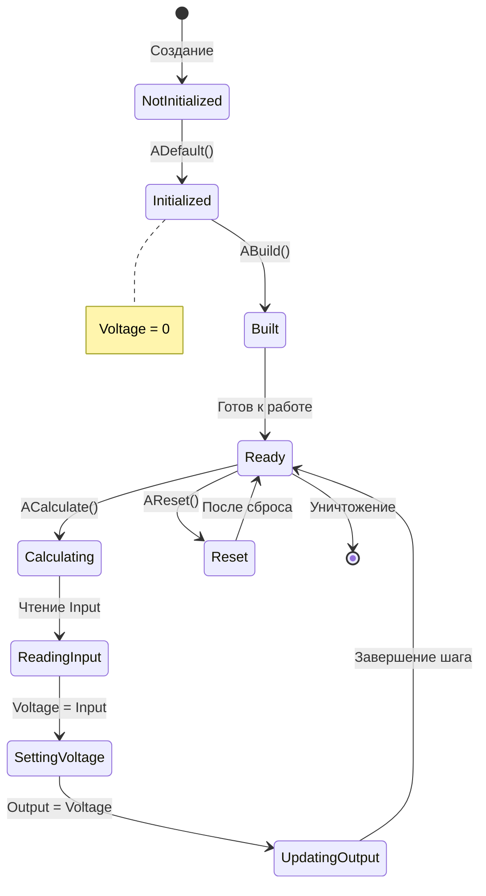
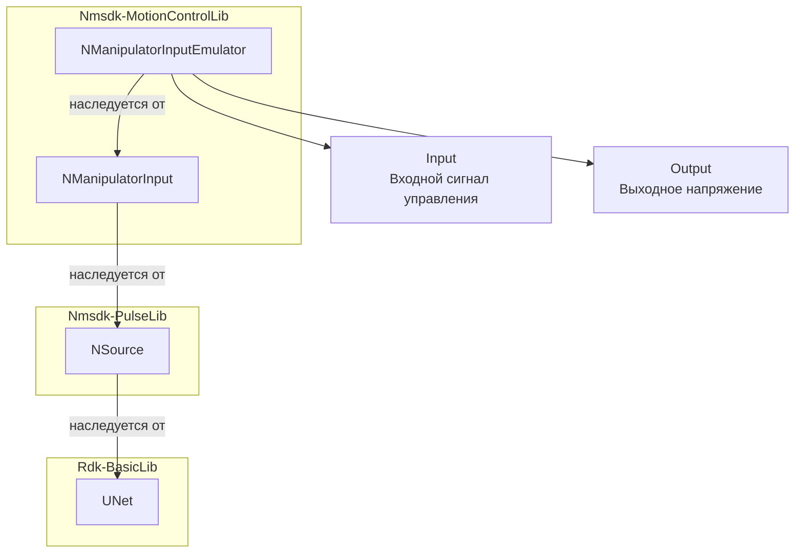
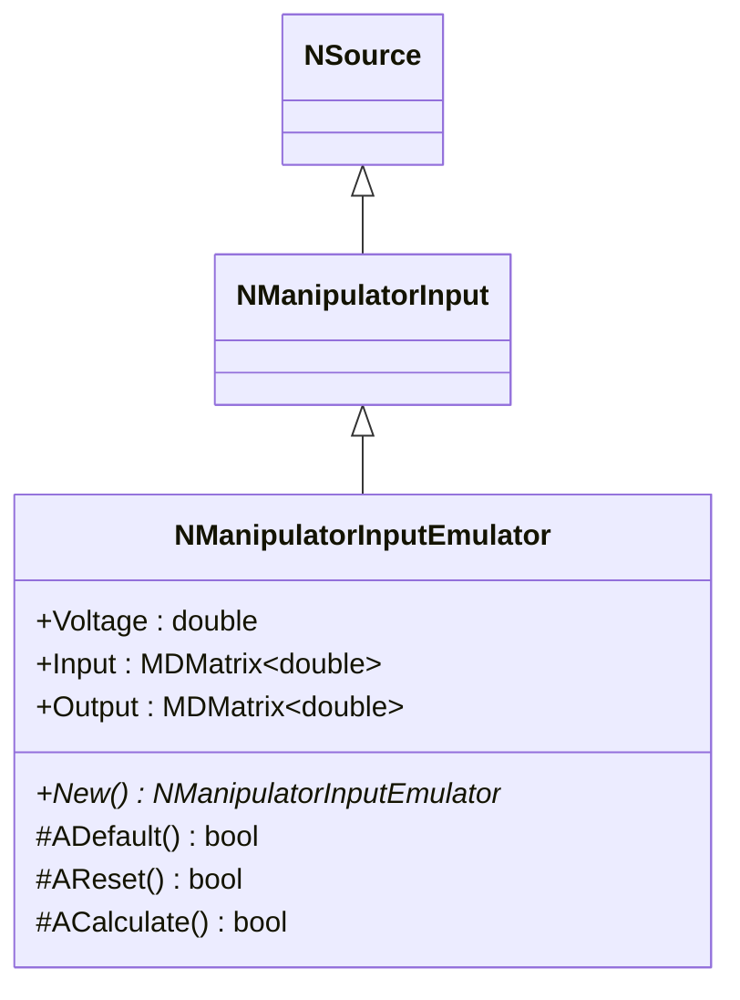
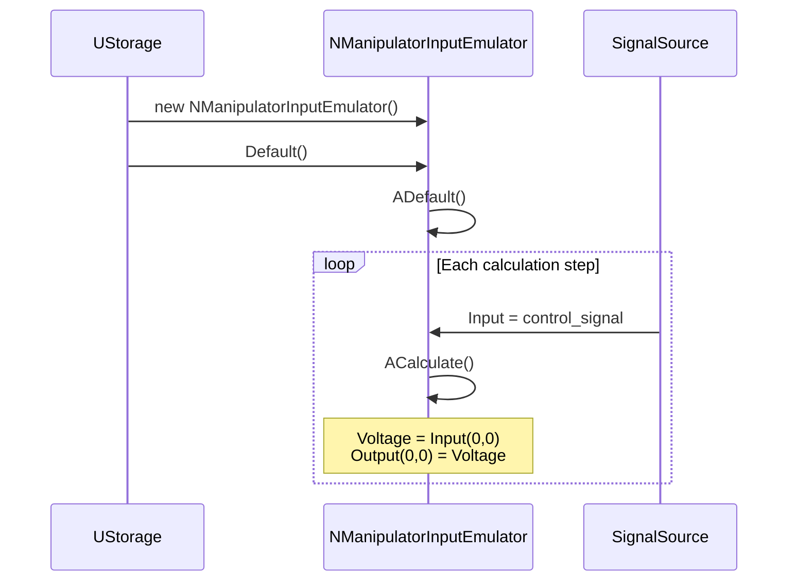
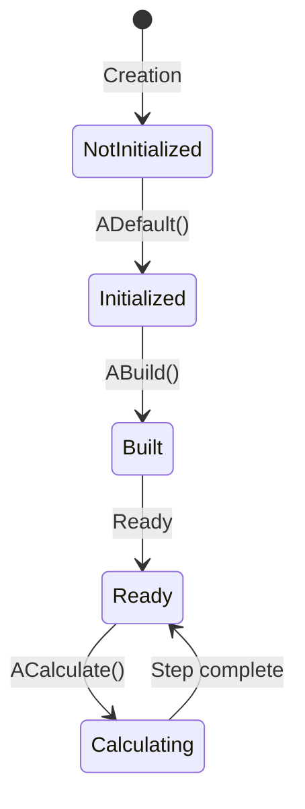

# NManipulatorInputEmulator — эмулятор ввода манипулятора

**Класс**: `NManipulatorInputEmulator` — эмулятор входных данных для манипулятора, упрощённая версия `NManipulatorInput` для тестирования и отладки.  
**Регистрация**: `NMotionControlLibrary.cpp` → `UploadClass("NManipulatorInputEmulator", ...)`.  
**Базовый класс**: `NManipulatorInput` (из Nmsdk-MotionControlLib).

NManipulatorInputEmulator является упрощённой версией `NManipulatorInput`, предназначенной для эмуляции входных команд манипулятора. Компонент наследует все свойства базового класса и просто передаёт входной сигнал на выход через напряжение. Используется для тестирования систем управления манипулятором без реального физического устройства.

## UML-диаграмма классов



**Иерархия наследования:**
- `NSource` (Nmsdk-PulseLib) — базовый класс для источников сигналов
- `NManipulatorInput` — базовый класс входа манипулятора
- `NManipulatorInputEmulator` — эмулятор входа манипулятора

## UML-диаграмма последовательности



**Описание жизненного цикла:**
1. **Создание** - компонент создаётся через конструктор
2. **Инициализация (ADefault)** - установка `Voltage=0` по умолчанию
3. **Построение (ABuild)** - подготовка к работе (наследуется от базового класса)
4. **Сброс (AReset)** - установка `UpdateOutputFlag=true` и сброс состояния
5. **Вычисление (ACalculate)** - передача входного сигнала на выход: `Voltage = Input(0,0)`, `Output(0,0) = Voltage`

## UML-диаграмма состояний



**Состояния компонента:**
- **NotInitialized** - компонент создан, но не инициализирован
- **Initialized** - компонент инициализирован с `Voltage=0`
- **Built** - готов к работе
- **Ready** - готов к вычислениям
- **Calculating** - выполняется вычисление
- **ReadingInput** - чтение входного сигнала
- **SettingVoltage** - установка напряжения из входного сигнала
- **UpdatingOutput** - обновление выходного сигнала
- **Reset** - состояние после сброса

## UML-диаграмма активности

```mermaid
flowchart TD
    Start([Начало ACalculate]) --> ReadInput[Чтение входного сигнала:<br/>Voltage = Input(0,0)]
    ReadInput --> UpdateOutput[Обновление выхода:<br/>Output(0,0) = Voltage]
    UpdateOutput --> End([Конец])
```

**Алгоритм работы ACalculate:**
1. Чтение входного сигнала: `Voltage = Input(0,0)`
2. Обновление выходного сигнала: `Output(0,0) = Voltage`

Компонент просто передаёт входной сигнал на выход без дополнительной обработки, что делает его удобным для эмуляции команд управления манипулятором.

## UML-диаграмма компонентов



**Зависимости:**
- **Nmsdk-MotionControlLib**: базовый класс `NManipulatorInput`
- **Nmsdk-PulseLib**: базовый класс `NSource`
- **Rdk-BasicLib**: базовый фреймворк (`UNet`)

## Свойства компонента

### Параметры (ptPubParameter)

| Свойство | Тип | Значение по умолчанию | Описание |
|----------|-----|----------------------|----------|
| `Voltage` | `double` | `0` | Напряжение управления (устанавливается из Input) |

### Входы/Выходы

| Свойство | Тип | Флаги | Описание |
|----------|-----|-------|----------|
| `Input` | `MDMatrix<double>` | `ptInput \| ptPubState` | Входной сигнал управления |
| `Output` | `MDMatrix<double>` | `ptOutput \| ptPubState` | Выходное напряжение (наследуется от NSource) |

### Внутренние свойства

| Свойство | Тип | Описание |
|----------|-----|----------|
| `UpdateOutputFlag` | `bool` | Флаг обновления выхода (устанавливается в `true` при сбросе) |

## Методы компонента

### Жизненный цикл

#### `ADefault() -> bool`
**Назначение**: Инициализация параметров по умолчанию.

**Описание**: Устанавливает `Voltage=0` и вызывает `NManipulatorInput::ADefault()`.

#### `AReset() -> bool`
**Назначение**: Сброс состояния компонента.

**Описание**: Устанавливает `UpdateOutputFlag=true` и вызывает `NManipulatorInput::AReset()`.

#### `ACalculate() -> bool`
**Назначение**: Передача входного сигнала на выход.

**Алгоритм:**
1. Чтение входного сигнала: `Voltage = Input(0,0)`
2. Обновление выхода: `Output(0,0) = Voltage`

**Возвращаемое значение**: `true` при успешном выполнении

## Примеры использования

### C++ код

```cpp
#include "NManipulatorInputEmulator.h"

// Создание компонента
UEPtr<NManipulatorInputEmulator> emulator = storage->CreateComponent<NManipulatorInputEmulator>("ManInpEmu1");

// Инициализация
emulator->Default();
emulator->Build();
emulator->Reset();

// В цикле вычислений
while (simulation_running) {
    // Установка входного сигнала (например, от контроллера)
    emulator->Input(0, 0) = control_signal;
    
    emulator->Calculate();
    
    // Получение выходного напряжения
    double voltage = emulator->Output(0, 0);
    // или
    double voltage = emulator->Voltage;
}
```

### XML конфигурация

```xml
<Component>
    <ClassName>NManipulatorInputEmulator</ClassName>
    <Name>ManInpEmu1</Name>
    <Properties>
        <Voltage>0</Voltage>
    </Properties>
</Component>
```

## Связи с конфигурационными проектами

Компонент `NManipulatorInputEmulator` используется в проектах, требующих:
- **Эмуляции входных команд манипулятора** - для тестирования систем управления без физического устройства
- **Отладки систем управления** - для проверки работы контроллеров и алгоритмов управления
- **Демонстрации функциональности** - для показа работы системы без реального манипулятора

Типичные сценарии использования:
- Тестирование алгоритмов управления манипулятором
- Отладка систем с обратной связью
- Демонстрационные проекты
- Обучение работе с системами управления движением

**Связь с другими компонентами:**
- Может подключаться к выходам контроллеров (`NEngineMotionControl`, `NPositionControlElement`)
- Выходы подключаются к `NManipulator` или другим компонентам, требующим входного напряжения
- Часто используется вместе с `NManipulatorSourceEmulator` для полной эмуляции манипулятора

**Отличия от NManipulatorInput:**
- `NManipulatorInputEmulator` является упрощённой версией для эмуляции
- Основное отличие - упрощённая логика в `ACalculate` (простая передача сигнала)
- Предназначен для тестирования и отладки, а не для работы с реальным устройством

---

## NManipulatorInputEmulator — manipulator input emulator (EN)

**Class**: `NManipulatorInputEmulator` — emulator for manipulator input data, simplified version of `NManipulatorInput` for testing and debugging.  
**Registration**: `NMotionControlLibrary.cpp` → `UploadClass("NManipulatorInputEmulator", ...)`.  
**Base class**: `NManipulatorInput` (from Nmsdk-MotionControlLib).

NManipulatorInputEmulator is a simplified version of `NManipulatorInput` designed for emulating manipulator input commands. The component inherits all properties from the base class and simply passes the input signal to the output through voltage. Used for testing manipulator control systems without a real physical device.

## Class Diagram



## Sequence Diagram



## State Diagram



## Activity Diagram

```mermaid
flowchart TD
    Start([Start ACalculate]) --> ReadInput[Read Input signal:<br/>Voltage = Input(0,0)]
    ReadInput --> UpdateOutput[Update Output:<br/>Output(0,0) = Voltage]
    UpdateOutput --> End([End])
```

## Properties

| Property | Type | Default | Description |
|----------|------|---------|-------------|
| `Voltage` | `double` | `0` | Control voltage (set from Input) |
| `Input` | `MDMatrix<double>` | - | Input control signal |
| `Output` | `MDMatrix<double>` | - | Output voltage |

## Methods

### Lifecycle Methods

#### `ADefault() -> bool`
**Purpose**: Initialize default parameters.

**Description**: Sets `Voltage=0` and calls `NManipulatorInput::ADefault()`.

#### `ACalculate() -> bool`
**Purpose**: Pass input signal to output.

**Description**: Reads input signal: `Voltage = Input(0,0)` and updates output: `Output(0,0) = Voltage`.

## Usage Examples

### C++ Code

```cpp
UEPtr<NManipulatorInputEmulator> emulator = storage->CreateComponent<NManipulatorInputEmulator>("ManInpEmu1");
emulator->Default();
emulator->Build();
emulator->Reset();

while (simulation_running) {
    emulator->Input(0, 0) = control_signal;
    emulator->Calculate();
    double voltage = emulator->Output(0, 0);
}
```

### XML Configuration

```xml
<Component>
    <ClassName>NManipulatorInputEmulator</ClassName>
    <Name>ManInpEmu1</Name>
    <Properties>
        <Voltage>0</Voltage>
    </Properties>
</Component>
```
