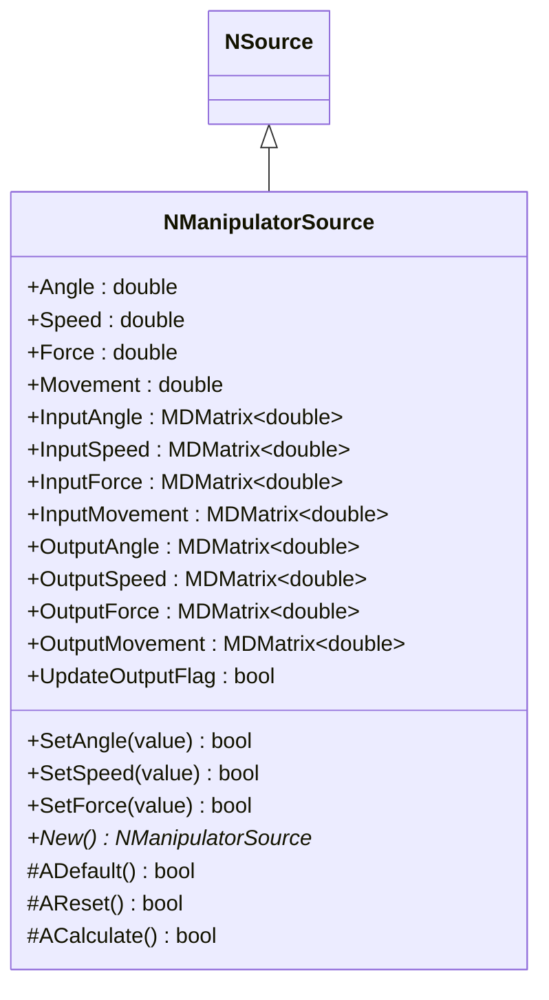
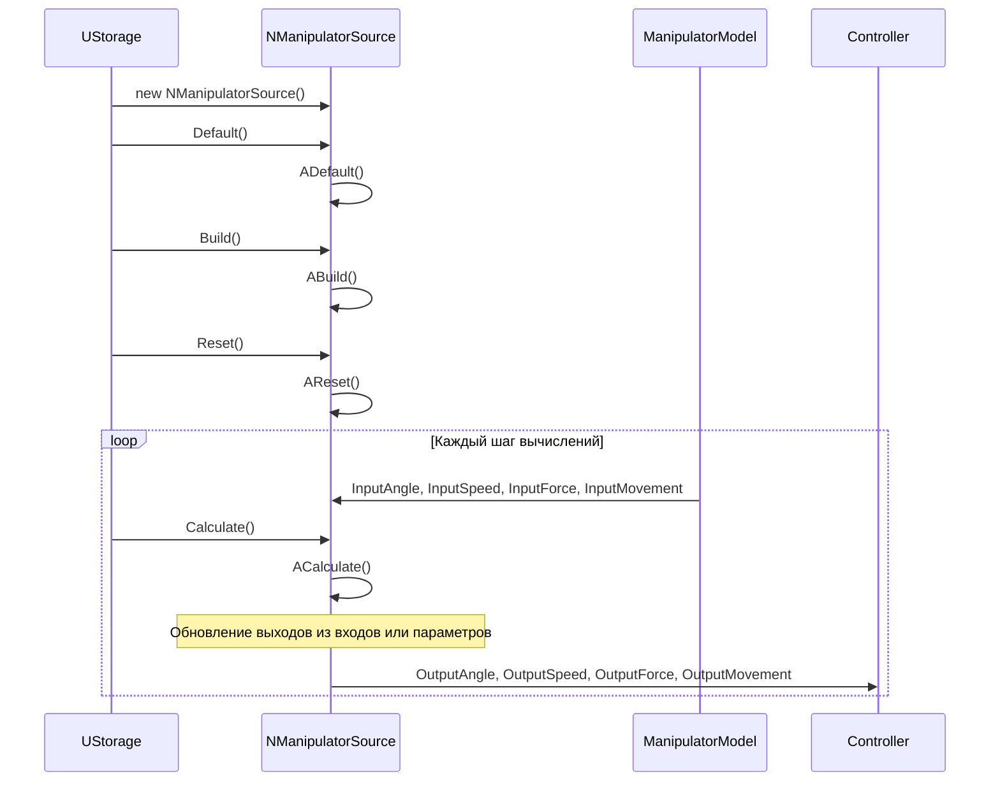
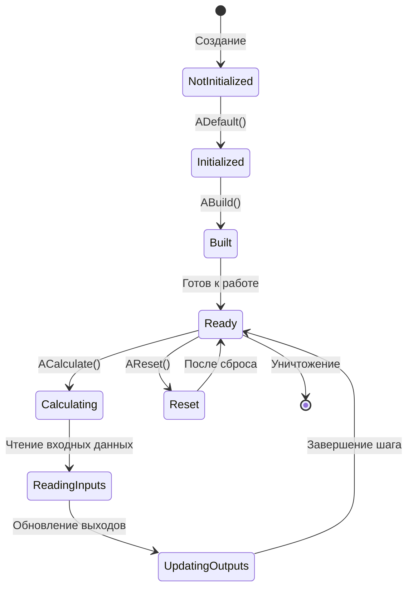
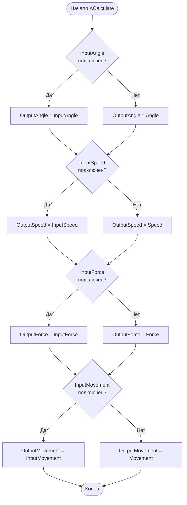
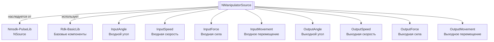

# NManipulatorSource — источник манипулятора

**Класс**: `NManipulatorSource` — источник данных о состоянии манипулятора (угол, скорость, сила, перемещение).
**Регистрация**: `NMotionControlLibrary.cpp` → `UploadClass("NManipulatorSource", ...)`.
**Базовый класс**: `NSource` (из Nmsdk-PulseLib).

NManipulatorSource предоставляет данные о состоянии манипулятора: угол, скорость, силу и перемещение. Компонент может получать данные через входные свойства или использовать внутренние параметры, и выдает их на выходы для использования другими компонентами системы.

## UML-диаграмма классов



**Иерархия наследования:**
- `NSource` (Nmsdk-PulseLib) — базовый класс для источников сигналов
- `NManipulatorSource` — источник данных манипулятора

## UML-диаграмма последовательности



## UML-диаграмма состояний



## UML-диаграмма активности



## UML-диаграмма компонентов



## Свойства

### Параметры

| Свойство | Тип | Флаги | Описание | Значение по умолчанию |
|----------|-----|-------|----------|----------------------|
| `Angle` | `double` | `ptPubParameter` | Угол манипулятора (рад) | `0.0` |
| `Speed` | `double` | `ptPubParameter` | Скорость манипулятора (рад/с) | `0.0` |
| `Force` | `double` | `ptPubParameter` | Сила манипулятора (Н) | `0.0` |
| `Movement` | `double` | `ptPubParameter` | Перемещение манипулятора (м) | `0.0` |

### Входы

| Свойство | Тип | Флаги | Описание | Источник данных |
|----------|-----|-------|----------|-----------------|
| `InputAngle` | `MDMatrix<double>` | `ptPubInput` | Входной угол (рад) | Модель манипулятора или датчик |
| `InputSpeed` | `MDMatrix<double>` | `ptPubInput` | Входная скорость (рад/с) | Модель манипулятора или датчик |
| `InputForce` | `MDMatrix<double>` | `ptPubInput` | Входная сила (Н) | Модель манипулятора или датчик |
| `InputMovement` | `MDMatrix<double>` | `ptPubInput` | Входное перемещение (м) | Модель манипулятора или датчик |

### Выходы

| Свойство | Тип | Флаги | Описание | Назначение |
|----------|-----|-------|----------|------------|
| `OutputAngle` | `MDMatrix<double>` | `ptOutput \| ptPubState` | Выходной угол (рад) | Передача контроллерам |
| `OutputSpeed` | `MDMatrix<double>` | `ptOutput \| ptPubState` | Выходная скорость (рад/с) | Передача контроллерам |
| `OutputForce` | `MDMatrix<double>` | `ptOutput \| ptPubState` | Выходная сила (Н) | Передача контроллерам |
| `OutputMovement` | `MDMatrix<double>` | `ptOutput \| ptPubState` | Выходное перемещение (м) | Передача контроллерам |

### Внутренние флаги

| Свойство | Тип | Описание |
|----------|-----|----------|
| `UpdateOutputFlag` | `bool` | Флаг необходимости обновления выхода |

## Методы

### Конструкторы и деструкторы

#### `NManipulatorSource(void)`
**Назначение:** Конструктор компонента
**Параметры:** Нет
**Возвращаемое значение:** Нет
**Описание:** Инициализирует UpdateOutputFlag=0

#### `virtual ~NManipulatorSource(void)`
**Назначение:** Деструктор компонента
**Параметры:** Нет
**Возвращаемое значение:** Нет

### Методы жизненного цикла

#### `virtual bool ADefault(void)`
**Назначение:** Инициализация значений по умолчанию
**Параметры:** Нет
**Возвращаемое значение:** `true` при успехе
**Описание:** Устанавливает Angle=0, Speed=0, Force=0, Movement=0, вызывает ADefault() базового класса

#### `virtual bool AReset(void)`
**Назначение:** Сброс состояния компонента
**Параметры:** Нет
**Возвращаемое значение:** `true` при успехе
**Описание:** Устанавливает UpdateOutputFlag=true, обнуляет выходные матрицы, вызывает AReset() базового класса

#### `virtual bool ACalculate(void)`
**Назначение:** Выполнение вычислений на текущем шаге
**Параметры:** Нет
**Возвращаемое значение:** `true` при успехе
**Описание:** Обновляет выходы:
- Если InputAngle подключен: OutputAngle = InputAngle, иначе OutputAngle = Angle
- Если InputSpeed подключен: OutputSpeed = InputSpeed, иначе OutputSpeed = Speed
- Если InputForce подключен: OutputForce = InputForce, иначе OutputForce = Force
- Если InputMovement подключен: OutputMovement = InputMovement, иначе OutputMovement = Movement

### Сеттеры свойств

#### `bool SetAngle(const double &value)`
**Назначение:** Установка угла
**Параметры:**
- `value` - значение угла
**Возвращаемое значение:** `true` при успехе

#### `bool SetSpeed(const double &value)`
**Назначение:** Установка скорости
**Параметры:**
- `value` - значение скорости
**Возвращаемое значение:** `true` при успехе

#### `bool SetForce(const double &value)`
**Назначение:** Установка силы
**Параметры:**
- `value` - значение силы
**Возвращаемое значение:** `true` при успехе

### Публичные методы

#### `virtual NManipulatorSource* New(void)`
**Назначение:** Создание нового экземпляра компонента
**Параметры:** Нет
**Возвращаемое значение:** Указатель на новый экземпляр

## Примеры использования

### C++ код

```cpp
#include "NManipulatorSource.h"

UEPtr<NManipulatorSource> source = new NManipulatorSource;
source->Default();
source->Build();
source->Reset();

// Подключение модели манипулятора
UEPtr<ManipulatorModel> model = new ManipulatorModel;
model->OutputAngle.Connect(source->InputAngle);
model->OutputSpeed.Connect(source->InputSpeed);
model->OutputForce.Connect(source->InputForce);
model->OutputMovement.Connect(source->InputMovement);

// Использование в цикле
for (int step = 0; step < numSteps; step++) {
    model->Calculate();
    source->Calculate();

    // Получение данных о состоянии
    double angle = source->OutputAngle(0, 0);
    double speed = source->OutputSpeed(0, 0);
    double force = source->OutputForce(0, 0);
    double movement = source->OutputMovement(0, 0);
}
```

### XML конфигурация

```xml
<Object Name="ManipulatorSource" ClassName="NManipulatorSource">
    <!-- Подключение входов от модели -->
    <Property Name="InputAngle" Connect="ManipulatorModel.OutputAngle" />
    <Property Name="InputSpeed" Connect="ManipulatorModel.OutputSpeed" />
    <Property Name="InputForce" Connect="ManipulatorModel.OutputForce" />
    <Property Name="InputMovement" Connect="ManipulatorModel.OutputMovement" />
</Object>
```

### Использование в конфигурациях

Компонент `NManipulatorSource` используется для предоставления данных о состоянии манипулятора другим компонентам системы управления.

**Типичные сценарии использования:**
1. **Источник данных о манипуляторе** - предоставление данных о состоянии манипулятора контроллерам
2. **Интеграция с NEngineMotionControl** - использование в системах управления движением
3. **Обратная связь** - предоставление данных обратной связи для систем управления

**Типичные комбинации:**
- `NManipulatorSource` + `NEngineMotionControl` - источник данных для движка управления
- `NManipulatorSource` + модели манипуляторов - получение данных от моделей

---

# NManipulatorSource — manipulator source

**Class**: `NManipulatorSource` — source of manipulator state data (angle, speed, force, movement).
**Registration**: `NMotionControlLibrary.cpp` → `UploadClass("NManipulatorSource", ...)`.
**Base class**: `NSource` (from Nmsdk-PulseLib).

NManipulatorSource provides manipulator state data: angle, speed, force, and movement. The component can receive data through input properties or use internal parameters, and outputs them for use by other system components.

## Class Diagram

[Same as RU section]

## Sequence Diagram

[Same as RU section]

## State Diagram

[Same as RU section]

## Activity Diagram

[Same as RU section]

## Component Diagram

[Same as RU section]

## Properties

[Same structure as RU section, translated to English]

## Methods

[Same structure as RU section, translated to English]

## Источники

- [Literature-References.md](../Literature-References.md): [A], 19, 20, 21 — источник данных манипулятора в иерархии управления.

## Usage Examples

[Same as RU section, with English comments]
