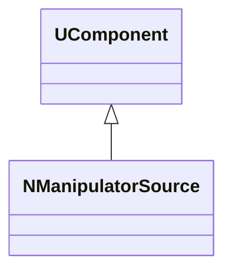
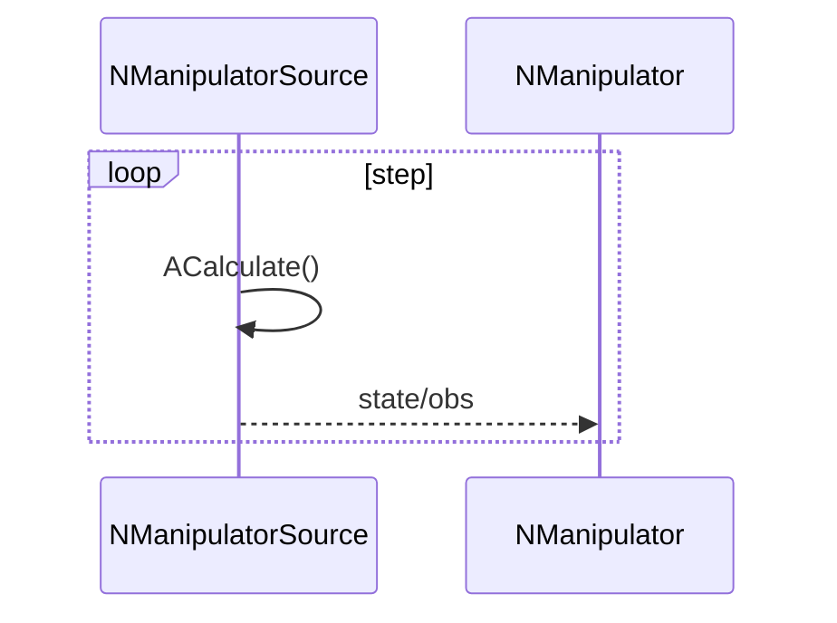
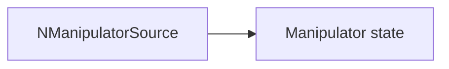
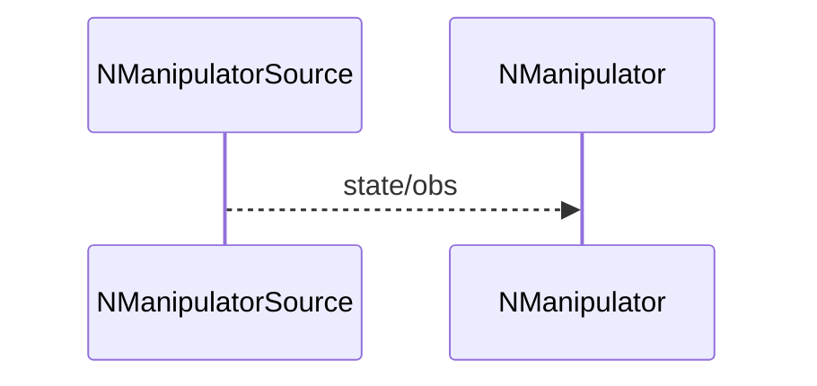

## NManipulatorSource — источник данных манипулятора

**Класс**: `NManipulatorSource` — предоставляет входные данные/состояния манипулятора (позиции, датчики, параметры).  
**Регистрация**: `UploadClass("NManipulatorSource", ...)` в `NMotionControlLibrary.cpp`.

### Lifecycle
- **ADefault**: инициализация источника.
- **ABuild**: подключение к датчикам/эмуляторам.
- **AReset**: сброс состояния.
- **ACalculate**: выдача актуальных данных.

### I/O
- Выход: состояния/наблюдения для `NManipulator` и контроллеров.



Пояснение: диаграмма классов показывает место компонента в иерархии и ключевые связи.



Пояснение: диаграмма последовательности показывает типовой сценарий взаимодействия и порядок вызовов.



Пояснение: блок-схема показывает поток данных/сигналов (входы → компонент → выходы).

### Config snippet

```ini
[Component]
ClassName = NManipulatorSource
Name = ManSrc1
```

---

## NManipulatorSource — manipulator state source (EN)

Provides state/observation data for manipulator controllers.


Description: this class diagram shows the component position in the type hierarchy and key relations.



Description: this sequence diagram shows a typical runtime interaction and call order.


Description: this flowchart shows the data/signal flow (inputs → component → outputs).
