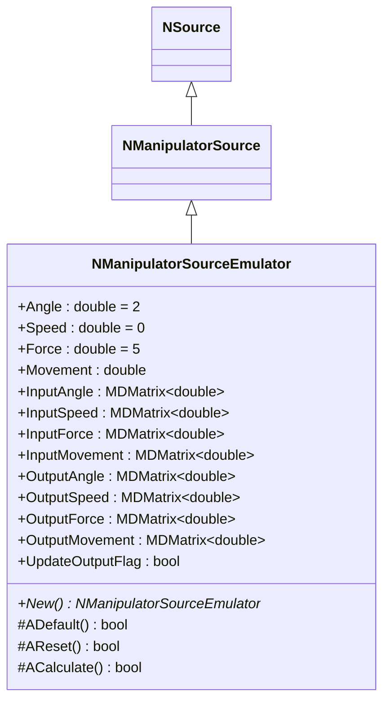
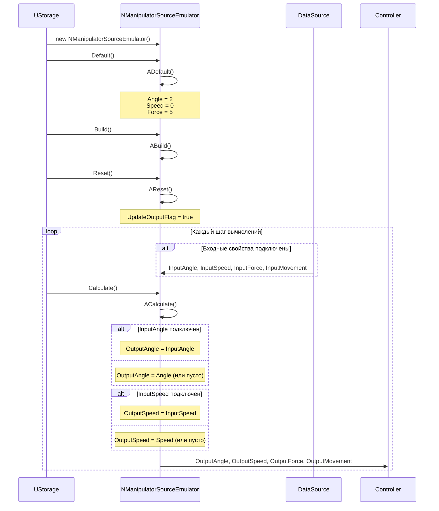
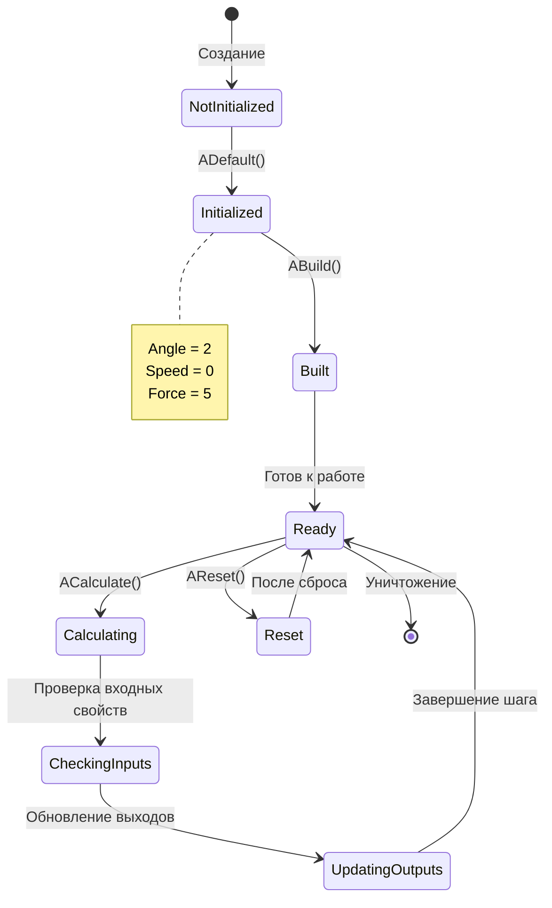
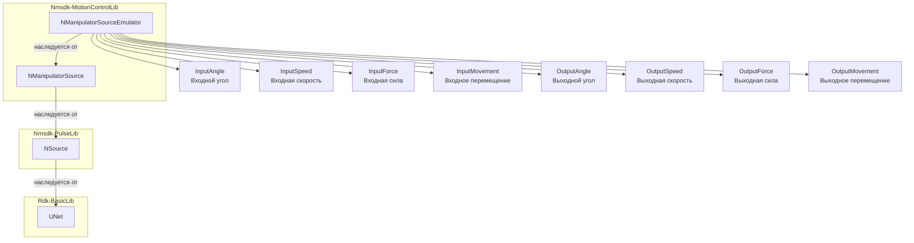
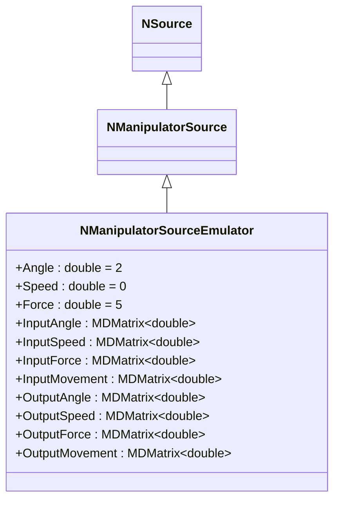
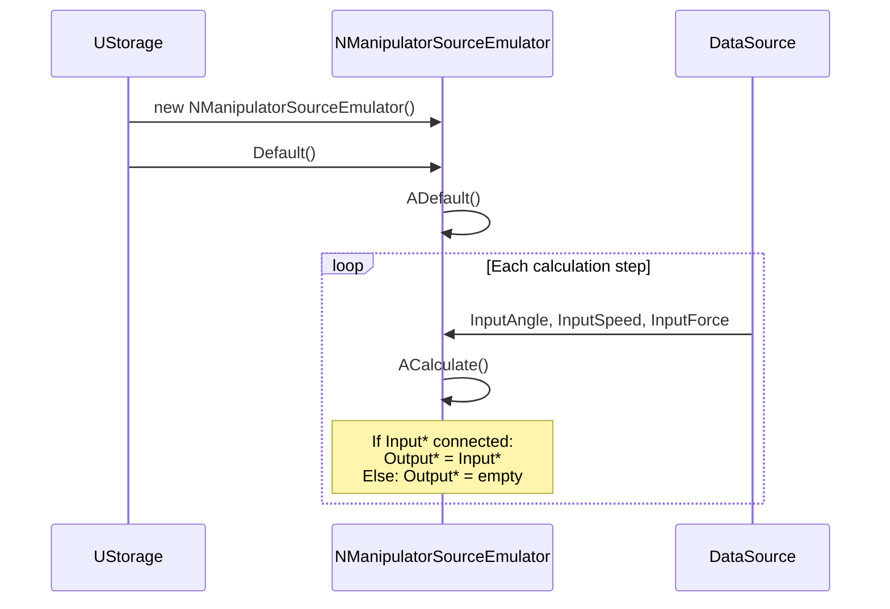
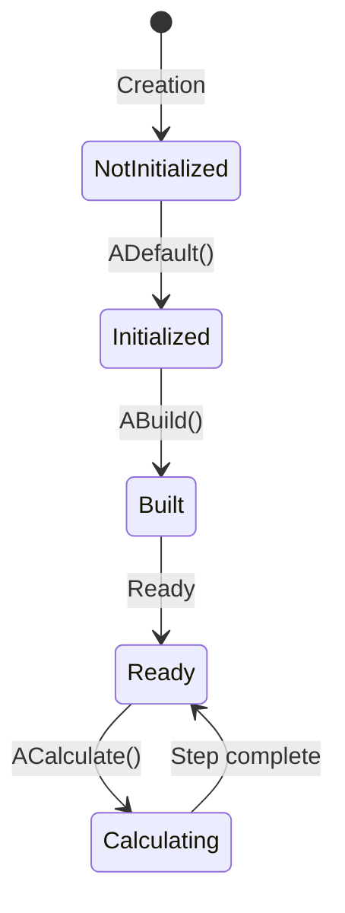

# NManipulatorSourceEmulator — эмулятор источника манипулятора

## RU

**Класс**: `NManipulatorSourceEmulator` — эмулятор источника данных о состоянии манипулятора, упрощённая версия `NManipulatorSource` для тестирования и отладки.
**Регистрация**: `NMotionControlLibrary.cpp` → `UploadClass("NManipulatorSourceEmulator", ...)`.
**Базовый класс**: `NManipulatorSource` (из Nmsdk-MotionControlLib).

NManipulatorSourceEmulator является упрощённой версией `NManipulatorSource`, предназначенной для эмуляции состояния манипулятора. Компонент наследует все свойства базового класса и устанавливает значения по умолчанию (Angle=2, Speed=0, Force=5). Если входные свойства подключены, компонент передаёт их значения на выходы, иначе использует внутренние параметры. Используется для тестирования систем управления манипулятором без реального физического устройства.

## UML-диаграмма классов



**Иерархия наследования:**
- `NSource` (Nmsdk-PulseLib) — базовый класс для источников сигналов
- `NManipulatorSource` — базовый класс источника данных манипулятора
- `NManipulatorSourceEmulator` — эмулятор источника данных манипулятора

## UML-диаграмма последовательности



**Описание жизненного цикла:**
1. **Создание** - компонент создаётся через конструктор
2. **Инициализация (ADefault)** - установка значений по умолчанию: `Angle=2`, `Speed=0`, `Force=5`
3. **Построение (ABuild)** - подготовка к работе (наследуется от базового класса)
4. **Сброс (AReset)** - установка `UpdateOutputFlag=true` и сброс состояния
5. **Вычисление (ACalculate)** - передача входных данных на выходы, если они подключены, иначе использование внутренних параметров

## UML-диаграмма состояний



**Состояния компонента:**
- **NotInitialized** - компонент создан, но не инициализирован
- **Initialized** - компонент инициализирован с значениями по умолчанию
- **Built** - готов к работе
- **Ready** - готов к вычислениям
- **Calculating** - выполняется вычисление
- **CheckingInputs** - проверка подключения входных свойств
- **UpdatingOutputs** - обновление выходных свойств
- **Reset** - состояние после сброса

## UML-диаграмма активности

```mermaid
flowchart TD
    Start([Начало ACalculate]) --> CheckInputAngle["InputAngle<br/>подключен?"]
    CheckInputAngle -->|Да| ReadInputAngle[OutputAngle = InputAngle]
    CheckInputAngle -->|Нет| ResizeAngleZero[OutputAngle.Resize(0,0)]
    ReadInputAngle --> CheckInputSpeed
    ResizeAngleZero --> CheckInputSpeed["InputSpeed<br/>подключен?"]
    CheckInputSpeed -->|Да| ReadInputSpeed[OutputSpeed = InputSpeed]
    CheckInputSpeed -->|Нет| ResizeSpeedZero[OutputSpeed.Resize(0,0)]
    ReadInputSpeed --> CheckInputForce
    ResizeSpeedZero --> CheckInputForce["InputForce<br/>подключен?"]
    CheckInputForce -->|Да| ReadInputForce[OutputForce = InputForce]
    CheckInputForce -->|Нет| ResizeForceZero[OutputForce.Resize(0,0)]
    ReadInputForce --> CheckInputMovement
    ResizeForceZero --> CheckInputMovement["InputMovement<br/>подключен?"]
    CheckInputMovement -->|Да| ReadInputMovement[OutputMovement = InputMovement]
    CheckInputMovement -->|Нет| ResizeMovementZero[OutputMovement.Resize(0,0)]
    ReadInputMovement --> End([Конец])
    ResizeMovementZero --> End
```

**Алгоритм работы ACalculate:**
1. Для каждого входного свойства (InputAngle, InputSpeed, InputForce, InputMovement):
   - Если свойство подключено → копировать значение в соответствующее выходное свойство
   - Если свойство не подключено → обнулить соответствующее выходное свойство (Resize(0,0))
2. Внутренние параметры (Angle, Speed, Force, Movement) используются только если соответствующие входы не подключены (через базовый класс)

## UML-диаграмма компонентов



**Зависимости:**
- **Nmsdk-MotionControlLib**: базовый класс `NManipulatorSource`
- **Nmsdk-PulseLib**: базовый класс `NSource`
- **Rdk-BasicLib**: базовый фреймворк (`UNet`)

## Свойства компонента

### Параметры (ptPubParameter)

| Свойство | Тип | Значение по умолчанию | Описание |
|----------|-----|----------------------|----------|
| `Angle` | `double` | `2` | Угол манипулятора (используется если InputAngle не подключен) |
| `Speed` | `double` | `0` | Скорость манипулятора (используется если InputSpeed не подключен) |
| `Force` | `double` | `5` | Сила манипулятора (используется если InputForce не подключен) |
| `Movement` | `double` | - | Перемещение манипулятора (используется если InputMovement не подключен) |

### Входы (ptPubInput)

| Свойство | Тип | Флаги | Описание |
|----------|-----|-------|----------|
| `InputAngle` | `MDMatrix<double>` | `ptPubInput` | Входной угол манипулятора |
| `InputSpeed` | `MDMatrix<double>` | `ptPubInput` | Входная скорость манипулятора |
| `InputForce` | `MDMatrix<double>` | `ptPubInput` | Входная сила манипулятора |
| `InputMovement` | `MDMatrix<double>` | `ptPubInput` | Входное перемещение манипулятора |

### Выходы (ptOutput | ptPubState)

| Свойство | Тип | Флаги | Описание |
|----------|-----|-------|----------|
| `OutputAngle` | `MDMatrix<double>` | `ptOutput \| ptPubState` | Выходной угол манипулятора |
| `OutputSpeed` | `MDMatrix<double>` | `ptOutput \| ptPubState` | Выходная скорость манипулятора |
| `OutputForce` | `MDMatrix<double>` | `ptOutput \| ptPubState` | Выходная сила манипулятора |
| `OutputMovement` | `MDMatrix<double>` | `ptOutput \| ptPubState` | Выходное перемещение манипулятора |

### Внутренние свойства

| Свойство | Тип | Описание |
|----------|-----|----------|
| `UpdateOutputFlag` | `bool` | Флаг обновления выхода (устанавливается в `true` при сбросе) |

## Методы компонента

### Жизненный цикл

#### `ADefault() -> bool`
**Назначение**: Инициализация параметров по умолчанию.

**Описание**: Устанавливает `Angle=2`, `Speed=0`, `Force=5` и вызывает `NManipulatorSource::ADefault()`.

#### `AReset() -> bool`
**Назначение**: Сброс состояния компонента.

**Описание**: Устанавливает `UpdateOutputFlag=true` и вызывает `NManipulatorSource::AReset()`.

#### `ACalculate() -> bool`
**Назначение**: Передача входных данных на выходы или использование внутренних параметров.

**Алгоритм:**
1. Если `InputAngle` подключен → `OutputAngle = InputAngle`, иначе → `OutputAngle.Resize(0,0)`
2. Если `InputSpeed` подключен → `OutputSpeed = InputSpeed`, иначе → `OutputSpeed.Resize(0,0)`
3. Если `InputForce` подключен → `OutputForce = InputForce`, иначе → `OutputForce.Resize(0,0)`
4. Если `InputMovement` подключен → `OutputMovement = InputMovement`, иначе → `OutputMovement.Resize(0,0)`

**Возвращаемое значение**: `true` при успешном выполнении

## Примеры использования

### C++ код

```cpp
#include "NManipulatorSourceEmulator.h"

// Создание компонента
UEPtr<NManipulatorSourceEmulator> emulator = storage->CreateComponent<NManipulatorSourceEmulator>("ManSrcEmu1");

// Инициализация
emulator->Default();
emulator->Build();
emulator->Reset();

// В цикле вычислений
while (simulation_running) {
    // Вариант 1: Использование входных свойств
    emulator->InputAngle(0, 0) = simulated_angle;
    emulator->InputSpeed(0, 0) = simulated_speed;
    emulator->InputForce(0, 0) = simulated_force;

    emulator->Calculate();

    // Получение выходных данных
    double angle = emulator->OutputAngle(0, 0);
    double speed = emulator->OutputSpeed(0, 0);
    double force = emulator->OutputForce(0, 0);

    // Вариант 2: Использование внутренних параметров (если входы не подключены)
    // emulator->Angle = 2.5;
    // emulator->Speed = 1.0;
    // emulator->Force = 10.0;
}
```

### XML конфигурация

```xml
<Component>
    <ClassName>NManipulatorSourceEmulator</ClassName>
    <Name>ManSrcEmu1</Name>
    <Properties>
        <Angle>2</Angle>
        <Speed>0</Speed>
        <Force>5</Force>
    </Properties>
</Component>
```

## Связи с конфигурационными проектами

Компонент `NManipulatorSourceEmulator` используется в проектах, требующих:
- **Эмуляции состояния манипулятора** - для тестирования систем управления без физического устройства
- **Отладки систем управления** - для проверки работы контроллеров с синтетическими данными
- **Демонстрации функциональности** - для показа работы системы без реального манипулятора

Типичные сценарии использования:
- Тестирование алгоритмов управления манипулятором
- Отладка систем с обратной связью
- Демонстрационные проекты
- Обучение работе с системами управления движением

**Связь с другими компонентами:**
- Может подключаться к выходам моделей манипулятора (`NManipulator`, `NManipulatorAndGyro`)
- Выходы подключаются к контроллерам (`NEngineMotionControl`, `NPositionControlElement`) для обратной связи
- Часто используется вместе с `NManipulatorInputEmulator` для полной эмуляции манипулятора

**Отличия от NManipulatorSource:**
- `NManipulatorSourceEmulator` является упрощённой версией для эмуляции
- Основное отличие - предустановленные значения по умолчанию (Angle=2, Speed=0, Force=5)
- Предназначен для тестирования и отладки, а не для работы с реальным устройством

---

## EN

## NManipulatorSourceEmulator — manipulator source emulator (EN)

**Class**: `NManipulatorSourceEmulator` — emulator for manipulator state data source, simplified version of `NManipulatorSource` for testing and debugging.
**Registration**: `NMotionControlLibrary.cpp` → `UploadClass("NManipulatorSourceEmulator", ...)`.
**Base class**: `NManipulatorSource` (from Nmsdk-MotionControlLib).

NManipulatorSourceEmulator is a simplified version of `NManipulatorSource` designed for emulating manipulator state. The component inherits all properties from the base class and sets default values (Angle=2, Speed=0, Force=5). If input properties are connected, the component passes their values to outputs, otherwise uses internal parameters. Used for testing manipulator control systems without a real physical device.

## Class Diagram



## Sequence Diagram



## State Diagram



## Activity Diagram

```mermaid
flowchart TD
    Start([Start ACalculate]) --> CheckInputAngle["InputAngle<br/>connected?"]
    CheckInputAngle -->|Yes| ReadInputAngle[OutputAngle = InputAngle]
    CheckInputAngle -->|No| ResizeAngleZero[OutputAngle.Resize(0,0)]
    ReadInputAngle --> CheckInputSpeed["InputSpeed<br/>connected?"]
    ResizeAngleZero --> CheckInputSpeed
    CheckInputSpeed -->|Yes| ReadInputSpeed[OutputSpeed = InputSpeed]
    CheckInputSpeed -->|No| ResizeSpeedZero[OutputSpeed.Resize(0,0)]
    ReadInputSpeed --> End([End])
    ResizeSpeedZero --> End
```

## Properties

| Property | Type | Default | Description |
|----------|------|---------|-------------|
| `Angle` | `double` | `2` | Manipulator angle (used if InputAngle not connected) |
| `Speed` | `double` | `0` | Manipulator speed (used if InputSpeed not connected) |
| `Force` | `double` | `5` | Manipulator force (used if InputForce not connected) |
| `InputAngle` | `MDMatrix<double>` | - | Input angle |
| `OutputAngle` | `MDMatrix<double>` | - | Output angle |

## Methods

### Lifecycle Methods

#### `ADefault() -> bool`
**Purpose**: Initialize default parameters.

**Description**: Sets `Angle=2`, `Speed=0`, `Force=5` and calls `NManipulatorSource::ADefault()`.

#### `ACalculate() -> bool`
**Purpose**: Pass input data to outputs or use internal parameters.

**Description**: If input properties are connected, copies their values to outputs, otherwise resizes outputs to (0,0).

## Usage Examples

### C++ Code

```cpp
UEPtr<NManipulatorSourceEmulator> emulator = storage->CreateComponent<NManipulatorSourceEmulator>("ManSrcEmu1");
emulator->Default();
emulator->Build();
emulator->Reset();

while (simulation_running) {
    emulator->InputAngle(0, 0) = simulated_angle;
    emulator->InputSpeed(0, 0) = simulated_speed;
    emulator->Calculate();
    double angle = emulator->OutputAngle(0, 0);
}
```

### XML Configuration

```xml
<Component>
    <ClassName>NManipulatorSourceEmulator</ClassName>
    <Name>ManSrcEmu1</Name>
    <Properties>
        <Angle>2</Angle>
        <Speed>0</Speed>
        <Force>5</Force>
    </Properties>
</Component>
```

## References
- [Literature-References.md](../Literature-References.md): [A], 19, 21 — эмулятор источника манипулятора в иерархии управления.
