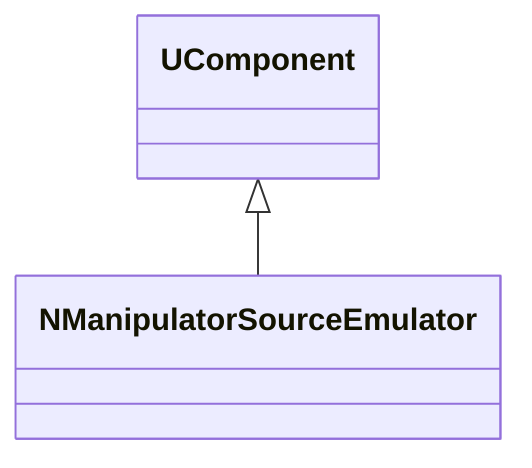
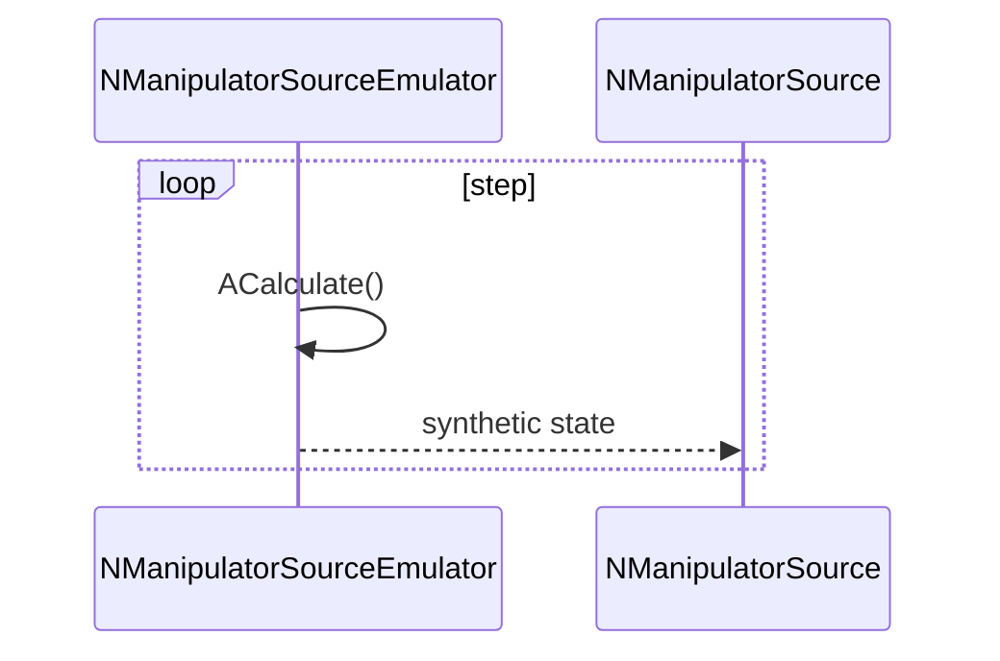
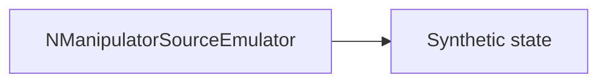
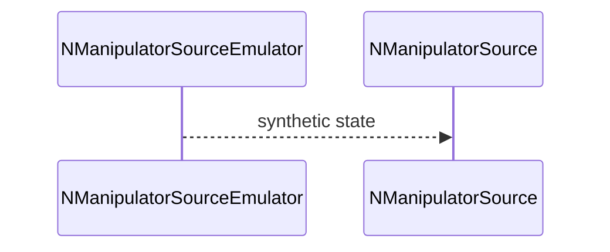

## NManipulatorSourceEmulator — эмулятор источника манипулятора

**Класс**: `NManipulatorSourceEmulator` — генерирует синтетические состояния/наблюдения манипулятора.  
**Регистрация**: `UploadClass("NManipulatorSourceEmulator", ...)` в `NMotionControlLibrary.cpp`.

### Lifecycle
- **ADefault**: стартовый сценарий.
- **ABuild**: подготовка генераторов/шумов.
- **AReset**: сброс сценария.
- **ACalculate**: выдача очередного состояния.

### I/O
- Выход: состояние/наблюдения для `NManipulatorSource`/`NManipulator`.



Пояснение: диаграмма классов показывает место компонента в иерархии и ключевые связи.



Пояснение: диаграмма последовательности показывает типовой сценарий взаимодействия и порядок вызовов.



Пояснение: блок-схема показывает поток данных/сигналов (входы → компонент → выходы).

### Config snippet

```ini
[Component]
ClassName = NManipulatorSourceEmulator
Name = ManSrcEmu1
```

---

## NManipulatorSourceEmulator — manipulator source emulator (EN)

Produces synthetic manipulator states/observations for testing.


Description: this class diagram shows the component position in the type hierarchy and key relations.



Description: this sequence diagram shows a typical runtime interaction and call order.


Description: this flowchart shows the data/signal flow (inputs → component → outputs).
