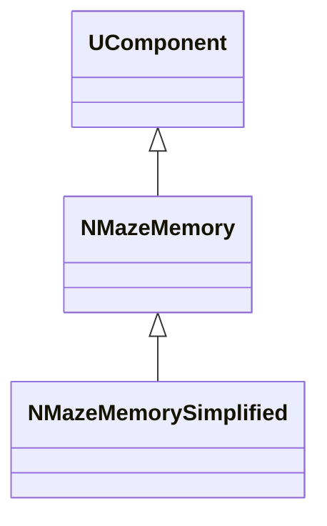
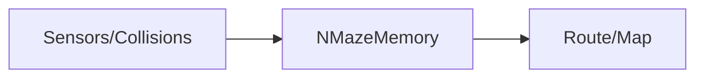
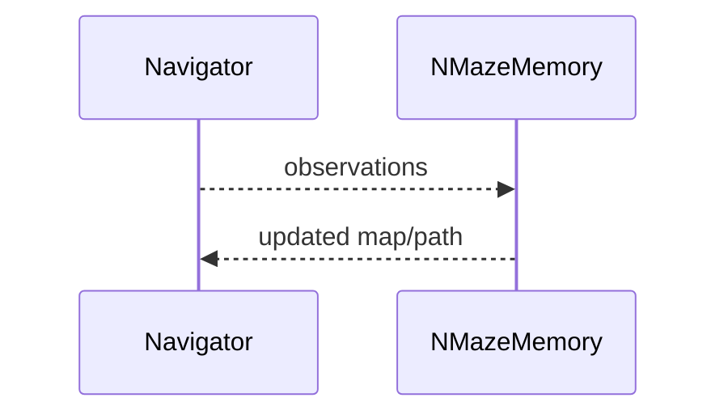

## NMazeMemory / NMazeMemorySimplified — память/навигация в лабиринте

**Классы**: `NMazeMemory`, `NMazeMemorySimplified` — хранение/обновление карты/памяти для навигации.  
**Регистрация**: `NMotionControlLibrary.cpp` → `UploadClass("NMazeMemory", ...)`, `"NMazeMemorySimplified"`.

### Входы/выходы
- Вход: сенсорные события/позиция, столкновения.
- Выход: обновлённая карта/решение маршрута.

Пояснение: блок-схема показывает поток данных/сигналов (входы → компонент → выходы).

Пояснение: диаграмма последовательности показывает типовой сценарий взаимодействия и порядок вызовов.

---

## NMazeMemory — maze memory

Maintains map for navigation; simplified version offers lightweight variant.
