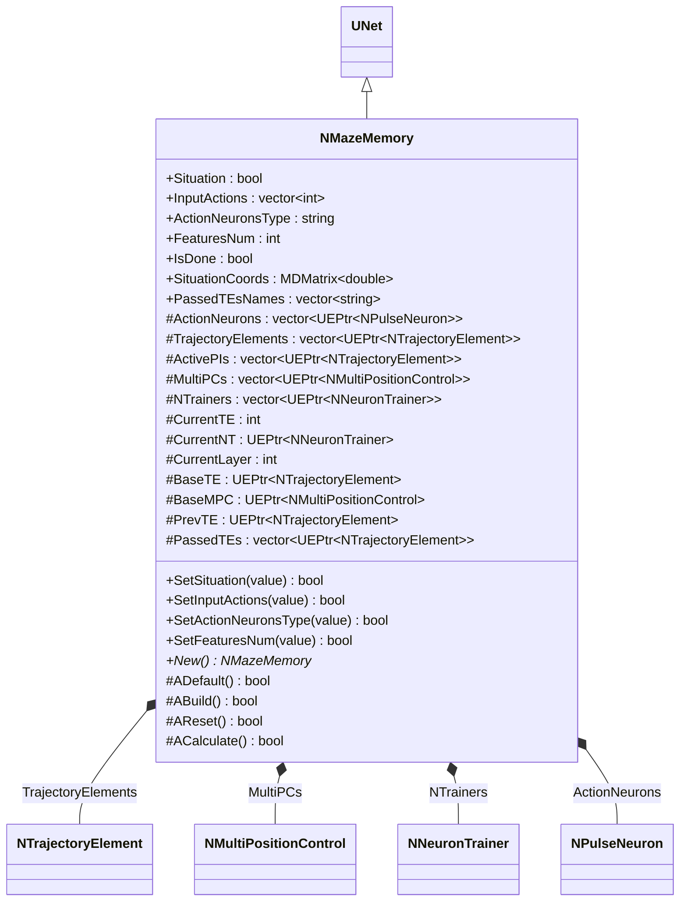
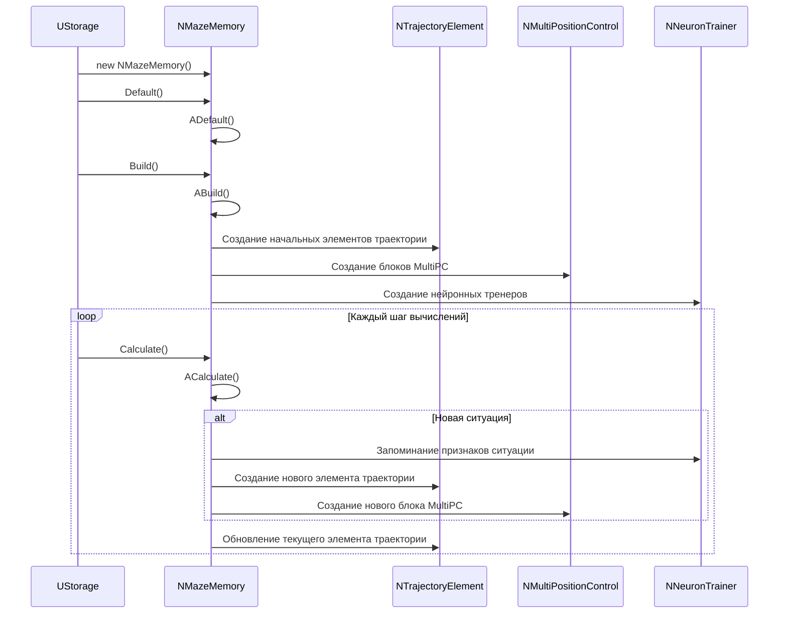
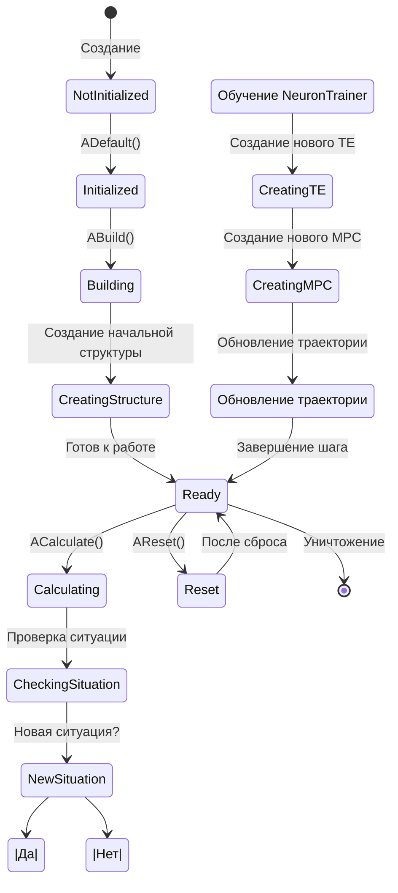
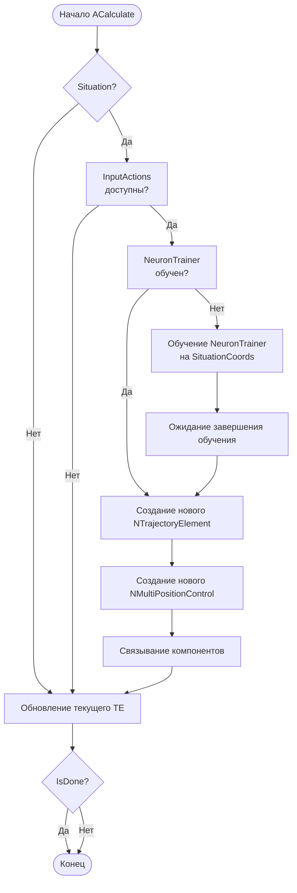
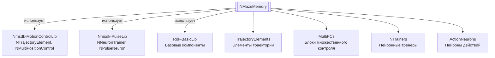

# NMazeMemory — память лабиринта

## RU

**Класс**: `NMazeMemory` — компонент для создания и управления памятью лабиринта с использованием элементов траектории (NTrajectoryElement), блоков множественного контроля позиции (NMultiPositionControl) и нейронных тренеров (NNeuronTrainer).
**Регистрация**: `NMotionControlLibrary.cpp` → `UploadClass("NMazeMemory", ...)`.
**Базовый класс**: `UNet` (из Rdk Framework).

NMazeMemory реализует систему памяти лабиринта, которая запоминает пройденные пути, создает новые элементы траектории при обнаружении новых ситуаций, и использует нейронные тренеры для запоминания признаков ситуаций. Компонент создает сложную динамическую структуру для навигации в лабиринте.

## UML-диаграмма классов



**Иерархия наследования:**
- `UNet` (Rdk Framework) — базовый класс для сетей компонентов
- `NMazeMemory` — память лабиринта

## UML-диаграмма последовательности



## UML-диаграмма состояний



## UML-диаграмма активности



## UML-диаграмма компонентов



## Свойства

### Параметры ситуации

| Свойство | Тип | Флаги | Описание | Значение по умолчанию |
|----------|-----|-------|----------|----------------------|
| `Situation` | `bool` | `ptPubParameter` | Флаг ситуации с множественным выбором (перекресток, развилка) | `false` |
| `InputActions` | `std::vector<int>` | `ptPubParameter` | Вектор возможных действий: [0]=направо, [1]=налево, [2]=прямо, [3]=стоп | `[0,0,0]` |
| `SituationCoords` | `MDMatrix<double>` | `ptPubParameter` | Координаты ситуации (x, y, alpha, ...) | Задается пользователем |
| `FeaturesNum` | `int` | `ptPubParameter` | Количество признаков ситуации | `4` |
| `ActionNeuronsType` | `string` | `ptPubParameter` | Тип нейронов действий | `"NSPNeuronGen"` |
| `IsDone` | `bool` | `ptPubParameter` | Флаг завершения работы (все варианты исследованы) | `false` |
| `PassedTEsNames` | `std::vector<string>` | `ptPubParameter` | Имена пройденных элементов траектории | Задается пользователем |

### Защищенные переменные

| Свойство | Тип | Описание |
|----------|-----|----------|
| `ActionNeurons` | `std::vector<UEPtr<NPulseNeuron>>` | Вектор нейронов действий |
| `TrajectoryElements` | `std::vector<UEPtr<NTrajectoryElement>>` | Вектор всех элементов траектории |
| `ActivePIs` | `std::vector<UEPtr<NTrajectoryElement>>` | Активные PostInput нейроны |
| `MultiPCs` | `std::vector<UEPtr<NMultiPositionControl>>` | Блоки множественного контроля позиции |
| `NTrainers` | `std::vector<UEPtr<NNeuronTrainer>>` | Нейронные тренеры для запоминания признаков |
| `CurrentTE` | `int` | Индекс текущего элемента траектории |
| `CurrentNT` | `UEPtr<NNeuronTrainer>` | Текущий нейронный тренер |
| `CurrentLayer` | `int` | Номер текущего слоя |
| `BaseTE` | `UEPtr<NTrajectoryElement>` | Текущий элемент траектории |
| `BaseMPC` | `UEPtr<NMultiPositionControl>` | MultiPC текущего элемента |
| `PrevTE` | `UEPtr<NTrajectoryElement>` | Предыдущий элемент траектории |
| `PassedTEs` | `std::vector<UEPtr<NTrajectoryElement>>` | Пройденные элементы траектории |

## Методы

### Конструкторы и деструкторы

#### `NMazeMemory(void)`
**Назначение:** Конструктор компонента
**Параметры:** Нет
**Возвращаемое значение:** Нет

#### `virtual ~NMazeMemory(void)`
**Назначение:** Деструктор компонента
**Параметры:** Нет
**Возвращаемое значение:** Нет

### Методы жизненного цикла

#### `virtual bool ADefault(void)`
**Назначение:** Инициализация значений по умолчанию
**Параметры:** Нет
**Возвращаемое значение:** `true` при успехе
**Описание:** Устанавливает Situation=false, InputActions=[0,0,0], ActionNeuronsType="NSPNeuronGen", FeaturesNum=4, IsDone=false, инициализирует внутренние переменные

#### `virtual bool ABuild(void)`
**Назначение:** Построение внутренней структуры компонента
**Параметры:** Нет
**Возвращаемое значение:** `true` при успехе
**Описание:** Создает начальную структуру:
1. Создает начальные элементы траектории, если их нет
2. Создает нейроны действий
3. Создает блоки MultiPC и нейронные тренеры
4. Создает связи между компонентами

#### `virtual bool AReset(void)`
**Назначение:** Сброс состояния компонента
**Параметры:** Нет
**Возвращаемое значение:** `true` при успехе

#### `virtual bool ACalculate(void)`
**Назначение:** Выполнение вычислений на текущем шаге
**Параметры:** Нет
**Возвращаемое значение:** `true` при успехе
**Описание:**
1. Проверяет наличие ситуации (Situation)
2. Если новая ситуация, обучает NeuronTrainer на SituationCoords
3. Создает новые элементы траектории и блоки MultiPC при необходимости
4. Обновляет текущий элемент траектории
5. Управляет переходами между элементами траектории

### Сеттеры свойств

Все сеттеры свойств обновляют соответствующие параметры внутренних компонентов.

### Публичные методы

#### `virtual NMazeMemory* New(void)`
**Назначение:** Создание нового экземпляра компонента
**Параметры:** Нет
**Возвращаемое значение:** Указатель на новый экземпляр

## Примеры использования

### C++ код

```cpp
#include "NMazeMemory.h"

UEPtr<NMazeMemory> memory = new NMazeMemory;
memory->Default();
memory->FeaturesNum = 4;  // x, y, alpha, calibration
memory->ActionNeuronsType = "NSPNeuronGen";
memory->Build();
```

### XML конфигурация

```xml
<Object Name="MazeMemory" ClassName="NMazeMemory">
    <Property Name="FeaturesNum" Value="4" />
    <Property Name="ActionNeuronsType" Value="NSPNeuronGen" />
    <Property Name="Situation" Value="false" />
    <Property Name="InputActions" Value="0,0,0" />
</Object>
```

### Использование в конфигурациях

Компонент `NMazeMemory` используется для создания и управления памятью лабиринта в системах навигации.

**Типичные сценарии использования:**
1. **Навигация в лабиринте** - запоминание пройденных путей и создание карты лабиринта
2. **Обучение навигации** - обучение системы навигации на основе опыта

**Типичные комбинации:**
- `NMazeMemory` + `NNavMousePrimitive` - навигация мыши с памятью
- `NMazeMemory` + `NTrajectoryElement` - построение графа траекторий

---

## EN

NMazeMemory — maze memory

**Class**: `NMazeMemory` — component for creating and managing maze memory using trajectory elements (NTrajectoryElement), multi-position control blocks (NMultiPositionControl), and neural trainers (NNeuronTrainer).
**Registration**: `NMotionControlLibrary.cpp` → `UploadClass("NMazeMemory", ...)`.
**Base class**: `UNet` (from Rdk Framework).

NMazeMemory implements a maze memory system that remembers traversed paths, creates new trajectory elements upon discovering new situations, and uses neural trainers to remember situation features. The component creates a complex dynamic structure for maze navigation.

## Class Diagram

[Same as RU section]

## Sequence Diagram

[Same as RU section]

## State Diagram

[Same as RU section]

## Activity Diagram

[Same as RU section]

## Component Diagram

[Same as RU section]

## Properties

[Same structure as RU section, translated to English]

## Methods

[Same structure as RU section, translated to English]

## Usage Examples

[Same as RU section, with English comments]

## Источники

- [Literature-References.md](../Literature-References.md): [A], 22, 24 — моторная память, запоминание пространственных конфигураций.
