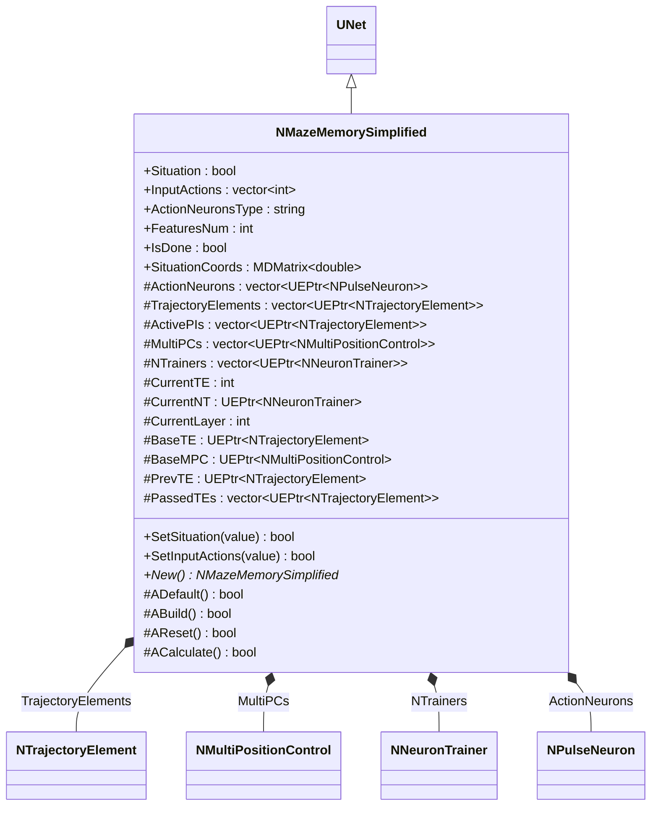
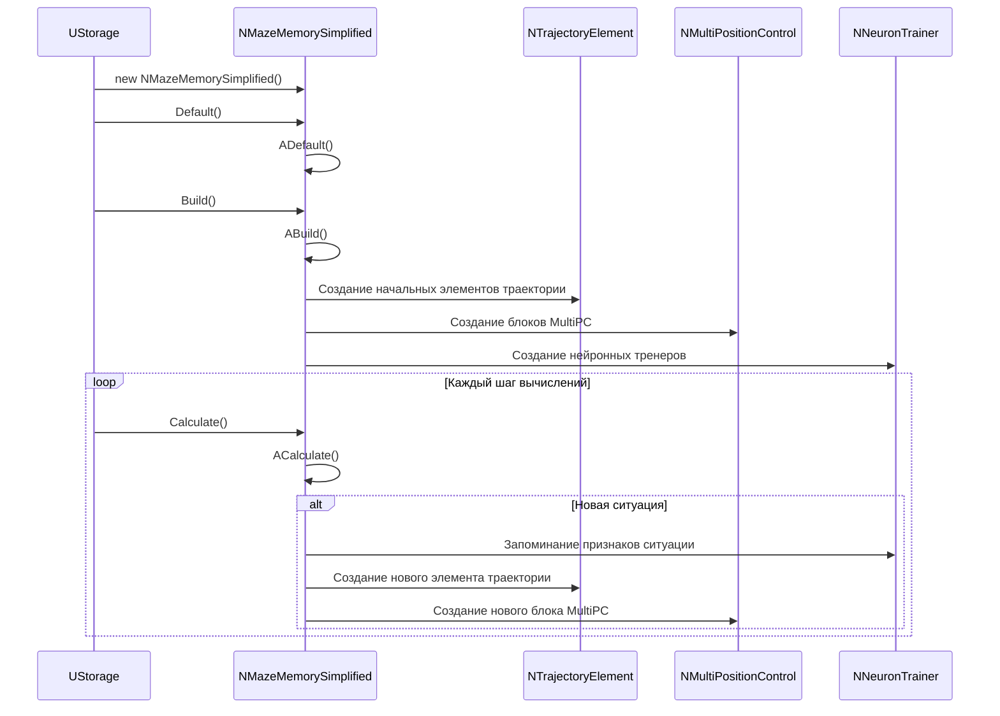
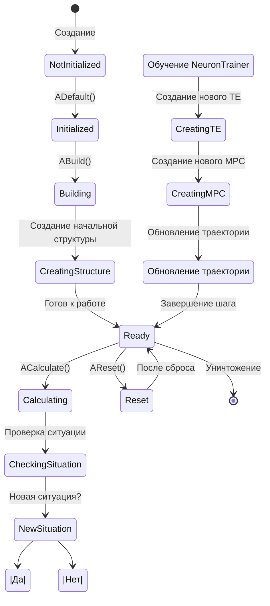
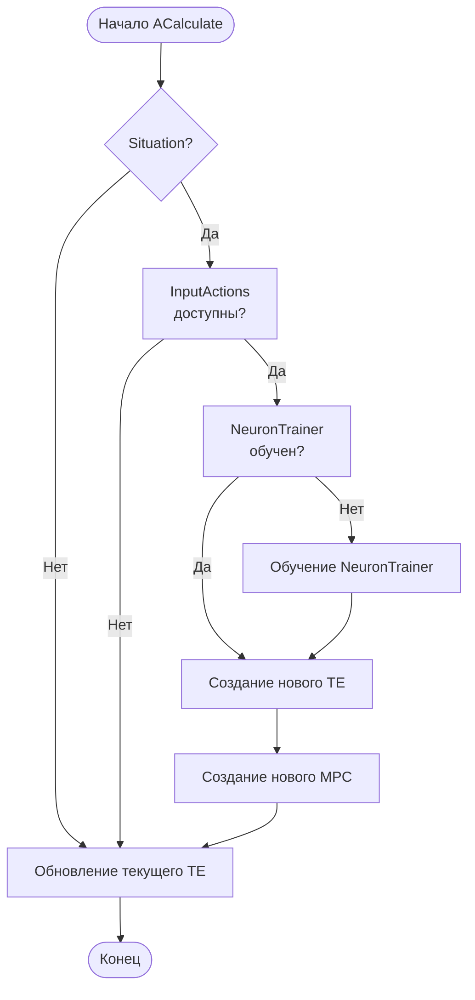
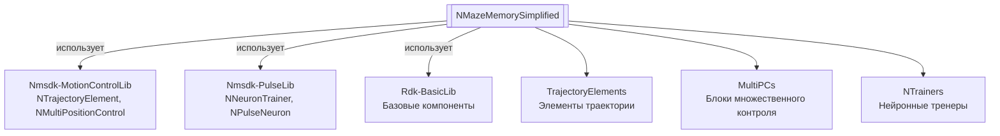
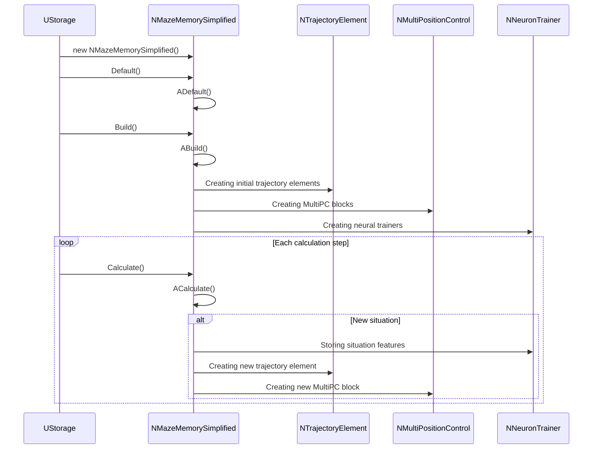
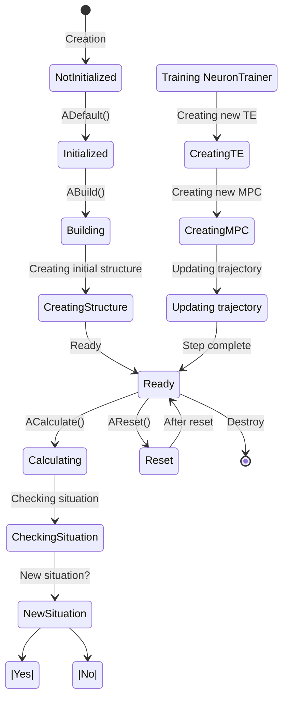
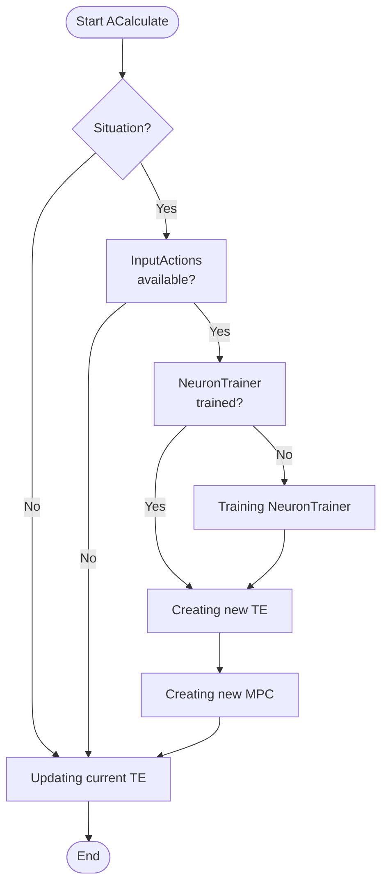
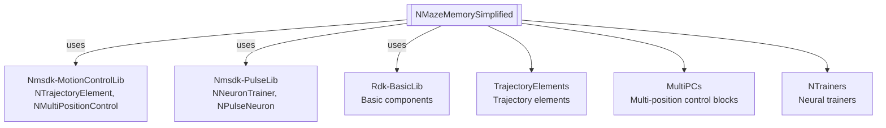

# NMazeMemorySimplified — упрощенная память лабиринта

## RU

**Класс**: `NMazeMemorySimplified` — упрощенная версия компонента памяти лабиринта с использованием элементов траектории (NTrajectoryElement), блоков множественного контроля позиции (NMultiPositionControl) и нейронных тренеров (NNeuronTrainer).
**Регистрация**: `NMotionControlLibrary.cpp` → `UploadClass("NMazeMemorySimplified", ...)`.
**Базовый класс**: `UNet` (из Rdk Framework).

NMazeMemorySimplified является упрощенной версией NMazeMemory, реализующей систему памяти лабиринта с упрощенной логикой создания и управления элементами траектории.

## UML-диаграмма классов



**Иерархия наследования:**
- `UNet` (Rdk Framework) — базовый класс для сетей компонентов
- `NMazeMemorySimplified` — упрощенная память лабиринта

## UML-диаграмма последовательности



## UML-диаграмма состояний



## UML-диаграмма активности



## UML-диаграмма компонентов



## Свойства

### Параметры ситуации

| Свойство | Тип | Флаги | Описание | Значение по умолчанию |
|----------|-----|-------|----------|----------------------|
| `Situation` | `bool` | `ptPubParameter` | Флаг ситуации с множественным выбором | `false` |
| `InputActions` | `std::vector<int>` | `ptPubParameter` | Вектор возможных действий | `[0,0,0]` |
| `SituationCoords` | `MDMatrix<double>` | `ptPubParameter` | Координаты ситуации | Задается пользователем |
| `FeaturesNum` | `int` | `ptPubParameter` | Количество признаков ситуации | `4` |
| `ActionNeuronsType` | `string` | `ptPubParameter` | Тип нейронов действий | `"NSPNeuronGen"` |
| `IsDone` | `bool` | `ptPubParameter` | Флаг завершения работы | `false` |

### Защищенные переменные

[Аналогично NMazeMemory, но без некоторых сложных механизмов]

## Методы

### Конструкторы и деструкторы

#### `NMazeMemorySimplified(void)`
**Назначение:** Конструктор компонента
**Параметры:** Нет
**Возвращаемое значение:** Нет

#### `virtual ~NMazeMemorySimplified(void)`
**Назначение:** Деструктор компонента
**Параметры:** Нет
**Возвращаемое значение:** Нет

### Методы жизненного цикла

#### `virtual bool ADefault(void)`
**Назначение:** Инициализация значений по умолчанию
**Параметры:** Нет
**Возвращаемое значение:** `true` при успехе
**Описание:** Аналогично NMazeMemory, но без некоторых сложных механизмов

#### `virtual bool ABuild(void)`
**Назначение:** Построение внутренней структуры компонента
**Параметры:** Нет
**Возвращаемое значение:** `true` при успехе
**Описание:** Создает упрощенную структуру аналогично NMazeMemory

#### `virtual bool AReset(void)`
**Назначение:** Сброс состояния компонента
**Параметры:** Нет
**Возвращаемое значение:** `true` при успехе

#### `virtual bool ACalculate(void)`
**Назначение:** Выполнение вычислений на текущем шаге
**Параметры:** Нет
**Возвращаемое значение:** `true` при успехе
**Описание:** Упрощенная логика по сравнению с NMazeMemory

### Публичные методы

#### `virtual NMazeMemorySimplified* New(void)`
**Назначение:** Создание нового экземпляра компонента
**Параметры:** Нет
**Возвращаемое значение:** Указатель на новый экземпляр

## Примеры использования

### C++ код

```cpp
#include "NMazeMemorySimplified.h"

UEPtr<NMazeMemorySimplified> memory = new NMazeMemorySimplified;
memory->Default();
memory->FeaturesNum = 4;
memory->Build();
```

### XML конфигурация

```xml
<Object Name="MazeMemorySimplified" ClassName="NMazeMemorySimplified">
    <Property Name="FeaturesNum" Value="4" />
    <Property Name="ActionNeuronsType" Value="NSPNeuronGen" />
</Object>
```

### Использование в конфигурациях

Компонент `NMazeMemorySimplified` используется как упрощенная версия NMazeMemory для навигации в лабиринте.

**Типичные сценарии использования:**
1. **Упрощенная навигация** - навигация в лабиринте с упрощенной логикой
2. **Быстрое прототипирование** - быстрое создание систем навигации

**Типичные комбинации:**
- `NMazeMemorySimplified` + `NNavMousePrimitive` - упрощенная навигация мыши

---

## EN

NMazeMemorySimplified — simplified maze memory

**Class**: `NMazeMemorySimplified` — simplified version of maze memory component using trajectory elements (NTrajectoryElement), multi-position control blocks (NMultiPositionControl), and neural trainers (NNeuronTrainer).
**Registration**: `NMotionControlLibrary.cpp` → `UploadClass("NMazeMemorySimplified", ...)`.
**Base class**: `UNet` (from Rdk Framework).

NMazeMemorySimplified is a simplified version of NMazeMemory, implementing a maze memory system with simplified logic for creating and managing trajectory elements.

## Class Diagram


## Sequence Diagram



## State Diagram



## Activity Diagram



## Component Diagram



## Properties

[Same structure as RU section, translated to English]

## Methods

[Same structure as RU section, translated to English]

## Usage Examples

[Same as RU section, with English comments]

## References

- [Literature-References.md](../Literature-References.md): [A], 22, 24 — maze memory, spatial configurations.
