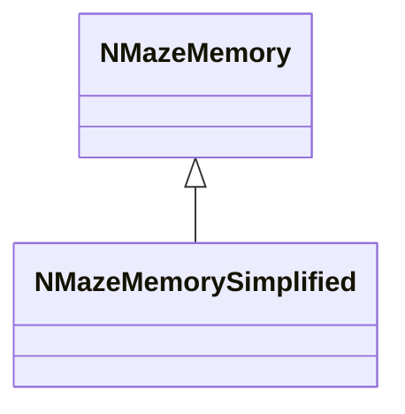
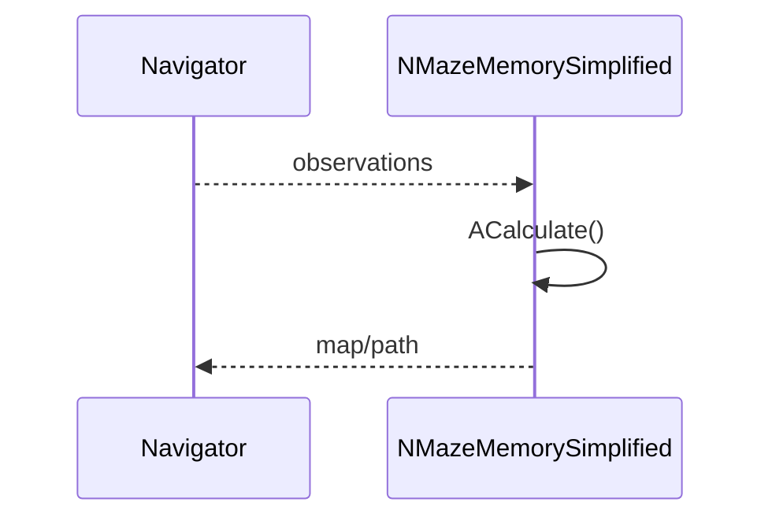
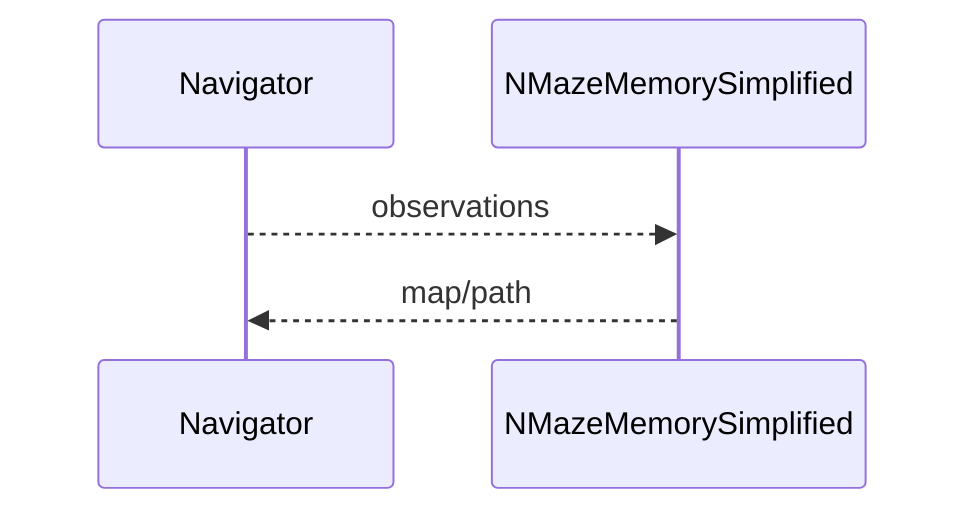

## NMazeMemorySimplified — упрощённая память лабиринта

**Класс**: `NMazeMemorySimplified` — облегчённая версия `NMazeMemory`.  
**Регистрация**: `UploadClass("NMazeMemorySimplified", ...)` в `NMotionControlLibrary.cpp`.

### Lifecycle
- **ADefault/ABuild/AReset**: инициализация карты и сброс.
- **ACalculate**: обновление памяти/карты по наблюдениям.

### I/O
- Вход: события/позиция/столкновения.
- Выход: обновлённая карта/решение.



Пояснение: диаграмма классов показывает место компонента в иерархии и ключевые связи.



Пояснение: диаграмма последовательности показывает типовой сценарий взаимодействия и порядок вызовов.


Пояснение: блок-схема показывает поток данных/сигналов (входы → компонент → выходы).

### Config snippet

```ini
[Component]
ClassName = NMazeMemorySimplified
Name = MazeMemS1
```

---

## NMazeMemorySimplified — simplified maze memory (EN)

Lightweight maze memory/map updater.


Description: this class diagram shows the component position in the type hierarchy and key relations.



Description: this sequence diagram shows a typical runtime interaction and call order.


Description: this flowchart shows the data/signal flow (inputs → component → outputs).
