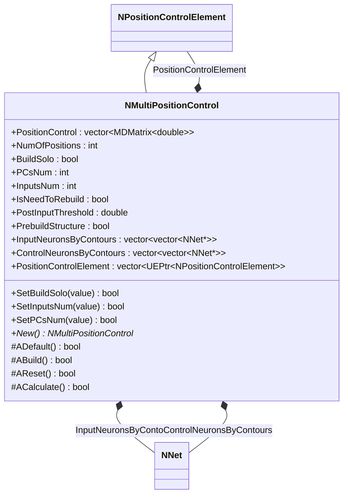
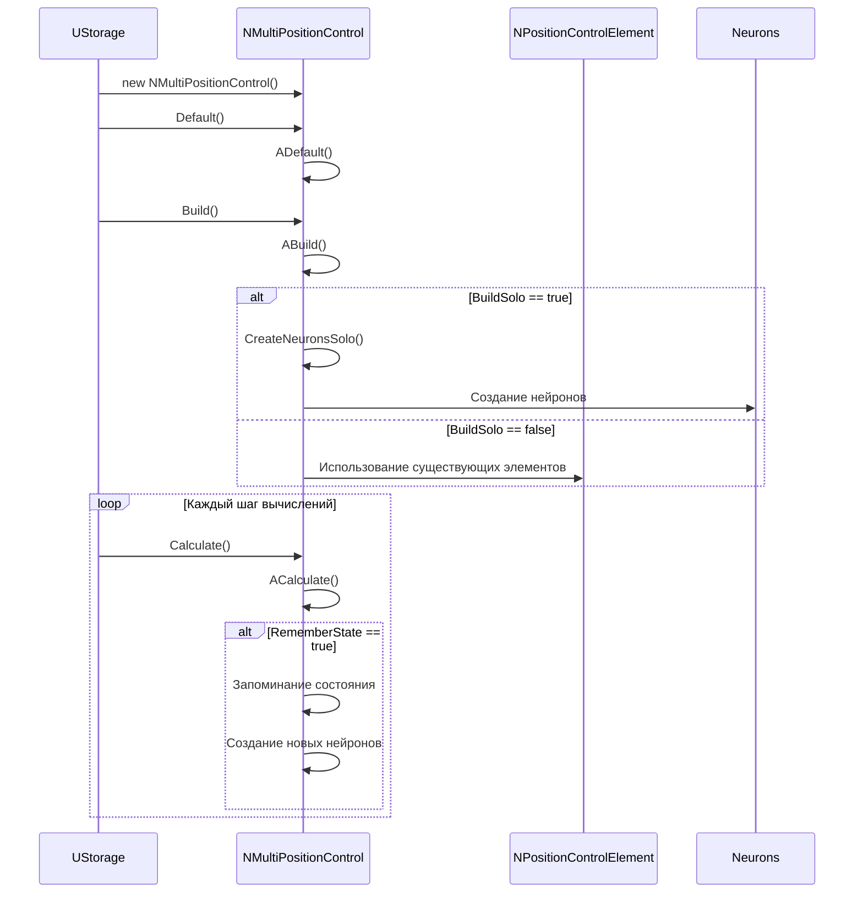
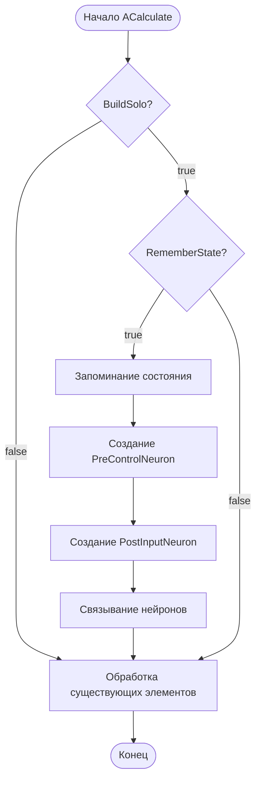
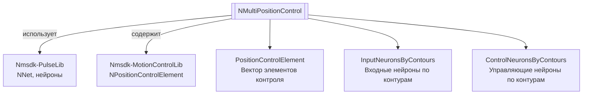
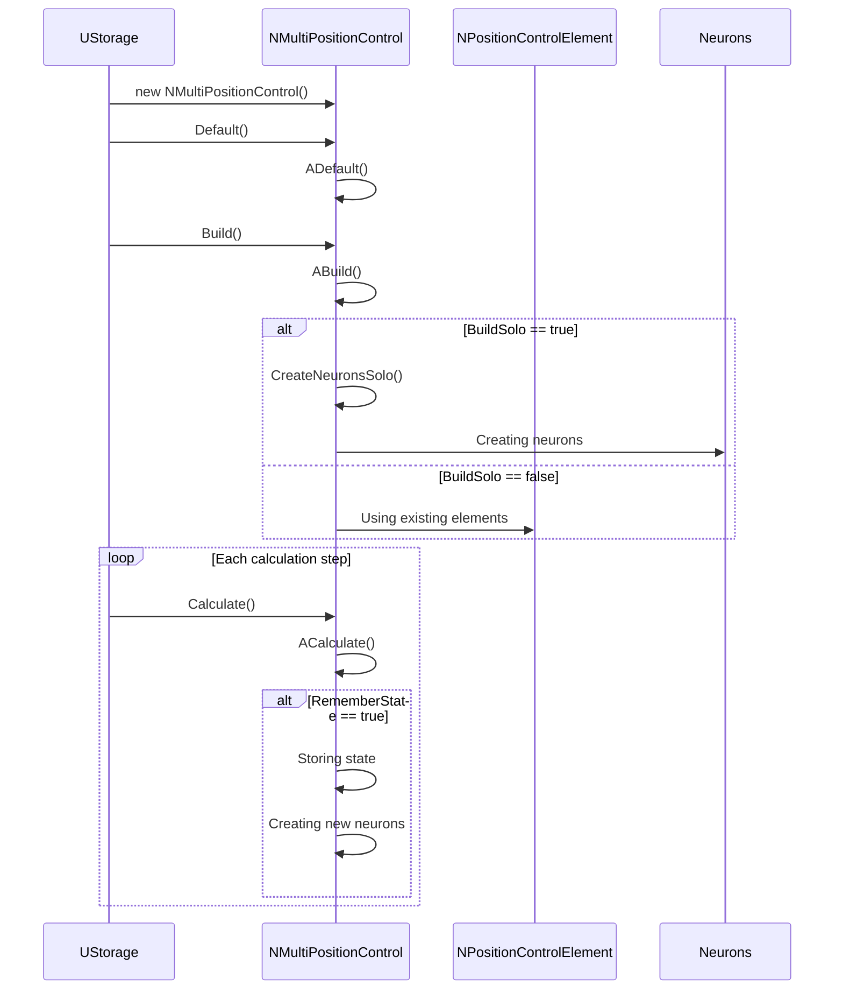
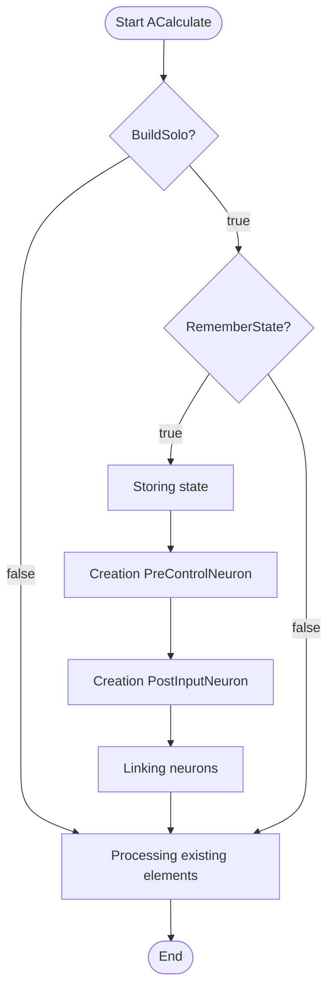
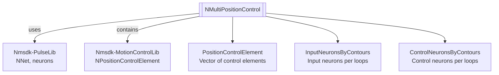

# NMultiPositionControl — множественный контроль позиции

## RU

**Класс**: `NMultiPositionControl` — элемент контроля позиции для управления несколькими позициями одновременно с поддержкой запоминания состояний.
**Регистрация**: `NMotionControlLibrary.cpp` → `UploadClass("NMultiPositionControl", ...)`.
**Базовый класс**: `NPositionControlElement` (из Nmsdk-MotionControlLib).

NMultiPositionControl расширяет NPositionControlElement для управления множественными позициями. Компонент может работать в двух режимах: BuildSolo=true (создает собственную структуру) или BuildSolo=false (использует существующие NNewPositionControl элементы). Поддерживает запоминание состояний и динамическое создание нейронов.

## UML-диаграмма классов



**Иерархия наследования:**
- `UNet` (Rdk Framework) — базовый класс для сетей компонентов
- `NPositionControlElement` — базовый элемент контроля позиции
- `NMultiPositionControl` — множественный контроль позиции

## UML-диаграмма последовательности



## UML-диаграмма состояний

```mermaid
stateDiagram-v2
    [*] --> NotInitialized: Создание
    NotInitialized --> Initialized: ADefault()
    Initialized --> Building: ABuild()
    Building --> CheckingMode{BuildSolo?}
    CheckingMode -->|Да| CreatingSolo: CreateNeuronsSolo()
    CheckingMode -->|Нет| UsingExisting: Использование существующих
    CreatingSolo --> Ready: Готов к работе
    UsingExisting --> Ready: Готов к работе
    Ready --> Calculating: ACalculate()
    Calculating --> Remembering{RememberState?}
    Remembering -->|Да| CreatingNew: Создание новых нейронов
    Remembering -->|Нет| Ready: Завершение шага
    CreatingNew --> Ready: После создания
    Ready --> Reset: AReset()
    Reset --> Ready: После сброса
    Ready --> [*]: Уничтожение
```

## UML-диаграмма активности



## UML-диаграмма компонентов



## Свойства

### Параметры

| Свойство | Тип | Флаги | Описание | Значение по умолчанию |
|----------|-----|-------|----------|----------------------|
| `PositionControl` | `std::vector<MDMatrix<double>>` | `ptPubInput` | Вектор элементов контроля позиции | Пустой вектор |
| `NumOfPositions` | `int` | `ptPubParameter` | Количество позиций | `0` |
| `BuildSolo` | `bool` | `ptPubParameter` | Режим построения: true=создает собственную структуру, false=использует существующие элементы | `true` |
| `PCsNum` | `int` | `ptPubParameter` | Количество элементов контроля позиции (при BuildSolo=true) | `1` |
| `InputsNum` | `int` | `ptPubParameter` | Количество входных нейронов (при BuildSolo=true) | `0` |
| `IsNeedToRebuild` | `bool` | `ptPubParameter` | Необходимость перестроения структуры | `false` |
| `PostInputThreshold` | `double` | `ptPubParameter` | Порог для PostInput нейронов | `0.024` |
| `PrebuildStructure` | `bool` | `ptPubParameter` | Предварительное построение структуры (для MazeMemory) | `false` |

### Внутренние коллекции

| Свойство | Тип | Описание |
|----------|-----|----------|
| `InputNeuronsByContours` | `vector<vector<NNet*>>` | Входные нейроны, организованные по контурам управления |
| `ControlNeuronsByContours` | `vector<vector<NNet*>>` | Управляющие нейроны, организованные по контурам управления |
| `PositionControlElement` | `std::vector<UEPtr<NPositionControlElement>>` | Вектор указателей на элементы контроля позиции |

## Методы

### Конструкторы и деструкторы

#### `NMultiPositionControl(void)`
**Назначение:** Конструктор компонента
**Параметры:** Нет
**Возвращаемое значение:** Нет

#### `virtual ~NMultiPositionControl(void)`
**Назначение:** Деструктор компонента
**Параметры:** Нет
**Возвращаемое значение:** Нет

### Методы жизненного цикла

#### `virtual bool ADefault(void)`
**Назначение:** Инициализация значений по умолчанию
**Параметры:** Нет
**Возвращаемое значение:** `true` при успехе
**Описание:** Устанавливает NumOfPositions=0, BuildSolo=true, PCsNum=1, InputsNum=0, ExternalControl=true, IsNeedToRebuild=false, PostInputThreshold=0.024, PrebuildStructure=false

#### `virtual bool ABuild(void)`
**Назначение:** Построение внутренней структуры компонента
**Параметры:** Нет
**Возвращаемое значение:** `true` при успехе
**Описание:** Инициализирует PositionControlElement из PositionControl, создает нейроны в зависимости от режима BuildSolo

#### `virtual bool AReset(void)`
**Назначение:** Сброс состояния компонента
**Параметры:** Нет
**Возвращаемое значение:** `true` при успехе
**Описание:** Вызывает AReset() базового класса

#### `virtual bool ACalculate(void)`
**Назначение:** Выполнение вычислений на текущем шаге
**Параметры:** Нет
**Возвращаемое значение:** `true` при успехе
**Описание:** Обрабатывает запоминание состояний, создает новые нейроны при необходимости, выполняет вычисления

### Сеттеры свойств

#### `bool SetBuildSolo(const bool &value)`
**Назначение:** Установка режима построения
**Параметры:**
- `value` - режим построения
**Возвращаемое значение:** `true` при успехе

#### `bool SetInputsNum(const int &value)`
**Назначение:** Установка количества входных нейронов
**Параметры:**
- `value` - количество входных нейронов
**Возвращаемое значение:** `true` при успехе
**Описание:** Устанавливает Ready=false для перестроения

#### `bool SetPCsNum(const int &value)`
**Назначение:** Установка количества элементов контроля позиции
**Параметры:**
- `value` - количество элементов
**Возвращаемое значение:** `true` при успехе
**Описание:** Устанавливает Ready=false для перестроения

#### `bool SetIsNeedToRebuild(const bool &value)`
**Назначение:** Установка флага необходимости перестроения
**Параметры:**
- `value` - необходимость перестроения
**Возвращаемое значение:** `true` при успехе
**Описание:** Устанавливает Ready=false для перестроения

#### `bool SetPostInputTreshold(const double &value)`
**Назначение:** Установка порога для PostInput нейронов
**Параметры:**
- `value` - значение порога
**Возвращаемое значение:** `true` при успехе

#### `bool SetPrebuildStructure(const bool &value)`
**Назначение:** Установка флага предварительного построения структуры
**Параметры:**
- `value` - предварительное построение
**Возвращаемое значение:** `true` при успехе
**Описание:** Устанавливает Ready=false для перестроения

### Публичные методы

#### `virtual NMultiPositionControl* New(void)`
**Назначение:** Создание нового экземпляра компонента
**Параметры:** Нет
**Возвращаемое значение:** Указатель на новый экземпляр

## Примеры использования

### C++ код

```cpp
#include "NMultiPositionControl.h"

UEPtr<NMultiPositionControl> multiPC = new NMultiPositionControl;
multiPC->Default();
multiPC->BuildSolo = true;
multiPC->PCsNum = 3;  // 3 элемента контроля позиции
multiPC->InputsNum = 5;  // 5 входных нейронов
multiPC->PostInputThreshold = 0.03;
multiPC->Build();
```

### XML конфигурация

```xml
<Object Name="MultiPositionControl" ClassName="NMultiPositionControl">
    <Property Name="BuildSolo" Value="true" />
    <Property Name="PCsNum" Value="3" />
    <Property Name="InputsNum" Value="5" />
    <Property Name="PostInputThreshold" Value="0.03" />
    <Property Name="PrebuildStructure" Value="false" />
</Object>
```

### Использование в конфигурациях

Компонент `NMultiPositionControl` используется для управления множественными позициями одновременно, особенно в системах с запоминанием состояний и динамическим созданием нейронов.

**Примеры конфигураций:** `Bin/Configs/SpikeSamples/MC1-PCN/` (MultiPositionControl_Test, MultiPositionControl_*Task, MultiPositionControl_*Test).

**Типичные сценарии использования:**
1. **Множественные позиции** - управление несколькими независимыми позициями
2. **Запоминание состояний** - динамическое создание нейронов при запоминании новых состояний
3. **Интеграция с MazeMemory** - использование в системах навигации с памятью

**Типичные комбинации:**
- `NMultiPositionControl` + `NMazeMemory` - навигация с памятью лабиринта
- `NMultiPositionControl` + `NTrajectoryElement` - построение траекторий движения

---

### Ключевые свойства / Favorites

| Свойство | Роль |
|----------|------|
| `NumOfPositions` / `PCsNum` | Структура |
| `TargetPosition` / `CurrentPosition` / `Delta` | Позиционирование |
| `BuildSolo` / `ExternalControl` / `RememberState` | Режимы |
| `ControlNeuronType` / `InputNeuronType` | Типы нейронов |

ClDesc: `Bin/ClDesc/MotionControlLibrary/ru-RU/NMultiPositionControl.xml`.

## EN

NMultiPositionControl — multi position control

**Class**: `NMultiPositionControl` — position control element for managing multiple positions simultaneously with state memory support.
**Registration**: `NMotionControlLibrary.cpp` → `UploadClass("NMultiPositionControl", ...)`.
**Base class**: `NPositionControlElement` (from Nmsdk-MotionControlLib).

NMultiPositionControl extends NPositionControlElement for managing multiple positions. The component can work in two modes: BuildSolo=true (creates its own structure) or BuildSolo=false (uses existing NNewPositionControl elements). Supports state memory and dynamic neuron creation.

## Class Diagram


## Sequence Diagram



## State Diagram

```mermaid
stateDiagram-v2
    [*] --> NotInitialized: Creation
    NotInitialized --> Initialized: ADefault()
    Initialized --> Building: ABuild()
    Building --> CheckingMode{BuildSolo?}
    CheckingMode -->|Yes| CreatingSolo: CreateNeuronsSolo()
    CheckingMode -->|No| UsingExisting: Using existing
    CreatingSolo --> Ready: Ready
    UsingExisting --> Ready: Ready
    Ready --> Calculating: ACalculate()
    Calculating --> Remembering{RememberState?}
    Remembering -->|Yes| CreatingNew: Creating new neurons
    Remembering -->|No| Ready: Step complete
    CreatingNew --> Ready: After creation
    Ready --> Reset: AReset()
    Reset --> Ready: After reset
    Ready --> [*]: Destroy
```

## Activity Diagram



## Component Diagram



## Properties

[Same structure as RU section, translated to English]

## Methods

[Same structure as RU section, translated to English]

## References

- [Literature-References.md](../Literature-References.md): [A], 22, 24 — multi-position control.

## Usage Examples

[Same as RU section, with English comments]
