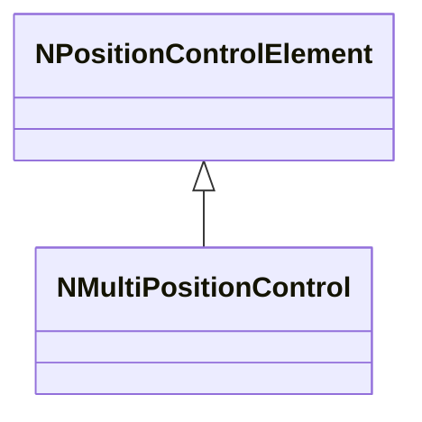
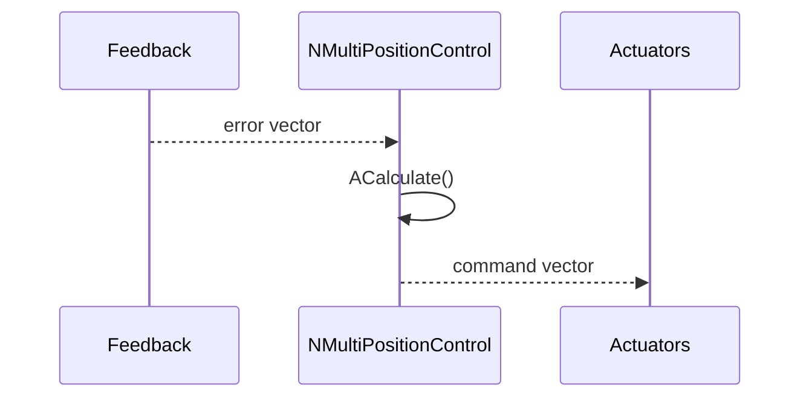
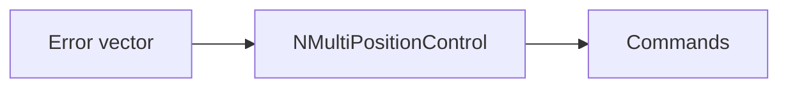
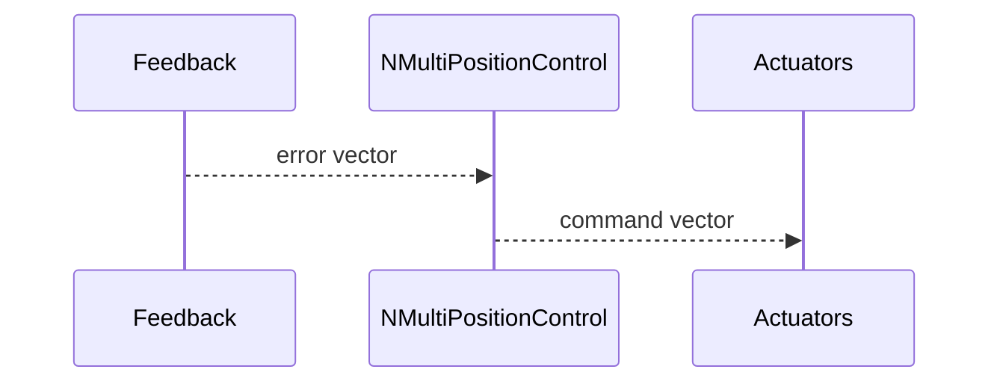

## NMultiPositionControl — многоканальный контроль позиции

**Класс**: `NMultiPositionControl` — позиционный контроллер для нескольких степеней свободы.  
**Регистрация**: `UploadClass("NMultiPositionControl", ...)` в `NMotionControlLibrary.cpp`.

### Lifecycle
- **ADefault**: параметры регуляторов по каналам.
- **ABuild**: подключение обратной связи/целей.
- **AReset**: сброс интеграторов.
- **ACalculate**: расчёт команд управления по ошибкам.

### I/O
- Вход: векторы ошибок/позиций/целей.
- Выход: вектор команд актуаторов.



Пояснение: диаграмма классов показывает место компонента в иерархии и ключевые связи.



Пояснение: диаграмма последовательности показывает типовой сценарий взаимодействия и порядок вызовов.



Пояснение: блок-схема показывает поток данных/сигналов (входы → компонент → выходы).

### Config snippet

```ini
[Component]
ClassName = NMultiPositionControl
Name = MPC1
```

---

## NMultiPositionControl — multi-DOF position control (EN)

Computes actuator commands from multi-dimensional position errors.


Description: this class diagram shows the component position in the type hierarchy and key relations.



Description: this sequence diagram shows a typical runtime interaction and call order.


Description: this flowchart shows the data/signal flow (inputs → component → outputs).
