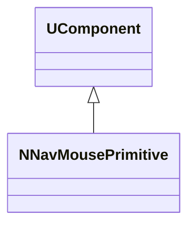
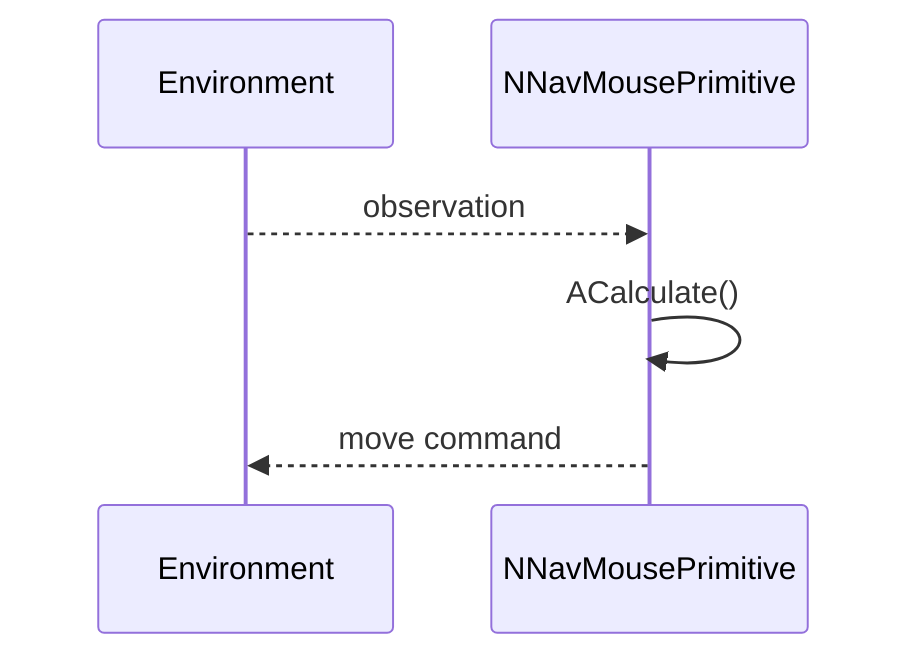
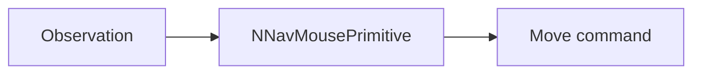
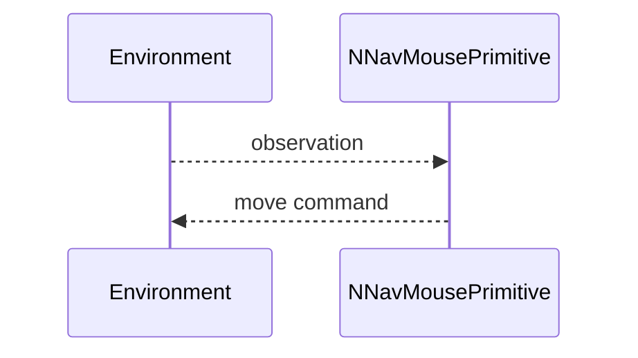

## NNavMousePrimitive — примитив навигации «мышь»

**Класс**: `NNavMousePrimitive` — простая навигационная логика в стиле движения «мыши».  
**Регистрация**: `UploadClass("NNavMousePrimitive", ...)` в `NMotionControlLibrary.cpp`.

### Lifecycle
- **ADefault/ABuild/AReset**: инициализация параметров навигации.
- **ACalculate**: шаг навигации (выбор действия/направления).

### I/O
- Вход: наблюдения/состояние среды.
- Выход: команда движения.



Пояснение: диаграмма классов показывает место компонента в иерархии и ключевые связи.



Пояснение: диаграмма последовательности показывает типовой сценарий взаимодействия и порядок вызовов.



Пояснение: блок-схема показывает поток данных/сигналов (входы → компонент → выходы).

### Config snippet

```ini
[Component]
ClassName = NNavMousePrimitive
Name = Nav1
```

---

## NNavMousePrimitive — mouse-like navigation primitive (EN)

Simple navigation logic producing movement commands from observations.


Description: this class diagram shows the component position in the type hierarchy and key relations.



Description: this sequence diagram shows a typical runtime interaction and call order.


Description: this flowchart shows the data/signal flow (inputs → component → outputs).
