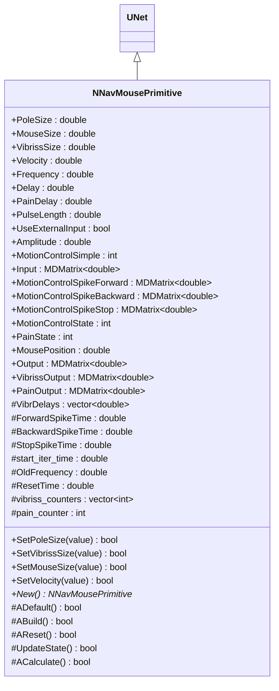
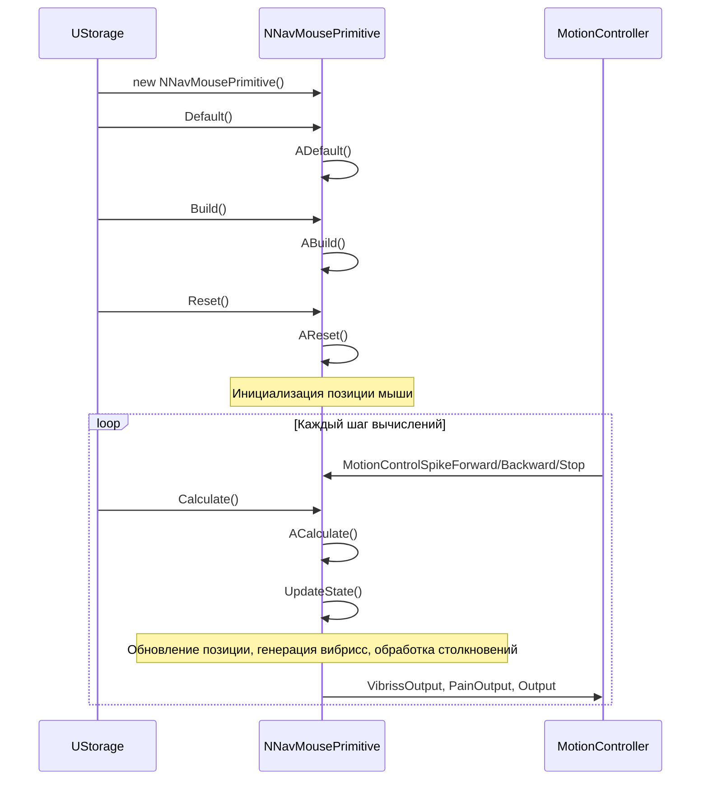
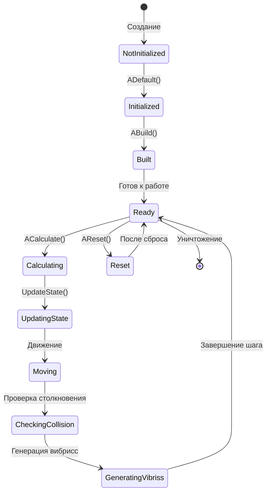
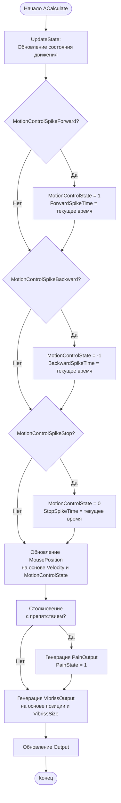
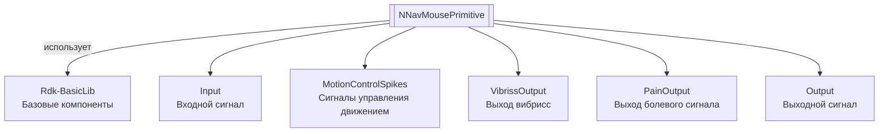

# NNavMousePrimitive — примитив навигации мыши

**Класс**: `NNavMousePrimitive` — компонент для моделирования навигации мыши в лабиринте с вибриссами (усами) для обнаружения препятствий.
**Регистрация**: `NMotionControlLibrary.cpp` → `UploadClass("NNavMousePrimitive", ...)`.
**Базовый класс**: `UNet` (из Rdk Framework).

NNavMousePrimitive моделирует движение мыши в одномерном лабиринте (полюсе) с использованием вибрисс для обнаружения препятствий. Компонент вычисляет позицию мыши, генерирует сигналы вибрисс и обрабатывает болевые сигналы при столкновении.

## UML-диаграмма классов



**Иерархия наследования:**
- `UNet` (Rdk Framework) — базовый класс для сетей компонентов
- `NNavMousePrimitive` — примитив навигации мыши

## UML-диаграмма последовательности



## UML-диаграмма состояний



## UML-диаграмма активности



## UML-диаграмма компонентов



## Свойства

### Параметры модели

| Свойство | Тип | Флаги | Описание | Значение по умолчанию |
|----------|-----|-------|----------|----------------------|
| `PoleSize` | `double` | `ptPubParameter` | Размер полюса (лабиринта) в см | `100.0` |
| `MouseSize` | `double` | `ptPubParameter` | Размер мыши в см | `20.0` |
| `VibrissSize` | `double` | `ptPubParameter` | Размер вибрисс (усов) в см | `10.0` |
| `Velocity` | `double` | `ptPubParameter` | Скорость движения мыши в см/с | `2.0` |

### Параметры сигналов

| Свойство | Тип | Флаги | Описание | Значение по умолчанию |
|----------|-----|-------|----------|----------------------|
| `Frequency` | `double` | `ptPubParameter` | Частота генерации сигналов (Гц) | `1.5` |
| `Delay` | `double` | `ptPubParameter` | Задержка сигналов (с) | `0.1` |
| `PainDelay` | `double` | `ptPubParameter` | Задержка болевого сигнала (с) | `0.1` |
| `PulseLength` | `double` | `ptPubParameter` | Длительность импульсов (с) | `0.001` |
| `Amplitude` | `double` | `ptPubParameter` | Амплитуда импульсов | Задается пользователем |
| `UseExternalInput` | `bool` | `ptPubParameter` | Использовать внешний вход | `true` |
| `MotionControlSimple` | `int` | `ptPubParameter` | Простое управление движением: 0=стоп, 1=вперед, -1=назад | Задается пользователем |

### Входы

| Свойство | Тип | Флаги | Описание | Источник данных |
|----------|-----|-------|----------|-----------------|
| `Input` | `MDMatrix<double>` | `ptInput \| ptPubState` | Входной сигнал | Другие компоненты системы |
| `MotionControlSpikeForward` | `MDMatrix<double>` | `ptInput \| ptPubState` | Импульс движения вперед | Контроллер движения |
| `MotionControlSpikeBackward` | `MDMatrix<double>` | `ptInput \| ptPubState` | Импульс движения назад | Контроллер движения |
| `MotionControlSpikeStop` | `MDMatrix<double>` | `ptInput \| ptPubState` | Импульс остановки | Контроллер движения |

### Выходы

| Свойство | Тип | Флаги | Описание | Назначение |
|----------|-----|-------|----------|------------|
| `Output` | `MDMatrix<double>` | `ptOutput \| ptPubState` | Выходной сигнал | Передача другим компонентам |
| `VibrissOutput` | `MDMatrix<double>` | `ptOutput \| ptPubState` | Выход вибрисс (2 элемента: левая и правая вибрисса) | Передача системам обработки |
| `PainOutput` | `MDMatrix<double>` | `ptOutput \| ptPubState` | Выход болевого сигнала | Передача системам обработки |

### Состояния

| Свойство | Тип | Флаги | Описание | Изменяется в |
|----------|-----|-------|----------|--------------|
| `MotionControlState` | `int` | `ptPubState` | Состояние управления движением: 0=стоп, 1=вперед, -1=назад | `ACalculate` |
| `PainState` | `int` | `ptPubState` | Состояние боли: 0=нет, 1=есть | `ACalculate` |
| `MousePosition` | `double` | `ptPubState` | Текущая позиция мыши в см | `ACalculate` |

### Защищенные переменные

| Свойство | Тип | Описание |
|----------|-----|----------|
| `VibrDelays` | `std::vector<double>` | Задержки для вибрисс |
| `ForwardSpikeTime`, `BackwardSpikeTime`, `StopSpikeTime` | `double` | Времена последних импульсов управления |
| `start_iter_time` | `double` | Время начала итерации |
| `OldFrequency` | `double` | Предыдущая частота |
| `ResetTime` | `double` | Время сброса |
| `vibriss_counters` | `std::vector<int>` | Счетчики для вибрисс |
| `pain_counter` | `int` | Счетчик боли |

## Методы

### Конструкторы и деструкторы

#### `NNavMousePrimitive(void)`
**Назначение:** Конструктор компонента
**Параметры:** Нет
**Возвращаемое значение:** Нет
**Описание:** Инициализирует OldFrequency=0.0

#### `virtual ~NNavMousePrimitive(void)`
**Назначение:** Деструктор компонента
**Параметры:** Нет
**Возвращаемое значение:** Нет

### Методы жизненного цикла

#### `virtual bool ADefault(void)`
**Назначение:** Инициализация значений по умолчанию
**Параметры:** Нет
**Возвращаемое значение:** `true` при успехе
**Описание:** Устанавливает значения по умолчанию:
- PoleSize=100, MouseSize=20, VibrissSize=10, Velocity=2
- Frequency=1.5, Delay=0.1, PainDelay=0.1
- MousePosition=MouseSize+MouseSize/10 (начальная позиция)
- MotionControlState=0, PainState=0
- UseExternalInput=true

#### `virtual bool ABuild(void)`
**Назначение:** Построение внутренней структуры компонента
**Параметры:** Нет
**Возвращаемое значение:** `true` при успехе

#### `virtual bool AReset(void)`
**Назначение:** Сброс состояния компонента
**Параметры:** Нет
**Возвращаемое значение:** `true` при успехе
**Описание:** Сбрасывает позицию мыши, счетчики, времена импульсов

#### `virtual bool UpdateState(void)`
**Назначение:** Обновление состояния движения
**Параметры:** Нет
**Возвращаемое значение:** `true` при успехе
**Описание:** Обновляет MotionControlState на основе входных импульсов управления движением

#### `virtual bool ACalculate(void)`
**Назначение:** Выполнение вычислений на текущем шаге
**Параметры:** Нет
**Возвращаемое значение:** `true` при успехе
**Описание:**
1. Вызывает UpdateState() для обновления состояния движения
2. Обновляет MousePosition на основе Velocity и MotionControlState
3. Проверяет столкновения с препятствиями
4. Генерирует VibrissOutput на основе позиции и VibrissSize
5. Генерирует PainOutput при столкновении
6. Обновляет Output

### Сеттеры свойств

#### `bool SetPoleSize(const double &value)`
**Назначение:** Установка размера полюса
**Параметры:**
- `value` - размер (должен быть > 0)
**Возвращаемое значение:** `true` при успехе, `false` при ошибке

#### `bool SetVibrissSize(const double &value)`
**Назначение:** Установка размера вибрисс
**Параметры:**
- `value` - размер (должен быть > 0)
**Возвращаемое значение:** `true` при успехе, `false` при ошибке

#### `bool SetMouseSize(const double &value)`
**Назначение:** Установка размера мыши
**Параметры:**
- `value` - размер (должен быть > 0)
**Возвращаемое значение:** `true` при успехе, `false` при ошибке

#### `bool SetVelocity(const double &value)`
**Назначение:** Установка скорости движения
**Параметры:**
- `value` - скорость (должна быть > 0)
**Возвращаемое значение:** `true` при успехе, `false` при ошибке

### Публичные методы

#### `virtual NNavMousePrimitive* New(void)`
**Назначение:** Создание нового экземпляра компонента
**Параметры:** Нет
**Возвращаемое значение:** Указатель на новый экземпляр

## Примеры использования

### C++ код

```cpp
#include "NNavMousePrimitive.h"

UEPtr<NNavMousePrimitive> mouse = new NNavMousePrimitive;
mouse->Default();
mouse->PoleSize = 200.0;  // Лабиринт 200 см
mouse->MouseSize = 20.0;
mouse->VibrissSize = 15.0;
mouse->Velocity = 3.0;  // Скорость 3 см/с
mouse->Build();
mouse->Reset();
```

### XML конфигурация

```xml
<Object Name="NavMouse" ClassName="NNavMousePrimitive">
    <Property Name="PoleSize" Value="200.0" />
    <Property Name="MouseSize" Value="20.0" />
    <Property Name="VibrissSize" Value="15.0" />
    <Property Name="Velocity" Value="3.0" />
    <Property Name="MotionControlSpikeForward" Connect="Controller.ForwardOutput" />
    <Property Name="MotionControlSpikeBackward" Connect="Controller.BackwardOutput" />
    <Property Name="MotionControlSpikeStop" Connect="Controller.StopOutput" />
</Object>
```

### Использование в конфигурациях

Компонент `NNavMousePrimitive` используется для моделирования навигации в одномерном лабиринте.

**Типичные сценарии использования:**
1. **Навигация в лабиринте** - моделирование движения мыши в лабиринте
2. **Обучение навигации** - использование с NMazeMemory для обучения навигации

**Типичные комбинации:**
- `NNavMousePrimitive` + `NMazeMemory` - навигация с памятью лабиринта
- `NNavMousePrimitive` + контроллеры движения - управление движением мыши

---

# NNavMousePrimitive — navigation mouse primitive

**Class**: `NNavMousePrimitive` — component for modeling mouse navigation in a maze with vibrissae (whiskers) for obstacle detection.
**Registration**: `NMotionControlLibrary.cpp` → `UploadClass("NNavMousePrimitive", ...)`.
**Base class**: `UNet` (from Rdk Framework).

NNavMousePrimitive models mouse movement in a one-dimensional maze (pole) using vibrissae for obstacle detection. The component calculates mouse position, generates vibrissae signals, and processes pain signals upon collision.

## Class Diagram

[Same as RU section]

## Sequence Diagram

[Same as RU section]

## State Diagram

[Same as RU section]

## Activity Diagram

[Same as RU section]

## Component Diagram

[Same as RU section]

## Properties

[Same structure as RU section, translated to English]

## Methods

[Same structure as RU section, translated to English]

## Usage Examples

[Same as RU section, with English comments]

## Источники

- [Literature-References.md](../Literature-References.md): [A], 22, 24 — навигация, память пространственных конфигураций.
