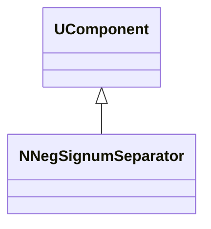
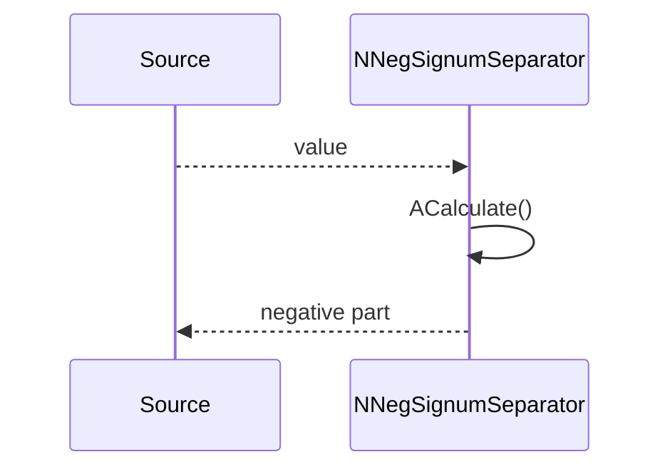
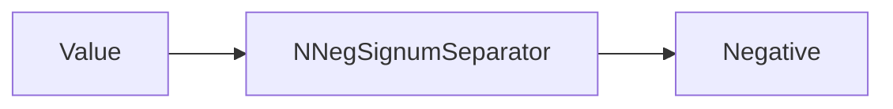
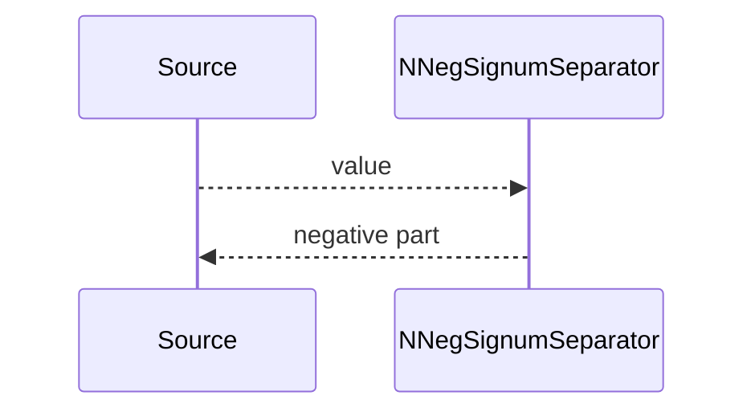

## NNegSignumSeparator — отрицательная часть сигнала

**Класс**: `NNegSignumSeparator` — выделяет отрицательную составляющую (или канал) сигнала.  
**Регистрация**: `UploadClass("NNegSignumSeparator", ...)` в `NMotionControlLibrary.cpp`.

### Lifecycle
- **ADefault/ABuild/AReset**: настройка и подготовка.
- **ACalculate**: вычисление отрицательной части (обычно с сохранением знака или модуля — по конфигу).

### I/O
- Вход: скаляр/вектор.
- Выход: отрицательная часть/маска.



Пояснение: диаграмма классов показывает место компонента в иерархии и ключевые связи.



Пояснение: диаграмма последовательности показывает типовой сценарий взаимодействия и порядок вызовов.



Пояснение: блок-схема показывает поток данных/сигналов (входы → компонент → выходы).

### Config snippet

```ini
[Component]
ClassName = NNegSignumSeparator
Name = NegSep1
```

---

## NNegSignumSeparator — negative channel extractor (EN)

Extracts negative part of a signal.


Description: this class diagram shows the component position in the type hierarchy and key relations.



Description: this sequence diagram shows a typical runtime interaction and call order.


Description: this flowchart shows the data/signal flow (inputs → component → outputs).
