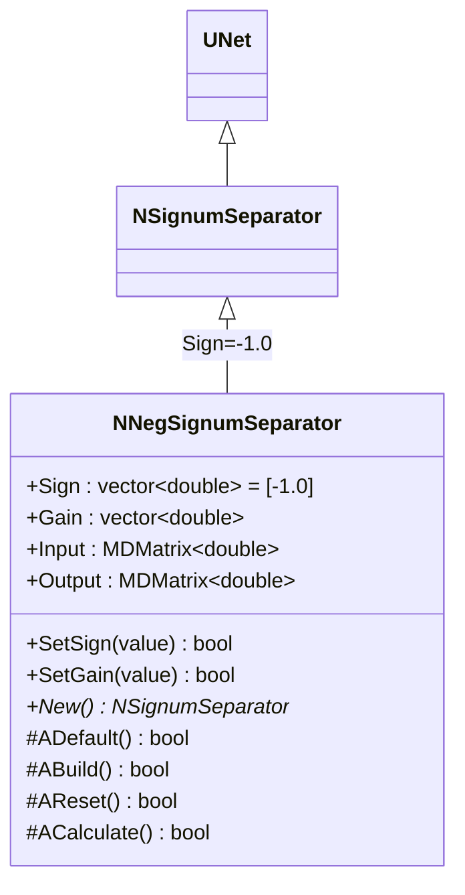
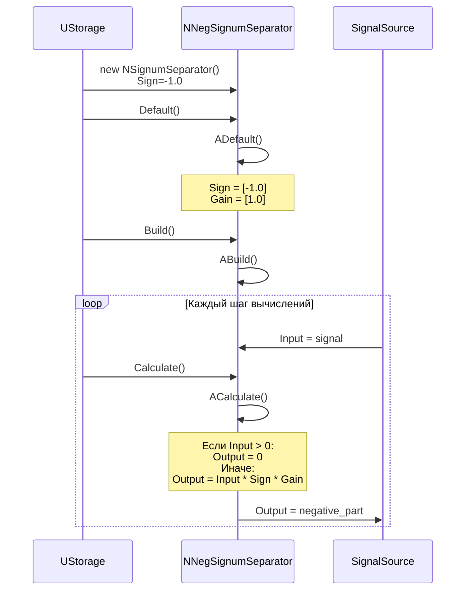
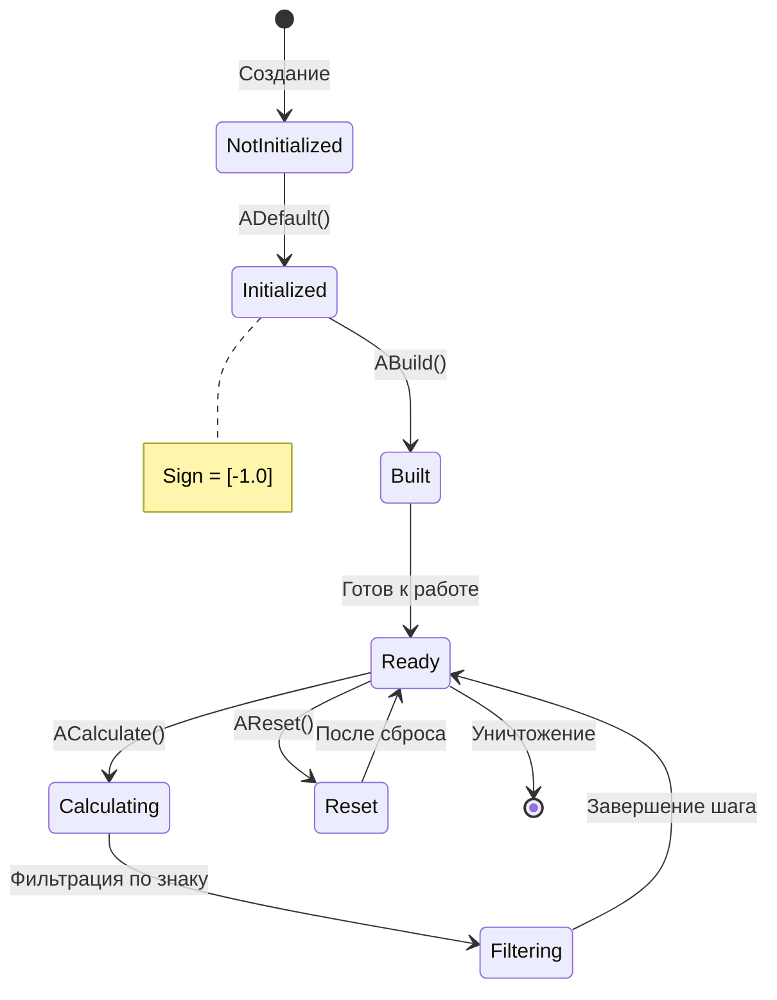
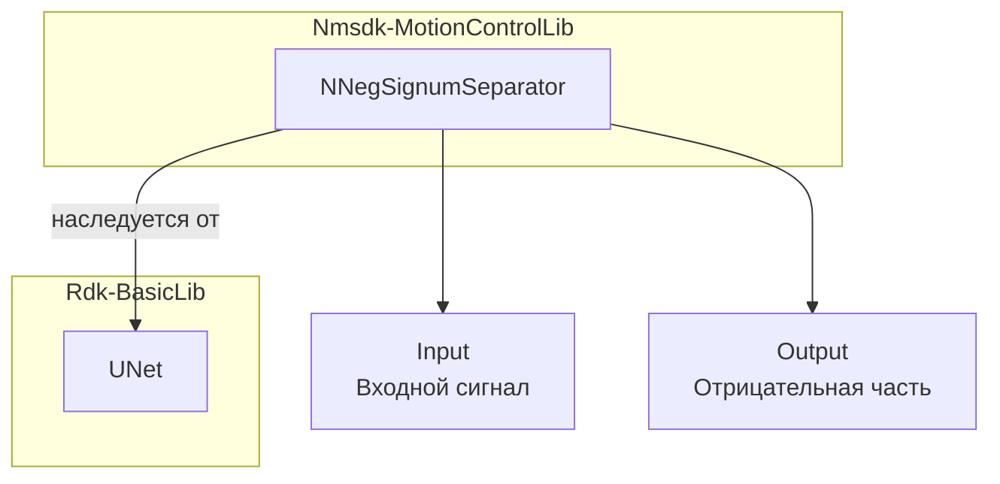
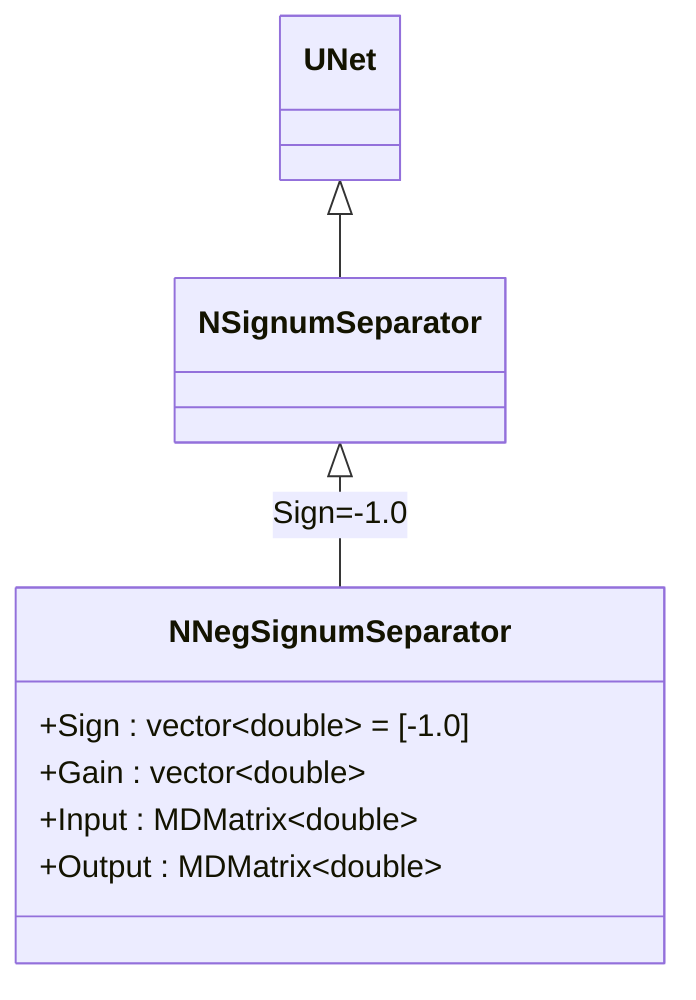
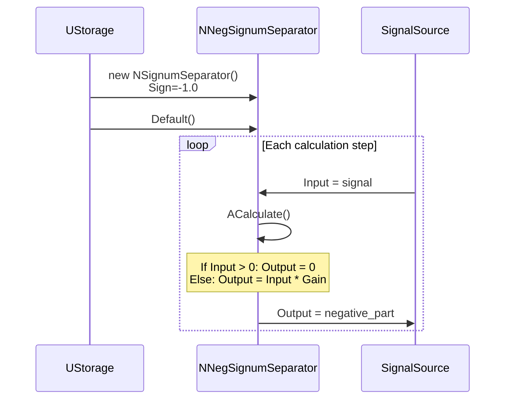
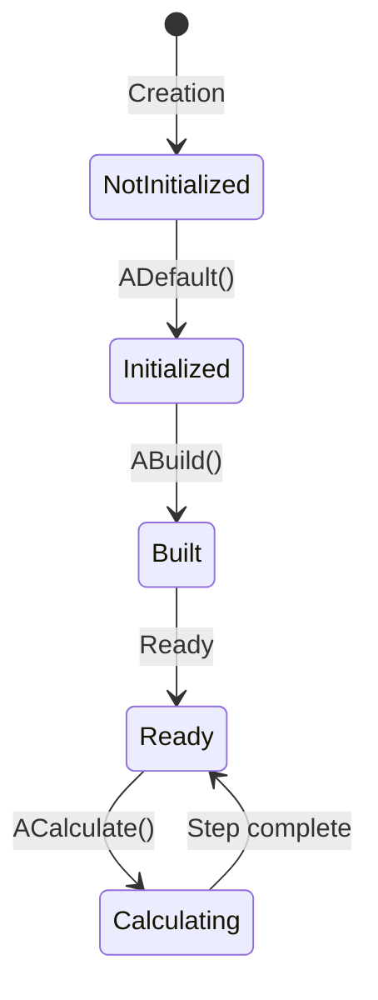
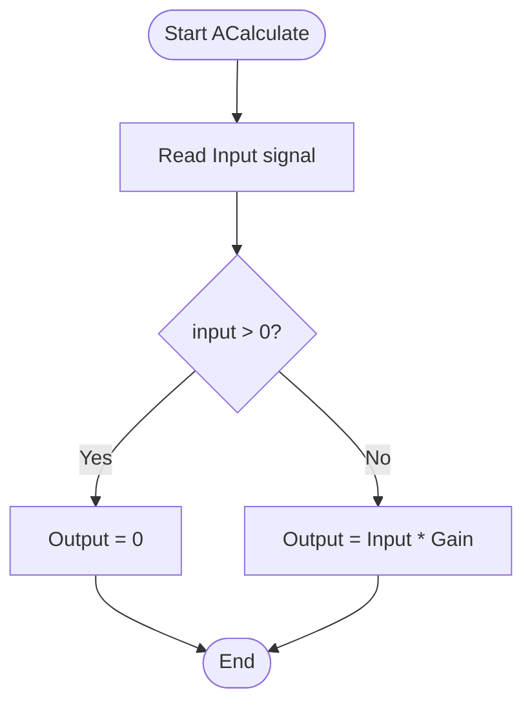

# NNegSignumSeparator — разделитель отрицательной части сигнала

## RU

**Класс**: `NNegSignumSeparator` — вариант конфигурации `NSignumSeparator` для выделения отрицательной составляющей сигнала.
**Регистрация**: `NMotionControlLibrary.cpp` → `UploadClass("NNegSignumSeparator", ...)`.
**Базовый класс**: `NSignumSeparator` (вариант конфигурации с `Sign=-1.0`).

NNegSignumSeparator является предварительно настроенным вариантом `NSignumSeparator` с параметром `Sign=-1.0`, что позволяет выделять только отрицательную часть входного сигнала. Компонент умножает входной сигнал на коэффициент знака и применяет усиление для формирования выходного сигнала. Положительные значения входного сигнала обнуляются.

## UML-диаграмма классов



**Иерархия наследования:**
- `UNet` (Rdk Framework) — базовый класс для сетей компонентов
- `NSignumSeparator` — базовый класс разделителя по знаку
- `NNegSignumSeparator` — вариант конфигурации для отрицательной части

**Примечание:** NNegSignumSeparator создаётся из `NSignumSeparator` с предустановленным `Sign=-1.0` при регистрации в библиотеке.

## UML-диаграмма последовательности



**Описание жизненного цикла:**
1. **Создание** - компонент создаётся как `NSignumSeparator` с `Sign=-1.0`
2. **Инициализация (ADefault)** - установка `Sign=[-1.0]` и `Gain=[1.0]` по умолчанию
3. **Построение (ABuild)** - подготовка к работе
4. **Сброс (AReset)** - обнуление выходного сигнала
5. **Вычисление (ACalculate)** - выделение отрицательной части: если вход положительный, выход = 0, иначе выход = Input * Sign * Gain

## UML-диаграмма состояний



**Состояния компонента:**
- **NotInitialized** - компонент создан, но не инициализирован
- **Initialized** - компонент инициализирован с `Sign=-1.0`
- **Built** - готов к работе
- **Ready** - готов к вычислениям
- **Calculating** - выполняется вычисление
- **Filtering** - фильтрация сигнала (обнуление положительных значений)
- **Reset** - состояние после сброса

## UML-диаграмма активности

```mermaid
flowchart TD
    Start([Начало ACalculate]) --> ReadInput[Чтение входного сигнала Input]
    ReadInput --> CheckConnection["Input<br/>подключен?"]
    CheckConnection -->|Нет| ResizeZero[Resize Output 0x0]
    CheckConnection -->|Да| GetSize[Получить размер входных данных]
    GetSize --> ResizeOutput[Resize Output 1xN]
    ResizeOutput --> LoopStart[Для каждого элемента i]
    LoopStart --> ReadElement[input = Input[i]]
    ReadElement --> CheckSign["input < 0<br/>AND<br/>Sign[i] > 0?"]
    CheckSign -->|Да| SetZero[Output[i] = 0]
    CheckSign -->|Нет| CheckSign2["input > 0<br/>AND<br/>Sign[i] < 0?"]
    CheckSign2 -->|Да| SetZero
    CheckSign2 -->|Нет| Calculate[Output[i] = input * Sign[i] * Gain[i]]
    SetZero --> NextElement["Есть ещё<br/>элементы?"]
    Calculate --> NextElement
    NextElement -->|Да| LoopStart
    NextElement -->|Нет| End([Конец])
    ResizeZero --> End
```

**Алгоритм работы ACalculate:**
1. Проверка подключения входного сигнала
2. Если не подключен - обнуление выхода
3. Если подключен - получение размера входных данных
4. Для каждого элемента входного сигнала:
   - Если знак входного значения не соответствует `Sign[i]` - выход = 0
   - Иначе - выход = Input * Sign[i] * Gain[i]
5. Для `NNegSignumSeparator` с `Sign=-1.0`: положительные значения обнуляются, отрицательные пропускаются с усилением

## UML-диаграмма компонентов



**Зависимости:**
- **Rdk-BasicLib**: базовый фреймворк (`UNet`)

**Связи:**
- **Входы**: `Input` - входной сигнал (может быть скаляр или вектор)
- **Выходы**: `Output` - отрицательная часть входного сигнала

## Свойства компонента

### Параметры (ptPubParameter)

| Свойство | Тип | Значение по умолчанию | Описание |
|----------|-----|----------------------|----------|
| `Sign` | `vector<double>` | `[-1.0]` | Коэффициент знака (предустановлен при регистрации) |
| `Gain` | `vector<double>` | `[1.0]` | Коэффициент усиления |

### Входы/Выходы

| Свойство | Тип | Флаги | Описание |
|----------|-----|-------|----------|
| `Input` | `MDMatrix<double>` | `ptInput \| ptPubState` | Входной сигнал (скаляр или вектор) |
| `Output` | `MDMatrix<double>` | `ptOutput \| ptPubState` | Выходной сигнал (отрицательная часть) |

## Методы компонента

### Жизненный цикл

#### `ADefault() -> bool`
**Назначение**: Инициализация параметров по умолчанию.

**Описание**: Устанавливает `Sign=[-1.0]` и `Gain=[1.0]` по умолчанию.

#### `ACalculate() -> bool`
**Назначение**: Выделение отрицательной части входного сигнала.

**Алгоритм:**
- Если входной сигнал отрицательный и `Sign[i] > 0` → `Output[i] = 0`
- Если входной сигнал положительный и `Sign[i] < 0` → `Output[i] = 0`
- Иначе → `Output[i] = Input[i] * Sign[i] * Gain[i]`

**Для NNegSignumSeparator** (Sign=-1.0):
- Положительные значения → Output = 0
- Отрицательные значения → Output = Input * Gain (с сохранением знака)

## Примеры использования

### C++ код

```cpp
#include "NSignumSeparator.h"

// Создание компонента (фактически создаётся NSignumSeparator с Sign=-1.0)
UEPtr<NSignumSeparator> separator = storage->CreateComponent<NSignumSeparator>("NegSep1");
separator->Sign->assign(1, -1.0); // Установка Sign=-1.0
separator->Gain->assign(1, 2.0); // Усиление в 2 раза

separator->Default();
separator->Build();
separator->Reset();

// В цикле вычислений
while (simulation_running) {
    separator->Input(0, 0) = input_signal; // Может быть положительным или отрицательным
    separator->Calculate();

    double negative_part = separator->Output(0, 0); // Только отрицательная часть
}
```

### XML конфигурация

```xml
<Component>
    <ClassName>NNegSignumSeparator</ClassName>
    <Name>NegSep1</Name>
    <Properties>
        <Sign>-1.0</Sign>
        <Gain>2.0</Gain>
    </Properties>
</Component>
```

## Связи с конфигурационными проектами

Компонент `NNegSignumSeparator` используется в проектах, требующих:
- **Разделения сигналов по знаку** - когда необходимо обрабатывать только отрицательные значения
- **Управления направлением движения** - для выделения команд движения в противоположном направлении
- **Обработки афферентных сигналов** - в системах управления движением для разделения положительных и отрицательных обратных связей

Типичные сценарии использования:
- Управление манипулятором с разделением команд для разных направлений
- Обработка сигналов ошибки в системах управления
- Фильтрация сигналов для выделения только отрицательных компонент

**Связь с другими компонентами:**
- Часто используется вместе с `NPosSignumSeparator` для полного разделения сигнала
- Может подключаться к выходам `NSignumSeparator` или других источников сигналов
- Выходы могут подключаться к элементам управления движением

---

## EN

## NNegSignumSeparator — negative channel extractor (EN)

**Class**: `NNegSignumSeparator` — configuration variant of `NSignumSeparator` for extracting negative signal component.
**Registration**: `NMotionControlLibrary.cpp` → `UploadClass("NNegSignumSeparator", ...)`.
**Base class**: `NSignumSeparator` (configuration variant with `Sign=-1.0`).

NNegSignumSeparator is a pre-configured variant of `NSignumSeparator` with parameter `Sign=-1.0`, allowing extraction of only the negative part of the input signal. The component multiplies the input signal by the sign coefficient and applies gain to form the output signal. Positive input values are zeroed.

## Class Diagram



## Sequence Diagram



## State Diagram



## Activity Diagram



## Properties

| Property | Type | Default | Description |
|----------|------|---------|-------------|
| `Sign` | `vector<double>` | `[-1.0]` | Sign coefficient (pre-set during registration) |
| `Gain` | `vector<double>` | `[1.0]` | Gain coefficient |
| `Input` | `MDMatrix<double>` | - | Input signal (scalar or vector) |
| `Output` | `MDMatrix<double>` | - | Output signal (negative part) |

## Usage Examples

### C++ Code

```cpp
UEPtr<NSignumSeparator> separator = storage->CreateComponent<NSignumSeparator>("NegSep1");
separator->Sign->assign(1, -1.0);
separator->Gain->assign(1, 2.0);
separator->Default();
separator->Build();
separator->Reset();

while (simulation_running) {
    separator->Input(0, 0) = input_signal;
    separator->Calculate();
    double negative_part = separator->Output(0, 0);
}
```

### XML Configuration

```xml
<Component>
    <ClassName>NNegSignumSeparator</ClassName>
    <Name>NegSep1</Name>
    <Properties>
        <Sign>-1.0</Sign>
        <Gain>2.0</Gain>
    </Properties>
</Component>
```

## References
- [Literature-References.md](../Literature-References.md): [A], 25, 28 — разделитель сигнум-сигналов в контурах управления.
