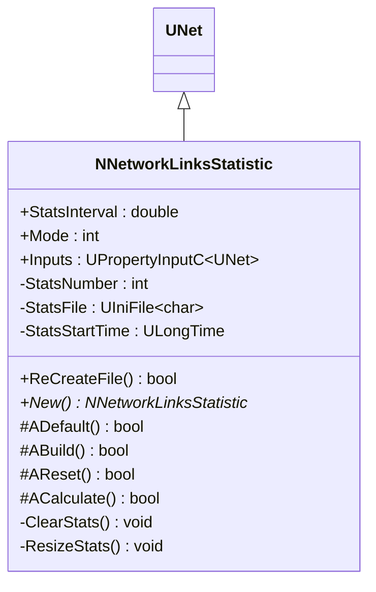
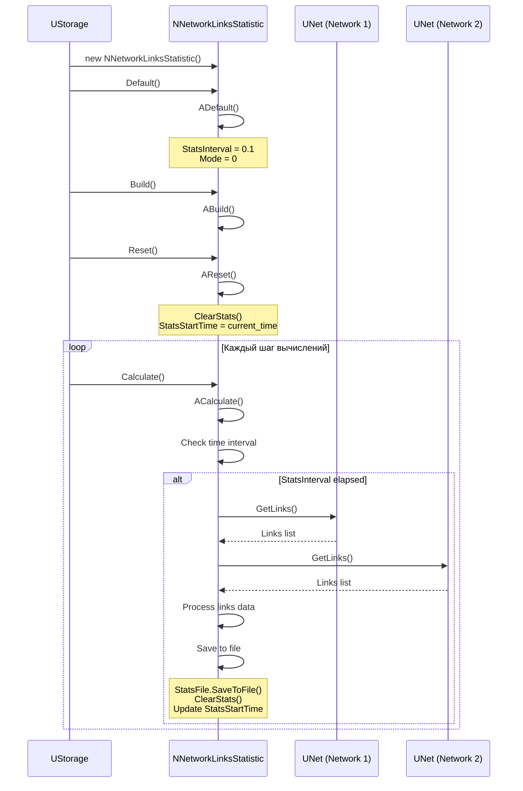
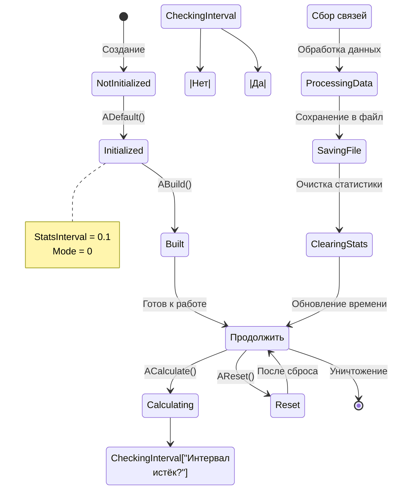
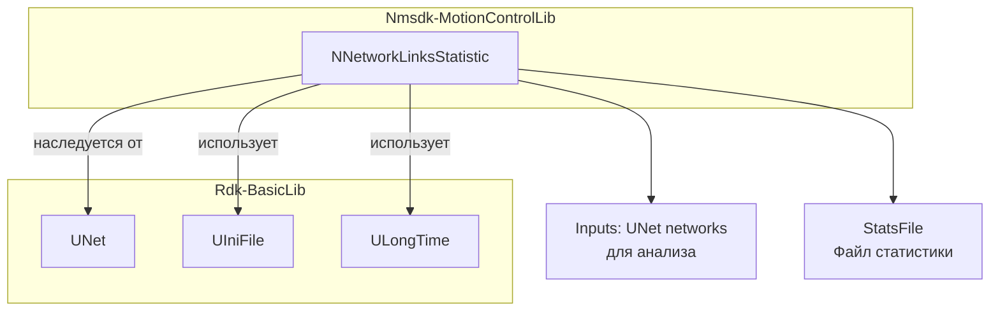
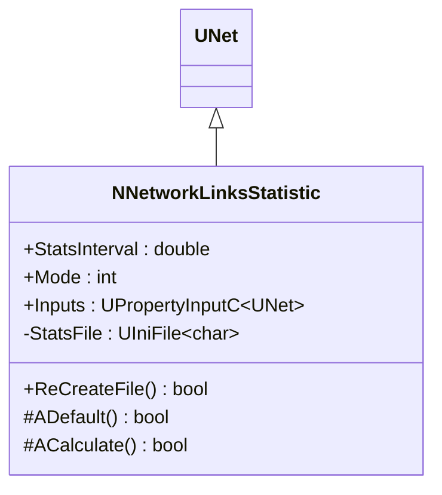
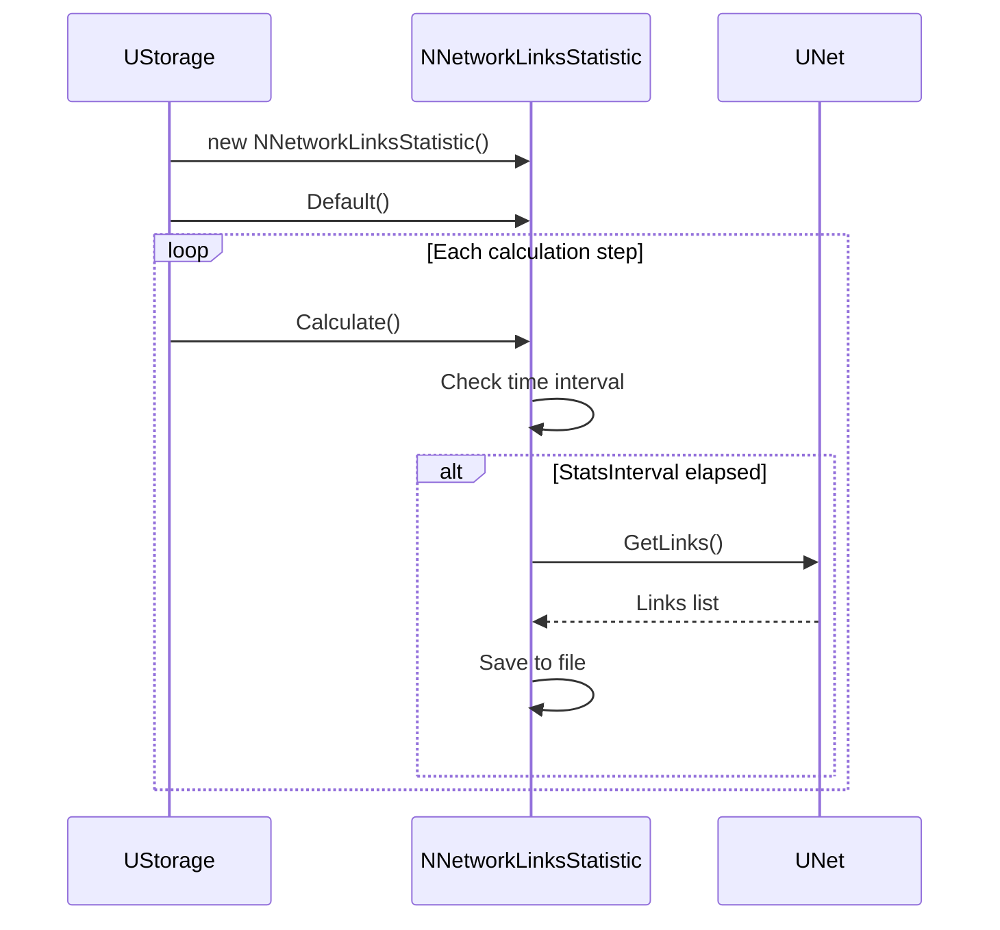
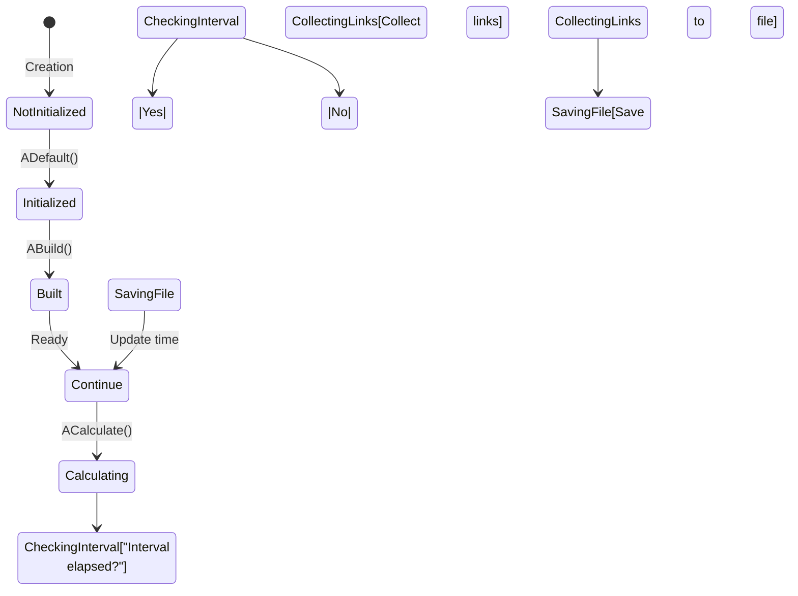
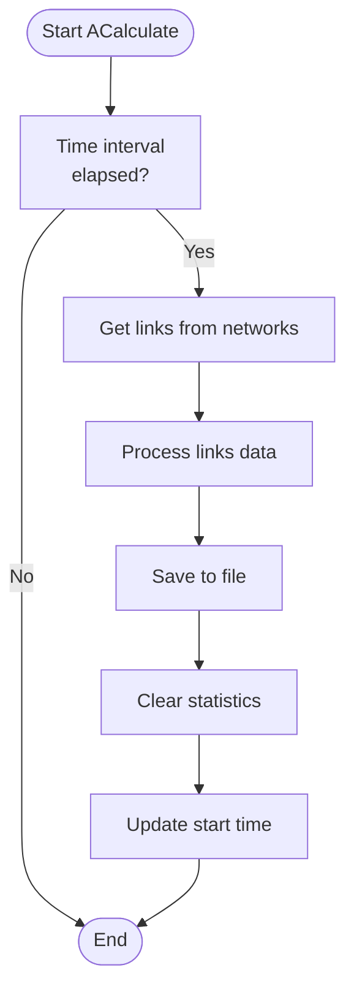

# NNetworkLinksStatistic — статистика связей сети

## RU

**Класс**: `NNetworkLinksStatistic` — компонент для сбора и сохранения статистики по связям в нейронных сетях.
**Регистрация**: `NMotionControlLibrary.cpp` → `UploadClass("NNetworkLinksStatistic", ...)` (в настоящее время закомментирован).
**Базовый класс**: `UNet` (из Rdk Framework).

NNetworkLinksStatistic собирает статистику по связям между компонентами в нейронных сетях. Компонент анализирует структуру связей в подключённых сетях, извлекает информацию о весах связей и сохраняет её в файлы с заданным интервалом. Используется для анализа и отладки структуры нейронных сетей, изучения динамики изменения весов связей.

**Примечание:** Компонент в настоящее время закомментирован в регистрации библиотеки, но код доступен для использования.

## UML-диаграмма классов



**Иерархия наследования:**
- `UNet` (Rdk Framework) — базовый класс для сетей компонентов
- `NNetworkLinksStatistic` — сборщик статистики связей

## UML-диаграмма последовательности



**Описание жизненного цикла:**
1. **Создание** - компонент создаётся через конструктор
2. **Инициализация (ADefault)** - установка `StatsInterval=0.1`, `Mode=0`
3. **Построение (ABuild)** - подготовка к работе
4. **Сброс (AReset)** - очистка статистики, установка времени начала сбора
5. **Вычисление (ACalculate)** - проверка интервала времени, сбор статистики по связям, сохранение в файл

## UML-диаграмма состояний



**Состояния компонента:**
- **NotInitialized** - компонент создан, но не инициализирован
- **Initialized** - компонент инициализирован
- **Built** - готов к работе
- **Ready** - готов к вычислениям
- **Calculating** - выполняется вычисление
- **CheckingInterval** - проверка интервала времени
- **CollectingLinks** - сбор информации о связях
- **ProcessingData** - обработка собранных данных
- **SavingFile** - сохранение статистики в файл
- **ClearingStats** - очистка текущей статистики
- **Reset** - состояние после сброса

## UML-диаграмма активности

```mermaid
flowchart TD
    Start([Начало ACalculate]) --> CheckInterval["Environment->GetTime() -<br/>StatsStartTime >=<br/>StatsInterval?"]
    CheckInterval -->|Нет| End([Конец])
    CheckInterval -->|Да| LoopStart[Для каждого Input в Inputs]
    LoopStart --> GetNetwork[network = dynamic_cast UNet из Input]
    GetNetwork --> CheckNetwork["network<br/>существует?"]
    CheckNetwork -->|Нет| NextInput["Есть ещё<br/>Inputs?"]
    CheckNetwork -->|Да| GetLinks[network->GetLinks(linkslist)]
    GetLinks --> ProcessLinks[Обработка списка связей]
    ProcessLinks --> ExtractData["Извлечение данных:<br/>Id, Name, Weight"]
    ExtractData --> SaveToFile["Сохранение в StatsFile:<br/>Id, SourceId, SourceName, Weight"]
    SaveToFile --> NextInput
    NextInput -->|Да| LoopStart
    NextInput -->|Нет| SaveFile["StatsFile.SaveToFile<br/>GetName_StatsNumber.ini"]
    SaveFile --> ClearStats[ClearStats()]
    ClearStats --> UpdateTime["StatsStartTime =<br/>Environment->GetTime()"]
    UpdateTime --> End
```

**Алгоритм работы ACalculate:**
1. Проверка интервала времени с момента последнего сохранения
2. Если интервал истёк:
   - Для каждого подключённого Input (UNet):
     - Получение списка связей через `GetLinks()`
     - Обработка связей и извлечение данных (Id, Name, Weight)
     - Сохранение данных в `StatsFile`
   - Сохранение файла статистики
   - Очистка текущей статистики
   - Обновление времени начала следующего интервала

## UML-диаграмма компонентов



**Зависимости:**
- **Rdk-BasicLib**: базовый фреймворк (`UNet`, `UIniFile`, `ULongTime`)

**Связи:**
- **Входы**: `Inputs` - коллекция сетей (UNet) для анализа связей
- **Выходы**: нет прямых выходов, данные сохраняются в файлы

## Свойства компонента

### Параметры (ptPubParameter)

| Свойство | Тип | Значение по умолчанию | Описание |
|----------|-----|----------------------|----------|
| `StatsInterval` | `double` | `0.1` | Интервал времени между сохранениями статистики (секунды) |
| `Mode` | `int` | `0` | Режим работы (в настоящее время не используется) |

### Входы (ptPubInput)

| Свойство | Тип | Флаги | Описание |
|----------|-----|-------|----------|
| `Inputs` | `UPropertyInputC<UNet>` | `ptPubInput` | Коллекция сетей (UNet) для анализа связей |

### Защищённые свойства

| Свойство | Тип | Описание |
|----------|-----|----------|
| `StatsNumber` | `int` | Счётчик файлов статистики (увеличивается при каждом сохранении) |
| `StatsFile` | `UIniFile<char>` | Файл для сохранения статистики |
| `StatsStartTime` | `ULongTime` | Время начала текущего интервала сбора статистики |

## Методы компонента

### Управление файлами

#### `ReCreateFile() -> bool`
**Назначение**: Сохранение текущего файла и создание нового.

**Описание**: Сохраняет текущий `StatsFile` с номером `StatsNumber`, удаляет содержимое файла и увеличивает счётчик.

### Жизненный цикл

#### `ADefault() -> bool`
**Назначение**: Инициализация параметров по умолчанию.

**Описание**: Устанавливает `StatsInterval=0.1`, `Mode=0`.

#### `ABuild() -> bool`
**Назначение**: Построение компонента.

**Описание**: Подготовка к работе (пустая реализация).

#### `AReset() -> bool`
**Назначение**: Сброс состояния компонента.

**Описание**: Вызывает `ClearStats()` и устанавливает `StatsStartTime` в текущее время.

#### `ACalculate() -> bool`
**Назначение**: Сбор и сохранение статистики по связям.

**Алгоритм:**
1. Проверка интервала времени
2. Если интервал истёк:
   - Для каждого Input (UNet):
     - Получение списка связей
     - Обработка и сохранение данных
   - Сохранение файла
   - Очистка статистики
   - Обновление времени начала

### Внутренние методы

#### `ClearStats() -> void` (protected)
**Назначение**: Очистка текущей статистики.

**Описание**: Очищает внутренние структуры данных статистики.

#### `ResizeStats() -> void` (protected)
**Назначение**: Изменение размеров векторов статистики.

**Описание**: Настраивает размеры внутренних структур данных (в настоящее время закомментировано).

## Примеры использования

### C++ код

```cpp
#include "NNetworkLinksStatistic.h"

// Создание компонента
UEPtr<NNetworkLinksStatistic> statistic = storage->CreateComponent<NNetworkLinksStatistic>("LinkStat1");

// Настройка параметров
statistic->StatsInterval = 1.0; // Сохранение каждую секунду
statistic->Mode = 0;

// Инициализация
statistic->Default();
statistic->Build();
statistic->Reset();

// Подключение сетей для анализа
UEPtr<UNet> network1 = storage->GetComponent<UNet>("Network1");
UEPtr<UNet> network2 = storage->GetComponent<UNet>("Network2");

statistic->Inputs->Add(network1);
statistic->Inputs->Add(network2);

// В цикле вычислений
while (simulation_running) {
    statistic->Calculate();
    // Статистика автоматически сохраняется в файлы с заданным интервалом
}
```

### XML конфигурация

```xml
<Component>
    <ClassName>NNetworkLinksStatistic</ClassName>
    <Name>LinkStat1</Name>
    <Properties>
        <StatsInterval>1.0</StatsInterval>
        <Mode>0</Mode>
    </Properties>
</Component>
```

## Связи с конфигурационными проектами

Компонент `NNetworkLinksStatistic` используется в проектах, требующих:
- **Анализа структуры нейронных сетей** - для изучения связей между компонентами
- **Отладки сетей** - для проверки корректности связей и весов
- **Исследования динамики весов** - для отслеживания изменений весов связей во времени
- **Документирования сетей** - для сохранения структуры сети в файлы

Типичные сценарии использования:
- Анализ структуры сложных нейронных сетей управления движением
- Отладка систем с множественными связями
- Исследование обучения и адаптации сетей
- Сохранение снимков состояния сети для последующего анализа

**Связь с другими компонентами:**
- Подключается к сетям (`UNet`) через свойство `Inputs`
- Анализирует связи внутри подключённых сетей
- Сохраняет результаты в файлы формата INI

**Важные замечания:**
- Компонент в настоящее время закомментирован в регистрации библиотеки
- Большая часть функциональности обработки связей закомментирована в коде
- Требует доработки для полной функциональности
- Файлы статистики сохраняются в формате INI с именами вида `ComponentName_XXXXX.ini`

---

## EN

## NNetworkLinksStatistic — network links statistics (EN)

**Class**: `NNetworkLinksStatistic` — component for collecting and saving statistics on connections in neural networks.
**Registration**: `NMotionControlLibrary.cpp` → `UploadClass("NNetworkLinksStatistic", ...)` (currently commented out).
**Base class**: `UNet` (from Rdk Framework).

NNetworkLinksStatistic collects statistics on connections between components in neural networks. The component analyzes the connection structure in connected networks, extracts information about connection weights, and saves it to files at specified intervals. Used for analyzing and debugging neural network structure, studying the dynamics of connection weight changes.

**Note:** The component is currently commented out in library registration, but the code is available for use.

## Class Diagram



## Sequence Diagram



## State Diagram



## Activity Diagram



## Properties

| Property | Type | Default | Description |
|----------|------|---------|-------------|
| `StatsInterval` | `double` | `0.1` | Time interval between statistics saves (seconds) |
| `Mode` | `int` | `0` | Operation mode (currently unused) |
| `Inputs` | `UPropertyInputC<UNet>` | - | Collection of networks (UNet) for link analysis |

## Methods

### Lifecycle Methods

#### `ADefault() -> bool`
**Purpose**: Initialize default parameters.

**Description**: Sets `StatsInterval=0.1`, `Mode=0`.

#### `ACalculate() -> bool`
**Purpose**: Collect and save link statistics.

**Description**: Checks time interval, collects link information from connected networks, and saves to file if interval elapsed.

## Usage Examples

### C++ Code

```cpp
UEPtr<NNetworkLinksStatistic> statistic = storage->CreateComponent<NNetworkLinksStatistic>("LinkStat1");
statistic->StatsInterval = 1.0;
statistic->Default();
statistic->Build();
statistic->Reset();

UEPtr<UNet> network1 = storage->GetComponent<UNet>("Network1");
statistic->Inputs->Add(network1);

while (simulation_running) {
    statistic->Calculate();
}
```

### XML Configuration

```xml
<Component>
    <ClassName>NNetworkLinksStatistic</ClassName>
    <Name>LinkStat1</Name>
    <Properties>
        <StatsInterval>1.0</StatsInterval>
        <Mode>0</Mode>
    </Properties>
</Component>
```

## References
- [Literature-References.md](../Literature-References.md): [A], 19, 22 — статистика связей в нейросетевых контурах управления движением.
